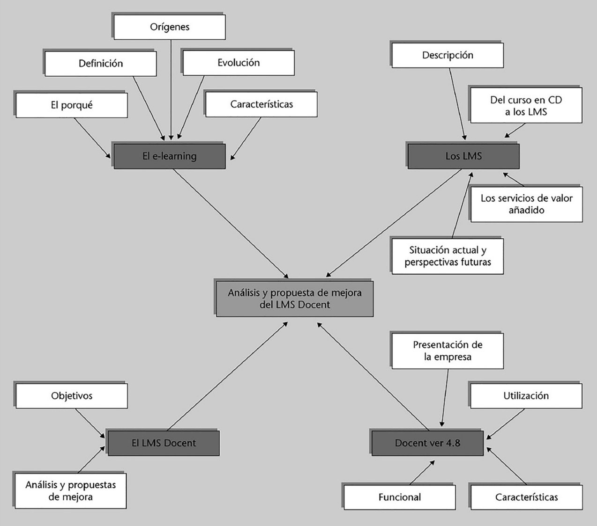
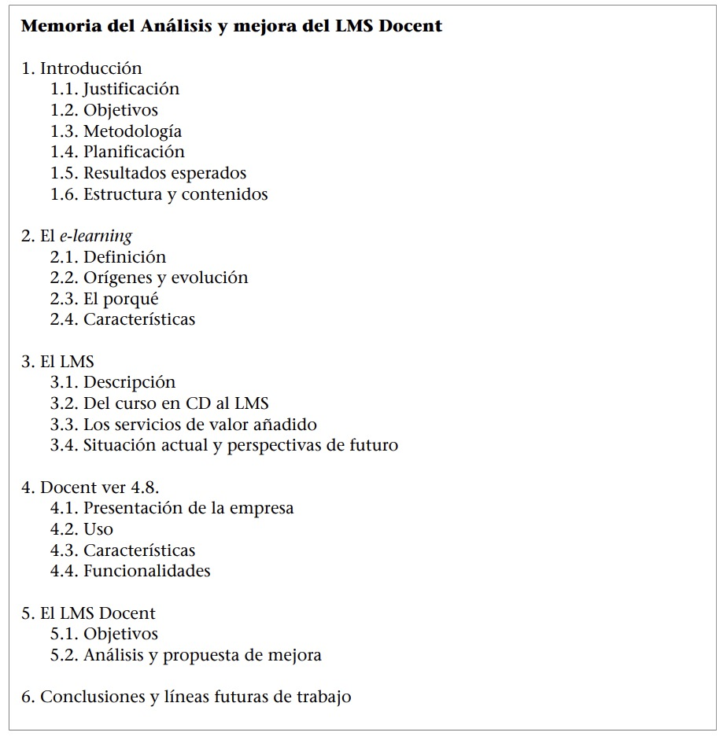
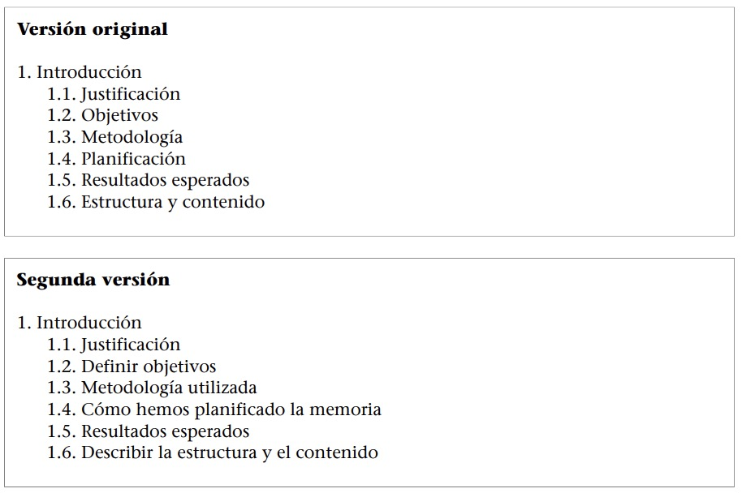

# RESUMEN Técnicas de producción de textos especializados (II). Aspectos de adecuación

## 1. La coherencia textual

### 1.1. Jerarquización de ideas, esquemas y mecanismos gráficos

Para lograr el objetivo comunicativo de un texto, es necesario organizar las ideas de forma jerárquica mediante la selección, agrupación y ordenación de la información. Esto se puede realizar utilizando diversas técnicas complementarias:

1. Agrupar el contenido por temas.
2. Jerarquizar los contenidos y ordenarlos. Se puede hacer mediante **mapas conceptuales** y/o **esquemas**.

	
	>Mapa conceptual
	
	 
	 

	
	>Esquema

### 1.2. Selección y presentación de la información: la estructura del texto 

La **selección de la información** trata de eligir la información que se ajusta más a nuestra finalidad comunicativa (adecuarse al contexto comunicativo).

Estructurar la información en un texto facilita la comunicación, permite organizar cada idea en su lugar, evita repeticiones y establece un orden lógico del discurso. Solo mediante la selección, agrupación, jerarquización y ordenación de la información se logra comunicar coherentemente el mensaje.

### 1.3. Organización de la información y simetría

La **organización** del escrito en unidades, ya sean capítulos, apartados o párrafos, facilita enormemente la lectura.

Para la correcta organización de los párrafos, se debe tener en cuenta lo siguiente:

1. **La extensión del párrafo**. Generalmente, tres o cuatro oraciones. Un párrafo con una sola oración no es adecuado, ya que denota que el texto es inconexo.
2. **Número de párrafos para una página**. Generalmente, entre tres y ocho párrafos.
3. **La correspondencia entre tema y párrafo**. Se recomienda (en un borrador u hoja aparte) poner título a los párrafos para controlar la identidad entre forma y contenido del párrafo.
4. **Equilibrio entre los párrafos**. La distribución visual de la página es
importante, por lo que conviene que haya equilibrio en la extensión de los párrafos.

>La segunda versión rompe la simetría ya que no mantiene una formulación con sustantivos. En su lugar, alterna sustantivos, infinitivos y oraciones, lo que crea una asimetría que dificulta la comprensión del texto.

### 1.4. La introducción y la conclusión

Los textos se suelen dividir en tres partes: introducción, desarrollo y conclusión.

El **desarrollo** suele ser más variado y no responde a un esquema predeterminado, pero las introducciones y las conclusiones tienen una estructura recurrente.

Las **introducciones** permiten situar el texto, presentar el tema y adelantar su contenido. 

Las **conclusiones** sintetizan o destacan lo expuesto y presentan resultados o ampliaciones del tema.

### 1.5. Definiciones y resúmenes

Son dos técnicas muy utilizadas para transmitir información en los textos de especialidad.

La **definición** describe un concepto desde los aspectos más generales hasta las características particulares y debe permitir diferenciarlo de otros conceptos. 

El **resumen** condensa y sintetiza la información de un texto y la manera en la que esta se presenta.