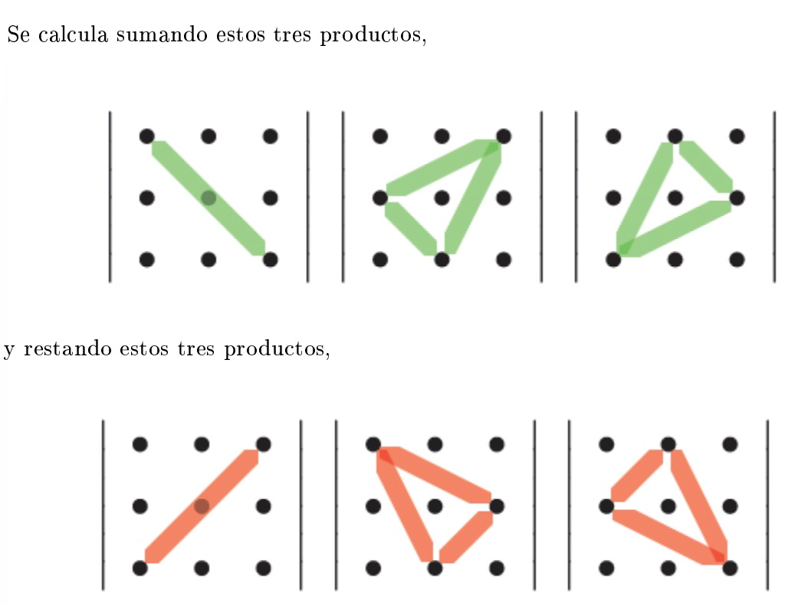

# 5. Matrices (resumen)

## 5.1. Matrices: tipos y elementos

**Matriz**: Conjunto de elementos organizados en _m_ filas y _n_ columnas (_m_ y _n_ son números naturales), y cerrados entre dos paréntesis.

$$
A =
\begin{pmatrix}
-1 &  4 &  5 & 23 \\
 6 & 11 & -8 &  2
\end{pmatrix}
$$

$A$ es una matriz de orden $(2, 4)$, o bien que tiene dimensión $2 \times 4$.

Para identificar los elementos de la matriz, se usan subíndices que indican la fila ($i$) y la columna ($j$) de la matriz $M$ con la notación $m_{i \, j}$.

Poniendo de ejemplo la matriz $A$, $m_{2 \, 1} = 6$.

>[!NOTE]
>**Diagonal**: Línea que va desde la esquina superior izquierda a la esquina inferior derecha

---

**Matriz cuadrada**

Matriz que tiene el mismo número de filas que de columnas (dimensión $n \times n$). Se entienden como matrices de orden $n$.

$$
A =
\begin{pmatrix}
1 & 4 \\
7 & 6
\end{pmatrix}
$$

---

**Matriz diagonal**

Matriz cuadrada cuya diagonal está formada por elementos cuyas filas y columnas tienen el mismo número ($a_{1 \, 1}, a_{2 \, 2}$...). El resto de elementos son $0$.

$$
A =
\begin{pmatrix}
-1 &  0 & 0 \\
 0 & -2 & 0 \\
 0 &  0 & 8
\end{pmatrix}
$$

---

**Matriz nula**

Todos sus elementos son 0. Se denota por $0_{m \, n}$.

$$
A =
\begin{pmatrix}
0 & 0 \\
0 & 0 \\
0 & 0
\end{pmatrix}
$$

---

**Matriz identidad**

Matriz diagonal (y por extensión, cuadrada) que cumple la propiedad de ser el elemento neutro en la multiplicación de matrices. Todos los elementos de la diagonal son $1$, y el resto $0$.. Se denota por $I_n$.

$$
I_3 =
\begin{pmatrix}
1 & 0 & 0 \\
0 & 1 & 0 \\
0 & 0 & 1
\end{pmatrix}
$$

---

**Matriz triangular**

Matriz cuadrada en la que todos los elementos situados por encima o por debajo de la diagonal son $0$. 

Dos tipos:
- **Matriz triangular superior**: Los $0$ están por **debajo** de la diagonal.

$$
I_3 =
\begin{pmatrix}
-1 &  3 & 5 \\
 0 & -2 & 2 \\
 0 &  0 & 8
\end{pmatrix}
$$

- **Matriz triangular inferior**: Los $0$ están por **encima** de la diagonal.

$$
I_3 =
\begin{pmatrix}
-1 &  0 & 0 \\
 2 & -2 & 0 \\
 2 & -7 & 8
\end{pmatrix}
$$

---

**Matriz traspuesta**

Matriz que resulta de cambiar filas por columnas. La matriz traspuesta de una matriz $A$ se denomina $A^{T}$.

$$
A =
\begin{pmatrix*}[r]
-1 &  3 & 5 \\
 2 & -2 & 2 \\
 2 & -7 & 8
\end{pmatrix*}
\longrightarrow 
A^T = 
\begin{pmatrix*}[r]
-1 &  2 &  2 \\
 3 & -2 & -7 \\
 5 &  2 &  8 
\end{pmatrix*}
$$

$$
B =
\begin{pmatrix*}[r]
-4 & 2 \\
 3 & 1 \\
-3 & 1
\end{pmatrix*}
\longrightarrow 
B^T = 
\begin{pmatrix*}[r]
-4 & 3 & -3 \\
 2 & 1 &  1
\end{pmatrix*}
$$

---

**Matriz simétrica**

Coincide con su matriz transpuesta.

$$
A = 
\begin{pmatrix*}[r]
-1 &  4 &  7 \\
 4 & -2 & -1 \\
 7 & -1 &  8
\end{pmatrix*}
$$

---

## 5.2. Operaciones básicas

**Suma y resta**

>[!WARNING]
>Solo se pueden realizar en dos matrices con las mismas dimensiones.

$$A + B = (a_{i \, j}) + (b_{i \, j}) = (a_{i \, j} + b_{i \, j})$$
$$A - B = (a_{i \, j}) - (b_{i \, j}) = (a_{i \, j} - b_{i \, j})$$

Ejemplo de **suma**:

$$
A = 
\begin{pmatrix*}[r]
 1 & 2 & -3 \\
 2 & 1 & -2 \\
-1 & 3 &  1
\end{pmatrix*}
\qquad
B = 
\begin{pmatrix*}[r]
1 & 1 & -3 \\
2 & 0 & -1 \\
3 & 4 &  2
\end{pmatrix*}
$$

$$
A + B = 
\begin{pmatrix*}[r]
 1 & 2 & -3 \\
 2 & 1 & -2 \\
-1 & 3 &  1
\end{pmatrix*}
+
\begin{pmatrix*}[r]
1 & 1 & -3 \\
2 & 0 & -1 \\
3 & 4 &  2
\end{pmatrix*}
=
\begin{pmatrix*}[r]
 1 + 1 & 2 + 1 & -3 - 3 \\
 2 + 2 & 1 + 0 & -2 - 1 \\
-1 + 3 & 3 + 4 &  1 + 2
\end{pmatrix*}
= 
\begin{pmatrix*}[r]
2 & 3 & -6 \\
4 & 1 & -3 \\
2 & 7 &  3
\end{pmatrix*}
$$

Ejemplo de **resta** (igual que la suma pero restando):

$$
A - B = 
\begin{pmatrix*}[r]
 1 & 2 & -3 \\
 2 & 1 & -2 \\
-1 & 3 &  1
\end{pmatrix*}
-
\begin{pmatrix*}[r]
1 & 1 & -3 \\
2 & 0 & -1 \\
3 & 4 &  2
\end{pmatrix*}
=
\begin{pmatrix*}[r]
 0 &  1 &  0 \\
 0 &  1 & -1 \\
-4 & -1 & -1
\end{pmatrix*}
$$

**Propiedades de la suma de matrices**

- **Conmutativa**: $A	+ B = B + A$
- **Asociativa**: $A + B + C = A + (B + C) = (A + B) + C$
- **Elemento neutro**: Matriz que sumada a otra matriz $A$ de la misma dimensión, tiene como resultado siempre $A$. Es la matriz nula.
- **Elemento opuesto**: Matriz que sumada con la original resulta el elemento neutro (matriz nula). El elemento opuesto de $A$ es $-A$.

$$
A = 
\begin{pmatrix*}[r]
 1 & 2 & -3 \\
 2 & 1 & -2 \\
-1 & 3 &  1
\end{pmatrix*}
\qquad
-A =
\begin{pmatrix*}[r]
-1 & -2 &  3 \\
-2 & -1 &  2 \\
+1 & -3 & -1
\end{pmatrix*}
$$

---

**Producto por un escalar**

Consiste en multiplicar todos los elementos de la matriz por el escalar (un número real). Es decir, si $r$ es un número real y $A = (a_{ij})$ es una matriz, el producto de la matriz por el escalar es

$$r \cdot A = r \cdot (a_{ij}) = (r \cdot a_{ij})$$

$$
3 \cdot A = 
3 
\cdot
\begin{pmatrix*}[r]
 1 & 2 & -3 \\
 2 & 1 & -2 \\
-1 & 3 &  1
\end{pmatrix*}
=
\begin{pmatrix*}[r]
3 \cdot   1  & 3 \cdot 2 & 3 \cdot (-3) \\
3 \cdot   2  & 3 \cdot 1 & 3 \cdot (-2) \\
3 \cdot (-1) & 3 \cdot 3 & 3 \cdot   1
\end{pmatrix*}
=
\begin{pmatrix*}[r]
 3 & 6 & -9 \\
 6 & 3 & -6 \\
-3 & 9 &  3
\end{pmatrix*}
$$

**Propiedades del producto por un escalar**

- **Conmutativa**: $r \cdot A = A \cdot r$
- **Asociativa**: $(r_1 \cdot r_2) \cdot A = r_1 \cdot (r_2 \cdot A)$
- **Elemento neutro**: Número que multiplicado por cualquier matriz $A$ tiene como resultado siempre $A$. Este número es $1$.
- **Distributiva**: Dos tipos:
	- **Escalar**: $r \cdot (A + B) = r \cdot A + r \cdot B$
	- **Matricial**: $(r_1 + r_2) \cdot A = r_1 \cdot A + r_2 \cdot A$

--- 

**Producto de matrices**

Para multiplicar dos matrices, $A$ y $B$, el número de columnas de $A$ tiene que coincidir con el número de filas de $B$. Si $A$ es de dimensiones $m \times n$ y $B$ de $n \times r$, entonces el producto $A \cdot B$ es posible y tendrá las dimensiones

$$(m \times n) \cdot (n \times r) = m \times r$$

Ejemplo:

$$
A =
\begin{pmatrix*}[r]
2 & -1 &  3 \\
1 &  0 &  2 \\
2 &  1 & -2 \\
0 &  1 &  0
\end{pmatrix*}
\qquad
B =
\begin{pmatrix*}[r]
2 & 3 \\
1 & 2 \\
0 & 1
\end{pmatrix*}
$$

$A \cdot B$ puede calcularse porque $A$ tiene 3 columnas y $B$ tiene 3 filas. La matriz resultante tendrá 4 filas (igual que $A$) y 2 columnas (igual que $B$). En cambio, $B \cdot A$ no puede calcularse porque $B$ tiene 2 columnas, mientras que $A$ tiene 4 filas.

Para encontrar el elemento $p_{1 \, 1}$ de la matriz resultante $P$, tienen que multiplicarse los elementos de la $F_1$ de la matriz $A$ por los elementos de la columna 1 de la matriz $B$:

$$p_{1 \, 1} = 2 \cdot 2 + (-1) \cdot 1 + 3 \cdot 0 = 3$$

Para encontrar $p_{1 \, 2}$, tiene que multiplicarse la $F_1$ de la matriz $A$ por la $C_2$ de la matriz $B$:

$$p_{1 \, 2} = 2 \cdot 3 + (-1) \cdot 2 + 3 \cdot 1 = 7$$

Si se sigue este procedimiento con todas las filas y columnas, al final llegamos a este resultado:

$$
A \cdot B =
\begin{pmatrix*}[r]
2 & -1 &  3 \\
1 &  0 &  2 \\
2 &  1 & -2 \\
0 &  1 &  0
\end{pmatrix*}
\cdot
\begin{pmatrix*}[r]
2 & 3 \\
1 & 2 \\
0 & 1
\end{pmatrix*}
=
\begin{pmatrix*}[r]
3 & 7 \\
2 & 5 \\
5 & 6 \\
1 & 2
\end{pmatrix*}
$$

Fórmula, donde $P$ es la matriz resultante:

$$P_{ij} = \sum_{k=1}^{n} A_{ik} \cdot B_{kj}$$

**Propiedades del producto de matrices**

- **Asociativa**: $A \cdot B \cdot C = A \cdot (B \cdot C) = (A \cdot B) \cdot C$
- **Elemento neutro** de matrices cuadradas: Elemento identidad $I_n$. Siendo $A$ una matriz cuadrada, se cumple que $A \cdot I_n = I_n \cdot A = A$.
- **Elemento inverso**: Se cumple a veces. La matriz inversa de una matriz cuadrada $A$ se indica como $A^{-1}$ y cumple

	$$A \cdot A^{-1} = I_n \qquad A^{-1} \cdot A = I_n$$

- **NO es conmutativo** (salvo excepciones).

## 5.3. Determinante de una matriz

Valor escalar que se asocia a una matriz cuadrada y que proporciona información importante sobre la matriz, como si la matriz es invertible. Se escribe $det(A)$ o $|A|$.

$$
A = 
\begin{pmatrix*}[r]
 1 & 2 & -3 \\
 2 & 2 & -2 \\
-1 & 3 &  1
\end{pmatrix*}
\longrightarrow 
det(A) =
\begin{vmatrix*}[r]
 1 & 2 & -3 \\
 2 & 1 & -2 \\
-1 & 3 &  1
\end{vmatrix*}
$$

### 5.3.1. Método de cálculo

**Determinante de una matriz $1 \times 1$**

Si $A = (3) \longrightarrow det(A) = |3| = 3$

**Determinante de una matriz $1 \times 1$**

Es igual al número que compone la matriz.

Si $A = (3) \longrightarrow det(A) = |3| = 3$

---

**Determinante de una matriz $2 \times 2$**

Es igual al producto de los elementos de la diagonal menos el producto de los otros dos elementos.

$$
\text{Si }
A = 
\begin{pmatrix*}[r]
1 & -1
2 &  4
\end{pmatrix*}
\longrightarrow
det(A) = 
\begin{pmatrix*}[r]
1 & -1
2 &  4
\end{pmatrix*}
=
1 \cdot 4 - (-1) \cdot 2 = 6
$$

---

**Determinante de una matriz $3 \times 3$**

Se calcula aplicando una regla gráfica que facilita el cálculo de los determinantes de orden 3, la cual se denomina **regla de Sarrus**:

$$
\begin{vmatrix*}[r]
 1 & 2 & -3 \\
 2 & 1 & -2 \\
-1 & 3 &  1
\end{vmatrix*}
= 
1 \cdot 1 \cdot 1 
+ 2 \cdot (-2) \cdot (-1) 
+ 2 \cdot (-3) \cdot 3 
- (-1) \cdot 1 \cdot (-3) 
- 2 \cdot 2 \cdot 1 
- 1 \cdot (-2) \cdot 3 
= -14
$$

---

**Determinante de una matriz $4 \times 4$** (aplicable a cualquier matriz cuadrada, independientemente de su orden)

Se tiene que partir de la base de que los signos tienen que aplicarse de forma ajedrezada para TODAS las matrices:

$$
\begin{vmatrix*}[r]
+ & - & + & - \\
- & + & - & + \\
+ & - & + & - \\
- & + & - & + \\
\end{vmatrix*}
$$

Teniendo esto en cuenta, cogemos una fila o columna cualquiera de la matriz. En caso de coger una columna, en este caso la segunda de la matriz del ejemplo de abajo, se haría lo siguiente:

$$
\begin{vmatrix*}[r]
2 & -1 &  3 & 1 \\
1 &  0 &  2 & 3 \\
2 &  1 & -2 & 6 \\
0 &  1 &  0 & 3
\end{vmatrix*}
= 
+(2) \cdot
\begin{vmatrix*}[r]
0 &  2 & 3 \\
1 & -2 & 6 \\
1 &  0 & 3
\end{vmatrix*}
-(1) \cdot
\begin{vmatrix*}[r]
-1 &  3 & 1 \\
 1 & -2 & 6 \\
 1 &  0 & 3
\end{vmatrix*}
+(2) \cdot
\begin{vmatrix*}[r]
-1 & 3 & 1 \\
 0 & 2 & 3 \\
 1 & 0 & 3
\end{vmatrix*}
-(0) \cdot
\begin{vmatrix*}[r]
-1 &  3 & 1 \\
 0 &  2 & 3 \\
 1 & -2 & 6
\end{vmatrix*}
= 
(2 \cdot 12 - (-6) - 6)
- (1 \cdot 6 + 18 - (-2) - 9)
+ (2 \cdot (-6) + 9 - 2)
= 24 - 17 + 2 = 9
$$

En caso de coger una fila, en este caso la segunda, se haría lo siguiente:

$$
\begin{vmatrix*}[r]
2 & -1 &  3 & 1 \\
1 &  0 &  2 & 3 \\
2 &  1 & -2 & 6 \\
0 &  1 &  0 & 3
\end{vmatrix*}
= 
-(1) \cdot
\begin{vmatrix*}[r]
-1 &  3 & 1 \\
 1 & -2 & 6 \\
 1 &  0 & 3
\end{vmatrix*}
+(0) \cdot
\begin{vmatrix*}[r]
2 &  3 & 1 \\
2 & -2 & 6 \\
0 &  0 & 3
\end{vmatrix*}
-(2) \cdot
\begin{vmatrix*}[r]
2 & -1 & 1 \\
2 &  1 & 6 \\
0 &  1 & 3
\end{vmatrix*}
+(3) \cdot
\begin{vmatrix*}[r]
2 & -1 &  3 \\
2 &  1 & -2 \\
0 &  1 &  0
\end{vmatrix*}
= 
(-1 \cdot 6 + 18 - (-2) - 9)
+ (-2 \cdot 6 + 2 - 12 - (-6))
+ (3 \cdot 6 - (-4))
= -17 - 4 + 30 = 9
$$

### 5.3.2. Propiedades de los determinantes

- El determinante de una matriz coincide con el de su transpuesta. $det(A) = det(A^T)$
- Si intercambiamos dos filas o columnas, el determinante es el mismo pero cambiado de signo.
- Si multiplicamos toda una fila o columna por un valor $k$, el determinante se multiplica por $k$.
- Si la matriz tiene dos filas o columnas iguales, el determinante vale 0.

$$
det(A) =
\begin{vmatrix*}[r]
1 & 2 & 3 \\
4 & 5 & 6 \\
1 & 2 & 3
\end{vmatrix*}
= 0
$$

- Si la matriz tiene una fila o columna de ceros, el determinante es 0.

$$
det(A) =
\begin{vmatrix*}[r]
1 & 2 & 3 \\
4 & 5 & 6 \\
0 & 0 & 0
\end{vmatrix*}
= 0
$$

- Si a una fila o columna se suma otra multiplicada por una constante, el determinante no varía.

$$
A =
\begin{pmatrix*}[r]
1 & 2 & 3 \\
4 & 5 & 6 \\
7 & 8 & 9
\end{pmatrix*}
$$

$$F_1 \rightarrow 3F_1$$

$$
A" =
\begin{pmatrix*}[r]
3(1) & 3(2) & 3(3) \\
4 & 5 & 6 \\
7 & 8 & 9
\end{pmatrix*}
=
\begin{pmatrix*}[r]
3 & 6 & 9 \\
4 & 5 & 6 \\
7 & 8 & 9
\end{pmatrix*}
$$

$$
det(A) = 
\begin{vmatrix*}[r]
1 & 2 & 3 \\
4 & 5 & 6 \\
7 & 8 & 9
\end{vmatrix*}
= 0
$$

$$
det(A") = 
\begin{vmatrix*}[r]
3 & 6 & 9 \\
4 & 5 & 6 \\
7 & 8 & 9
\end{vmatrix*}
= 0
$$

- El determinante de una matriz triangular es el producto de los valores de la diagonal.
- El producto de determinantes es igual al determinante del producto. $det(A \cdot B) = det(A) \cdot det(B)$

### 5.3.3. Matriz de adjuntos

Sólo se puede sacar la matriz de adjuntos de una matriz cuadrada. La matriz de adjuntos tendrá la misma dimensión que la matriz original.

>[!NOTE]
>La matriz de adjuntos se indica como $M'$ o $Adj(M)$.

Para hallar la matriz de adjuntos de la matriz $A$, se hace lo siguiente:

$$
A =
\begin{pmatrix*}[r]
-3 &  2 & 0 \\
 1 & -1 & 2 \\
-2 &  1 & 3
\end{pmatrix*}
$$

Atendiendo a la matriz "ajedrezada" de signos

$$
\begin{pmatrix*}[r]
+ & - & + \\
- & + & - \\
+ & - & + \\
- & + & - \\
\end{pmatrix*}
$$

Hallamos el cofactor de cada elemento de la matriz $A$. He aquí el procedimiento para hallar los dos primeros cofactores, los cuales se hallan calculando el determinante de la matriz resultante al eliminar la fila y columna de cada elemento en la matriz $A$:

$$
adj(a_{1 \, 1}) = 
+
\begin{vmatrix*}[r]
-1 & 2 \\
 1 & 3
\end{vmatrix*}
= -3 - 2 = +(-5)
$$

$$
adj(a_{1 \, 2}) = 
-
\begin{vmatrix*}[r]
 1 & 2 \\
-2 & 3
\end{vmatrix*}
= 3 - (-4) = -(7)
$$

$$
A' = 
\begin{pmatrix*}[r]
-5 & -7 & -1 \\
-6 & -9 & -1 \\
 4 &  6 &  1
\end{pmatrix*}
$$

## 5.4. Matriz inversa

>[!IMPORTANT]
>Una matriz cuadrada $n \times n$ **puede invertirse siempre que su determinante no sea 0**.

$$A^{−1} = \frac{1}{det(A)} \cdot (A')^{T}$$

Dada la matriz

$$
A = 
\begin{pmatrix*}[r]
 1 & 2 & -3 \\
 2 & 1 & -2 \\
-1 & 3 &  1
\end{pmatrix*}
$$

queremos calcular $A^{-1}$.

1. **Calcular el determinante de $A$.**

$$
A =
\begin{vmatrix*}[r]
 1 & 2 & -3 \\
 2 & 1 & -2 \\
-1 & 3 &  1
\end{vmatrix*}
= 14
$$

2. **Calcular la matriz de adjuntos.**

$$
A' =
\begin{pmatrix*}[r]
  7 &  0 &  7 \\
-11 & -2 & -5 \\
 -1 & -4 & -3
\end{pmatrix*}
\quad
$$

3. **Calcular la matriz transpuesta de la matriz de adjuntos.**

$$
(A')^T =
\begin{pmatrix*}[r]
7 & -11 & -1 \\
0 &  -2 & -4 \\
7 &  -5 & -3
\end{pmatrix*}
$$

4. **Calcular la matriz inversa de A.**

$$
(A)^{-1} =
\frac{-1}{14}
\begin{pmatrix*}[r]
7 & -11 & -1 \\
0 &  -2 & -4 \\
7 &  -5 & -3
\end{pmatrix*}
=
\begin{pmatrix*}[r]
-\frac{1}{2} & \frac{11}{14} & \frac{1}{14} \\
0 & \frac{1}{7} & \frac{2}{7} \\
-\frac{1}{2} & \frac{5}{14} & \frac{3}{14}
\end{pmatrix*}
$$

5. **Comprobar que la matriz resultante es efectivamente la inversa viendo que satisface $A \cdot A^{-1} = I_3$ y también $A^{-1} \cdot A = I_3$.**

$$
(A)^{-1} \cdot A =
\frac{-1}{14}
\begin{pmatrix*}[r]
7 & -11 & -1 \\
0 &  -2 & -4 \\
7 &  -5 & -3
\end{pmatrix*}
\begin{pmatrix*}[r]
 1 & 2 & -3 \\
 2 & 1 & -2 \\
-1 & 3 &  1
\end{pmatrix*}
=
\frac{-1}{14}
\begin{pmatrix*}[r]
-14 &   0 &   0 \\
  0 & -14 &   0 \\
  0 &   0 & -14
\end{pmatrix*}
= 
I_3
$$

---

**Cálculo por el método de Gauss**

Dada la matriz

$$
A =
\begin{pmatrix*}[r]
1 &   0 &   0 \\
0 & -14 &   0 \\
2 &   0 & -14
\end{pmatrix*}
$$

1. **Partir la $A$ en dos: a la izquierda, la matriz $A$; y a la derecha, la matriz identidad.**

$$
\begin{pmatrix*}[r]
1 &  2 & 1 & \vert & 1 & 0 & 0 \\
0 & -1 & 0 & \vert & 0 & 1 & 0 \\
2 &  1 & 1 & \vert & 0 & 0 & 1
\end{pmatrix*}
$$

2. **Aplicar transformaciones lineales a la matriz del anterior paso hasta que la matriz identidad esté a la izquierda.**

$$
\begin{pmatrix*}[r]
1 &  2 & 1 & \vert & 1 & 0 & 0 \\
0 & -1 & 0 & \vert & 0 & 1 & 0 \\
2 &  1 & 1 & \vert & 0 & 0 & 1
\end{pmatrix*}
\overset{F3=F2-2F1} \longrightarrow
\begin{pmatrix*}[r]
1 &  2 &  1 & \vert &  1 & 0 & 0 \\
0 & -1 &  0 & \vert &  0 & 1 & 0 \\
0 & -3 & -1 & \vert & -2 & 0 & 1
\end{pmatrix*}
\overset{F2=(-1)F2}{\underset{F3=F3+3F2}{\longrightarrow}}
\begin{pmatrix*}[r]
1 &  2 &  1 & \vert &  1 &  0 & 0 \\
0 & -1 &  0 & \vert &  0 & -1 & 0 \\
0 &  0 & -1 & \vert & -2 & -3 & 1
\end{pmatrix*}
\overset{F3=(-1)F3}{\underset{F1=F1+2F2}{\longrightarrow}}
\begin{pmatrix*}[r]
1 & 0 & 1 & \vert & 1 &  2 &  0 \\
0 & 1 & 0 & \vert & 0 & -1 &  0 \\
0 & 0 & 1 & \vert & 2 &  3 & -1
\end{pmatrix*}
\overset{F1=F1-F3} \longrightarrow
\begin{pmatrix*}[r]
1 & 0 & 0 & \vert & -1 & -1 &  1 \\
0 & 1 & 0 & \vert &  0 & -1 &  0 \\
0 & 0 & 1 & \vert &  2 &  3 & -1
\end{pmatrix*}
$$

Por lo tanto, la matriz inversa de $A$ es

$$
A^{-1} =
\begin{pmatrix*}[r]
-1 & -1 &  1 \\
 0 & -1 &  0 \\
 2 &  3 & -1
\end{pmatrix*}
$$

## 5.5. Resolución de sistemas

**CONCEPTOS PREVIOS**

**Menor de orden $k$**: Determinante de las filas y columnas $k$ seleccionadas de una matriz $A$.

	En este ejemplo, se seleccionan 2 ($k$) filas (la 1 y la 2, en este caso) y 2 columnas (la 2 y la 3, en este caso)

$$
\begin{pmatrix*}[r]
-3 & -1 &  3 & 1 \\
-2 &  0 &  2 & 3 \\
 2 &  1 & -2 & 6 \\
 0 &  1 &  0 & 3
\end{pmatrix*}
\overset{\text{menor de orden 2}} \longrightarrow
\begin{vmatrix*}[r]
2 & 6 \\
0 & 3
\end{vmatrix*}
= 6
$$

---

**Rango de una matriz**: Número de filas o columnas linealmente independientes en una matriz. Se indica como $rango(A)$. La orden del primer menor diferente de 0 será el rango de la matriz.

>[!NOTE]
>**Linealmente dependiente**: Filas o columnas de una matriz que no pueden expresarse como una combinación lineal de otras columnas o filas de la matriz. Por ejemplo, la tercera fila de la siguiente matriz es dependiente de la primera porque es el doble de la primera fila.  

$$
\begin{pmatrix*}[r]
 5 &  2 & 1 \\ 
 4 & -3 & 8 \\ 
10 &  4 & 2 \\  
 0 &  0 & 0
\end{pmatrix*}
$$

>[!NOTE]
>El rango de esta matriz es $2$ porque tiene dos filas que no dependen de ninguna otra (linealmente independientes) y una fila de ceros, la cual no cuenta porque no aporta información útil sobre la estructura de la matriz.

Para saber el rango máximo de una matriz, nos fijamos en el **menor número** de filas y columnas. La única matriz con **rango $0$ es la matriz identidad**.

Por ejemplo:
- El rango máximo de una matriz de orden $3 \times 4$ es $3$.
- El rango máximo de una matriz de orden $7 \times 2$ es $2$. El

En una matriz más compleja como

$$
A =
\begin{pmatrix*}[r]
1 &  2 &  3 &  -1 \\
0 &  5 &  1 &   7 \\
2 & -1 &  5 &  -9 \\
4 & -2 & 10 & -18
\end{pmatrix*}
$$

Apreciamos que la $F_4$ es múltiplo de la $F_3$, es decir, linealmente dependiente, por lo que podemos eliminarla para facilitar el cálculo del rango con el método de reducción de Gauss.

$$
A =
\begin{pmatrix*}[r]
1 &  2 & 3 & -1 \\
0 &  5 & 1 &  7 \\
2 & -1 & 5 & -9
\end{pmatrix*}
$$

Ahora, aplicamos el método de reducción de Gauss con el fin de hallar una matriz triangular superior:

$$
\begin{pmatrix*}[r]
1 &  2 & 3 & -1 \\
0 &  5 & 1 &  7 \\
2 & -1 & 5 & -9
\end{pmatrix*}
\overset{F_2 = F_3 - 2F_1} \longrightarrow
\begin{pmatrix*}[r]
1 &  2 &  3 & -1 \\
0 &  5 &  1 &  7 \\
0 & -5 & -1 & -7 \\
\end{pmatrix*}
\overset{F_3 = F_3 + F_2} \longrightarrow
\begin{pmatrix*}[r]
1 & 2 & 3 & -1 \\
0 & 5 & 1 &  7 \\
0 & 0 & 0 &  0
\end{pmatrix*}
$$

El rango de la matriz $A$ es 2, ya que .

---

**Matriz ampliada**

Matriz formada por la matriz $A$ más la columna $B$. Esta dos partes se separan por una línea vertical y se indica la matriz ampliada por $A^{*}$

---

**DISCUSIÓN DE SISTEMAS**

Dado un sistema matricial 

$A \cdot X = B$, 

donde:
- $A$ es una matriz $m \times n$ ($m$ es el número de ecuaciones y $n$ el número de incógnitas),
- $X$ es el vector columna de incógnitas (con $n$ incógnitas),
- $B$ es el vector columna de términos independientes.

Aplicamos el teorema de Rouché-Frobenius, el cual permite determinar rápidamente si un sistema tiene solución y cuántas tiene, sin resolver todo el sistema directamente.

Hay tres tipos diferentes de sistemas según su número de soluciones. Para ello, basta con calcular el rango de la matriz asociada a la matriz $A$ y el rango de la matriz ampliada $A^{*}$:

- **Sin solución**: $rango(A) \neq rango(A^{*})$
- **Con solución**: $rango(A) = rango(A^{*})$.
	- **Única solución**: $rango(A) = n$
	- **Infinitas soluciones**: $rango(A) < n$

### 5.5.1. Resolución de sistemas con la matriz inversa

**Resolución de un sistema con una única solución** ($rango(A) = rango(A^{*}) = n$)

$$
\begin{cases}
x + y + z = 0 \\ 
2x - 5y - 2z = -2  \\
3x + 4y + z = 8 \\
2x + 2y + 2z = 0
\end{cases}
\text{equivalente a}
\begin{pmatrix*}[r]
1 &  1 &  1 \\
2 & -5 & -2 \\
3 &  4 &  1 \\
2 &  2 &  2
\end{pmatrix*}
\begin{pmatrix*}[r]
x \\
y \\
x
\end{pmatrix*}
=
\begin{pmatrix*}[r]
 0 \\
-2 \\
 8 \\
 0
\end{pmatrix*}
$$

>[!NOTE]
>La submatriz de orden _n_ menor que la matriz $A$ que no sea $0$ se denomina $\bar A$.

Tiene una única solución porque $rango(A) = rango(A^{*}) = 3$. Para resolverlo, tiene que escogerse un menor de orden 3 que no sea 0 (por ejemplo, el menor formado por las tres filas). Así, tenemos que, para resolver el sistema planteado, basta con resolver el sistema equivalente $\bar A \cdot X = \bar B$ donde

$$
\bar A =
\begin{pmatrix*}[r]
1 &  1 &  1 \\
2 & -5 & -2\\
3 &  4 &  1
\end{pmatrix*}
\qquad
\bar B =
\begin{pmatrix*}[r]
 0 \\
-2 \\
 8
\end{pmatrix*}
$$

y la solución del sistema es 

$$
\text{si } \bar A^{-1} =
\frac{1}{18}
\begin{pmatrix*}[r]
 3 &  3 &  3 \\
-8 & -2 &  4 \\
23 & -1 & -7 \\
\end{pmatrix*}
\rightarrow
X = 
\frac{1}{18}
\begin{pmatrix*}[r]
 3 &  3 &  3 \\
-8 & -2 &  4 \\
23 & -1 & -7 \\
\end{pmatrix*}
\cdot
\begin{pmatrix*}[r]
 0 \\
-2 \\
 8
\end{pmatrix*}
= 
\begin{pmatrix*}[r]
 1 \\
 2 \\
-3
\end{pmatrix*}
$$

La solución es $B(x,y,z)=(1,2,-3)$

---

**Resolución de un sistema con infinitas soluciones** ($rango(A) = rango(A^{*}) = r < n$)

Una vez escogido el menor de orden $r$, se tiene que transformar el sistema de ecuaciones inicial, de modo que las incógnitas que no correspondan con una columna del menor anterior tienen que situarse al otro lado del signo igual, en el vector de términos independientes $B$.

Ejemplo:

$$
\begin{cases}
x + y + z - w = 1 \\ 
y - z  + w = -1 \\
3x + 6z - 6w = 6 \\
-y + z - w = 1
\end{cases}
\overset{\text{lo reescribimos}} \longrightarrow
\begin{cases}
x + y = 1 - z + w \\ 
y = -1 + z - w \\
3x = 6 - 6z + 6w \\
-y = 1 - z + w
\end{cases}
$$

En forma matricial se expresa así:

$$
\begin{pmatrix*}[r]
1 & 1 \\
0 & 1 \\
3 & 0 \\
0 & -1
\end{pmatrix*}
\begin{pmatrix*}[r]
x \\
y
\end{pmatrix*}
=
\begin{pmatrix*}[r]
 1 -  z +  w \\
-1 +  z -  w \\
 6 - 6z + 6w \\
 1 -  z +  w \\
\end{pmatrix*}
$$

Si escogemos una submatriz de rango 2, obtenemos:

$$
\begin{pmatrix*}[r]
1 & 1 \\
0 & 1 
\end{pmatrix*}
\begin{pmatrix*}[r]
x \\
y
\end{pmatrix*}
= 
\begin{pmatrix*}[r]
 1 - z + w \\
-1 + z - w \\
\end{pmatrix*}
$$

por lo tanto,

$$
\begin{pmatrix*}[r]
x \\
y
\end{pmatrix*}
=
\begin{pmatrix*}[r]
1 & 1 \\
0 & 1
\end{pmatrix*}^{-1}
\begin{pmatrix*}[r]
 1 - z + w \\
-1 + z - w
\end{pmatrix*}
= 
\begin{pmatrix*}[r]
 2 - 2z + 2w \\
-1 +  z -  w
\end{pmatrix*}
$$

podemos dar el valor que queramos a $z$ y $w$, y para cada uno de estos tendremos una solución del sistema.

## 5.5.2. Resolución de sistemas con el método de Gauss

Visto en el bloque 3 (sistema de ecuaciones). Ejemplo:

$$
\begin{cases}
x - y = 0 \\ 
2x - 2y + z + 2w = 4 \\
y + w = 0 \\
2z + w = 5
\end{cases}
\overset{\text{matriz ampliada \\ asociada al sistema}} \longrightarrow
\begin{pmatrix*}[r]
1 & -1 & 0 & 0 & 0 \\
2 & -2 & 1 & 2 & 4 \\
0 &  1 & 0 & 1 & 0 \\
0 &  0 & 2 & 1 & 5
\end{pmatrix*}
$$

Ahora realizamos las transformaciones necesarias para obtener una matriz triangular:

$$
\begin{pmatrix*}[r]
1 & -1 & 0 & 0 & 0 \\
2 & -2 & 1 & 2 & 4 \\
0 &  1 & 0 & 1 & 0 \\
0 &  0 & 2 & 1 & 5
\end{pmatrix*}
\overset{F2 = F2-2F1} \longrightarrow
\begin{pmatrix*}[r]
1 & -1 & 0 & 0 & 0 \\
0 &  0 & 1 & 2 & 4 \\
0 &  1 & 0 & 1 & 0 \\
0 &  0 & 2 & 1 & 5
\end{pmatrix*}
\overset{F2 \iff F3 \text{ (se intercambia F2 por F3)}} \longrightarrow
\begin{pmatrix*}[r]
1 & -1 & 0 & 0 & 0 \\
0 &  1 & 0 & 1 & 0 \\
0 &  0 & 1 & 2 & 4 \\
0 &  0 & 2 & 1 & 5
\end{pmatrix*}
\overset{F4 = F4 - 2F3} \longrightarrow
\begin{pmatrix*}[r]
1 & -1 & 0 &  0 &  0 \\
0 &  1 & 0 &  1 &  0 \\
0 &  0 & 1 &  2 &  4 \\
0 &  0 & 0 & -3 & -3
\end{pmatrix*}
$$

Cuando ya tenemos una matriz triangular, resolvemos la matriz como si fuera un sistema de ecuaciones de la siguiente forma:

- $F_4$: $-3x_4 = -3 \implies x_4 = 1$
- $F_3$: $x_3 + 2x_4 = 4 \implies x_3 + 2(1) = 4 \implies x_3 = 2$
- $F_2$: $x_2 + x_4 = 0 \implies x_2 + 1 = 0 \implies x_2 = -1$
- $F_1$: $x_1 - x_2 = 0 \implies x_1 - (-1) = 0 \implies x_1 = -1$

$$(x,y,z,w) = (-1,-1,2,1)$$

## 5.5.3. Resolución de sistemas con la regla de Cramer

>[!WARNING]
>Se usa siempre y cuando el determinante de la matriz de coeficientes $A$ sea distinto de 0 (es decir, que el sistema tenga una única solución).

La regla de Cramer establece que las soluciones de las incógnitas $x_1, x_2,..., x_n$  se obtienen como:

$$x_i = \frac{det(A_i)}{det(A)}$$

donde:
- $det(A)$ es el determinante de la matriz de coeficientes $A$.
- $A_i$ es la matriz que se obtiene reemplazando la $i$-ésima columna de $A$ por el vector $B$.

Ejemplo:

$$
\begin{cases}
x + y + z = 1 \\ 
x - y + z = -3 \\
2x - y + z = 1
\end{cases}
\overset{\text{matriz asociada al sistema \\ vector de términos independientes}} \longrightarrow
A =
\begin{pmatrix*}[r]
1 &  1 & 1 \\
1 & -1 & 1 \\
2 & -1 & 1 \\
\end{pmatrix*}
\quad 
B =
\begin{pmatrix*}[r]
 1 \\
-3 \\
 1
\end{pmatrix*}
$$

Vemos que $|A| = 2$, lo que implica que podemos aplicar la regla de Cramer. Calculamos $|A_x|,|A_y|,|A_z|$.

$$
|A_x| = 
\begin{vmatrix*}[r]
 1 &  1 & 1 \\
-3 & -1 & 1 \\
 1 & -1 & 1
\end{vmatrix*}
= 8
\quad 
|A_y| = 
\begin{vmatrix*}[r]
 1 &  1 & 1 \\
 1 & -3 & 1 \\
 2 &  1 & 1
\end{vmatrix*}
= 4
\quad
|A_z| = 
\begin{vmatrix*}[r]
 1 &  1 &  1 \\
 1 & -1 & -3 \\
 2 & -1 &  1
\end{vmatrix*}
= -10
$$

Ahora podemos calcular las soluciones al sistema:

$$
x = \frac{|A_x|}{|A|} = \frac{8}{2} = 4,
\quad
y = \frac{|A_y|}{A} = \frac{4}{2} = 2,
\quad
z = \frac{|A_z|}{A} = \frac{-10}{2} = -5,
$$
