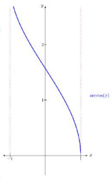

# 8. Funciones trigonométricas

## 8.1. Razones trigonométricas

## 8.1.1. Razones principales de un ángulo agudo

Razones trigonométricas principales:
- **Seno**: $sin(\alpha) = \frac{b}{a} = \frac{\text{cateto opuesto}}{\text{hipotenusa}}$
- **Coseno**: $cos(\alpha) = \frac{c}{a} = \frac{\text{cateto adyacente}}{\text{hipotenusa}}$
- **Tangente**: $tg(\alpha) = tan(\alpha) = \frac{b}{c} = \frac{sin(\alpha)}{cos(\alpha)} = \frac{\frac{b}{a}}{\frac{c}{a}} = \frac{b}{c} = \frac{\text{cateto opuesto}}{\text{cateto adyacente}}$

**Razones trigonométricas de los ángulos más usados**

>[!NOTE]
>**Radián**: Si en una circunferencia cogemos un arco de longitud igual a la del radio, el ángulo correspondiente tiene una medida que denominamos **radián (rad)**. $360° = 2\pi rad$

| $\alpha \text{(en rad)}$ | $\alpha \text{(en grados)}$ | $sin(\alpha)$        | $cos(\alpha)$        | $tan(\alpha)$        |
|--------------------------|-----------------------------|----------------------|----------------------|----------------------|
| $\frac{\pi}{6}$          | $30°$                       | $\frac{1}{2}$        | $\frac{\sqrt{3}}{2}$ | $\frac{\sqrt{3}}{3}$ |
| $\frac{\pi}{4}$          | $45°$                       | $\frac{\sqrt{2}}{2}$ | $\frac{\sqrt{2}}{2}$ | $1$                  |
| $\frac{\pi}{3}$          | $60°$                       | $\frac{\sqrt{3}}{2}$ | $\frac{1}{2}$        | $\sqrt{3}$           |
| $\frac{\pi}{2}$          | $90°$                       | $1$                  | 0                    | $\infty$             |

**Teorema fundamental de la trigonometría**

>[!NOTE]
>$(sin(\alpha))^2 = sin^2(\alpha)$

$sin^2(\alpha) + cos^2(\alpha) = 1$

Lo mismo que:
- $sin(\alpha) = \sqrt{1 - cos^2(\alpha)}$
- $cos(\alpha) =  \sqrt{1 - sin^2(\alpha)}$

### 8.1.2. Razones principales de un ángulo cualquiera

Se pueden deducir a partir de las razones trigonométricas de un ángulo agudo.

>Razones trigonométricas de un ángulo agudo.

>Razones trigonométricas de un ángulo obtuso.

>Seno y coseno de varios ángulos relevantes.

>[!NOTE]
>Las razones trigonométricas se repiten cuando se suma $2\pi$ a un ángulo. Por ejemplo:  
>$$sin(8342°) = sin(23 \cdot 360° + 62°) = sin(62°)$$

>Signo de las razones trigonométricas dependiendo del cuadrante en el que se encuentre la función.

## 8.2. Funciones seno y coseno

Estas funciones tienen la propiedad de ser periódicas, o sea que las mismas imágenes
se repiten cada vez que al valor $x$ le sumamos una cantidad fijada, que se llama
**período**.

### 8.2.1. Definición y ejemplos

| CARACTERÍSTICA                    | $sen(x)$                                                                        | $cos(x)$                                                                          |
|-----------------------------------|---------------------------------------------------------------------------------|-----------------------------------------------------------------------------------|
| **Fórmula**                       | $$sin(\alpha) = \frac{b}{a} = \frac{\text{cateto opuesto}}{\text{hipotenusa}}$$ | $$cos(\alpha) = \frac{c}{a} = \frac{\text{cateto adyacente}}{\text{hipotenusa}}$$ |
| **Representación gráfica**        |                                            |                                          |
| **Dominio**                       | $\mathbb{R}$                                                                    | $\mathbb{R}$                                                                      |
| **Imagen**                        | $[-1, -1]$                                                                      | $[-1, -1]$                                                                        |
| **Período**                       | $2\pi$                                                                          | $2\pi$                                                                            |
| **Puntos de corte con el eje X**  | $(k\pi, 0)$ donde $k \in \mathbb{Z}$                                            | $((2k + 1)\frac{\pi}{2}, 0)$ donde $k \in \mathbb{Z}$                             |
| **Puntos de corte con el eje Y**  | $(0, 0)$                                                                        | $(0, 1)$                                                                          |
| **Creciente en los intervalos**   | $(\frac{3\pi}{2} + 2\pi k, \frac{5\pi}{2} + 2\pi k)\, k \in \mathbb{Z}$         | $(\pi + 2\pi k, 2\pi + 2\pi k)$ donde $k \in \mathbb{Z}$                          |
| **Decreciente en los intervalos** | $(\frac{\pi}{2} + 2\pi k, \frac{3\pi}{2} + 2\pi k)$ donde $k \in \mathbb{Z}$    | $(2\pi k, \pi + 2\pi k)$ donde $k \in \mathbb{Z}$                                 |
| **Máximos**                       | En el punto $(\frac{\pi}{2} + 2\pi k, 1)$ donde $k \in \mathbb{Z}$              | En el punto $(2\pi k, 1)$ donde $k \in \mathbb{Z}$                                |
| **Mínimos**                       | En el punto $(\frac{3\pi}{2} + 2\pi k, -1)$ donde $k \in \mathbb{Z}$            | En el punto $(\pi + 2\pi k, -1)$ donde $k \in \mathbb{Z}$                         |
| **Simetría**                      | Función impar (simétrica respecto al origen). Cumple $sin(x) = sin(-x)$.	       | Función par (simétrica respecto al eje Y). Cumple $cos(x) = cos(-x)$.             |

### 8.2.2. Relación seno y coseno

$$cos(x) = sin(x + \frac{\pi}{2})$$

### 8.2.3. Transformaciones

- $f(x) = a \cdot sin(bx + c) + d$
- $g(x) = a \cdot cos(bx + c) + d$

Componentes de la transformación:

- **Amplitud ($a$)**: Controla el estiramiento o compresión vertical. 
	- Si $|a| < 1$, la gráfica se comprime verticalmente. 
	- Si $|a| > 1$, la gráfica se estira verticalmente. 
	- Si $a < 0$, hay una simetría respecto al eje X.
- **Frecuencia y período ($b$)**: Controla la compresión o expansión horizontal. El período de la función cambia y se calcula como $\frac{2\pi}{|b|}$.
	- Si $|b| > 1$, la gráfica se comprime horizontalmente. 
	- Si $|b| < 1$, la gráfica se estira horizontalmente.
	- Si $b < 0$, hay una simetría respecto al eje Y.
- **Desplazamiento horizontal ($c$)**: La gráfica se desplaza $c$ unidades horizontalmente. Se desplaza hacia la izquierda si $c > 0$ y hacia la derecha si $b < 0$. El desplazamiento exacto es $-\frac{c}{b}$.
- **Desplazamiento vertical ($d$)**: La gráfica se desplaza $d$ unidades verticalmente. Sube en $d > 0$ o baja en $d < 0$. Cambia la linea de equilibrio de la función (que normalmente es $y = 0$) a $y = d$.

## 8.3. Funciones tangente y cotangente

### 8.3.1. Definición y ejemplos

| CARACTERÍSTICA                    | $tan(x)$                                                                                                                                                                             | $cot(x)$                                                                                                 |
|-----------------------------------|--------------------------------------------------------------------------------------------------------------------------------------------------------------------------------------|----------------------------------------------------------------------------------------------------------|
| **Fórmula**                       | $$tg(\alpha) = tan(\alpha) = \frac{b}{c} = \frac{sin(\alpha)}{cos(\alpha)} = \frac{\frac{b}{a}}{\frac{c}{a}} = \frac{b}{c} = \frac{\text{cateto opuesto}}{\text{cateto adyacente}}$$ | $$cot(x) = \frac{cos(x)}{sin(x)} = \frac{1}{tan(x)}$$                                                    |
| **Representación gráfica**        |                                                                                                                                         |                                                         |
| **Dominio**                       | $\mathbb{R} ∖ \{\frac{\pi}{2} + k\pi\}$ donde $k \in \mathbb{Z}$, ya que la función no está definida cuando $cos(x) = 0$                                                             | $\mathbb{R} ∖ \{k\pi\}$ donde $k \in \mathbb{Z}$, ya que la función no está definida cuando $sin(x) = 0$ |
| **Imagen**                        | $\mathbb{R}$                                                                                                                                                                         | $\mathbb{R}$                                                                                             |
| **Período**                       | $\pi$                                                                                                                                                                                | $\pi$                                                                                                    |
| **Puntos de corte con el eje X**  | $(\frac{\pi}{2} + k\pi, 0)$ donde $k \in \mathbb{Z}$                                                                                                                                 | $(\frac{\pi}{2} + k\pi, 0)$ donde $k \in \mathbb{Z}$                                                     |
| **Puntos de corte con el eje Y**  | $(0, 0)$                                                                                                                                                                             | No tiene puntos de corte con el eje Y                                                                    |
| **Creciente en los intervalos**   | Creciente en todo su dominio                                                                                                                                                         | -                                                                                                        |
| **Decreciente en los intervalos** | -                                                                                                                                                                                    | Decreciente en todo su dominio                                                                           |
| **Máximos**                       | No tiene máximos                                                                                                                                                                     | No tiene máximos                                                                                         |
| **Mínimos**                       | No tiene mínimos                                                                                                                                                                     | No tiene mínimos                                                                                         |
| **Simetría**                      | Función impar (simétrica respecto al origen)	                                                                                                                                        | Función impar (simétrica respecto al origen)                                                             |

## 8.4. Funciones secante y cosecante

### 8.4.1. Definición y ejemplos

| CARACTERÍSTICA                    | $sec(x)$                                                                                                               | $cosec(x)$                                                                                             |
|-----------------------------------|------------------------------------------------------------------------------------------------------------------------|--------------------------------------------------------------------------------------------------------|
| **Fórmula**                       | $$sec(x) = \frac{1}{cos(x)}$$                                                                                          | $$cosec(x) = \frac{1}{sin(x)}$$                                                                        |
| **Representación gráfica**        |                                                                             |                                                         |
| **Dominio**                       | $\mathbb{R} ∖ \{\frac{\pi}{2} + k\pi \vert k \in \mathbb{Z}\}$, ya que la función no está definida cuando $cos(x) = 0$ | $\mathbb{R} ∖ \{k\pi \vert k \in \mathbb{Z}\}$, ya que la función no está definida cuando $sin(x) = 0$ |
| **Imagen**                        | $(-\infty, -1] \cup [1, +\infty)$                                                                                      | $(-\infty, -1] \cup [1, +\infty)$                                                                      |
| **Período**                       | $2\pi$                                                                                                                 | $2\pi$                                                                                                 |
| **Puntos de corte con el eje X**  | No tiene puntos de corte con el eje X                                                                                  | No tiene puntos de corte con el eje X                                                                  |
| **Puntos de corte con el eje Y**  | $(0, 1)$                                                                                                               | No tiene puntos de corte con el eje Y                                                                  |
| **Creciente en los intervalos**   | $(2\pi k, (2k + 1)\pi)$ donde $k \in \mathbb{Z}$                                                                       | $((4k + 1) \frac{\pi}{2}, (4k + 3) \frac{\pi}{2})$ donde $k \in \mathbb{Z}$                            |
| **Decreciente en los intervalos** | $((2k + 1) \pi, (2k + 2) \pi)$ donde $k \in \mathbb{Z}$                                                                | $((4k + 3) \frac{\pi}{2}, (4k + 5) \frac{\pi}{2})$ donde $k \in \mathbb{Z}$                            |
| **Máximos**                       | En el punto $((2k + 1) \pi, -1)$                                                                                       | En el punto $((4k + 3) \frac{\pi}{2}, -1)$                                                             | 
| **Mínimos**                       | En el punto $(2\pi k, 1)$ donde $k \in \mathbb{Z}$                                                                     | En el punto $((4k + 1) \frac{\pi}{2}, 1)$ donde $k \in \mathbb{Z}$.                                    |
| **Simetría**                      | Función par (simétrica respecto al eje Y)                                                                              | Función impar (simétrica respecto al origen)                                                           |

## 8.5. Funciones inversas

### 8.5.1. Definición y ejemplos

| CARACTERÍSTICA                    | $arcsin(x)$                                   | $arccos(x)$                                       | $arctan(x)$                                           |
|-----------------------------------|-----------------------------------------------|---------------------------------------------------|-------------------------------------------------------|
| **Representación gráfica**        |  |  |  |
| **Dominio**                       | $[-1, 1]$                                     | $[0, \pi]$                                        | $(-\infty, +\infty)$                                  |
| **Imagen**                        | $[-1, 1]$                                     | $[-1, 1]$                                         | $(-\infty, +\infty)$                                  |
| **Período**                       | No tiene período                              | No tiene período                                  | No tiene período                                      |
| **Puntos de corte con el eje X**  | $(0,0)$                                       | $(1, 0)$                                          | $(0,0)$                                               |
| **Creciente en los intervalos**   | $(-1, 1)$                                     | $(-1, 1)$                                         | $(-\infty, +\infty)$                                  |
| **Decreciente en los intervalos** | No aplica (es creciente en todo su dominio)	  | No aplica (es decreciente en todo su dominio)    | No aplica (es creciente en todo su dominio)           |
| **Máximos**                       | $(1, \frac{\pi}{2})$                          | $(1, 0)$                                          | No tiene máximos en un valor específico               |
| **Mínimos**                       | $(-1, -\frac{\pi}{2})$                        | $(-1, \pi)$                                       | No tiene mínimos en un valor específico               |
| **Simetría**                      | Función impar (simétrica respecto al origen)  | Función par (simétrica respecto al eje Y)         | Función impar (simétrica respecto al origen)          |
