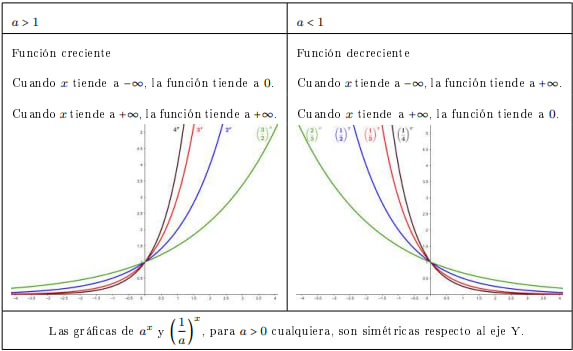
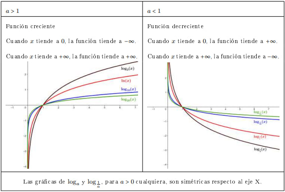
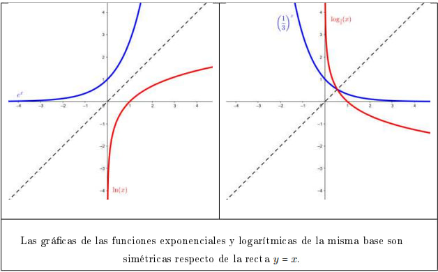

# 9. Funciones exponenciales y logarítmicas

| CARACTERÍSTICA                   | Función exponencial                                                        | Función logarítmica                                                              |
|----------------------------------|----------------------------------------------------------------------------|----------------------------------------------------------------------------------|
| **Definición**                   | Crece o decrece exponencialmente según la base $a$                         | Es la inversa de la función exponencial                                          |
| **Expresión**                    | $$y = a^x, \text{donde } a > 0, y > 0$$                                    | $$y = \log_a x = \log_a (x) \iff a^y = x, \text{donde } a > 0, x \neq 1, x > 0$$ |
| **Representación gráfica**       |                         |                               |
| **Dominio**                      | $\mathbb{R} = (-\infty, +\infty)$                                          | $\mathbb{R}^+ = (0, +\infty)$                                                    |
| **Imagen**                       | $\mathbb{R}^+ = (0, +\infty)$                                              | $\mathbb{R} = (-\infty, +\infty)$                                                |
| **Puntos de corte con el eje X** | No corta con el eje X ($y > 0$)                                            | $(1, 0)$                                                                         |
| **Puntos de corte con el eje Y** | $(0, 1)$                                                                   | No corta con el eje Y ($x > 0$)                                                  |
| **Máximos**                      | No tiene máximos                                                           | No tiene máximos                                                                 |
| **Mínimos**                      | No tiene mínimos                                                           | No tiene mínimos                                                                 |
| **Monotonía**                    | <ul><li>Creciente si $a > 1$</li><li>Decreciente si $0 < a < 1$</li></ul>	| <ul><li>Creciente si $a > 1$</li><li>Decreciente si $0 < a < 1$</li></ul>        |
| **Asíntotas**                    | Asíntota horizontal en $y = 0$                                             | Asíntota vertical en $x = 0$                                                     | 

## Función exponencial

$$f(x) = e^{x + a} + b$$

Donde:
- $e^x$ es una función exponencial con base $e$.
- $a$ provoca un desplazamiento **horizontal** de la gráfica. Esto modifica tanto a su escalamiento vertical como al punto de corte con el eje Y $(0, e^a)$.
	- $a > 0$: La gráfica se desplaza hacia la **izquierda** $a$ unidades y se eleva verticalmente. 
	- $a < 0$: La gráfica se desplaza hacia la **derecha** $|a|$ unidades y se reduce verticalmente (pero sigue siendo positiva).
- $b$ provoca un desplazamiento **vertical** de la gráfica. Esto modifica tanto el rango de la función como la posición de su asíntota vertical.
	- $b > 0$: La gráfica se desplaza hacia **arriba** $b$ unidades. 
	- $b < 0$: La gráfica se desplaza hacia **abajo** $|b|$ unidades.

## Logaritmo

$$y = \log_a x = \log_a (x) \iff a^y = x, \text{donde } a > 0, x \neq 1, x > 0$$

Ejemplos:
- Logaritmo de base $3$ de $81$: $\log_3 (81) = 4$ porque $3^4 = 81$.
- Logaritmo de base $5$ de $25$: $\log_5 (25) = 2$ porque $5^2 = 25$.
- Logaritmo de base $7$ de $49$: $\log_7 (49) = 2$ porque $7^2 = 49$.

Dos casos particulares en la notación de esta función:
- Cuando la base es el número irracional $e$, se habla de logaritmo neperiano y se escribe $\ln$. Es decir, se entiende $\ln = \log_e$.
- Cuando la base es el número $10$, se habla simplemente de logaritmo, sin especificar la base, y se suele escribir simplemente $\log$. Es decir, se entiende $\log = \log_10$.

### Propiedades

1. $\log_a (a) = 1$ y $\log_a (1) = 0$
2. El logaritmo del producto es igual a la suma de logaritmos:

	$$\log_a (x \cdot y) = \log_a (x) + \log_a (y), \text{para } x, y > 0$$

3. El logaritmo de una potencia es igual al producto del exponente por el logaritmo de la base:

	$$\log_a (x^y) = y \cdot \log_a (x), \text{para } x > 0$$

4. El logaritmo de un cociente es el logaritmo del numerador menos el logaritmo del denominador:

	$$\log_a (\frac{x}{y}) = \log_a (x) - \log_a (y), \text{para } x > 0$$

5. Es posible relacionar dos logaritmos de diferentes bases, $a$ y $b$, con esta fórmula:

	$$\log_b (x) = \frac{\log_a (x)}{\log_a (b)}, \text{para } x > 0$$

## Función logarítmica

$$f(x) = \log_a (x^b)$$

Donde:
- $a$ es la base del logaritmo. Afecta a la monotonía de la función.
	- $a > 1$: La función es **creciente**.
	- $0 < a < 1$: La función es **decreciente**.
- $b$ influye en la pendiente y el número de ramas.
	- $b > 1$: Mayor pendiente.
	- $0 < b < 1$: Menor pendiente.
	- $b < 0$: Curvatura invertida, con $f(x)$ decreciendo rápidamente para $x \rightarrow 0^+$.
	- $b / 2 = 0$: La función tiene **dos ramas** simétricas respecto al eje Y.
	- $b / 2 \neq 0$: La función tiene **una rama**.

$$f(x) = \log_a (x + c)$$

Donde:
- $a$ es la base del logaritmo. Afecta a la monotonía de la función.
	- $a > 1$: La función es **creciente**.
	- $0 < a < 1$: La función es **decreciente**.
- $c$ provoca un desplazamiento **horizontal** de la gráfica. Esto modifica el dominio de la función y el punto de corte con el eje X $(1 - c, 0)$.
	- $c > 0$: La función se desplaza hacia la **izquierda** $c$ unidades.
	- $c < 0$: La función se desplaza hacia la **derecha** $|c|$ unidades.

## Relación entre las gráficas exponencial y logarítmica

La simetría refleja la relación de inversión entre ambas funciones. Si $a^x = y$, entonces $\log⁡_a (y) = x$. Esto implica que las operaciones de exponenciación y logaritmo invierten lo que hace la otra función.

## Ecuaciones exponencial y logarítmica

### Ecuación exponencial

No tiene ninguna fórmula de resolución general. Lo que conviene en estos casos es agrupar al máximo las potencias para intentar sustituir la ecuación exponencial por una ecuación lineal o cuadrática.

**Ejemplos de resolución**

$$2^{x+1} = 2^2$$

Dado que las bases son iguales, los exponentes tienen que ser iguales:

$$x + 1 = 2 \Rightarrow x = 2 - 1 = 1$$

Efectivamente, $2^{1+1} = 2^2$.

---

$$7^x + 7^{x+1} + 7^{x+2} = 2793$$

Se tiene que intentar sacar $7^x$ como factor común aplicando las propiedades de las potencias:

$$7^x \cdot (1 + 7 + 7^2) = 2793$$

Operamos los elementos entre paréntesis:

$$7^x \cdot (57) = 2793$$

de donde resulta

$$7^x = \frac{2793}{57} = 49 = 7^2$$

y, por lo tanto, 

$$x = 2$$

---

$$5^{x - 1} = 2 + \frac{3}{5^{x - 2}}$$

Se tiene que intentar eliminar el denominador. Multiplicamos toda la expresión por $5^{x - 2}$:

$$5^{x - 1} \cdot 5^{x - 2} = 2 \cdot 5^{x - 2} - 3 = 0$$

Reescribimos:

$$5 \cdot 5^{2x - 4} - 2 \cdot 5^{x - 2} - 3 = 0$$

Agrupamos términos de manera conveniente:

$$5 \cdot (5^{(x - 2)})^2 - 2 \cdot 5^{x - 2} - 3 = 0$$

Obtenemos así una ecuación de segundo grado con incógnita $5^{x - 2}$. Denominamos $z = 5^{x - 2}$ e intentamos resolver la ecuación:

$$5z^2 - 2z - 3 = 0$$

Aplicamos la fórmula para las ecuaciones de segundo grado y obtenemos

$$z = 1 \text{ y } z = -\frac{3}{5}$$

Comprobamos si las soluciones obtenidas cumplen la ecuación original:

$z = -\frac{3}{5}$ no es posible porque se tendría que cumplir $z = 5^{x - 2} = -\frac{3}{5}$, que no es posible porque $5^{x - 2}$ no puede ser negativo.

$z = 1$ proporciona esta solución:

$$z = 5^{x - 2} = 1 = 5^0 \Rightarrow 5^{x - 2} = 5^0 \Rightarrow x - 2 = 0 \Rightarrow x = 2$$

### Ecuación logarítmica

Al igual que la ecuación exponencial, no tiene ninguna fórmula de resolución general. Lo que conviene en estos casos es agrupar al máximo los logaritmos para intentar sustituir la ecuación exponencial por una ecuación lineal o cuadrática.

**Ejemplos de resolución**

$$2 \log (x) - \log (x - 16) = 2$$

Reescribimos el término de la izquierda, ya que $2 \log (x) = \log (x^2)$:

$$\log (x^2) - \log(x - 16) = 2$$

Aplicamos la propiedad del logaritmo del cociente, $\log (x^2) - log (x - 16) = \log \frac{x^2}{x - 16}$:

$$\log (\frac{x^2}{x - 16}) = 2$$

Reescribimos el término de la derecha, ya que $2 = \log (100)$:

$$\log (\frac{x^2}{x - 16}) = \log (100)$$

de donde resulta

$$\frac{x^2}{x - 16} = 100$$

Ordenamos los términos:

$$x^2 - 100x + 1600 = 0$$

y se trata de resolver una ecuación de segundo grado.

Aplicamos la fórmula de Baskhara y obtenemos

$$x = 20 \text{ y } x = 80$$

---

$$
\begin{cases}
x + y = 65 \\
\log (x) + \log (y) = 3
\end{cases}
$$

La primera ecuación ya es lineal, por lo tanto, nos centramos en intentar transformar la segunda en una ecuación lineal.

Reescribimos la segunda ecuación teniendo en cuenta el logaritmo de un producto: $\log (a \cdot b) = \log (a) + \log (b)$ y que $\log (1000) = 3$:

$$\log (x \cdot y) = \log (1000)$$

Esta ecuación se reduce en $x \cdot y = 1000$, y por lo tanto, se trata de resolver el sistema

$$
\begin{cases}
x + y = 65 \\
x \cdot y = 1000
\end{cases}
$$

Al resolver este sistema de ecuaciones, obtenemos dos alternativas:

$$(x, y) = (40, 25) \text{o bien } (x, y) = (25, 40)$$

Finalmente, comprobamos las posibles soluciones obtenidas en el sistema original:

$$
\begin{cases}
40 + 25 = 65 \Rightarrow 65 = 65 \\
\log (40) + \log (25) = 3 \Rightarrow 3 = 3
\end{cases}
$$

$$\log_{\frac{1}{3}} (x) = 2$$