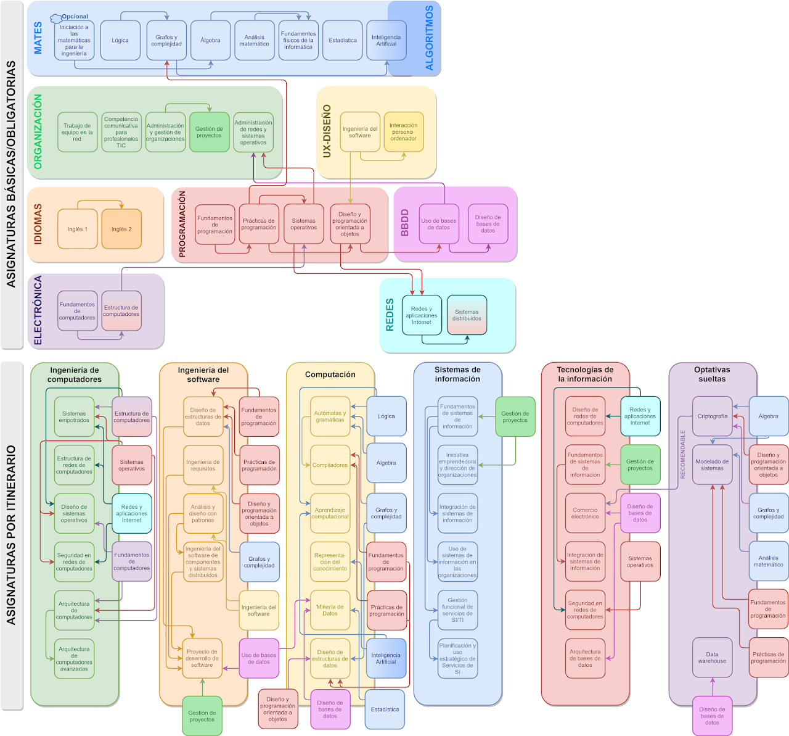

	
	<h1 align="center">UOC Ingeniería Informática</h1>
	

		Repositorio con todos los materiales, apuntes y ejercicios realizados durante el grado en Ingeniería Informática de la Universidad Oberta de Catalunya.
	

	

		
		
		
		
		
	

	

		<a href="https://github.com/HenestrosaDev/uoc-ingenieria-informatica/issues/new/choose">
			Reportar Error
		</a> 
		· 
		<a href="https://github.com/HenestrosaDev/uoc-ingenieria-informatica/discussions">
			Realizar Pregunta
		</a>
	

---

## Antes de empezar

>[!IMPORTANT]  
>No están todas las asignaturas obligatorias y básicas, ya que convalidé las siguientes por haber cursado el CFGS en Desarrollo de Aplicaciones Web (y Multiplataforma) y tener el título C1 de inglés de Cambridge (CAE):
>| ASIGNATURA CONVALIDADA                    | TIPO DE FORMACIÓN | CRÉDITOS |
>|-------------------------------------------|-------------------|----------|
>| Fundamentos de programación               | Básica            | 6        |
>| Prácticas de programación                 | Básica            | 6        |
>| Trabajo en equipo en la red               | Básica            | 6        |
>| Diseño de bases de datos                  | Obligatoria       | 6        |
>| Diseño y programación orientada a objetos | Obligatoria       | 6        |
>| Inglés I                                  | Obligatoria       | 6        |
>| Inglés II                                 | Obligatoria       | 6        |
>| Uso de bases de datos                     | Obligatoria       | 6        |
>| Iniciativa emprendedora                   | Optativa          | 6        |
>| Prácticas en empresa                      | Optativa          | 12       |

## Asignaturas

>[!NOTE]
>- Este repositorio se actualiza al término de cada semestre.
>- Los números entre paréntesis al final del nombre de cada asignatura indican el curso escolar en el que se realizó, junto con el semestre, que puede ser 1 (de septiembre a enero) o 2 (de febrero a junio).
>- Las asignaturas están desglosadas por tipo (básicas, obligatorias y optativas) y ordenadas alfabéticamente.
>- 

>	
Leyenda de calificaciones

>
>	- Matrícula de Honor (M): 9 a 10
>	- Sobresaliente (EX): 9 a 10
>	- Notable (NO): 7 a 8,99
>	- Aprobado (A): 5 a 6,99
>	- Suspendido (SU): 0 a 4,99
>

### Asignaturas básicas

<table>
	<tr>
		<th>ASIGNATURA</th>
		<th>PRUEBA DE EVALUACIÓN CONTINUA (PEC)</th>
		<th>PRÁCTICA (PR)</th>
		<th>CALIFICACIÓN</th>
	</tr>
	<tr>
		<td rowspan="5">
			<a href="https://github.com/HenestrosaDev/uoc-ingenieria-informatica/tree/main/administracion_y_gestion_de_organizaciones">
				Administración y gestión de organizaciones (24/25-1)
			</a>
		</td>
		<td>
			<a href="https://github.com/HenestrosaDev/uoc-ingenieria-informatica/tree/main/administracion_y_gestion_de_organizaciones/pec1">
				PEC1 - Tipificación y análisis de una organización
			</a>
		</td>
		<td>-</td>
		<td rowspan="5">
			8,10 / 10,00 (NO)
		</td>
	</tr>
	<tr>
		<td>
			<a href="https://github.com/HenestrosaDev/uoc-ingenieria-informatica/tree/main/administracion_y_gestion_de_organizaciones/pec2">
				PEC2 - Análisis financiero y contable de una organización
			</a>
		</td>
		<td>-</td>
	</tr>
	<tr>
		<td>
			<a href="https://github.com/HenestrosaDev/uoc-ingenieria-informatica/tree/main/administracion_y_gestion_de_organizaciones/pec3">
				PEC3 - Elaboración de un plan de negocio, con aspectos de RSC
			</a >
		</td>
		<td>-</td>
	</tr>
	<tr>
		<td>
			<a href="https://github.com/HenestrosaDev/uoc-ingenieria-informatica/tree/main/administracion_y_gestion_de_organizaciones/pec4">
				PEC4 - Datos, organizaciones y resiliencia
			</a>
		</td>
		<td>-</td>
	</tr>
	<tr>
		<td colspan="2" align="center">
			<strong>
				<a href="https://github.com/HenestrosaDev/uoc-ingenieria-informatica/tree/main/administracion_y_gestion_de_organizaciones/examen">
					EXAMEN
				</a>
			</strong>
		</td>
	</tr>
	<!-- ANÁLISIS MATEMÁTICO -->
	<tr>
		<td rowspan="6">
			<a href="https://github.com/HenestrosaDev/uoc-ingenieria-informatica/tree/main/analisis_matematico">
				Análisis matemático (24/25-2)
			</a>
		</td>
		<td>
			<a href="https://github.com/HenestrosaDev/uoc-ingenieria-informatica/tree/main/analisis_matematico/pec1">
				PEC1 - Funciones reales de variable real
			</a>
		</td>
		<td>-</td>
		<td rowspan="6">
			- / 10,00 ()
		</td>
	</tr>
	<tr>
		<td>
			<a href="https://github.com/HenestrosaDev/uoc-ingenieria-informatica/tree/main/analisis_matematico/pec2">
				PEC2 - Límites de funciones y continuidad
			</a>
		</td>
		<td>-</td>
	</tr>
	<tr>
		<td>
			<a href="https://github.com/HenestrosaDev/uoc-ingenieria-informatica/tree/main/analisis_matematico/pec3">
				PEC3 - Derivación: el problema de la tangente
			</a >
		</td>
		<td>-</td>
	</tr>
	<tr>
		<td>
			<a href="https://github.com/HenestrosaDev/uoc-ingenieria-informatica/tree/main/analisis_matematico/pec4">
				PEC4 - Integración: el problema del área
			</a>
		</td>
		<td>-</td>
	</tr>
	<tr>
		<td>
			<a href="https://github.com/HenestrosaDev/uoc-ingenieria-informatica/tree/main/analisis_matematico/pec5">
				PEC5 - Sucesiones y series de números reales
			</a>
		</td>
		<td>-</td>
	</tr>
	<tr>
		<td colspan="2" align="center">
			<strong>
				<a href="https://github.com/HenestrosaDev/uoc-ingenieria-informatica/tree/main/analisis_matematico/examen">
					EXAMEN
				</a>
			</strong>
		</td>
	</tr>
	<!-- FUNDAMENTOS DE COMPUTADORES -->
	<tr>
		<td rowspan="4">
			<a href="https://github.com/HenestrosaDev/uoc-ingenieria-informatica/tree/main/fundamentos_de_computadores">
				Fundamentos de computadores (24/25-2)
			</a>
		</td>
		<td>
			<a href="https://github.com/HenestrosaDev/uoc-ingenieria-informatica/tree/main/fundamentos_de_computadores/pec1">
				PEC1 - ¿Estás preparado para adentrarte en el mundo de los computadores digitales?
			</a>
		</td>
		<td>
			<a href="https://github.com/HenestrosaDev/uoc-ingenieria-informatica/tree/main/fundamentos_de_computadores/pr1">
				PR1 - Máquinas de estados: entendiendo la arquitectura básica de un computador a partir de las máquina algorítmicas generalizables
			</a>
		</td>
		<td rowspan="4">
			- / 10,00 ()
		</td>
	</tr>
	<tr>
		<td>
			<a href="https://github.com/HenestrosaDev/uoc-ingenieria-informatica/tree/main/fundamentos_de_computadores/pec2">
				PEC2 - Diseñando circuitos combinacionales
			</a>
		</td>
		<td>-</td>
	</tr>
	<tr>
		<td>
			<a href="https://github.com/HenestrosaDev/uoc-ingenieria-informatica/tree/main/fundamentos_de_computadores/pec3">
				PEC3 - De los sistemas combinacionales a los sistemas secuenciales: diseñando circuitos con memoria
			</a >
		</td>
		<td>-</td>
	</tr>
	<tr>
		<td colspan="2" align="center">
			<strong>
				<a href="https://github.com/HenestrosaDev/uoc-ingenieria-informatica/tree/main/fundamentos_de_computadores/examen">
					EXAMEN
				</a>
			</strong>
		</td>
	</tr>
	<!-- LÓGICA -->
	<tr>
		<td rowspan="7">
			<a href="https://github.com/HenestrosaDev/uoc-ingenieria-informatica/tree/main/logica">
				Lógica (24/25-2)
			</a>
		</td>
		<td>
			<a href="https://github.com/HenestrosaDev/uoc-ingenieria-informatica/tree/main/logica/pec1">
				PEC1 - ¿Estás preparado para adentrarte en el mundo de los computadores digitales?
			</a>
		</td>
		<td>-</td>
		<td rowspan="7">
			- / 10,00 ()
		</td>
	</tr>
	<tr>
		<td>
			<a href="https://github.com/HenestrosaDev/uoc-ingenieria-informatica/tree/main/logica/pec2">
				PEC2 - La deducción natural: un sistema de razonamiento formal
			</a>
		</td>
		<td>-</td>
	</tr>
	<tr>
		<td>
			<a href="https://github.com/HenestrosaDev/uoc-ingenieria-informatica/tree/main/logica/pec3">
				PEC3 - Mecanización y verificación de razonamientos formales
			</a >
		</td>
		<td>-</td>
	</tr>
	<tr>
		<td>
			<a href="https://github.com/HenestrosaDev/uoc-ingenieria-informatica/tree/main/logica/pec4">
				PEC4 - El lenguaje formal de la lógica de predicados
			</a >
		</td>
		<td>-</td>
	</tr>
	<tr>
		<td>
			<a href="https://github.com/HenestrosaDev/uoc-ingenieria-informatica/tree/main/logica/pec5">
				PEC5 - La deducción natural en la lógica de predicados
			</a >
		</td>
		<td>-</td>
	</tr>
	<tr>
		<td>
			<a href="https://github.com/HenestrosaDev/uoc-ingenieria-informatica/tree/main/logica/pec6">
				PEC6 - El método de resolución y la semántica de la lógica de predicados
			</a >
		</td>
		<td>-</td>
	</tr>
	<tr>
		<td colspan="2" align="center">
			<strong>
				<a href="logica/examenes/2025/junio/espanol/20242_75570_210625_1_E_SOL">
					EXAMEN
				</a>
			</strong>
		</td>
	</tr>
</table>

### Asignaturas obligatorias

<table>
	<tr>
		<th>ASIGNATURA</th>
		<th>PRUEBA DE EVALUACIÓN CONTINUA (PEC)</th>
		<th>PRÁCTICA (PR)</th>
		<th>CALIFICACIÓN</th>
	</tr>
	<tr>
		<td rowspan="4">
			<a href="https://github.com/HenestrosaDev/uoc-ingenieria-informatica/tree/main/competencia_comunicativa_para_profesionales_de_las_tic">
				Competencia comunicativa para profesionales de las TIC (24/25-1)
			</a>
		</td>
		<td>
			<a href="https://github.com/HenestrosaDev/uoc-ingenieria-informatica/tree/main/competencia_comunicativa_para_profesionales_de_las_tic/pec1">
				PEC1 - Dime cómo escribes y te diré quién eres
			</a>
		</td>
		<td>
			<a href="https://github.com/HenestrosaDev/uoc-ingenieria-informatica/tree/main/competencia_comunicativa_para_profesionales_de_las_tic/pr1">
				PR1 - La primera impresión es la que cuenta
			</a>
		</td>
		<td rowspan="4">
			10,00 / 10,00 (M)
		</td>
	</tr>
	<tr>
		<td>
			<a href="https://github.com/HenestrosaDev/uoc-ingenieria-informatica/tree/main/competencia_comunicativa_para_profesionales_de_las_tic/pec2">
				PEC2 - Divide y vencerás. Los párrafos y las técnicas de síntesis
			</a>
		</td>
		<td>
			<a href="https://github.com/HenestrosaDev/uoc-ingenieria-informatica/tree/main/competencia_comunicativa_para_profesionales_de_las_tic/pr2">
				PR2 - Resumiendo que es gerundio
			</a>
		</td>
	</tr>
	<tr>
		<td>
			<a href="https://github.com/HenestrosaDev/uoc-ingenieria-informatica/tree/main/competencia_comunicativa_para_profesionales_de_las_tic/pec3">
				PEC3 - Texto bien unido, jamás será vencido
			</a>
		</td >
		<td>
			<a href="https://github.com/HenestrosaDev/uoc-ingenieria-informatica/tree/main/competencia_comunicativa_para_profesionales_de_las_tic/pr3">
				PR3 - ¡Manos a la obra! Trabajamos la propuesta de proyecto
			</a>
		</td>
	</tr>
	<tr>
		<td>
			-
		</td>
		<td>
			<a href="https://github.com/HenestrosaDev/uoc-ingenieria-informatica/tree/main/competencia_comunicativa_para_profesionales_de_las_tic/pr4">
				PR4 - ¡Recapitulemos! ¿Qué he aprendido?
			</a>
		</td>
	</tr>
</table>

<!-- ### Asignaturas optativas pertenecientes al itinerario de Ingeniería del software

<table>
	<tr>
		<th>ASIGNATURA</th>
		<th>PRUEBA DE EVALUACIÓN CONTINUA (PEC)</th>
		<th>PRÁCTICA (PR)</th> 
	</tr>
	<tr>
		<td rowspan="2">
			<a href="https://github.com/HenestrosaDev/uoc-ingenieria-informatica/tree/main/diseno_de_estructuras_de_datos">
				Diseño de estructuras de datos
			</a>
		</td>
		<td>
			<a href="https://github.com/HenestrosaDev/uoc-ingenieria-informatica/tree/main/diseno_de_estructuras_de_datos/pec1">
				-
			</a>
		</td>
		<td>-</td>
	</tr>
	<tr>
		<td rowspan="1">
			<a href="https://github.com/HenestrosaDev/uoc-ingenieria-informatica/tree/main/ingenieria_de_requisitos">
				Ingeniería de requisitos
			</a>
		</td>
		<td>
			<a href="https://github.com/HenestrosaDev/uoc-ingenieria-informatica/tree/main/ingenieria_de_requisitos/pec1">
				-
			</a>
		</td>
		<td>-</td>
	</tr>
	<tr>
		<td rowspan="1">
			<a href="https://github.com/HenestrosaDev/uoc-ingenieria-informatica/tree/main/analisis_y_diseno_con_patrones">
				Análisis y diseño con patrones
			</a>
		</td>
		<td>
			<a href="https://github.com/HenestrosaDev/uoc-ingenieria-informatica/tree/main/analisis_y_diseno_con_patrones/pec1">
				-
			</a>
		</td>
		<td>-</td>
	</tr>
	<tr>
		<td rowspan="1">
			<a href="https://github.com/HenestrosaDev/uoc-ingenieria-informatica/tree/main/ingenieria_del_software_de_componentes_y_sistemas_distribuidos">
				Ingeniería del software de componentes y sistemas distribuidos
			</a>
		</td>
		<td>
			<a href="https://github.com/HenestrosaDev/uoc-ingenieria-informatica/tree/main/ingenieria_del_software_de_componentes_y_sistemas_distribuidos/pec1">
				-
			</a>
		</td>
		<td>-</td>
	</tr>
	<tr>
		<td rowspan="1">
			<a href="https://github.com/HenestrosaDev/uoc-ingenieria-informatica/tree/main/proyecto_de_desarrollo_de_software">
				Proyecto de desarrollo de software
			</a>
		</td>
		<td>
			<a href="https://github.com/HenestrosaDev/uoc-ingenieria-informatica/tree/main/proyecto_de_desarrollo_de_software/pec1">
				-
			</a>
		</td>
		<td>-</td>
	</tr>
</table> -->

### Asignaturas optativas sueltas

<table>
	<tr>
		<th>ASIGNATURA</th>
		<th>PRUEBA DE EVALUACIÓN CONTINUA (PEC)</th>
		<th>PRÁCTICA (PR)</th>
		<th>CALIFICACIÓN</th>
	</tr>
	<tr>
		<td rowspan="2">
			<a href="https://github.com/HenestrosaDev/uoc-ingenieria-informatica/tree/main/iniciacion_a_las_matematicas_para_la_ingenieria">
				Iniciación a las matemáticas para la ingeniería (24/25-1)
			</a>
		</td>
		<td>
			<a href="https://github.com/HenestrosaDev/uoc-ingenieria-informatica/tree/main/iniciacion_a_las_matematicas_para_la_ingenieria/pec1">
				PEC1 - Bloque 1: Álgebra
			</a>
		</td>
		<td>
			-
		</td>
		<td rowspan="2">9,60 / 10,00 (M)</td>
	</tr>
	<tr>
		<td>
			<a href="https://github.com/HenestrosaDev/uoc-ingenieria-informatica/tree/main/iniciacion_a_las_matematicas_para_la_ingenieria/pec2">
				PEC2 - Bloque 2: Análisis
			</a>
		</td>
		<td>-</td>
	</tr>
</table>

(<a href="#top">volver al principio</a>)

## Recursos de interés

>Infografía general sacada de la web no oficial de [FAQs y enlaces de interés](https://sites.google.com/view/faq-enginyeria-informatica). Las asignaturas **Modelado de sistemas** y **Data warehouse** ya no están disponibles.

### Enlaces

- [Página oficial de la UOC sobre el grado](https://www.uoc.edu/es/estudios/grados/grado-ingenieria-informatica)
- [Recopilatorio no oficial de asignaturas con sus respectivas notas medias, métodos de evaluación y grupos de Telegram/WhatsApp](https://uoc-nextjs.vercel.app/)

## Licencia

Distribuido bajo la licencia **MIT**. Véase [`LICENSE`](https://github.com/HenestrosaDev/uoc-ingenieria-informatica/blob/main/LICENSE) para más información.

## Autores

- HenestrosaDev <[github@henestrosa.dev](github@henestrosa.dev)> (José Carlos López Henestrosa)

## Apoyo

¿Te han parecido útiles los materiales subidos a este repositorio y te gustaría mostrar tu agradecimiento por el trabajo realizado? ¡Muchas gracias! Puedes invitarme a un café yendo a mi perfil de Ko-Fi o PayPal haciendo clic en alguno de los botones de abajo.

	

(<a href="#top">volver al principio</a>)

