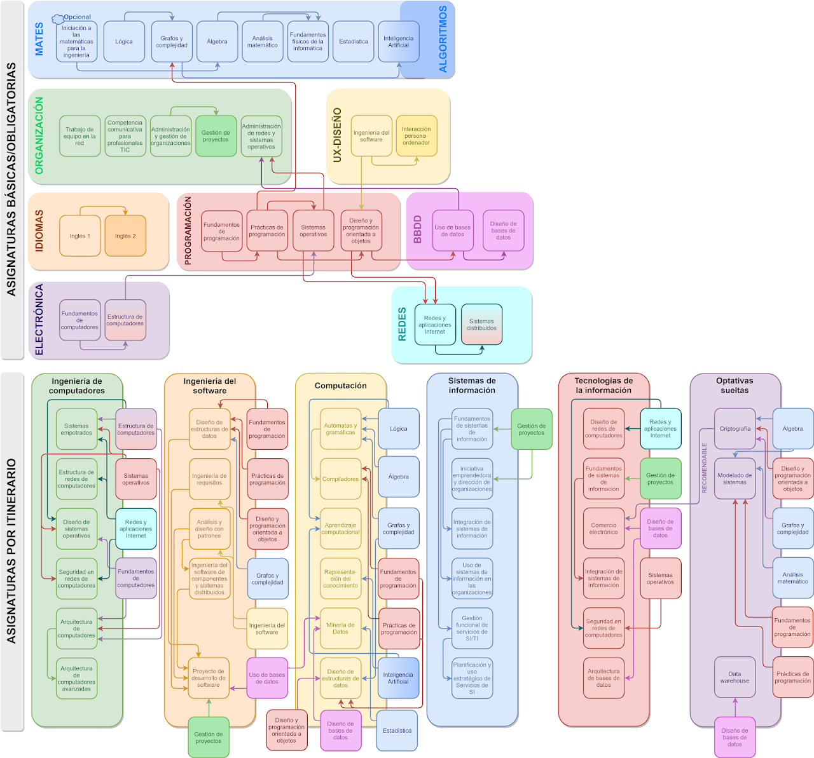

	
	<h1 align="center">UOC Ingeniería Informática</h1>
	

		Repositorio con todos los materiales, apuntes y ejercicios realizados durante el grado en Ingeniería Informática de la Universidad Oberta de Catalunya.
	

	

		
		
		
		
		
	

	

		<a href="https://github.com/HenestrosaDev/uoc-ingenieria-informatica/issues/new/choose">
			Reportar Error
		</a> 
		· 
		<a href="https://github.com/HenestrosaDev/uoc-ingenieria-informatica/discussions">
			Realizar Pregunta
		</a>
	

---

## Antes de empezar

>[!IMPORTANT]  
>No están todas las asignaturas obligatorias y básicas, ya que convalidé las siguientes por haber cursado el CFGS en Desarrollo de Aplicaciones Web (y Multiplataforma) y tener el título C1 de inglés de Cambridge (CAE):
>| ASIGNATURA CONVALIDADA                    | TIPO DE FORMACIÓN | CRÉDITOS |
>|-------------------------------------------|-------------------|----------|
>| Fundamentos de programación               | Básica            | 6        |
>| Prácticas de programación                 | Básica            | 6        |
>| Trabajo en equipo en la red               | Básica            | 6        |
>| Diseño de bases de datos                  | Obligatoria       | 6        |
>| Diseño y programación orientada a objetos | Obligatoria       | 6        |
>| Inglés I                                  | Obligatoria       | 6        |
>| Inglés II                                 | Obligatoria       | 6        |
>| Uso de bases de datos                     | Obligatoria       | 6        |
>| Iniciativa emprendedora                   | Optativa          | 6        |
>| Prácticas en empresa                      | Optativa          | 12       |

## Asignaturas

>[!NOTE]
>Los números entre paréntesis hacen referencia al curso en el que se completaron las asignaturas.

### Asignaturas básicas

<table>
	<tr>
		<th>ASIGNATURA</th>
		<th>PRUEBA DE EVALUACIÓN CONTINUA (PEC)</th>
	</tr>
	<tr>
		<td rowspan="4">
			<a href="https://github.com/HenestrosaDev/uoc-ingenieria-informatica/tree/main/Administraci%C3%B3n%20y%20gesti%C3%B3n%20de%20organizaciones">
				Administración y gestión de organizaciones (24/25)
			</a>
		</td>
		<td>
			<a href="https://github.com/HenestrosaDev/uoc-ingenieria-informatica/tree/main/Administraci%C3%B3n%20y%20gesti%C3%B3n%20de%20organizaciones/PEC1">
				PEC1 Introducción al bastionado
			</a>
		</td>
	</tr>
	<tr>
		<td>
			<a href="https://github.com/HenestrosaDev/uoc-ingenieria-informatica/tree/main/Administraci%C3%B3n%20y%20gesti%C3%B3n%20de%20organizaciones/PEC2">
				PEC2 Análisis financiero y contable de una organización
			</a>
		</td>
	</tr>
	<tr>
		<td>
			<a href="https://github.com/HenestrosaDev/uoc-ingenieria-informatica/tree/main/Administraci%C3%B3n%20y%20gesti%C3%B3n%20de%20organizaciones/PEC3">
				PEC3 Elaboración de un plan de negocio, con aspectos de RSC
			</a>
		</td>
	</tr>
	<tr>
		<td>
			<a href="https://github.com/HenestrosaDev/uoc-ingenieria-informatica/tree/main/Administraci%C3%B3n%20y%20gesti%C3%B3n%20de%20organizaciones/PEC4">
				PEC4 Datos, organizaciones y resiliencia
			</a>
		</td>
	</tr>
</table>

### Asignaturas obligatorias

<table>
	<tr>
		<th>ASIGNATURA</th>
		<th>PRUEBA DE EVALUACIÓN CONTINUA (PEC)</th>
		<th>PRÁCTICA (PR)</th>
	</tr>
	<tr>
		<td rowspan="4">
			<a href="https://github.com/HenestrosaDev/uoc-ingenieria-informatica/tree/main/Competencia%20comunicativa%20para%20profesionales%20de%20las%20TIC">
				Competencia comunicativa para profesionales de las TIC (24/25)
			</a>
		</td>
		<td>
			<a href="https://github.com/HenestrosaDev/uoc-ingenieria-informatica/tree/main/Competencia%20comunicativa%20para%20profesionales%20de%20las%20TIC/PEC1">
				PEC1 Dime cómo escribes y te diré quién eres
			</a>
		</td>
		<td>
			<a href="https://github.com/HenestrosaDev/uoc-ingenieria-informatica/tree/main/Competencia%20comunicativa%20para%20profesionales%20de%20las%20TIC/PR1">
				PR1 La primera impresión es la que cuenta
			</a>
		</td>
	</tr>
	<tr>
		<td>
			<a href="https://github.com/HenestrosaDev/uoc-ingenieria-informatica/tree/main/Competencia%20comunicativa%20para%20profesionales%20de%20las%20TIC/PEC2">
				PEC2 Divide y vencerás. Los párrafos y las técnicas de síntesis
			</a>
		</td>
		<td>
			<a href="https://github.com/HenestrosaDev/uoc-ingenieria-informatica/tree/main/Competencia%20comunicativa%20para%20profesionales%20de%20las%20TIC/PR2">
				PR2 Resumiendo que es gerundio
			</a>
		</td>
	</tr>
	<tr>
		<td>
			<a href="https://github.com/HenestrosaDev/uoc-ingenieria-informatica/tree/main/Competencia%20comunicativa%20para%20profesionales%20de%20las%20TIC/PEC2">
				PEC3 Texto bien unido, jamás será vencido
			</a>
		</td>
		<td>
			<a href="https://github.com/HenestrosaDev/uoc-ingenieria-informatica/tree/main/Competencia%20comunicativa%20para%20profesionales%20de%20las%20TIC/PR2">
				PR3 ¡Manos a la obra! Trabajamos la propuesta de proyecto
			</a>
		</td>
	</tr>
	<tr>
		<td>
			-
		</td>
		<td>
			<a href="https://github.com/HenestrosaDev/uoc-ingenieria-informatica/tree/main/Competencia%20comunicativa%20para%20profesionales%20de%20las%20TIC/PR2">
				PR4 ¡Recapitulemos! ¿Qué he aprendido?
			</a>
		</td>
	</tr>
</table>

<!-- ### Asignaturas optativas pertenecientes al itinerario de Ingeniería del software

<table>
	<tr>
		<th>ASIGNATURA</th>
		<th>PRUEBA DE EVALUACIÓN CONTINUA (PEC)</th>
	</tr>
	<tr>
		<td rowspan="2">
			<a href="https://github.com/HenestrosaDev/uoc-ingenieria-informatica/tree/main/Dise%C3%B1o%20de%20estructuras%20de%20datos">
				Diseño de estructuras de datos
			</a>
		</td>
		<td>
			<a href="https://github.com/HenestrosaDev/uoc-ingenieria-informatica/tree/main/Dise%C3%B1o%20de%20estructuras%20de%20datos/PEC1">
				-
			</a>
		</td>
	</tr>
	<tr>
		<td rowspan="1">
			<a href="https://github.com/HenestrosaDev/uoc-ingenieria-informatica/tree/main/Ingenier%C3%ADa%20de%20requisitos">
				Ingeniería de requisitos
			</a>
		</td>
		<td>
			<a href="https://github.com/HenestrosaDev/uoc-ingenieria-informatica/tree/main/Ingenier%C3%ADa%20de%20requisitos/PEC1">
				-
			</a>
		</td>
	</tr>
	<tr>
		<td rowspan="1">
			<a href="https://github.com/HenestrosaDev/uoc-ingenieria-informatica/tree/main/An%C3%A1lisis%20y%20dise%C3%B1o%20con%20patrones">
				Análisis y diseño con patrones
			</a>
		</td>
		<td>
			<a href="https://github.com/HenestrosaDev/uoc-ingenieria-informatica/tree/main/An%C3%A1lisis%20y%20dise%C3%B1o%20con%20patrones/PEC1">
				-
			</a>
		</td>
	</tr>
	<tr>
		<td rowspan="1">
			<a href="https://github.com/HenestrosaDev/uoc-ingenieria-informatica/tree/main/Ingenier%C3%ADa%20del%20software%20de%20componentes%20y%20sistemas%20distribuidos">
				Ingeniería del software de componentes y sistemas distribuidos
			</a>
		</td>
		<td>
			<a href="https://github.com/HenestrosaDev/uoc-ingenieria-informatica/tree/main/Ingenier%C3%ADa%20del%20software%20de%20componentes%20y%20sistemas%20distribuidos/PEC1">
				-
			</a>
		</td>
	</tr>
	<tr>
		<td rowspan="1">
			<a href="https://github.com/HenestrosaDev/uoc-ingenieria-informatica/tree/main/Proyecto%20de%20desarrollo%20de%20software">
				Proyecto de desarrollo de software
			</a>
		</td>
		<td>
			<a href="https://github.com/HenestrosaDev/uoc-ingenieria-informatica/tree/main/Proyecto%20de%20desarrollo%20de%20software/PEC1">
				-
			</a>
		</td>
	</tr>
</table> -->

### Asignaturas optativas sueltas

<table>
	<tr>
		<th>ASIGNATURA</th>
		<th>PRUEBA DE EVALUACIÓN CONTINUA (PEC)</th>
	</tr>
	<tr>
		<td rowspan="2">
			<a href="https://github.com/HenestrosaDev/uoc-ingenieria-informatica/tree/main/Iniciaci%C3%B3n%20a%20las%20matem%C3%A1ticas%20para%20la%20ingenier%C3%ADa">
				Iniciación a las matemáticas para la ingeniería (24/25)
			</a>
		</td>
		<td>
			<a href="https://github.com/HenestrosaDev/uoc-ingenieria-informatica/tree/main/Iniciaci%C3%B3n%20a%20las%20matem%C3%A1ticas%20para%20la%20ingenier%C3%ADa/CAMBIAR POR ">
				PEC1 Bloque 1 (desde "Números" hasta "Matrices")
			</a>
		</td>
	</tr>
	<tr>
		<td>
			<a href="https://github.com/HenestrosaDev/uoc-ingenieria-informatica/tree/main/Iniciaci%C3%B3n%20a%20las%20matem%C3%A1ticas%20para%20la%20ingenier%C3%ADa/CAMBIAR POR ">
				PEC2 Bloque 2 (desde "Funciones polinómicas" hasta "Integración")
			</a>
		</td>
	</tr>
</table>

(<a href="#top">volver al principio</a>)

## Recursos de interés

>Infografía general sacada de la web no oficial de [FAQs y enlaces de interés](https://sites.google.com/view/faq-enginyeria-informatica). Las asignaturas **Modelado de sistemas** y **Data warehouse** ya no están disponibles.

### Enlaces

- [Recopilatorio no oficial de asignaturas con sus respectivas notas medias, métodos de evaluación y grupos de Telegram/WhatsApp](https://uoc-nextjs.vercel.app/)
- [FAQs y enlaces de interés (no oficial)](https://sites.google.com/view/faq-enginyeria-informatica)
- [Página oficial de la UOC sobre el grado](https://www.uoc.edu/es/estudios/grados/grado-ingenieria-informatica)

## Licencia

Distribuido bajo la licencia **MIT**. Véase [`LICENSE`](https://github.com/HenestrosaDev/uoc-ingenieria-informatica/blob/main/LICENSE) para más información.

## Autores

- HenestrosaDev <[henestrosadev@gmail.com](henestrosadev@gmail.com)> (José Carlos López Henestrosa)

## Apoyo

¿Te gustaría apoyar el proyecto? ¡Muchas gracias! Puedes ir a mi perfil de Ko-Fi haciendo clic en el botón de abajo.

(<a href="#top">volver al principio</a>)

