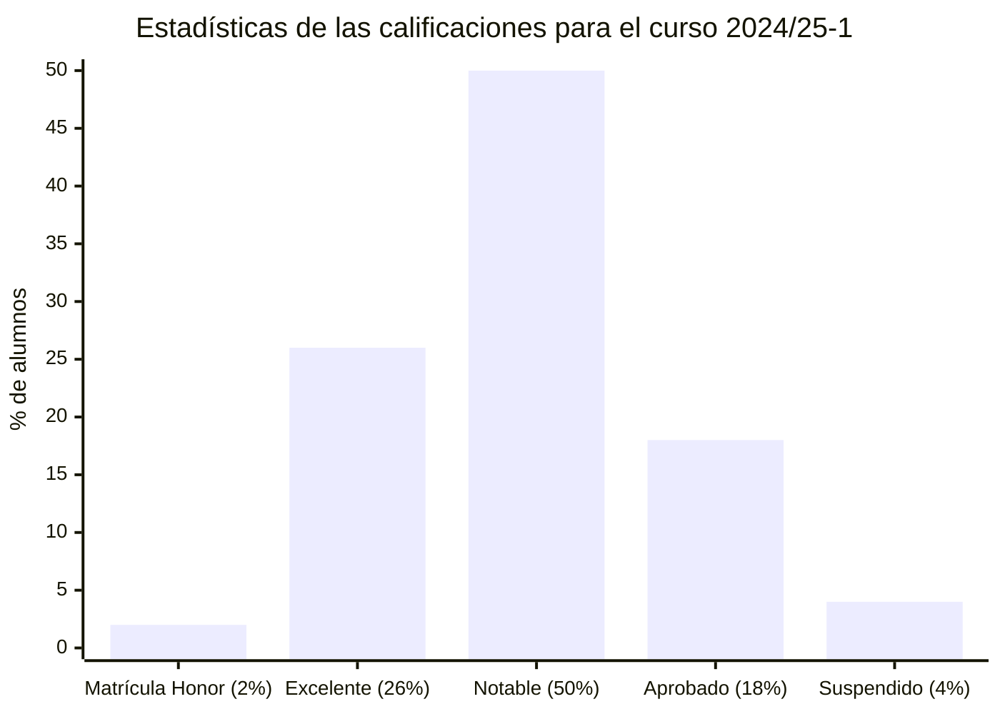

# Administración y gestión de organizaciones (24/25-1)

## Información sobre la asignatura

- **Curso**: 2024/25 (1º semestre)
- **Tipo**: Básica
- **Método de evaluación**: Evaluación continua + Examen
- **Ponderación**: PEC 35% + EX 65%
- **Créditos**: 6
- [**Plan docente**](https://cv.uoc.edu/tren/trenacc/web/GAT_EXP.PLANDOCENTE?any_academico=20241&cod_asignatura=75.556&idioma=CAS&pagina=PD_PREV_PORTAL)

## Calificación final

8,10 / 10,00 (B)

## Pruebas de evaluación continua (PECs)

| NOMBRE                                                              | CALIFICACIÓN       |
|---------------------------------------------------------------------|--------------------|
| [PEC1 - Tipificación y análisis de una organización](pec1)            | 24,30 / 30,00 (B)  |
| [PEC2 - Análisis financiero y contable de una organización](pec2)     | 27,13 / 30,00 (A)  |
| [PEC3 - Elaboración de un plan de negocio, con aspectos de RSC](pec3) | 27,60 / 30,00 (A) |
| [PEC4 - Datos, organizaciones y resiliencia](pec4)                    | 9,80 / 10,00 (A) |
|                                                                     |                      |
| **SUMA DE CALIFICACIONES**                                          | **88,83 / 100,00 (B)** |
| **CALIFICACIÓN PONDERADA** (35%)                                    | **31,09 / 35,00 (B)** |

## Debates

- [**Debate 1**: Impacto de la IA en la toma de decisiones empresariales: ¿automatización o supervisión humana?](debate1)
- [**Debate 2**: Objetivos de Desarrollo Sostenible (ODS)](debate2)

## Recursos de aprendizaje

>[!NOTE]
>- Cada título es un enlace a la carpeta que contiene los resúmenes de los recursos asociados a dicha PEC.
>- No se incluyen los archivos `pdf` en el repositorio para evitar posibles problemas de copyright.

### [PEC1](./pec1/recursos)

- [**Guía de aprendizaje**](https://materials.campus.uoc.edu/daisy/Materials/PID_00295192/pdf/PID_00295192.pdf)
	- 1.0) GA Guía de aprendizaje del reto 1: tipificación y análisis de una organización
- [**Conceptos básicos**](https://materials.campus.uoc.edu/daisy/Materials/PID_00200485/pdf/PID_00200479.pdf) ([resumen](https://github.com/HenestrosaDev/uoc-ingenieria-informatica/blob/main/administracion_y_gestion_de_organizaciones/pec1/recursos/conceptos_basicos_resumen.md))
	- 1.1) Conceptos de empresa y organización (páginas 5-9 del apartado 1.2) 
	- 1.3) Tipos de empresa (páginas 40-46 del apartado 2.4)
- [**Dirección y organización**](https://materials.campus.uoc.edu/daisy/Materials/PID_00200484/pdf/PID_00200480.pdf) ([resumen](https://github.com/HenestrosaDev/uoc-ingenieria-informatica/blob/main/administracion_y_gestion_de_organizaciones/pec1/recursos/direccion_y_organizacion_resumen.md))
	- 1.2) Definición de los objetivos empresariales (páginas 28-32 del apartado 2.2.1)
	- 1.6) Estructura de la empresa (páginas 71-97, apartado 4)
	- 1.9) Dirección de la empresa (páginas 9-27, apartado 1)
- [**Bit 12 (Caracterización del sector no lucrativo)**](https://campus.uoc.edu/autors/MostraPDFMaterialAction.do?id=151490&hash=48756e1f2d49fa4d05082a71834690de5a91a74a9e582e1d1a843bb63440cc51) ([resumen](https://github.com/HenestrosaDev/uoc-ingenieria-informatica/blob/main/administracion_y_gestion_de_organizaciones/pec1/recursos/bit_12_caracterizacion_del_sector_no_lucrativo_resumen.md))
	- 1.4) Caracterización del sector no lucrativo
- [**Áreas funcionales**](https://materials.campus.uoc.edu/daisy/Materials/PID_00200486/pdf/PID_00200478.pdf) ([resumen](https://github.com/HenestrosaDev/uoc-ingenieria-informatica/blob/main/administracion_y_gestion_de_organizaciones/pec1/recursos/areas_funcionales_recursos_humanos_resumen.md))
	- 1.5) Áreas de actividad en la empresa (páginas: 7-12, 32-37, 52-55 y 84-87 que corresponden respectivamente a los apartados 1.2, 2.2, 3.2 y 4.2)
- [**Bit 42 (Elección de la forma jurídica)**](https://campus.uoc.edu/autors/MostraPDFMaterialAction.do?id=263175&hash=889f6bf2bacd51622901535a21aafe91d1eab521c9bcf0040fc4e03354eb14c8) ([resumen](https://github.com/HenestrosaDev/uoc-ingenieria-informatica/blob/main/administracion_y_gestion_de_organizaciones/pec1/bit_42_eleccion_de_la_forma_juridica_resumen.md))
	- 1.7) Elección de la forma jurídica
- [**Bit 15 (Proyectos y estructuras organizativas)**](https://campus.uoc.edu/autors/MostraPDFMaterialAction.do?id=151497&hash=1c1d4b91d5b3515fa3cb83ca2e2d84d43fa76da4531b65378a46896bbff3c249) ([resumen](https://github.com/HenestrosaDev/uoc-ingenieria-informatica/blob/main/administracion_y_gestion_de_organizaciones/pec1/bit_15_proyectos_y_estructuras_organizativas_resumen.md))
	- 1.8) Proyectos y estructuras organizativas

### [PEC2](./pec2/recursos)

- [**Bit 21 (Contabilidad y finanzas de la empresa (I))**](http://cvapp.uoc.edu/autors/MostraPDFMaterialAction.do?id=263179&hash=1a0968aafeee5f7362c6a75eff9e5f2d44dad0c2f5ebe3e293116b24e5762337) ([resumen](https://github.com/HenestrosaDev/uoc-ingenieria-informatica/blob/main/administracion_y_gestion_de_organizaciones/pec2/recursos/bit_21_contabilidad_y_finanzas_de_la_empresa_i_resumen.md))
	- Introducción y apartado 1.1
- [**Contabilidad y finanzas de la empresa (II)**](https://protected-content.ftp.uoc.edu/biblioteca/prestatgeries/05556_75556/90521.pdf) (contenido protegido) ([resumen](https://github.com/HenestrosaDev/uoc-ingenieria-informatica/blob/main/administracion_y_gestion_de_organizaciones/pec2/recursos/contabilidad_y_finanzas_de_la_empresa_ii_resumen.md))
	- Apartado 1, páginas 6 a 30
- [**Bit 22 (Análisis de inversiones)**](http://cvapp.uoc.edu/autors/MostraPDFMaterialAction.do?id=263181&hash=4c5f222055ec6ceb4523f0adfd2afc2cba2d41ca2646c41001d81e2e49cbe412) ([resumen](https://github.com/HenestrosaDev/uoc-ingenieria-informatica/blob/main/administracion_y_gestion_de_organizaciones/pec2/recursos/bit_22_analisis_de_inversiones_resumen.md))
- [**Bit 23 (Conceptos económicos que impactan en las organizaciones)**](http://cvapp.uoc.edu/autors/MostraPDFMaterialAction.do?id=151500&hash=3fd646fe78d6cf5866ce7b47c92856d23aa9806cbf020d714dbc127b18408898) ([resumen](https://github.com/HenestrosaDev/uoc-ingenieria-informatica/blob/main/administracion_y_gestion_de_organizaciones/pec2/recursos/bit_23_conceptos_economicos_que_impactan_en_las_organizaciones_resumen.md))

### [PEC3](./pec3/recursos)

- [**Ética en las organizaciones**](https://materials.campus.uoc.edu/cdocent/IP05_79056_00955.pdf)
	- Apartado "Ética de las organizaciones", comprendido entre las páginas 77 y 113 del documento de 236 páginas.
- [**Empresa y medio ambiente**](https://materials.campus.uoc.edu/daisy/Materials/PID_00263792/pdf/PID_00263792.pdf)
- [**Los pilares del sistema de gestión de la RSC**](https://materials.campus.uoc.edu/daisy/Materials/PID_00253408/pdf/PID_00253408.pdf)
- [**La igualdad de género en las organizaciones**](https://materials.campus.uoc.edu/daisy/Materials/PID_00280846/pdf/PID_00280846.pdf)
- [**Bit 41 (De la idea a la creación de una nueva empresa)**](http://cvapp.uoc.edu/autors/MostraPDFMaterialAction.do?id=263174&hash=1acd7edb24ed9e3ac4d09181d2953c5d042d75b712b3c2fccdfbfe33c0a9eb2d)

### [PEC4](./pec4/recursos)

- [**Datos, organizaciones y resiliencia**](https://materials.campus.uoc.edu/daisy/Materials/PID_00278516/pdf/PID_00278516.pdf)
- [**Uso y valor de la información personal: un escenario en evolución**](https://dialnet.unirioja.es/servlet/articulo?codigo=6307843)
- [**Datos masivos y datos abiertos para una gobernanza inteligente**](https://dialnet.unirioja.es/servlet/articulo?codigo=6566268)
- [**INCIBE Plan de contingencia y continuidad de negocio**](https://www.incibe.es/empresas/que-te-interesa/plan-contingencia-continuidad-negocio)
- [**INCIBE Ciberseguridad y gestión de riesgos**](https://www.incibe.es/sites/default/files/contenidos/guias/doc/guia_ciberseguridad_gestion_riesgos_metad.pdf)