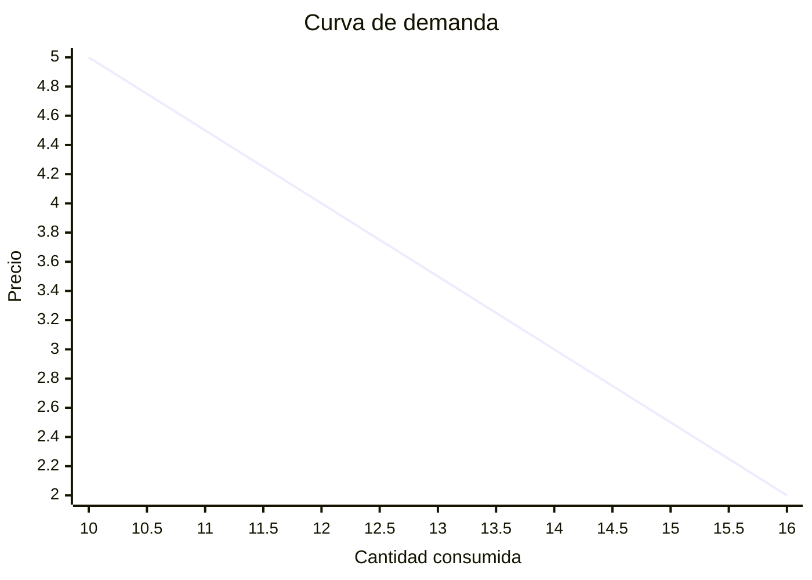
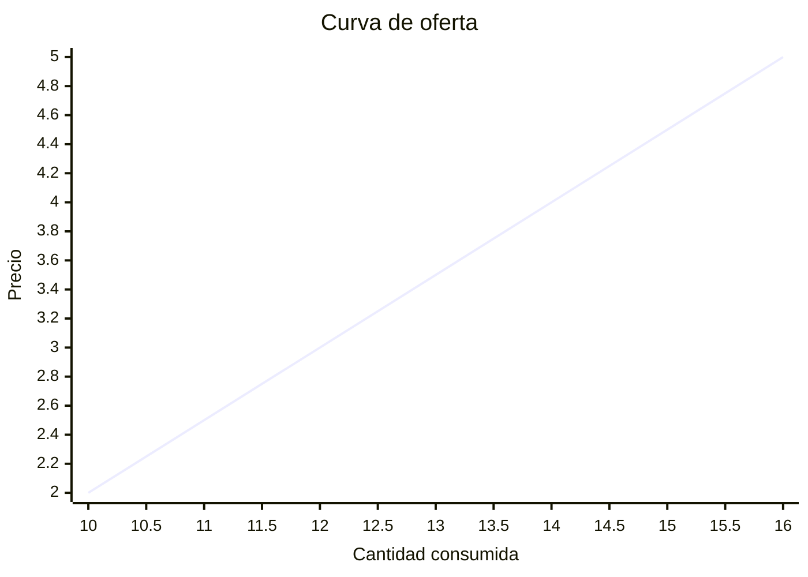
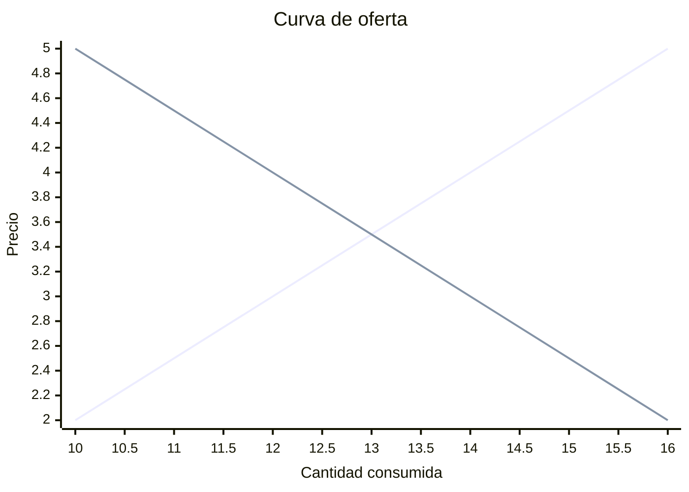

# Conceptos económicos que impactan en las organizaciones

## 1. Mercado y precios

## 1.1. La función de demanda

**Función de demanda**: Expresión matemática que relaciona la cantidad demandada de un bien o servicio y los factores que la afecta, como:
- **Renta del consumidor**: Cuando hay cambios en la renta, se distinguen dos tipos de bienes:
	- **Bienes normales**: Cuando aumenta el nivel de renta, su consumo también aumenta y viceversa. P. ej., viajes, cines, etc.
	- **Bienes inferiores**: Cuando aumenta el nivel de renta, su consumo disminuye y viceversa. P. ej., mortadela; cuando la gente tiene mayor renta, la suele sustituir por jamón.
- **Gustos del consumidor**: Si los gustos mejoran, aumenta la demanda.
- **Precios de otros bienes relacionados**: En función de cómo se relacionan los bienes entre sí, podemos distinguir:
	- **Bienes complementarios**: El consumo de uno de ellos requiere el consumo de otro. Un aumento en el precio de uno reduce la demanda del otro. P. ej., coche y gasolina, Cola Cao y leche.
	- **Bienes sustitutivos**: Tanto uno como otro cumplen la misma función. Un aumento en el precio de uno incrementa la demanda del otro. P. ej., margarina y mantequilla, gasoil y gasolina.
- **Precio del bien o servicio**: Generalmente, a mayor precio, menor cantidad demandada, y a menor precio, mayor cantidad demandada, manteniendo constantes otros factores (condición _ceteris paribus_, "en igualdad de condiciones"). Esta relación inversa se denomina **Ley de demanda**.

>Ejemplo de representación gráfica de la **función de demanda**.

La **curva de demanda** se desplaza:
- Hacia la **izquierda** cuando **disminuye la cantidad demandada** de un bien o servicio a todos los niveles de precio.
- Hacia la **derecha** cuando **aumenta la cantidad demandada** de un bien o servicio a todos los niveles de precio.

**Demanda de mercado**: Cantidad total de un bien o servicio que todos los consumidores están dispuestos a comprar en un mercado en un momento y a un precio determinado. 

## 1.2. Función de oferta

**Función de oferta**: La cantidad de un bien que un productor ofrece aumenta con el precio. Se influencia también por factores como:
- **Precio de los factores productivos**: Un aumento en estos precios tiende a reducir la cantidad ofrecida al mismo precio.
- **Nivel de tecnología existente**: Las mejoras tecnológicas aumentan la cantidad ofrecida.
- **Impuestos sobre las ventas**: Aumentan o disminuyen el coste de producción y, por ende, afectan a la cantidad ofrecida.
- **Número de empresas**: A más empresas, más oferta de mercado.

>Ejemplo de representación gráfica de la **función de oferta**.

La **curva de oferta** se desplaza:
- Hacia la **izquierda** cuando **disminuye la cantidad ofrecida** de un bien o servicio a todos los niveles de precio.
- Hacia la **derecha** cuando **aumenta la cantidad ofrecida** de un bien o servicio a todos los niveles de precio.

**Oferta de mercado**: Cantidad total de un bien o servicio que todos los productores en un mercado están dispuestos a vender a diferentes niveles de precio en un período determinado.

## 1.3. El equilibrio de mercado

Punto en el que los deseos de consumidores y productores coinciden.

>Ejemplo de representación gráfica del **equilibro de mercado**. La línea verde representa la curva de demanda (D), mientras que la azul es la curva de oferta (O).

>[!NOTE]
>Para calcular el precio de equilibrio sabiendo la ecuación de la curva de oferta y de la demanda, hacemos lo siguiente a partir de este ejemplo:
>- **Curva de oferta**: $Q_o = 8 + 8P$
>- **Curva de demanda**: $Q_d = 20.584 - 5P$
>
>**Paso 1: Igualar la oferta y la demanda**  
>
>Igualamos $Q_o$ y $Q_d$ para encontrar el precio de equilibrio:
>
>$$8 + 8P = 20.584 - 5P$$
>
>**Paso 2: Hallar $P$**  
>
>1. Igualamos $Q_o$ y $Q_d$ para encontrar el precio de equilibrio:
>
>$$8 + 8P = 20.584 - 5P \implies 13P = 12.584 \implies P = \frac{12.584}{13} \implies P = 0.968$$

Aparte del punto de equilibrio, se distinguen estos dos indicadores:
- **Exceso de oferta**: Todo aquello que está por **encima** del punto de corte de las curvas de oferta y demanda. Gran parte de la producción ofrecida no es vendida, por lo que bajarán los precios. Con ello, los consumidores demandarán más, pero los productores también ofertarán menos.
- **Exceso de demanda**: Todo aquello que está por **debajo** del punto de corte de las curvas de oferta y demanda. A los consumidores les gustaría consumir más, por lo que el precio aumentará y la demanda bajará.

Intervención del estado en la fijación de precios:
- Fijando **precios máximos**: Precio por **encima** del cual los agentes tienen prohibido realizar intercambios.
- Fijando **precios mínimos**: Precio por **debajo** del cual los agentes tienen prohibido realizar intercambios.
- Fijando **precios subvencionados**: Establecidos y mantenidos por el gobierno por debajo del precio del mercado.

### 1.4. La competencia perfecta

Mercado en el que existen multitud de vendedores y compradores con información perfecta, en el que todas las empresas producen un bien homogéneo y ninguna de ellas dispone de la capacidad para fijar el precio que rige el mercado.

El **juego de la oferta y la demanda** fija el precio del mercado, el cual siempre se encuentra en el punto de equilibrio del mercado.

### 1.5. El monopolio

Mercado en el que existe una única empresa, que produce y vende el bien a multitud de consumidores y que tiene el poder de fijar el precio del bien o la cantidad a intercambiar en el mercado.

### 1.6. El oligopolio

Mercado con elevadas barreras de entrada, en el que participan pocas empresas y existe interdependencia entre las acciones que pueden tomar las diferentes empresas.

Esto hace que las empresas adopten un **comportamiento estratégico** y lleguen a **acuerdos de cooperación** o incluso formen **cárteles** (agrupación de empresas .para decidir la cantidad a ofrecer en el mercado).

## 2. Gobiernos y objetivos macroeconómicos

### 2.1. Inflación y estabilidad de precios

**Inflación**: Aumento generalizado y continuo de los precios que afecta al poder adquisitivo. Se mide con:
- **Índice de Precios al Consumo (IPC)**: Mide la variación de precios de una canasta de bienes y servicios de consumo habitual.
- **Deflactor del PIB**: Refleja los cambios en el nivel general de precios considerando el total de bienes y servicios producidos.

Causas de la inflación:
- Inflación **de demanda**: La demanda agregada supera la capacidad productiva de la economía.
- Inflación **monetarista**: La cantidad de dinero en circulación se incrementa más rápidamente que la producción, aumentando el poder adquisitivo y presionando los precios.
- Inflación de **costes**: Aumento en los precios de los factores productivos, como el petróleo o la energía, que encarece la producción.

Efectos de la inflación:
- **Pérdida de poder adquisitivo**: Con el aumento de precios, el dinero rinde menos, afectando principalmente a los asalariados y pensionistas, que tienen ingresos fijos.
- **Desigualdad económica**: Algunos empresarios pueden ajustar sus precios para contrarrestar el alza de costos, mientras que otros en sectores con competencia intensa no pueden hacerlo.
- **Inestabilidad**: Genera incertidumbre, desincentivando la inversión y la creación de empleo.

**Estabilidad de precios**: Situación económica en la que los precios se mantienen relativamente constantes a lo largo del tiempo. Se da en un entorno económico favorable con poca inflación, poca volatilidad de precios y poder adquisitivo estable.

### 2.2. El pleno empleo

Objetivo central de la política económica: que exista el menos desempleo posible.

El desempleo se clasifica en:
- **Desempleo estructural**: Surge cuando las habilidades de los trabajadores no coinciden con las necesidades del mercado.
- **Desempleo friccional**: Es temporal y se da cuando las personas cambian de empleo.
- **Desempleo cíclico**: Aumenta en las recesiones y disminuye en las expansiones económicas.
- **Desempleo estacional**: Ocurre en sectores con demanda fluctuante a lo largo del año, como turismo y agricultura.

>[!NOTE]
>Población en edad de trabajar en España: Desde los 16 a los 65 años.

Medición de desempleo:
- **Tasa de actividad**: Proporción de la población en edad de trabajar que participa en el mercado laboral.

	$$\text{tasa de actividad} = \frac{\text{población activa}}{\text{población en edad de trabajar}} \times 100$$

- **Tasa de desempleo**: Porcentaje de la población activa que está sin empleo.

	$$\text{tasa de desempleo} = \frac{\text{desempleados}}{\text{población activa}} \times 100$$

- **Tasa de ocupación**: Proporción de personas empleadas sobre la población en edad laboral.

	$$\text{tasa de ocupación} = \frac{\text{número de ocupados}}{\text{población en edad de trabajar}} \times 100$$

Efectos del desempleo:
- **Ingresos reducidos o inexistentes** de los desempleados. Emergen necesidades de asistencia social.
- **Pérdida de cualificación** de los desempleados y reducción del capital humano de la economía.
- **Aumento de la precariedad laboral**.
- La **economía pierde productividad** al no utilizar sus recursos humanos plenamente.

### 2.3. El crecimiento económico

Otro objetivo central de la política económica. Es vital para mejorar el nivel de vida y reducir la pobreza. Se mide principalmente por el **Producto Interior Bruto (PIB)**.

Dos conceptos clave en el crecimiento económico:
- **Capacidad potencial de producción**: Máximo nivel de producción que se puede alcanzar sin generar inflación excesiva.
- **Brecha de producción**: Diferencia entre producción efectiva y potencial. Una producción por debajo de la potencial indica desempleo, mientras que una por encima genera inflación.

Objetivos dependiendo del periodo de tiempo:
- A **corto plazo** (< 1 año): Conseguir una tasa de crecimiento cercana al máximo posible de la capacidad potencial de producción.
- A **largo plazo** (> 1 año): Conseguir aumentar la capacidad potencial de producción.

Factores que favorecen el crecimiento económico:
- Aumento de factores productivos.
- Progreso tecnológico.
- Capital humano.
- Buena red de infraestructuras.