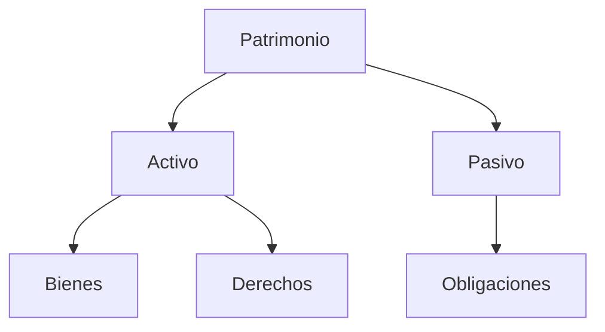
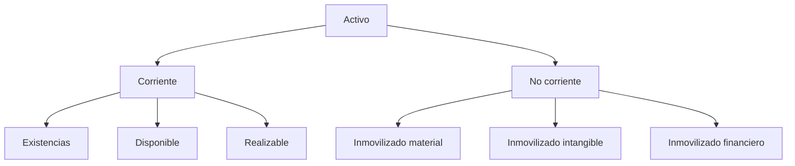
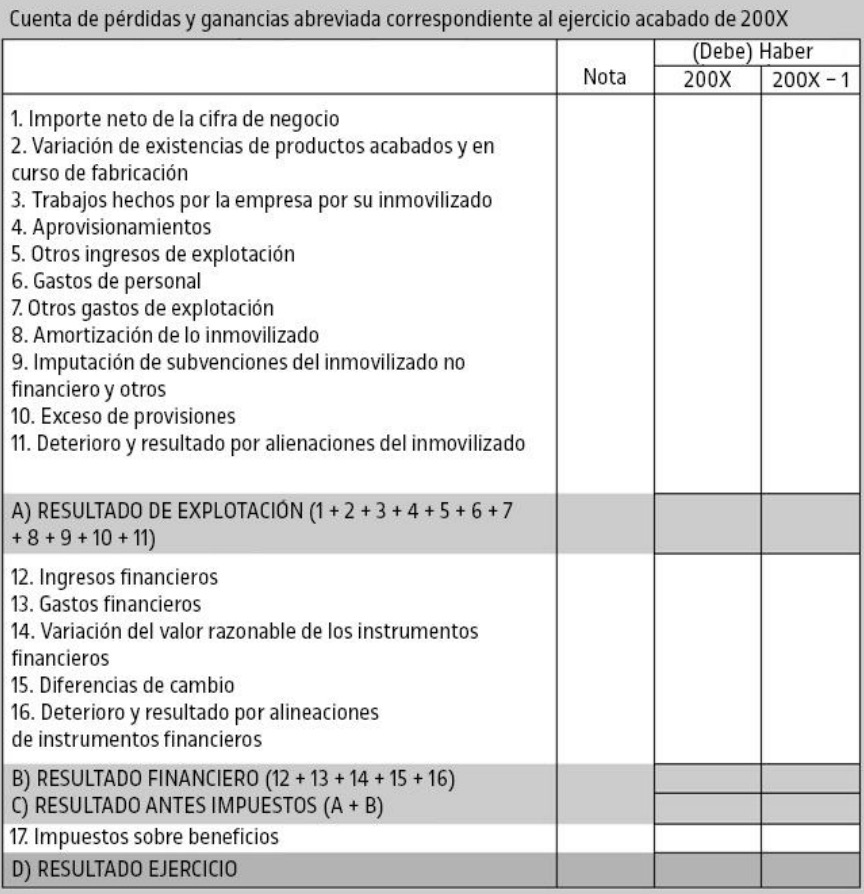

# Contabilidad y finanzas de la empresa (II)

## 1. Gestión empresarial

**Bienes**: Activos con un valor económico que posee una empresa. Se usan para contribuir a su producción de bienes o servicios o generar ingresos.

**Derechos**: Activos en forma de conjunto de créditos a favor de la persona física o jurídica titular de la empresa.

**Obligaciones**: Conjunto de deudas que la persona física o jurídica ha contraído con terceras personas. Conocido como _pasivo_.

**Patrimonio**: Conjunto de bienes, derechos y obligaciones, cuantificables, que pertenecen a una persona física o jurídica.

**Patrimonio neto**: Valor residual de los activos de una empresa una vez deducidos todos sus pasivos.

>[!NOTE]
>**Valor residual**: Valor estimado de un activo al final de su vida útil, después de haber sido utilizado en su propósito principal.

La ecuación fundamental de la contabilidad es:
$$\text{activo} = \text{pasivo} + \text{patrimonio neto}$$

>[!CAUTION]
>Las ecuaciones fundamentales que presenta el libro **NO SON CORRECTAS**, ya que no es correcto decir que el patrimonio neto forme parte del pasivo, a pesar de que aparezca en el lado derecha del balance junto con el pasivo.

### 1.1. Contabilidad

Ciencia que estudia el patrimonio empresarial tanto de forma estática (en un momento determinado del tiempo) como de forma dinámica (estudio de las variaciones a lo largo del tiempo).

#### 1.1.1. Masas patrimoniales

**Masa patrimonial**: Conjunto de bienes, derechos y obligaciones que poseen características similares desde el punto de vista económico o financiero.

>Composición del patrimonio empresarial

---

**Activo** 

Conjunto de bienes tangibles e intangibles y derechos que posee una persona física o jurídica.

$$\text{activo} = \text{pasivo} + \text{patrimonio neto}$$

>Composición del activo

Tipos de activo:
- **Activo corriente**: Activos que se esperan liquidar o consumir a corto plazo. Se divide en:
	- **Existencias**: Bienes de una empresa destinados a ser vendidos o a ser transformados para incorporarlos al proceso productivo.
	- **Deudores comerciales (activo realizable)**: Derechos de cobro que se cobrarán en un plazo inferior al año, como deudas de clientes y deudores.
	- **Efectivo y otros activos (activo disponible)**: Dinero disponible de la empresa.
- **Activo no corriente**: Activos que permiten la actividad productiva de la empresa a largo plazo. Se clasifica en:
	- **Inmovilizado material**: Activos tangibles. P. ej., terrenos, maquinaria, etc.
	- **Inmovilizado intangible**: Activos intangibles. P. ej., patentes, _software_, etc.
	- **Inmovilizado financiero**: Inversiones permanentes en otras empresas.

---

**Pasivo**

Obligaciones y deudas que una empresa contrae con terceros. Pueden ser a corto o a largo plazo. Refleja sus obligaciones financieras y su estructura de capital. 

$$\text{pasivo} = \text{activo total} - \text{patrimonio neto}$$

Tipos de pasivo:
- **Pasivo exigible**: Deudas que la empresa debe pagar en un plazo determinado. Hay dos tipos, según el plazo:
	- **Pasivo no corriente**: Deudas con vencimiento > 1 año.
	- **Pasivo corriente**: Deudas con vencimiento < 1 año.

	$$\text{pasivo exigible = pasivo corriente + pasivo no corriente}$$

- **Neto patrimonial** (patrimonio neto): Parte residual de los activos de una empresa al deducir todos sus pasivos.

#### 1.1.2. Usuarios de la contabilidad

Socios, administradores, clientes, proveedores y bancos. Usan la contabilidad para analizar la viabilidad financiera y la capacidad de la empresa para cumplir sus obligaciones.

### 1.2. Análisis patrimonial de la empresa mediante las cuentas anuales

**Patrimonio**: Conjunto de bienes, derechos y obligaciones de una persona
o empresa.

**Solvencia**: Capacidad de cumplir sus obligaciones.

**Objetivo del análisis patrimonial**: Evaluar la  solvencia y la situación patrimonial de la empresa.

**Puntos a tener en cuenta al realizar el análisis**:
1. Contexto económico.
2. Grado de competencia.
3. Marcha de las empresas del sector.
4. Objetivos que propone la empresa.

#### 1.2.1. Las cuentas anuales. Cuentas del Plan general de contabilidad

**Contabilidad financiera**: Rama de la contabilidad que informa de la situación patrimonial, económica y financiera de la empresa.

**Ejercicio contable**: Ciclo de la elaboración de la información contable. Normalmente coincide con el año natural.

**Cuentas anuales**: Información resumida de la contabilidad financiera de una empresa al cierre de un ejercicio contable.

**Tesorería**: Disponibilidad de dinero en caja y en las cuentas abiertas de la empresa en entidades financieras.

>[!NOTE]
>La normalización contable en España está recogida en el **Real decreto 1514/2007, de 16 noviembre**, por el cual se aprueba el Plan general de contabilidad.

Según el Plan general de contabilidad, las cuentas anuales tienen que disponer de la siguiente información:
- **Balance**: Muestra la situación patrimonial.
- **Cuenta de pérdidas y ganancias**: Registra el resultado del ejercicio su origen.
- **Estado de flujos en el patrimonio neto**: Informa de las variaciones en el patrimonio neto.
- **Estado de flujos de tesorería**: Informa del origen y la utilización de los activos monetarios representativos de efectivo y otros activos líquidos equivalentes.
- **Memoria**: Completa y amplía la información de las otras cuentas anuales.

#### 1.2.2. Análisis patrimonial

Estudio de la estructura de los bienes, derechos, obligaciones y neto patrimonial de la empresa.

**Ejemplo de análisis patrimonial**:

>[!NOTE]
>Hay ajustes hechos respecto al neto 

Una empresa presenta los saldos de patrimonio siguientes:

| PATRIMONIO                                 | SALDO  |
|--------------------------------------------|--------|
| Construcciones                             | 19.000 |
| Elementos de transporte                    | 7.000  |
| Mobiliario                                 | 2.000  |
| Equipos procesos información (ordenadores) | 482    |
| Aplicaciones informáticas (programas)      | 70     |
| Capital                                    | 10.000 |
| Reservas                                   | 3.235  |
| Resultado ejercicio                        | 3.662  |
| Existencias                                | 2.300  |
| Clientes                                   | 1.700  |
| Proveedores inmovilizado a largo plazo     | 7.045  |
| Deudas entidades créditos a largo plazo    | 6.853  |
| Deudas entidades crédito a corto plazo     | 2.000  |
| Caja                                       | 390    |
| Bancos                                     | 1.000  |
| Proveedores                                | 1.147  |

La presentación según el modelo tradicional de balance es la siguiente:

<table>
	<tr align="left">
		<th>ACTIVO NO CORRIENTE</th>
		<th>28.552</th>
		<th>NETO PATRIMONIAL</th>
		<th>16.897</th>
	</tr>
	<tr>
		<td>Construcciones</td>
		<td>19.000</td>
		<td>Reservas</td>
		<td>3.235</td>
	</tr>
	<tr>
		<td>Elementos de transporte</td>
		<td>7.000</td>
		<td>Resultado ejercicio</td>
		<td>3.662</td>
	</tr>
	<tr>
		<td>Mobiliario</td>
		<td>2.000</td>
		<td>Capital</td>
		<td>10.000</td>
	</tr>
	<tr>
		<td>Equipo procesos información</td>
		<td>482</td>
		<td colspan="2"> </td>
	</tr>
	<tr>
		<td>Aplicaciones informáticas</td>
		<td>70</td>
		<td><strong>PASIVO NO CORRIENTE</strong></td>
		<td><strong>13.898</strong></td>
	</tr>
	<tr>
		<td colspan="2"> </td>
		<td>Proveedores inmovilizados a largo plazo</td>
		<td>7.045</td>
	</tr>
	<tr>
		<td><strong>ACTIVO CORRIENTE</strong></td>
		<td><strong>5.390</strong></td>
		<td>Deudas entidades crédito a largo plazo</td>
		<td>6.853</td>
	</tr>
	<tr>
		<td>Clientes</td>
		<td>1.700</td>
		<td colspan="2"> </td>
	</tr>
	<tr>
		<td>Efectivo y otros activos (disponible)</td>
		<td>1.390</td>
		<td><strong>PASIVO CORRIENTE</strong></td>
		<td><strong>3.147</strong></td>
	</tr>
	<tr>
		<td>Caja</td>
		<td>390</td>
		<td>Proveedores</td>
		<td>1.147</td>
	</tr>
	<tr>
		<td>Bancos</td>
		<td>1.000</td>
		<td>Deudas entidades crédito a CT</td>
		<td>2.000</td>
	</tr>
	<tr>
		<td>Existencias</td>
		<td>2.300</td>
		<td colspan="2"></td>
	</tr>
	<tr>
		<td>Deudores comerciales (realizable)</td>
		<td>1.700</td>
		<td colspan="2"></td>
	</tr>
	<tr>
		<td colspan="2"> </td>
		<td colspan="2"></td>
	</tr>
	<tr>
		<td><strong>TOTAL ACTIVO</strong></td>
		<td><strong>33.942</strong></td>
		<td><strong>TOTAL PASIVO</strong></td>
		<td><strong>33.942</strong></td>
	</tr>
</table>

---

**Finalidad del análisis patrimonial**

- Saber si la empresa es solvente en el pasivo corriente con los recursos generados por el activo corriente.
- Saber si la proporción entre las aportaciones de los socios y las deudas es el adecuado.
- Saber si la proporción entre el pasivo corriente y el pasivo no corriente es adecuada.

---

**Instrumentos de análisis patrimonial**

>[!NOTE]
>**Suspensión de pagos o concurso de acreedores**: Situación en la que una empresa no puede pagar las deudas con la tesorería, incluso con una situación patrimonial solvente.

1. **Fondo de maniobra**: Evalúa la salud financiera de una empresa a corto plazo. 

	$$\text{fondo de maniobra = activo corriente – pasivo corriente}$$
	$$\text{fondo de maniobra = pasivo no corriente + patrimonio neto – activo no corriente}$$

	**Interpretaciones del resultado**:
	- **&gt; 0**: Equilibrada financieramente.
	- **&lt; 0**: Riesgo de concurso de acreedores, ya que tiene que devolver a corto plazo más dinero del que puede disponer en el mismo periodo. 
	- **&lt;&lt; 0**: Quiebra. La empresa no puede hacer frente a sus deudas, incluso aunque venda todos los bienes que forman su activo.

2. **Ratio de disponibilidad**: Evalúa la capacidad de la empresa para cumplir sus obligaciones a corto plazo exclusivamente con el efectivo y otros activos líquidos disponibles en el momento.

	$$\text{ratio de disponibilidad} = \frac{\text{disponible}}{\text{pasivo corriente}}$$

	**Interpretación del resultado**: 
	- Cuanto más se aproxime a 0, más problemas para pagar las deudas a corto plazo. 

3. **Ratio de tesorería** (_acid test_): Mide la capacidad de una empresa para hacer frente a sus deudas a corto plazo utilizando el efectivo y otros activos que se puedan liquidar rápidamente.

	$$\text{ratio de tesorería} = \frac{\text{disponible + realizable}}{\text{pasivo corriente}}$$

	**Interpretación del resultado**: 
	- **&gt; 1**: Exceso de liquidez.
	- **0,8 &lt; ratio &lt; 1**: Valor ideal.
	- **&lt; 0,80**: Peligro de impago. 

4. **Ratio de liquidez**: Refleja el concepto de _fondo de maniobra_ en forma de cociente. 

	$$\text{ratio de liquidez} = \frac{\text{activo corriente}}{\text{pasivo corriente}}$$

	**Interpretación del resultado**: 
	- **&gt; 1**: Mínimo requerido.
	- **1,7 &lt; ratio &lt; 1,9**: Valor ideal.

5. **Ratio de solvencia (o garantía)**: Mide la capacidad de una empresa para cumplir con sus obligaciones a largo plazo.

	$$\text{ratio de solvencia} = \frac{\text{activo total}}{\text{pasivo total}}$$

	**Interpretación del resultado**: 
	- **&gt; 1**: Óptimo.
	- **&lt; 1**: Situación de quiebra.

6. **Ratio de endeudamiento**: Mide la proporción de obligaciones que tiene una empresa en relación con su patrimonio neto, y se utiliza para evaluar el nivel de riesgo financiero al que está expuesta. 
	
	>[!NOTE]
	>Por algún motivo, los recursos que he consultado en Internet indican que el ratio de endeudamiento se calcula como $\text{ratio de endeudamiento} = \frac{\text{pasivo total}}{\text{patrimonio neto}}$, mientras que en los recursos de la UOC, se calcula con la fórmula de abajo. Lo único que cambia es que, para la fórmula anterior, se toma $1$ como el valor de referencia para interpretar el resultado.

	$$\text{ratio de endeudamiento} = \frac{\text{pasivo total}}{\text{patrimonio neto}}$$
	
	**Interpretación del resultado**:
	- **&gt; 0,6**: Exceso de deudas.
	- **= 0,6**: Endeudamiento correcto.
	- **&lt; 0,6**: Demasiados fondos propios.

7. **Ratio de estructura de la deuda**: Mide la proporción que representa la deuda a corto plazo respecto al total de la deuda.

	$$\text{ratio de estructura de la deuda} = \frac{\text{pasivo corriente}}{\text{pasivo corriente + pasivo no corriente}}$$

	**Interpretación del resultado**: Cuanto más se aproxime a 0, mejor es la calidad de la deuda.

#### 1.2.3. Análisis económico-financiero

Estudia el resultado de la empresa (la cuantía, la estructura, el origen, la evolución y las rentabilidades) de un ejercicio contable. Se recoge en la cuenta de pérdidas y ganancias. 

>Modelo de cuenta de pérdidas y ganancias

	
Definiciones de la terminología del modelo de pérdidas y ganancias

- **Importe neto de la cifra de negocio**: Valor de las ventas de bienes y servicios después de deducir descuentos y devoluciones.
- **Variación de existencias de mercancías, productos acabados y en curso de fabricación**: Aumento o disminución de las existencias al finalizar el ejercicio contable respecto a la situación que había al inicio del ejercicio.
- **Trabajos hechos por la empresa en su inmovilizado**: Valor de los inmovilizados fabricados por la misma empresa.
- **Aprovisionamientos**: Gastos por adquisiciones de existencias.
- **Gastos de personal**: Retribuciones al personal, cuotas a la Seguridad Social a cargo de la empresa y otros gastos de carácter social.
- **Otros gastos de explotación**: Gastos no incluidos en apartados anteriores.
- **Amortización del inmovilizado**: Valor de las depreciaciones de los elementos del inmovilizado durante el ejercicio.
- **Deterioro y resultado por alienaciones del inmovilizado**: Pérdidas de valor no definitivas del inmovilizado y beneficios o pérdidas en ventas del inmovilizado.
- **Resultado de explotación**: Beneficio o pérdida por los ingresos y pérdidas descritos anteriormente.
- **Ingresos financieros**: Retribuciones recibidas por cesiones de fondos monetarios a terceros en forma de dividendos o intereses por participaciones en el capital de otras empresas o préstamos hechos.
- **Gastos financieros**: Retribuciones a terceros en forma de intereses por préstamos recibidos.
- **Resultado financiero**: Diferencia entre los ingresos y los gastos financieros.
- **Resultado antes de impuestos**: Suma del resultado de explotación más el resultado financiero.
- **Impuestos sobre beneficios**: Cuota del impuesto sobre sociedades.
- **Resultado del ejercicio**: Igual al resultado antes de impuestos menos el impuesto sobre sociedades.

---

**Finalidad del análisis económico-financiero** + **Instrumentos de análisis económico-financiero**

1. **Análisis de la rentabilidad económica** (aka ROA (_return on assets_)): Mide la capacidad de una empresa para generar beneficios en relación con el total de sus activos.

	$$\text{ratio de rentabilidad económica} = \frac{\text{beneficio antes de impuestos e intereses}}{\text{activo total}}$$

	**Interpretación del resultado**: 
	- **&gt; 0**: Cuanto más alta, mejor.
	- **&lt; 0**: La empresa necesita optimizar el uso de sus activos o reconsiderar ciertas inversiones.

2. **Análisis de la rentabilidad financiera** (aka ROE (_return on equity_)): Mide la capacidad de una empresa para generar beneficios con sus propios fondos.

	$$\text{ratio de rentabilidad financiera} = \frac{\text{beneficio neto}}{\text{patrimonio neto}}$$

	**Interpretación del resultado**: 
	- **&gt; 0**: Óptimo. Cuanto mayor, mejor.
	- **&lt; 0**: Rentabilidad negativa. Puede restringir la financiación externa.

3. **Análisis de la rentabilidad de las ventas** (aka ROE (_return on equity_)): Mide qué porcentaje de las ventas totales de una empresa se convierte en beneficio neto.

	$$\text{ratio de rentabilidad de las ventas} = \frac{\text{beneficio antes de impuestos e intereses}}{\text{ventas totales}}$$

	**Interpretación del resultado**: 
	- **&gt; 0**: Óptimo. Cuanto mayor, mejor.
	- **&lt; 0**: Se está vendiendo a pérdidas, por lo que hay que hacer cambios estructurales en la empresa.

### 1.3. Presupuesto de tesorería

Permite a las empresas planificar y controlar sus flujos de efectivo a corto plazo. Facilita la toma de decisiones para asegurar el crecimiento sostenido de la empresa.

**Ejemplo de presupuesto de tesorería**

|                              | MAYO       | JUNIO      | JULIO      |
|------------------------------|------------|------------|------------|
| **COBROS**                   | **15.000** | **15.000** | **20.000** |
| Ventas abril                 | 10.000     |            |            |
| Ventas mayo                  | 5.000      | 5.000      |            |
| Ventas junio                 |            | 10.000     | 10.000     |
| Ventas julio                 |            |            | 10.000     |
| **PAGOS**                    | **13.500** | **19.500** | **18.500** |
| Compras                      | 5.000      | 10.000     | 10.000     |
| Hipoteca                     | 1.500      | 1.500      | 1.500      |
| Gastos varios                | 1.000      | 2.000      | 1.000      |
| Sueldos y salarios           | 6.000      | 6.000      | 6.000      |
| **FLUJO NETO DE CAJA**       | **1.500**  | **-4.500** | **1.500**  |
|                              |            |            |            |
| **Saldo al comienzo de mes** | **10.000** | **11.500** | **7.000**  |
| **Saldo al final de mes**    | **11.500** | **7.000**  | **8.500**  |