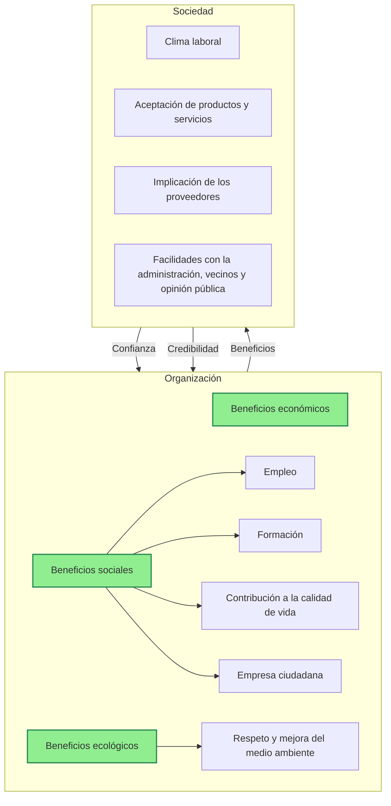
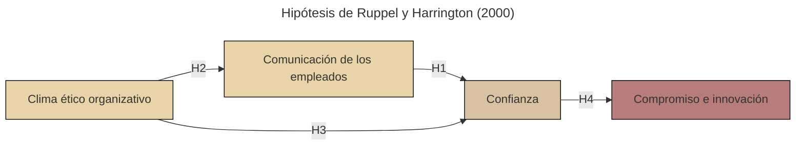

# RESUMEN Ética de la información

## 1. La necesidad de ir más allá de la ética personal

El comportamiento ético no es solo una cuestión personal, sino que está influido por el entorno organizacional, tal y como afirma Chiavenato (2000):

>"La influencia de las organizaciones en la vida de los individuos es fundamental: la manera como las personas viven, se visten, se alimentan, y sus expectativas, sus convicciones y sus sistemas de valores experimentan una enorme influencia de las organizaciones, que a su vez se ven influenciadas por el modo de pensar y sentir de sus miembros".

## 2. Definición de organización y su evolución

Según Chiavenato, una organización es un sistema de actividades coordinadas por dos o más personas con un objetivo común. Se analiza la evolución de las organizaciones en tres etapas:

- **Era de la industrialización clásica (1900-1950)**: Organizaciones jerárquicas y centralizadas. Imagen **negativa** del ser humano (vago).
- **Era de la industrialización neoclásica (1950-1990)**: Mayor enfoque en las relaciones humanas y la motivación. Imagen **negativa** del ser humano (inmaduro).
- **Era de la información (1990-actualidad)**: Conocimiento como principal fuente de productividad (**capital intelectual**). Imagen **positiva** del ser humano (creativo).

A medida que ha ido evolucionando el concepto de organización, también se le ha ido dando mayor importancia a la comunicación.

## 3. Origen y desarrollo de las éticas aplicadas

Surgió en los años 70 debido a la falta de confianza del público, la presión de los colectivos profesionales y el esfuerzo de los filósofos por desarrollar un discurso ético aplicado.

## 4. Ética de las organizaciones

Las organizaciones pueden ser agentes morales, ya que las decisiones organizacionales influyen en el comportamiento individual y tienen un impacto social. Se plantea en dos niveles: los **fines de la organización** y los **medios para alcanzarlos**, destacando la importancia de que ambos sean éticos, puesto que el fin no justifica cualquier medio en la dirección de las organizaciones.

También se plantea la relación empresa-sociedad, cuya argumentación parte de D. García-Marzá (2004):

## 5. Ventajas estratégicas y exigencias vitales para el desarrollo de la éticas en las organizaciones

>"En el capitalismo es necesaria una ética porque existe un gran espacio de libertad y los valores morales (como la confianza) reducen los "costos de transacción", compensan los fallos del mercado, favorecen la integración social y contribuyen a la eficiencia económica".
>
>A. Cortina; J. Conill; A. Domingo; D. García-Marzá (1994). _Ética de la empresa. Claves para una nueva cultura empresarial_ (pág. 63). Madrid: Trotta.

### 5.1. Ventajas estratégicas

- Mejora de imagen organizativa.
- Diferenciación competitiva.
- Mayor innovación.
- Cohesión cultural.
- Ahorro de costes de coordinación y transacción.
- Evita conflictos y corrupción.
- Atrae a talento, clientes e inversores más fieles.

### 5.2. Exigencias vitales

- Necesidad de confianza.
- Crecimiento de la complejidad organizativa.
- Responsabilidad social.
- Imposibilidad de eludir el nivel posconvencional de conciencia moral.
- Voluntad de justicia y felicidad de los trabajadores.

## 6. Barreras para el desarrollo de la responsabilidad en las organizaciones

### 6.1. Barreras de la estructura de la organización

- División del trabajo.
- Separación de la toma de decisiones.
- Jerarquía estricta.

### 6.2. Barreras de la cultura de la organización

- Expectativas de rol estrictas.
- Fuerte cohesión grupal.
- Confusión de prioridades.
- Protección ante la intervención exterior.

Los cambios culturales no se imponen, sino que se proponen y se generan. La actuación ética de las personas está muy influida por el entorno comunicativo de organización, por lo que las barreras propuestas pueden ser superadas con mayor comunicación.

## 7. Comunicación, ética y confianza en las organizaciones

La comunicación es clave para generar confianza y un clima ético en las organizaciones. 

Ruppel y Harrington centraron su estudio en cómo generar confianza en las organizaciones a través de cuatro hipótesis:

- (H1): Cuanto mayor es la comunicación entre directivos y empleados, mayor es el nivel de confianza en las subunidades de la organización.
- (H2): Cuanto más enfatice el clima corporativo las relaciones humanas y el interés de los empleados, mayor será la comunicación y satisfacción de los empleados.
- (H3): Cuanto mayor sea el nivel de egoísmo en el clima organizativo, menor será el nivel de confianza en las subunidades de la organización; y, a su vez, a menor nivel de benevolencia en el clima organizacional, menor nivel de confianza en las subunidades.
- (H4): Cuanto mayor sea el nivel de confianza en las subunidades de la organización, mayor será el compromiso y la innovación de las subunidades.

