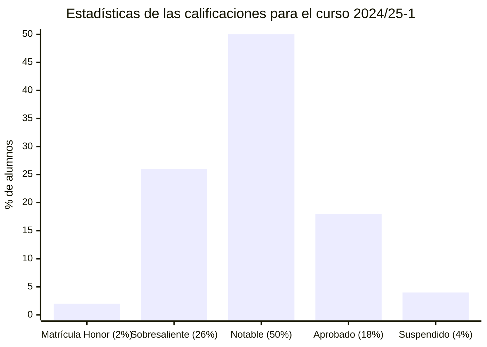
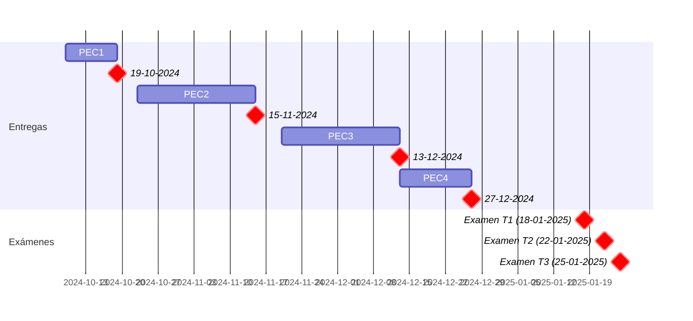

# Administración y gestión de organizaciones (24/25-1)

- [Información sobre la asignatura](#información-sobre-la-asignatura)
- [Archivo de exámenes](#archivo-de-exámenes)
- [Calendario de entregas](#calendario-de-entregas)
- [Resumen de calificaciones](#resumen-de-calificaciones)
- [Debates](#debates)
- [Recursos de aprendizaje](#recursos-de-aprendizaje)
	- [PEC1](#pec1)
	- [PEC2](#pec2)
	- [PEC3](#pec3)
	- [PEC4](#pec4)

## Información sobre la asignatura

- **Código**: 75.556
- **Curso**: 2024/25 (1º semestre)
- **Tipo**: Básica
- **Método de evaluación**: Examen (65%) + Evaluación continua (35%)
- **Créditos**: 6
- [**Plan docente**](https://cv.uoc.edu/tren/trenacc/web/GAT_EXP.PLANDOCENTE?any_academico=20241&cod_asignatura=75.556&idioma=CAS&pagina=PD_PREV_PORTAL)

>

>	
Leyenda de calificaciones

>
>	- **Matrícula de Honor (M)**: 9 a 10
>	- **Sobresaliente (EX)**: 9 a 10
>	- **Notable (NO)**: 7 a 8,99
>	- **Aprobado (A)**: 5 a 6,99
>	- **Suspendido (SU)**: 0 a 4,99
>

## Archivo de exámenes

- [Compilación de 49 exámenes desde 2010](examenes)

## Calendario de entregas

## Resumen de calificaciones

>[!NOTE]
>La calificación final es la que aparece en mi expediente. No tiene por qué ser, necesariamente, el resultado de la suma de las calificaciones ponderadas de los bloques.

<table>
	<tr>
		<th>BLOQUE</th>
		<th>ACTIVIDAD</th>
		<th>CALIFICACIÓN</th>
		<th>CALIFICACIÓN PONDERADA</th>
	</tr>
	<tr>
		<td rowspan="4">
			<strong>Evaluación continua (EC)</strong> (35%)
		</td>
		<td>
			<a href="pec1">
				PEC1 - Tipificación y análisis de una organización
			</a>
			(30%)
		</td>
		<td>24,30 / 30,00 (B)</td>
		<td rowspan="4">
			

				<strong>Calificación total PEC</strong>:
				 
				88,83 / 100,00
			

			 
			

				<strong>Calificación ponderada EC</strong>:
				 
				3,10 / 3,50</td>
			

	</tr>
	<tr>
		<td>
			<a href="pec2">
				PEC2 - Análisis financiero y contable de una organización
			</a>
			(30%)
		</td>
		<td>27,13 / 30,00 (A)</td>
	</tr>
	<tr>
		<td>
			<a href="pec3">
				PEC3 - Elaboración de un plan de negocio, con aspectos de RSC
			</a>
			(30%)
		</td>
		<td>27,60 / 30,00 (A)</td>
	</tr>
	<tr>
		<td>
			<a href="pec4">
				PEC4 - Datos, organizaciones y resiliencia
			</a>
			(10%)
		</td>
		<td>9,80 / 10,00 (A)</td>
	</tr>
	<tr>
		<td>
			<a href="examen">
				<strong>Examen</strong>
			</a> (65%)
		</td>
		<td></td>
		<td>7,60 / 10,00</td>
		<td>4,94 / 6,50</td>
	</tr>
	<tr>
		<td colspan="3"></td>
		<td></td>
	</tr>
	<tr>
		<td colspan="3">
			<strong>CALIFICACIÓN FINAL</strong>
		</td>
		<td>8,10 / 10,00 (NO)</td>
	</tr>
</table>

## Debates

>[!NOTE]
>A pesar que la participación en los mismos es optativa, pueden representar hasta un **10% adicional** en algunas notas del curso (siempre y cuando haya sido una participación de calidad). Esta valoración positiva influirá principalmente en notas donde haya alguna duda (por ejemplo, entre aprobado y suspenso, entre EX/M, etc.), tanto de la EC como del examen.

- [**Debate 1**: Impacto de la IA en la toma de decisiones empresariales: ¿automatización o supervisión humana?](debate1)
- [**Debate 2**: Objetivos de Desarrollo Sostenible (ODS)](debate2)

## Recursos de aprendizaje

>[!NOTE]
>- Cada título es un enlace a la carpeta que contiene los resúmenes de los recursos asociados a dicha PEC.
>- No se incluyen los archivos `pdf` en el repositorio para evitar posibles problemas de copyright.

### [PEC1](./pec1/recursos)

- [**Guía de aprendizaje**](https://materials.campus.uoc.edu/daisy/Materials/PID_00295192/pdf/PID_00295192.pdf)
	- 1.0) GA Guía de aprendizaje del reto 1: tipificación y análisis de una organización
- [**Conceptos básicos**](https://materials.campus.uoc.edu/daisy/Materials/PID_00200485/pdf/PID_00200479.pdf) ([resumen](https://github.com/HenestrosaDev/uoc-ingenieria-informatica/blob/main/administracion_y_gestion_de_organizaciones/pec1/recursos/conceptos_basicos_resumen.md))
	- 1.1) Conceptos de empresa y organización (páginas 5-9 del apartado 1.2) 
	- 1.3) Tipos de empresa (páginas 40-46 del apartado 2.4)
- [**Dirección y organización**](https://materials.campus.uoc.edu/daisy/Materials/PID_00200484/pdf/PID_00200480.pdf) ([resumen](https://github.com/HenestrosaDev/uoc-ingenieria-informatica/blob/main/administracion_y_gestion_de_organizaciones/pec1/recursos/direccion_y_organizacion_resumen.md))
	- 1.2) Definición de los objetivos empresariales (páginas 28-32 del apartado 2.2.1)
	- 1.6) Estructura de la empresa (páginas 71-97, apartado 4)
	- 1.9) Dirección de la empresa (páginas 9-27, apartado 1)
- [**Bit 12 (Caracterización del sector no lucrativo)**](https://campus.uoc.edu/autors/MostraPDFMaterialAction.do?id=151490&hash=48756e1f2d49fa4d05082a71834690de5a91a74a9e582e1d1a843bb63440cc51) ([resumen](https://github.com/HenestrosaDev/uoc-ingenieria-informatica/blob/main/administracion_y_gestion_de_organizaciones/pec1/recursos/bit_12_caracterizacion_del_sector_no_lucrativo_resumen.md))
	- 1.4) Caracterización del sector no lucrativo
- [**Áreas funcionales**](https://materials.campus.uoc.edu/daisy/Materials/PID_00200486/pdf/PID_00200478.pdf) ([resumen](https://github.com/HenestrosaDev/uoc-ingenieria-informatica/blob/main/administracion_y_gestion_de_organizaciones/pec1/recursos/areas_funcionales_recursos_humanos_resumen.md))
	- 1.5) Áreas de actividad en la empresa (páginas: 7-12, 32-37, 52-55 y 84-87 que corresponden respectivamente a los apartados 1.2, 2.2, 3.2 y 4.2)
- [**Bit 42 (Elección de la forma jurídica)**](https://campus.uoc.edu/autors/MostraPDFMaterialAction.do?id=263175&hash=889f6bf2bacd51622901535a21aafe91d1eab521c9bcf0040fc4e03354eb14c8) ([resumen](https://github.com/HenestrosaDev/uoc-ingenieria-informatica/blob/main/administracion_y_gestion_de_organizaciones/pec1/bit_42_eleccion_de_la_forma_juridica_resumen.md))
	- 1.7) Elección de la forma jurídica
- [**Bit 15 (Proyectos y estructuras organizativas)**](https://campus.uoc.edu/autors/MostraPDFMaterialAction.do?id=151497&hash=1c1d4b91d5b3515fa3cb83ca2e2d84d43fa76da4531b65378a46896bbff3c249) ([resumen](https://github.com/HenestrosaDev/uoc-ingenieria-informatica/blob/main/administracion_y_gestion_de_organizaciones/pec1/bit_15_proyectos_y_estructuras_organizativas_resumen.md))
	- 1.8) Proyectos y estructuras organizativas

### [PEC2](./pec2/recursos)

- [**Bit 21 (Contabilidad y finanzas de la empresa (I))**](http://cvapp.uoc.edu/autors/MostraPDFMaterialAction.do?id=263179&hash=1a0968aafeee5f7362c6a75eff9e5f2d44dad0c2f5ebe3e293116b24e5762337) ([resumen](https://github.com/HenestrosaDev/uoc-ingenieria-informatica/blob/main/administracion_y_gestion_de_organizaciones/pec2/recursos/bit_21_contabilidad_y_finanzas_de_la_empresa_i_resumen.md))
	- Introducción y apartado 1.1
- [**Contabilidad y finanzas de la empresa (II)**](https://protected-content.ftp.uoc.edu/biblioteca/prestatgeries/05556_75556/90521.pdf) (contenido protegido) ([resumen](https://github.com/HenestrosaDev/uoc-ingenieria-informatica/blob/main/administracion_y_gestion_de_organizaciones/pec2/recursos/contabilidad_y_finanzas_de_la_empresa_ii_resumen.md))
	- Apartado 1, páginas 6 a 30
- [**Bit 22 (Análisis de inversiones)**](http://cvapp.uoc.edu/autors/MostraPDFMaterialAction.do?id=263181&hash=4c5f222055ec6ceb4523f0adfd2afc2cba2d41ca2646c41001d81e2e49cbe412) ([resumen](https://github.com/HenestrosaDev/uoc-ingenieria-informatica/blob/main/administracion_y_gestion_de_organizaciones/pec2/recursos/bit_22_analisis_de_inversiones_resumen.md))
- [**Bit 23 (Conceptos económicos que impactan en las organizaciones)**](http://cvapp.uoc.edu/autors/MostraPDFMaterialAction.do?id=151500&hash=3fd646fe78d6cf5866ce7b47c92856d23aa9806cbf020d714dbc127b18408898) ([resumen](https://github.com/HenestrosaDev/uoc-ingenieria-informatica/blob/main/administracion_y_gestion_de_organizaciones/pec2/recursos/bit_23_conceptos_economicos_que_impactan_en_las_organizaciones_resumen.md))

### [PEC3](./pec3/recursos)

- [**Ética en las organizaciones**](https://materials.campus.uoc.edu/cdocent/IP05_79056_00955.pdf) ([resumen](https://github.com/HenestrosaDev/uoc-ingenieria-informatica/blob/main/administracion_y_gestion_de_organizaciones/pec3/recursos/etica_en_las_organizaciones_resumen.md))
	- Apartado "Ética de las organizaciones", comprendido entre las páginas 77 y 113 del documento de 236 páginas.
- [**Empresa y medio ambiente**](https://materials.campus.uoc.edu/daisy/Materials/PID_00263792/pdf/PID_00263792.pdf) ([resumen](https://github.com/HenestrosaDev/uoc-ingenieria-informatica/blob/main/administracion_y_gestion_de_organizaciones/pec3/recursos/empresa_y_medio_ambiente_resumen.md))
- [**Los pilares del sistema de gestión de la RSC**](https://materials.campus.uoc.edu/daisy/Materials/PID_00253408/pdf/PID_00253408.pdf) ([resumen](https://github.com/HenestrosaDev/uoc-ingenieria-informatica/blob/main/administracion_y_gestion_de_organizaciones/pec3/recursos/los_pilares_del_sistema_de_gestion_de_la_rsc_resumen.md))
- [**La igualdad de género en las organizaciones**](https://materials.campus.uoc.edu/daisy/Materials/PID_00280846/pdf/PID_00280846.pdf) ([resumen](https://github.com/HenestrosaDev/uoc-ingenieria-informatica/blob/main/administracion_y_gestion_de_organizaciones/pec3/recursos/la_igualdad_de_genero_en_las_organizaciones_resumen.md))
- [**Bit 41 (De la idea a la creación de una nueva empresa)**](http://cvapp.uoc.edu/autors/MostraPDFMaterialAction.do?id=263174&hash=1acd7edb24ed9e3ac4d09181d2953c5d042d75b712b3c2fccdfbfe33c0a9eb2d) ([resumen](https://github.com/HenestrosaDev/uoc-ingenieria-informatica/blob/main/administracion_y_gestion_de_organizaciones/pec3/recursos/bit_41_de_la_idea_a_la_creacion_de_una_nueva_empresa_resumen.md))

### [PEC4](./pec4/recursos)

- [**Datos, organizaciones y resiliencia**](https://materials.campus.uoc.edu/daisy/Materials/PID_00278516/pdf/PID_00278516.pdf) ([resumen](https://github.com/HenestrosaDev/uoc-ingenieria-informatica/blob/main/administracion_y_gestion_de_organizaciones/pec4/recursos/datos_organizaciones_y_resiliencia_resumen.md))
- [**Uso y valor de la información personal: un escenario en evolución**](https://oai.e-spacio.uned.es/server/api/core/bitstreams/c956c489-b654-4f00-9536-c57b734f0fc5/content) ([resumen](https://github.com/HenestrosaDev/uoc-ingenieria-informatica/blob/main/administracion_y_gestion_de_organizaciones/pec4/recursos/uso_y_valor_de_la_informacion_personal_resumen.md))
- [**Datos masivos y datos abiertos para una gobernanza inteligente**](https://revista.profesionaldelainformacion.com/index.php/EPI/article/view/epi.2018.sep.16/40860) ([resumen](https://github.com/HenestrosaDev/uoc-ingenieria-informatica/blob/main/administracion_y_gestion_de_organizaciones/pec4/recursos/datos_masivos_y_datos_abiertos_para_una_gobernanza_inteligente_resumen.md))
- [**INCIBE Plan de contingencia y continuidad de negocio**](https://www.incibe.es/empresas/que-te-interesa/plan-contingencia-continuidad-negocio)
- [**INCIBE Ciberseguridad y gestión de riesgos**](https://www.incibe.es/sites/default/files/contenidos/guias/doc/guia_ciberseguridad_gestion_riesgos_metad.pdf)