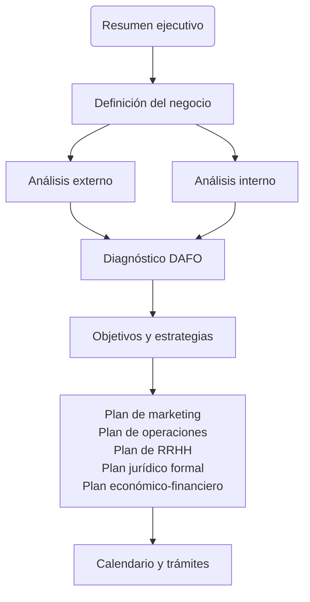
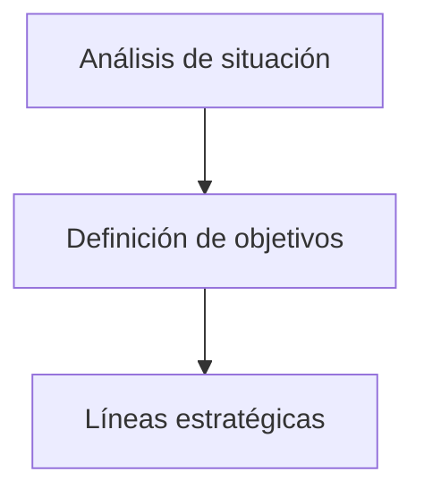

# RESUMEN Bit 41: De la idea a la creación de una nueva empresa

## 1. De la idea a la creación de una nueva empresa

### 1.1. Introducción

- El proceso de creación de una empresa comienza con una idea de negocio.
- Es necesario realizar un estudio de viabilidad que considere factores como el mercado, competencia, recursos técnicos y económicos, y el perfil del emprendedor.
- El perfil del emprendedor es crucial, ya que debe ser capaz de llevar la idea a la práctica.

### 1.2. La idea de negocio

#### 1.2.1. ¿Dónde encontrar una idea?

Fuentes de ideas:

- **Mercados exteriores**: Ideas que han tenido éxito en mercados exteriores pueden funcionar también en nuestro mercado si se adaptan correctamente.
- **Análisis de los cambios legales, sociales, económicos o tecnológicos**
- **Necesidades del mercado y análisis del grado de satisfacción de las mismas**: Puede que hay necesidades que no estén lo suficientemente cubiertas que ofrezcan una oportunidad de mercado.
- **Análisis del propio trabajo**: A través del trabajo, podemos detectar oportunidades de mejora de servicios o productos que ofrece la empresa.
- **Organismos y asociaciones empresariales**: En sus análisis y estadísticas podemos descubrir nuevas oportunidades de mercado.
- **Ideas ajenas**

#### 1.2.2. Una opción: La franquicia

Permite el acceso a un mercado y mundo empresarial a través de empresas con experiencia e imagen reconocida dentro del mercado en el que operan.

El _franquiciador_ concede a una persona física o jurídica--el _franquiciado_--el derecho a operar con un concepto de negocio, comercializando un producto o prestando un servicio bajo el formato de negocio del franquiciador y bajo su propia marca durante un tiempo y zonas delimitados y bajo ciertas condiciones económicas [normalmente, se establece un canon de entrada y un _royalty_ (porcentaje sobre ventas)].

#### 1.2.3. Cómo proteger una idea

**1. Invenciones industriales**

<table>
	<tr>
		<th></th>
		<th>Patente de invención</th>
		<th>Modelo de utilidad</th>
	</tr>
	<tr>
		<td><strong>Definición</strong></td>
		<td>Las invenciones nuevas que impliquen una actividad inventiva y aplicación industrial.</td>
		<td>Las invenciones que, siendo nuevas e implicando actividad inventiva, consisten en dar a un objeto una configuración, estructura o constitución de la que resulte alguna ventaja apreciable para su uso o fabricación.</td>
	</tr>
	<tr>
		<td><strong>Duración máxima</strong></td>
		<td>20 años a partir de la fecha de solicitud.</td>
		<td>10 años a partir de la fecha de solicitud.</td>
	</tr>
	<tr>
		<td><strong>Mantenimiento</strong></td>
		<td>Anualidades.</td>
		<td>Anualidades.</td>
	</tr>
	<tr>
		<td><strong>Novedad</strong></td>
		<td>Absoluta y mundial.</td>
		<td>Relativa a España.</td>
	</tr>
	<tr>
		<td><strong>Obligación de explotación</strong></td>
		<td>4 años desde la solicitud o 3 años desde la concesión.</td>
		<td>4 años desde la solicitud o 3 años desde la concesión.</td>
	</tr>
	<tr>
		<td><strong>Ámbito de protección</strong></td>
		<td>El territorio nacional.</td>
		<td>El territorio nacional.</td>
	</tr>
</table>

**2. Convenio de la patente europea**

Este convenio establece un sistema único de concesión de una solicitud de patente para todos los países adheridos a este convenio. Sus ventajas son:

- Se pueden designar hasta 20 países europeos con una sola solicitud en un solo idioma (alemán, inglés o francés). 
- Simplifica mucho los trámites de concesión de la patente

**3. Signos distintivos**

<table>
	<tr>
		<th></th>
		<th>Marca</th>
		<th>Nombre comercial</th>
	</tr>
	<tr>
		<td><strong>Definición</strong></td>
		<td>Todo signo susceptible de representación gráfica que sirva para distinguir en el mercado los productos o servicios de una empresa de los de otra.</td>
		<td>Los nombres de los propios individuos, sociedades o entidades de todas las clases que se dediquen al ejercicio del comercio o industria en cualquiera de sus manifestaciones.</td>
	</tr>
	<tr>
		<td><strong>Duración máxima</strong></td>
		<td>Indefinida, en períodos de 10 años desde la fecha de solicitud renovables.</td>
		<td>Indefinida, en períodos de 10 años desde la fecha de solicitud renovables.</td>
	</tr>
	<tr>
		<td><strong>Mantenimiento</strong></td>
		<td>Cada 10 años.</td>
		<td>Cada 10 años.</td>
	</tr>
	<tr>
		<td><strong>Ámbito de protección</strong></td>
		<td>El territorio nacional.</td>
		<td>El territorio nacional.</td>
	</tr>
</table>

**4. Rótulo de establecimiento**

La nueva Ley de marcas ha suprimido los rótulos de establecimiento para establecer, en su lugar, un régimen transitorio para los mismos. Una vez expirada su vida leal, se regirán por la Ley de Competencia Desleal.

**5. Marca comunitaria**

- Carácter unitario en toda la Unión Europea, es decir que efectos en todo el territorio de la Unión Europea, mediante una sola solicitud.
- Simplifica los trámites de solicitud mediante un único procedimiento de registro.

**6. Diseños**

<table>
	<tr>
		<th></th>
		<th>Modelo industrial</th>
		<th>Dibujo industrial</th>
	</tr>
	<tr>
		<td><strong>Definición</strong></td>
		<td>Todo objeto que pueda servir de tipo para la fabricación de un producto y que pueda descubrirse por su estructura, configuración, ornamentación o representación.</td>
		<td>Toda disposición o conjunto de líneas o colores aplicables con fin comercial a la ornamentación de un producto.</td>
	</tr>
	<tr>
		<td><strong>Duración máxima</strong></td>
		<td>5 años renovables por otros 5 años, en total 10 a partir de la fecha de concesión.</td>
		<td>5 años renovables por otros 5 años, en total 10 a partir de la fecha de concesión.</td>
	</tr>
	<tr>
		<td><strong>Mantenimiento</strong></td>
		<td>Quinquenios.</td>
		<td>Quinquenios.</td>
	</tr>
	<tr>
		<td><strong>Novedad</strong></td>
		<td>Mundial y absoluta.</td>
		<td>Mundial y absoluta.</td>
	</tr>
	<tr>
		<td><strong>Ámbito de protección</strong></td>
		<td>El territorio nacional.</td>
		<td>El territorio nacional.</td>
	</tr>
</table>

**La propiedad intelectual**

Se refiere a los derechos derivados de creaciones humanas y originales de carácter literario, artístico o científico. 

Se adquieren desde la creación del producto o descubrimiento y otorgan a su autor un derecho moral y patrimonial sobre el resultado de la creación que le protege frente al plagio de su obra.

### 1.3. El emprendedor

<table>
	<tr>
		<th>Rasgos de la personalidad</th>
		<th>Capacidades o aptitudes personales</th>
		<th>Formación y/o experiencia deseables</th>
	</tr>
	<tr>
		<td>
			<ul>
				<li>Iniciativa.</li>
				<li>Decisión.</li>
				<li>Asunción de riesgos.</li>
			</ul>
		</td>
		<td>
			<ul>
				<li>Habilidades organizativas y de coordinación.</li>
				<li>Adaptación a los cambios.</li>
				<li>Liderazgo.</li>
				<li>Aptitudes negociadoras.</li>
				<li>Competitividad.</li>
				<li>Capacidad de trabajo.</li>
				<li>Resistencia física.</li>
			</ul>
		</td>
		<td>
			<ul>
				<li>Experiencia empresarial directa o cercana.</li>
				<li>Conocimiento global de una empresa y/o desempeño de tareas en áreas diferentes de la misma.</li>
				<li>Formación específica para la gestión y/o puesta en marcha de una empresa.</li>
				<li>Formación técnica, directiva o en el sector de actividad propio de la empresa que vaya a constituirse.</li>
			</ul>
		</td>
	</tr>
</table>

### 1.4. Fases de generación de nuevos negocios

1. **Generación de la idea de negocio**: Crear y validar la idea, y configurar un equipo.
2. **Definición del proyecto empresarial (Business plan)**: Realizar un plan de empresa para analizar la viabilidad.
3. **Puesta en marcha (Start-Up)**: Realizar tareas como búsqueda de local, constitución de la empresa, contacto con proveedores y ejecución del plan de marketing.
4. **Consolidación de la actividad**: Auditar la rentabilidad y comparar con el plan de empresa.

## 2. Esquema elaboración de un plan de negocio

### 2.1. El plan de negocio

Es la descripción en un documento de nuestra idea de negocio que nos debe ayudar a reflexionar y analizar sobre los distintos factores que intervienen en la puesta en marcha del negocio o proyecto.

#### 2.1.1. Objetivo del plan de negocio

- **Interno**: Analizar la viabilidad y rentabilidad del negocio para concluir si es viable ponerlo en marcha.
- **Externo**: Servir como carta de presentación para obtener financiación o socios.

#### 2.1.2. Estructura y contenido de un plan de negocio

#### 2.1.3. Características de la redacción de un plan de negocio

- Presentación clara, profesional y atractiva.
- Extensión de entre 25 y 30 páginas.
- Estructura lineal y coherente.
- Datos aportados fundamentados en citas, fuentes de información, etc.
- Puntos a incluir:
	- La idea de negocio.
	- El perfil del Equipo directivo.
	- Situación en la que se encuentra el desarrollo del negocio.
	- Inversión requerida.
	- Valoración global del proyecto: aspectos más innovadores, viabilidad, rentabilidad.

### 2.2. Definición del negocio

#### 2.2.1. Características del negocio

Para describir la idea, tenemos que responder a estas tres preguntas:

- ¿A **quién** nos dirigimos?
- ¿**Qué** ofrecemos?
- ¿**Cómo** lo ofrecemos?

### 2.3. Análisis de situación

Realizar análisis externo e interno con herramientas como el análisis DAFO (Debilidades, Amenazas, Fortalezas, Oportunidades) para evaluar el entorno y la empresa.

El entorno se puede separar en:

- **Microentorno**: Clientes, competidores, proveedores e intermediarios.
- **Macroentorno**: Factores demográficos, económicos, sociales-culturales, políticos-legales, tecnológicos y medio ambientales.

### 2.4. Objetivos y estrategias

Se marcarán una vez se realice el análisis de situación.

#### 2.4.1. Definición de los objetivos

Según el Prof. Philip Kotler, han de ser:

- Cuantificables.
- Reales y factibles.
- Consistentes.
- Ordenados en orden de importancia descendente.
- Referirse a un tiempo y lugar determinados.

Hay tres estrategias comerciales principales:

- **Estrategia de costes**: Abaratar costes a través de la producción a gran escala.
- **Estrategia de diferenciación**: Especialización en algún aspecto que haga a la empresa única y que sea valorado.
- **Estrategia de enfoque**: Explotación de un nicho muy concreto en el que la empresa tendrá alguna ventaja en costes o diferenciación.

### 2.5. Plan de actuación

#### 2.5.1. Plan de marketing

Engloba el estudio de demanda y oferta en el mercado, estrategias de marketing (segmentación y posicionamiento) y definición del marketing-mix (producto, precio, distribución, promoción).

#### 2.5.2. Plan de organización y recursos humanos

Determina el número de personas necesarias, organigrama, descripción de funciones y perfiles, reclutamiento y selección, y cálculo de costes salariales.

#### 2.5.3. Plan operativo

Especifica las necesidades de infraestructura, proceso de producción, localización, equipamiento, gestión de compras y elección de proveedores.

#### 2.5.4. Plan jurídico formal

Selecciona la forma jurídica de la empresa y trámites de constitución de la misma.

#### 2.5.5. Plan económico-financiero

Calcula las necesidades de inversión, financiación, cuenta de resultados previsional, presupuesto de tesorería, balance previsional y análisis mediante ratios.

### 2.6. Calendario de puesta en marcha

Calendario realista que contemple todos los pasos necesarios para la creación de la empresa, desde la constitución hasta la apertura del negocio.
