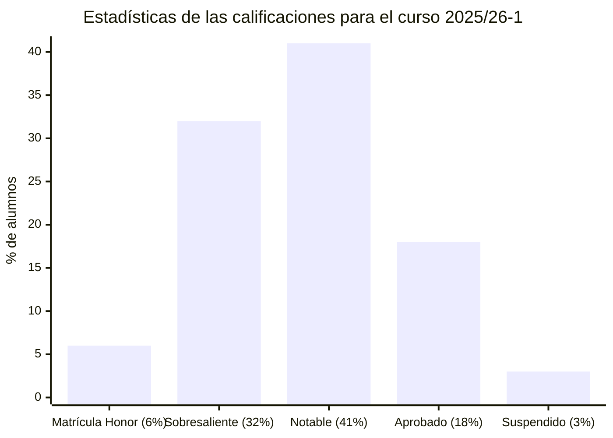

# Álgebra (25/26-1)

## Información sobre la asignatura

- **Curso**: 2025/26 (1º semestre)
- **Tipo**: Básica
- **Método de evaluación**: Examen (65%) + Evaluación continua (35%)
- **Créditos**: 6
- [**Plan docente**](https://apps.uoc.edu/PlaDocent/PlaDocent?Semestre=20251&SignatureCode=75.557&Context=3&Locale=es)

>

>	
Leyenda de calificaciones

>
>	- **Matrícula de Honor (M)**: 9 a 10
>	- **Sobresaliente (EX)**: 9 a 10
>	- **Notable (NO)**: 7 a 8,99
>	- **Aprobado ( )**: 5 a 6,99
>	- **Suspendido (SU)**: 0 a 4,99
>

## Resumen de calificaciones

>[!NOTE]
>La calificación final es la que aparece en mi expediente. No tiene por qué ser, necesariamente, el resultado de la suma de las calificaciones ponderadas de los bloques.

<table>
	<tr>
		<th>BLOQUE</th>
		<th>ACTIVIDAD</th>
		<th>CUESTIONARIO</th>
		<th>CALIFICACIÓN</th>
		<th>CALIFICACIÓN PONDERADA</th>
	</tr>
	<tr>
		<td rowspan="12">
			<strong>Evaluación continua (EC)</strong> (35%)
		</td>
		<td>
			<a href="pec1">
				PEC1 - ¿Te atreves a resolver una ecuación de segundo grado cuyas soluciones impliquen una raíz cuadrada de un número negativo?
			</a>
			(15%)
		</td>
		<td>
			<a href="pec1">
				Cuestionario 1
			</a>
		</td>
		<td>- / 15,00 ( )</td>
		<td rowspan="12">
			

				<strong>Calificación total PECs</strong>:
				 
				- / 100,00
			

			 
			

				<strong>Calificación ponderada EC</strong>:
				 
				- / 3,50
			
	
		</td>
	</tr>
	<tr>
		<td rowspan="4">
			<a href="pec2">
				PEC2 - ¿Sabías que el WiFi de alta velocidad es solo posible gracias a los de sistemas de ecuaciones lineales?
			</a>
			(15%)
		</td>
		<td>
			<a href="pec2/cuestionario2">
				Cuestionario 2
			</a>
		</td>
		<td>- / 3,75 ( )</td>
	</tr>
	<tr>
		<td>
			<a href="pec2/cuestionario3">
				Cuestionario 3
			</a>
		</td>
		<td>- / 3,75 ( )</td>
	</tr>
	<tr>
		<td>
			<a href="pec2/cuestionario4">
				Cuestionario 4
			</a>
		</td>
		<td>- / 3,75 ( )</td>
	</tr>
	<tr>
		<td>
			<a href="pec2/cuestionario5">
				Cuestionario 5
			</a>
		</td>
		<td>- / 3,75 ( )</td>
	</tr>
	<tr>
		<td rowspan="2">
			<a href="pec3">
				PEC3 - Relacionando los espacios vectoriales, los números, los conjuntos ¡y las paletas de colores!
			</a>
			(15%)
		</td>
		<td>
			<a href="pec3/cuestionario6">
				Cuestionario 6
			</a>
		</td>
		<td>- / 7,50 ( )</td>
	</tr>
	<tr>
		<td>
			<a href="pec3/cuestionario7">
				Cuestionario 7
			</a>
		</td>
		<td>- / 7,50 ( )</td>
	</tr>
	<tr>
		<td rowspan="4">
			<a href="pec4">
				PEC4 - ¿Qué tienen en común el algoritmo PageRank de búsqueda de Google y Fortnite?
			</a>
			(15%)
		</td>
		<td>
			<a href="pec4/cuestionario8">
				Cuestionario 8
			</a>
		</td>
		<td>- / 3,75 ( )</td>
	</tr>
	<tr>
		<td>
			<a href="pec4/cuestionario9">
				Cuestionario 9
			</a>
		</td>
		<td>- / 3,75 ( )</td>
	</tr>
	<tr>
		<td>
			<a href="pec4/cuestionario10">
				Cuestionario 10
			</a>
		</td>
		<td>- / 3,75 ( )</td>
	</tr>
	<tr>
		<td>
			<a href="pec4/cuestionario11">
				Cuestionario 11
			</a>
		</td>
		<td>- / 3,75 ( )</td>
	</tr>
	<tr>
		<td>
			<a href="pec5">
				PEC5 - Y de todo lo visto, ¿con qué me quedo?
			</a>
			(40%)
		</td>
		<td>
			<a href="pec5">
				Actividad
			</a>
		</td>
		<td>- / 40,00 ( )</td>
	</tr>
	<tr>
		<td>
			<a href="examen">
				<strong>Examen</strong>
			</a> (65%)
		</td>
		<td colspan="2"></td>
		<td>- / 10,00</td>
		<td>- / 6,50</td>
	</tr>
	<tr>
		<td colspan="4"></td>	
		<td></td>
	</tr>
	<tr>
		<td colspan="4">
			<strong>CALIFICACIÓN FINAL</strong>
		</td>
		<td>- / 10,00 ( )</td>
	</tr>
</table>

## Recursos de aprendizaje

>[!NOTE]
>- No se incluyen los archivos `pdf` en el repositorio para evitar posibles problemas de copyright.

### PEC1

- [Los números: Números naturales, principio de inducción y números complejos](https://aprenentatge.recursos.uoc.edu/continguts/pdf/PID_00271022.pdf) ([resumen](pec1/recursos/README.md))

### PEC2

- [Sistemas de ecuaciones lineales: Discusión, resolución e interpretación geométrica](https://aprenentatge.recursos.uoc.edu/continguts/pdf/PID_00293765.pdf) ([resumen](pec2/recursos/sistemas_ecuaciones_lineales.md))
- [Elementos de álgebra lineal y geometría: Espacios vectoriales, matrices, determinantes, espacio afín y euclídeo](https://aprenentatge.recursos.uoc.edu/continguts/pdf/PID_00293818.pdf) ([resumen](pec2/recursos/algebra_lineal.md))

### PEC3

- [Elementos de álgebra lineal y geometría: Espacios vectoriales, matrices, determinantes, espacio afín y euclídeo](https://aprenentatge.recursos.uoc.edu/continguts/pdf/PID_00293818.pdf) ([resumen](pec2/recursos/algebra_lineal.md))

### PEC4

- [Aplicaciones lineales: Matriz asociada, vectores y valores propios y diagonalización](https://aprenentatge.recursos.uoc.edu/continguts/pdf/PID_00298140.pdf) ([resumen](pec4/recursos/aplicaciones_lineales.md))
- [Transformaciones geométricas: Traslación, rotación y escalado](https://aprenentatge.recursos.uoc.edu/continguts/pdf/PID_00301214.pdf) ([resumen](pec4/recursos/transformaciones.md))
