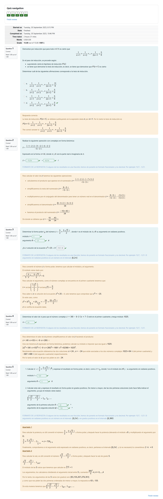

# PEC1 - ¿Te atreves a resolver una ecuación de segundo grado cuyas soluciones impliquen una raíz cuadrada de un número negativo?

## Capturas de las partes

	
Captura del cuestionario 1 realizado en Moodle

## Recursos de aprendizaje

>[!NOTE]
>- No se incluyen los archivos `pdf` en el repositorio para evitar posibles problemas de copyright.

- [**Los números: Números naturales, principio de inducción y números complejos**](https://aprenentatge.recursos.uoc.edu/continguts/pdf/PID_00271022.pdf) ([resumen](recursos/README.md))

---

## Resultado

### Calificación

- **Calificación original**: 15,00 / 15,00
- **Calificación sobre 10**: 10,00 / 10,00
- **Letra (escala internacional)**: A

### Detalles sobre la puntuación

