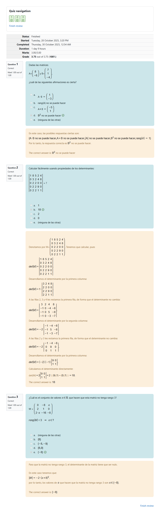
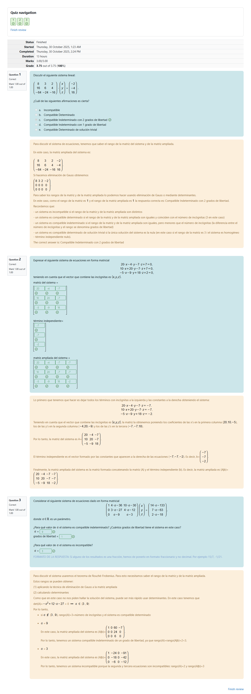
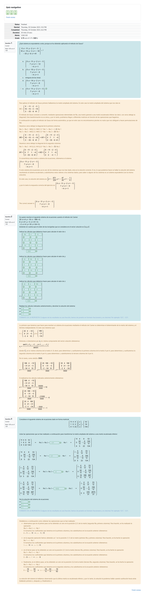
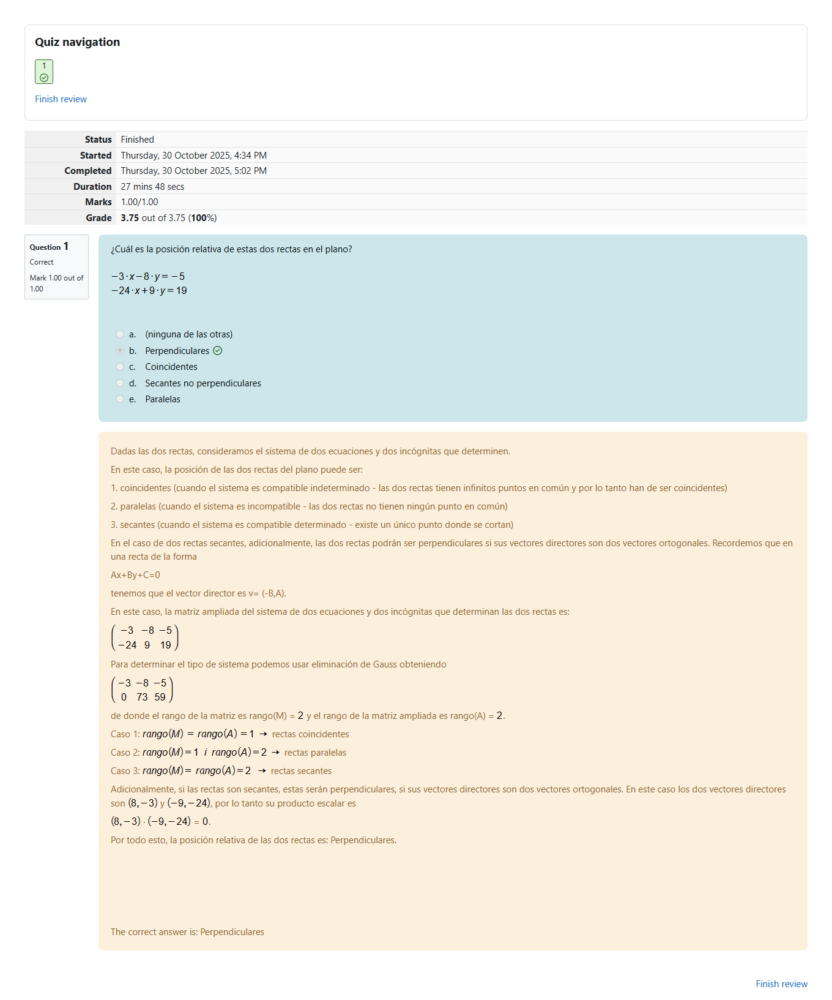
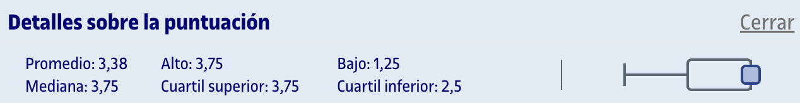
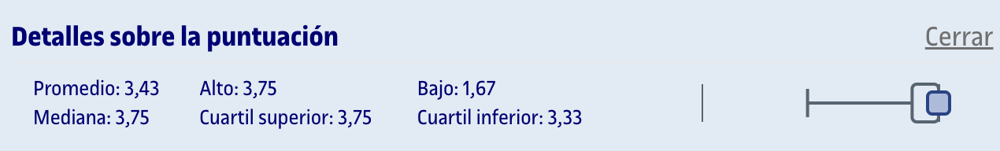
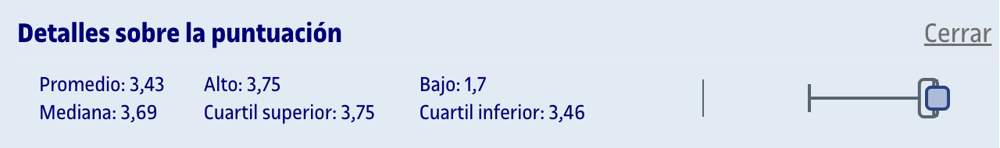
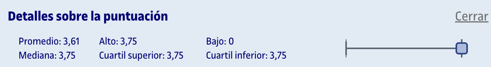

# PEC2 - ¿Sabías que el WiFi de alta velocidad es solo posible gracias a los de sistemas de ecuaciones lineales?

## Capturas de las partes

	
Captura del cuestionario 2 realizada en Moodle

	
Captura del cuestionario 3 realizada en Moodle

	
Captura del cuestionario 4 realizada en Moodle

	
Captura del cuestionario 5 realizada en Moodle

## Recursos de aprendizaje

>[!NOTE]
>- No se incluyen los archivos `pdf` en el repositorio para evitar posibles problemas de copyright.

- [**Sistemas de ecuaciones lineales: Discusión, resolución e interpretación geométrica**](https://aprenentatge.recursos.uoc.edu/continguts/pdf/PID_00293765.pdf) ([resumen](pec2/recursos/sistemas_ecuaciones_lineales.md))
- [**Elementos de álgebra lineal y geometría: Espacios vectoriales, matrices, determinantes, espacio afín y euclídeo**](https://aprenentatge.recursos.uoc.edu/continguts/pdf/PID_00293818.pdf) ([resumen](pec2/recursos/algebra_lineal.md))

---

## Resultado

### Calificación

<table>
	<thead>
		<tr>
			<th>EVALUABLE</th>
			<th>C. ORIGINAL</th>
			<th>C. SOBRE 10</th>
		</tr>
	</thead>
	<tbody>
		<tr>
			<td>Cuestionario 2</td>
			<td>3,75 / 3,75</td>
			<td>10,00 / 10,00</td>
		</tr>
		<tr>
			<td>Cuestionario 3</td>
			<td>3,75 / 3,75</td>
			<td>10,00 / 10,00</td>
		</tr>
		<tr>
			<td>Cuestionario 4</td>
			<td>3,75 / 3,75</td>
			<td>10,00 / 10,00</td>
		</tr>
		<tr>
			<td>Cuestionario 5</td>
			<td>3,75 / 3,75</td>
			<td>10,00 / 10,00</td>
		</tr>
		<tr><td colspan="3"></td></tr>
		<tr>
			<td><strong>TOTAL</strong></td>
			<td><strong>15,00 / 15,00</strong></td>
			<td><strong>10,00 / 10,00 (A)</strong></td>
		</tr>
	</tbody>
</table>

### Detalles sobre la puntuación

Cuestionario 2

Cuestionario 3

Cuestionario 4

Cuestionario 5

