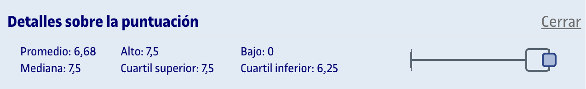
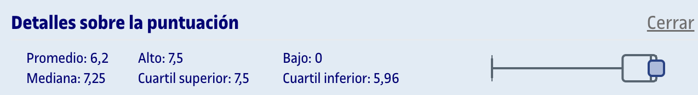

# PEC3 - Relacionando los espacios vectoriales, los números, los conjuntos ¡y las paletas de colores!

## Capturas de las partes

	
Captura del cuestionario 6 realizada en Moodle

	
Captura del cuestionario 7 realizada en Moodle

## Recursos de aprendizaje

>[!NOTE]
>- No se incluyen los archivos `pdf` en el repositorio para evitar posibles problemas de copyright.

- [**Elementos de álgebra lineal y geometría: Espacios vectoriales, matrices, determinantes, espacio afín y euclídeo**](https://aprenentatge.recursos.uoc.edu/continguts/pdf/PID_00293818.pdf)

---

## Resultado

### Calificación

**Cuestionario 6**:
- **Calificación original**: 7,50 / 7,50
- **Calificación sobre 10**: 10,00 / 10,00

**Cuestionario 7**:
- **Calificación original**: 7,50 / 7,50
- **Calificación sobre 10**: 10,00 / 10,00

**Calificación total**:
- **Calificación original**: 15,00 / 15,00
- **Calificación sobre 10**: 10,00 / 10,00
- **Letra (escala internacional)**: A

### Detalles sobre la puntuación

- **Cuestionario 6**

	

- **Cuestionario 7**

	
