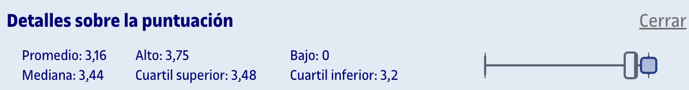
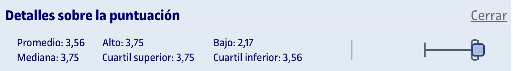
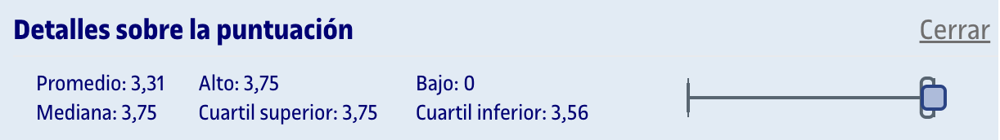

# PEC4 - ¿Qué tienen en común el algoritmo PageRank de búsqueda de Google y Fortnite?

## Capturas de las partes

>[!IMPORTANT]
>A fecha en la que publico esto (18/02/2026), me aparece un error al intentar acceder a los cuestionarios de Moodle, por lo que no puedo adjuntar capturas de los cuestionarios relativos a esta PEC.

	
Captura del cuestionario 8 realizada en Moodle

	
Captura del cuestionario 9 realizada en Moodle

	
Captura del cuestionario 10 realizada en Moodle

	
Captura del cuestionario 11 realizada en Moodle

## Recursos de aprendizaje

>[!NOTE]
>- No se incluyen los archivos `pdf` en el repositorio para evitar posibles problemas de copyright.

- [**Aplicaciones lineales: Matriz asociada, vectores y valores propios y diagonalización**](https://aprenentatge.recursos.uoc.edu/continguts/pdf/PID_00298140.pdf)
- [**Transformaciones geométricas: Traslación, rotación y escalado**](https://aprenentatge.recursos.uoc.edu/continguts/pdf/PID_00301214.pdf)

---

## Resultado

### Calificación

<table>
	<thead>
		<tr>
			<th>EVALUABLE</th>
			<th>C. ORIGINAL</th>
			<th>C. SOBRE 10</th>
		</tr>
	</thead>
	<tbody>
		<tr>
			<td>Cuestionario 8</td>
			<td>3,75 / 3,75</td>
			<td>10,00 / 10,00</td>
		</tr>
		<tr>
			<td>Cuestionario 9</td>
			<td>3,75 / 3,75</td>
			<td>10,00 / 10,00</td>
		</tr>
		<tr>
			<td>Cuestionario 10</td>
			<td>3,75 / 3,75</td>
			<td>10,00 / 10,00</td>
		</tr>
		<tr>
			<td>Cuestionario 11</td>
			<td>3,75 / 3,75</td>
			<td>10,00 / 10,00</td>
		</tr>
		<tr><td colspan="3"></td></tr>
		<tr>
			<td><strong>TOTAL</strong></td>
			<td><strong>15,00 / 15,00</strong></td>
			<td><strong>10,00 / 10,00 (A)</strong></td>
		</tr>
	</tbody>
</table>

### Detalles sobre la puntuación

Cuestionario 8

Cuestionario 9

Cuestionario 10

Cuestionario 11

