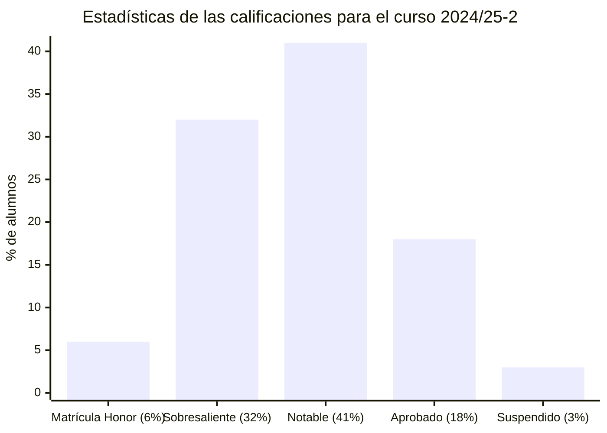
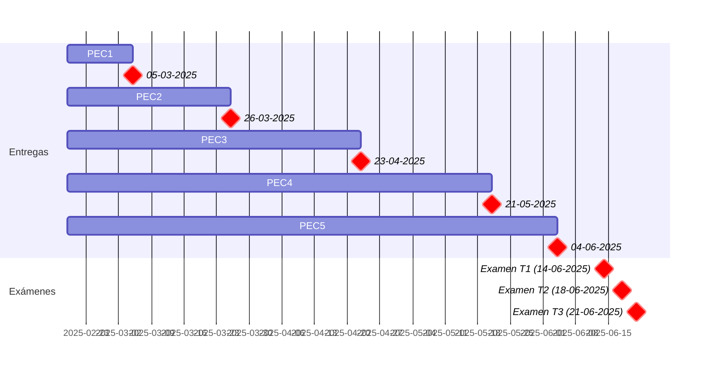

# Análisis matemático (24/25-2)

- [Información sobre la asignatura](#información-sobre-la-asignatura)
- [Calendario de entregas](#calendario-de-entregas)
- [Resumen de calificaciones](#resumen-de-calificaciones)
- [Recursos de aprendizaje](#recursos-de-aprendizaje)
	- [PEC1](#pec1)
	- [PEC2](#pec2)
	- [PEC3](#pec3)
	- [PEC4](#pec4)
	- [PEC5](#pec5)

## Información sobre la asignatura

- **Código**: 75.558
- **Curso**: 2024/25 (2º semestre)
- **Tipo**: Básica
- **Método de evaluación**: Examen (65%) + Evaluación continua (35%)
- **Créditos**: 6
- [**Plan docente**](https://apps.uoc.edu/PlaDocent/PlaDocent?Semestre=20242&SignatureCode=75.558&Context=2&Locale=es)

>

>	
Leyenda de calificaciones

>
>	- **Matrícula de Honor (M)**: 9 a 10
>	- **Sobresaliente (EX)**: 9 a 10
>	- **Notable (NO)**: 7 a 8,99
>	- **Aprobado (A)**: 5 a 6,99
>	- **Suspendido (SU)**: 0 a 4,99
>

## Calendario de entregas

## Resumen de calificaciones

>[!NOTE]
>La calificación final es la que aparece en mi expediente. No tiene por qué ser, necesariamente, el resultado de la suma de las calificaciones ponderadas de los bloques.

<table>
	<tr>
		<th>BLOQUE</th>
		<th>ACTIVIDAD</th>
		<th>PARTE</th>
		<th>CALIFICACIÓN</th>
		<th>CALIFICACIÓN PONDERADA</th>
	</tr>
	<tr>
		<td rowspan="10">
			<strong>Evaluación continua (EC)</strong> (35%)
		</td>
		<td>
			<a href="pec1">
				PEC1 - Funciones reales de variable real
			</a>
			(10%)
		</td>
		<td>
			<a href="pec1">
				Parte 1
			</a>
		</td>
		<td>10,00 / 10,00 (A)</td>
		<td rowspan="10">
			

				<strong>Calificación total PEC</strong>:
				 
				97,74 / 100,00
			

			 
			

				<strong>Calificación ponderada EC</strong>:
				 
				3,42 / 3,50
			
	
		</td>
	</tr>
	<tr>
		<td rowspan="2">
			<a href="pec2">
				PEC2 - Límites de funciones y continuidad
			</a>
			(20%)
		</td>
		<td>
			<a href="pec2/parte1">
				Parte 1
			</a>
		</td>
		<td>10,00 / 10,00 (A)</td>
	</tr>
	<tr>
		<td>
			<a href="pec2/parte2.png">
				Parte 2
			</a>
		</td>
		<td>10,00 / 10,00 (A)</td>
	</tr>
	<tr>
		<td rowspan="3">
			<a href="pec3">
				PEC3 - Derivación: el problema de la tangente
			</a>
			(30%)
		</td>
		<td>
			<a href="pec3/parte1">
				Parte 1
			</a>
		</td>
		<td>10,00 / 10,00 (A)</td>
	</tr>
	<tr>
		<td>
			<a href="pec3/parte2">
				Parte 2
			</a>
		</td>
		<td>9,25 / 10,00 (A)</td>
	</tr>
	<tr>
		<td>
			<a href="pec3/parte3">
				Parte 3
			</a>
		</td>
		<td>9,20 / 10,00 (A)</td>
	</tr>
	<tr>
		<td rowspan="3">
			<a href="pec4">
				PEC4 - Integración: el problema del área
			</a>
			(30%)
		</td>
		<td>
			<a href="pec4/parte1">
				Parte 1
			</a>
		</td>
		<td>10,00 / 10,00 (A)</td>
	</tr>
	<tr>
		<td>
			<a href="pec4/parte2">
				Parte 2
			</a>
		</td>
		<td>10,00 / 10,00 (A)</td>
	</tr>
	<tr>
		<td>
			<a href="pec4/parte3">
				Parte 3
			</a>
		</td>
		<td>9,29 / 10,00 (A)</td>
	</tr>
	<tr>
		<td>
			<a href="pec5">
				PEC5 - Sucesiones y series de números reales
			</a>
			(10%)
		</td>
		<td>
			<a href="pec5">
				Parte 1
			</a>
		</td>
		<td>10,00 / 10,00 (A)</td>
	</tr>
	<tr>
		<td>
			<a href="examen">
				<strong>Examen</strong>
			</a> (65%)
		</td>
		<td colspan="2"></td>
		<td>10,00 / 10,00</td>
		<td>6,50 / 6,50</td>
	</tr>
	<tr>
		<td colspan="4"></td>	
		<td></td>
	</tr>
	<tr>
		<td colspan="4">
			<strong>CALIFICACIÓN FINAL</strong>
		</td>
		<td>10,00 / 10,00 (M)</td>
	</tr>
</table>

## Recursos de aprendizaje

>[!NOTE]
>- No se incluyen los archivos `pdf` en el repositorio para evitar posibles problemas de copyright.  
>- Con el permiso de [Carlos Cactus](https://t.me/carlos_cactus), he añadido los recursos Sin Espinas que están disponibles públicamente.

### PEC1

- [**Funciones reales de variable real**](http://cvapp.uoc.edu/autors/MostraPDFMaterialAction.do?id=284292&hash=698e6f70d8d51d3cbe7b9e288ca162f49eadc2bb61c832a9990783a27cdb9717) ([resumen](pec1/recursos/README.md)) ([Sin Espinas](pec1/recursos/sin_espinas-funciones.pdf))

### PEC2

- [**Límites de funciones y continuidad**](http://cvapp.uoc.edu/autors/MostraPDFMaterialAction.do?id=284288&hash=6aaa82909fee7ad8205ab3b6e8fb45fa47ca1845a10ccdbf0ec38ad9e8415768) ([resumen](pec2/recursos/README.md)) ([Sin Espinas](pec2/recursos/sin_espinas-limites.pdf))

### PEC3

- [**Derivación: el problema de la tangente**](http://cvapp.uoc.edu/autors/MostraPDFMaterialAction.do?id=284285&hash=d2b9fd2f3d54657bf691c6a73166ab55ecfb532d60ae21aa3b6d3b4a40df505f) ([resumen](pec3/recursos/README.md))

### PEC4

- [**Integración: el problema del área**](http://cvapp.uoc.edu/autors/MostraPDFMaterialAction.do?id=284290&hash=ab97fdca71e4cd5f5085a0b3ba5aeac41d886f19d35fb22f43d3a25a5a5a63bf) ([resumen](pec4/recursos/README.md))

### PEC5

- [**Sucesiones y series de números reales**](http://cvapp.uoc.edu/autors/MostraPDFMaterialAction.do?id=284286&hash=6620186fa12c1c2e8822e0a7720fccdc86578afe3a7e9f045693f30574bf90d9) ([resumen](pec5/recursos/README.md))