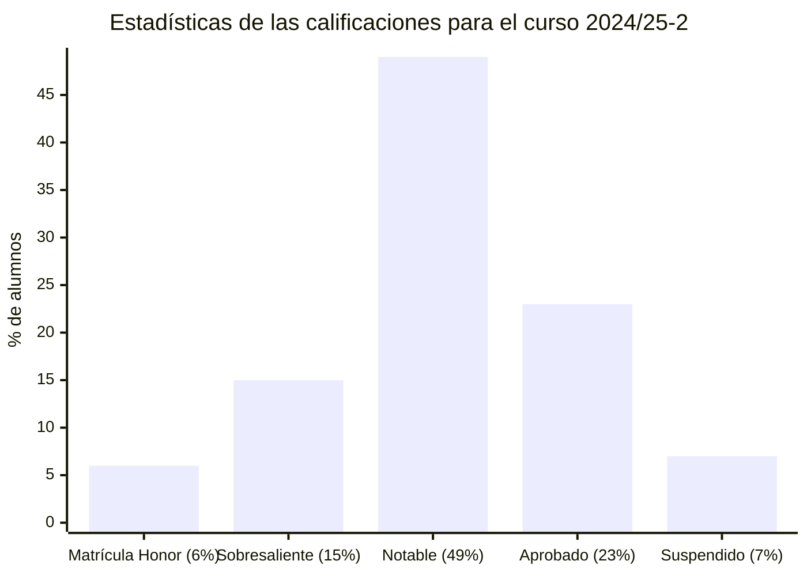

# Análisis matemático (24/25-2)

## Información sobre la asignatura

- **Curso**: 2024/25 (2º semestre)
- **Tipo**: Básica
- **Método de evaluación**: Evaluación continua (EC) + Examen (EX)
- **Ponderación**: EC 35% + EX 65%
- **Créditos**: 6
- [**Plan docente**](https://apps.uoc.edu/PlaDocent/PlaDocent?Semestre=20242&SignatureCode=75.558&Context=2&Locale=es)

>

>	
Leyenda de calificaciones

>
>	- Matrícula de Honor (M): 9 a 10
>	- Sobresaliente (EX): 9 a 10
>	- Notable (NO): 7 a 8,99
>	- Aprobado (A): 5 a 6,99
>	- Suspendido (SU): 0 a 4,99
>

## Calificación final 

- [**Examen**](examen): - / 10,00 ()
- **Evaluación continua**: - / 10,00 ()
- **Calificación final**: - / 10,00 ()

## Pruebas de evaluación continua (PECs)

<table>
	<tr>
		<th>PEC</th>
		<th>PARTE</th>
		<th>CALIFICACIÓN</th>
	</tr>
	<tr>
		<td>
			<a href="https://github.com/HenestrosaDev/uoc-ingenieria-informatica/tree/main/analisis_matematico/pec1">
				PEC1 - Funciones reales de variable real
			</a>
		</td>
		<td>
			<a href="https://github.com/HenestrosaDev/uoc-ingenieria-informatica/tree/main/analisis_matematico/pec1/parte1">
				Parte 1
			</a>
		<td>
			10,00 / 10,00 (A)
		</td>
	</tr>
	<tr>
		<td rowspan="2">
			<a href="https://github.com/HenestrosaDev/uoc-ingenieria-informatica/tree/main/analisis_matematico/pec2">
				PEC2 - Límites de funciones y continuidad
			</a>
		</td>
		<td>
			<a href="https://github.com/HenestrosaDev/uoc-ingenieria-informatica/tree/main/analisis_matematico/pec2/parte1">
				Parte 1
			</a>
		</td>
		<td>
			- / 10,00 ( )
		</td>
	</tr>
	<tr>
		<td>
			<a href="https://github.com/HenestrosaDev/uoc-ingenieria-informatica/tree/main/analisis_matematico/pec2/parte2">
				Parte 2
			</a>
		</td>
		<td>
			- / 10,00 ( )
		</td>
	</tr>
	<tr>
		<td rowspan="3">
			<a href="https://github.com/HenestrosaDev/uoc-ingenieria-informatica/tree/main/analisis_matematico/pec1">
				PEC3 - Derivación: el problema de la tangente
			</a>
		</td>
		<td>
			<a href="https://github.com/HenestrosaDev/uoc-ingenieria-informatica/tree/main/analisis_matematico/pec3/parte1">
				Parte 1
			</a>
		</td>
		<td>
			- / 10,00 ( )
		</td>
	</tr>
	<tr>
		<td>
			<a href="https://github.com/HenestrosaDev/uoc-ingenieria-informatica/tree/main/analisis_matematico/pec3/parte2">
				Parte 2
			</a>
		</td>
		<td>
			- / 10,00 ( )
		</td>
	</tr>
	<tr>
		<td>
			<a href="https://github.com/HenestrosaDev/uoc-ingenieria-informatica/tree/main/analisis_matematico/pec3/parte3">
				Parte 3
			</a>
		</td>
		<td>
			- / 10,00 ( )
		</td>
	</tr>
	<tr>
		<td rowspan="3">
			<a href="https://github.com/HenestrosaDev/uoc-ingenieria-informatica/tree/main/analisis_matematico/pec4">
				PEC4 - Integración: el problema del área
			</a>
		</td>
		<td>
			<a href="https://github.com/HenestrosaDev/uoc-ingenieria-informatica/tree/main/analisis_matematico/pec4/parte1">
				Parte 1
			</a>
		</td>
		<td>
			- / 10,00 ( )
		</td>
	</tr>
	<tr>
		<td>
			<a href="https://github.com/HenestrosaDev/uoc-ingenieria-informatica/tree/main/analisis_matematico/pec4/parte2">
				Parte 2
			</a>
		</td>
		<td>
			- / 10,00 ( )
		</td>
	</tr>
	<tr>
		<td>
			<a href="https://github.com/HenestrosaDev/uoc-ingenieria-informatica/tree/main/analisis_matematico/pec4/parte3">
				Parte 3
			</a>
		</td>
		<td>
			- / 10,00 ( )
		</td>
	</tr>
	<tr>
		<td>
			<a href="https://github.com/HenestrosaDev/uoc-ingenieria-informatica/tree/main/analisis_matematico/pec5">
				PEC5 - Sucesiones y series de números reales
			</a>
		</td>
		<td>
			<a href="https://github.com/HenestrosaDev/uoc-ingenieria-informatica/tree/main/analisis_matematico/pec5/parte1">
				Parte 1
			</a>
		<td>
			- / 10,00 ( )
		</td>
	</tr>
	<tr>
		<td colspan="2"></td>
		<td></td>
	</tr>
	<tr>
		<td colspan="2">
			<strong>SUMA DE CALIFICACIONES</strong>
		</td>
		<td>
			<strong>- / 100,00 ( )</strong>
		</td>
	</tr>
	<tr>
		<td colspan="2">
			<strong>CALIFICACIÓN PONDERADA</strong> (35%)
		</td>
		<td>
			<strong>- / 35,00 ( )</strong>
		</td>
	</tr>
</table>

## Recursos de aprendizaje

>[!NOTE]
>- No se incluyen los archivos `pdf` en el repositorio para evitar posibles problemas de copyright.

### PEC1

- [Funciones reales de variable real](http://cvapp.uoc.edu/autors/MostraPDFMaterialAction.do?id=284292&hash=698e6f70d8d51d3cbe7b9e288ca162f49eadc2bb61c832a9990783a27cdb9717)

### PEC2

- [Límites de funciones y continuidad](http://cvapp.uoc.edu/autors/MostraPDFMaterialAction.do?id=284288&hash=6aaa82909fee7ad8205ab3b6e8fb45fa47ca1845a10ccdbf0ec38ad9e8415768)

### PEC3

- [Derivación: el problema de la tangente](http://cvapp.uoc.edu/autors/MostraPDFMaterialAction.do?id=284285&hash=d2b9fd2f3d54657bf691c6a73166ab55ecfb532d60ae21aa3b6d3b4a40df505f)

### PEC4

- [Integración: el problema del área](http://cvapp.uoc.edu/autors/MostraPDFMaterialAction.do?id=284290&hash=ab97fdca71e4cd5f5085a0b3ba5aeac41d886f19d35fb22f43d3a25a5a5a63bf)

### PEC5

- [Sucesiones y series de números reales](http://cvapp.uoc.edu/autors/MostraPDFMaterialAction.do?id=284286&hash=6620186fa12c1c2e8822e0a7720fccdc86578afe3a7e9f045693f30574bf90d9)