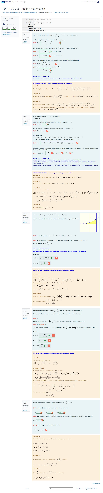
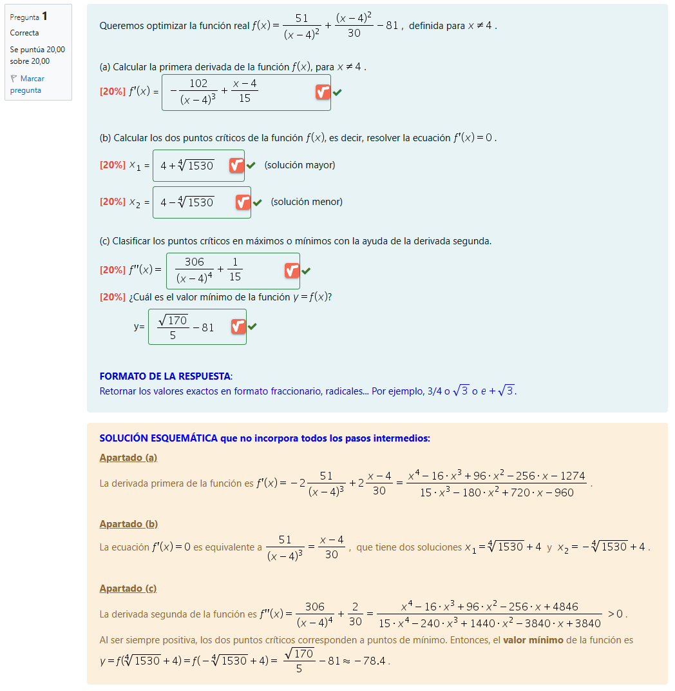
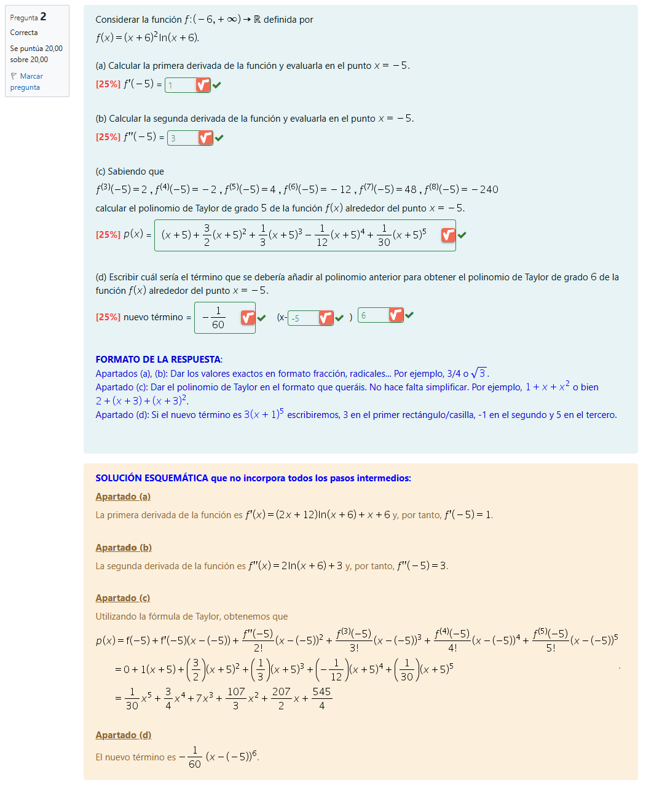
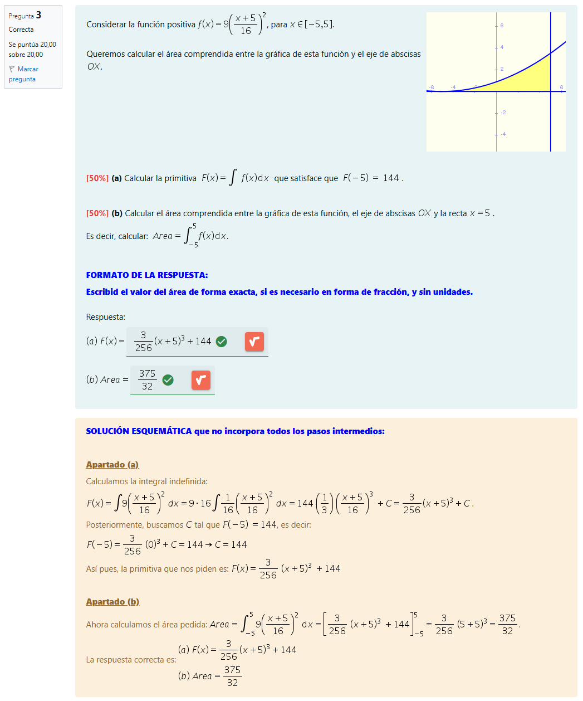
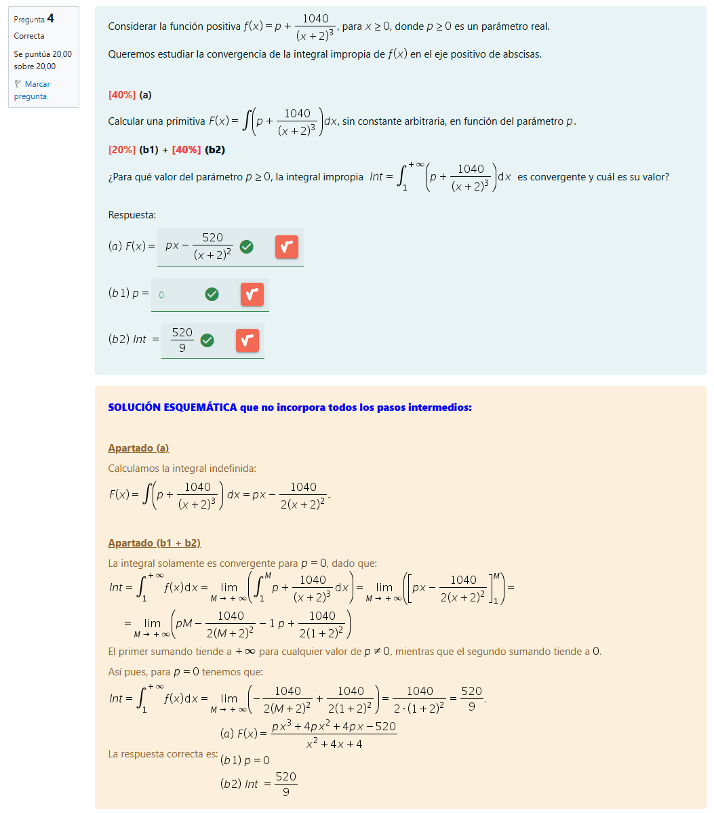
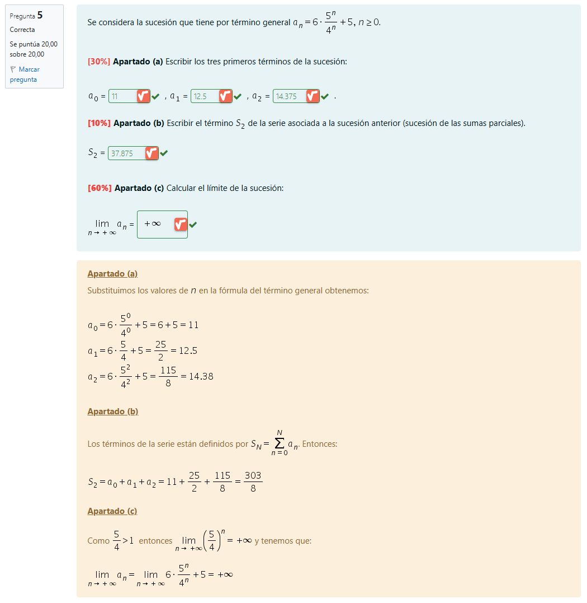

# EXAMEN Análisis Matemático (24/25-2)

>[!NOTE]
>- Este examen fue realizado en el tercer turno (21/06/2025). 
>- No hay un examen modelo para cada turno, ya que cada alumno tiene un examen distinto en Moodle. Por este motivo, esta asignatura no cuenta con un índice de exámenes como el de otras, como lógica o administración y gestión de organizaciones.

## Índice

- [Desglose de ejercicios](#desglose-de-ejercicios)
	- [Ejercicio 1](#ejercicio-1)
	- [Ejercicio 2](#ejercicio-2)
	- [Ejercicio 3](#ejercicio-3)
	- [Ejercicio 4](#ejercicio-4)
	- [Ejercicio 5](#ejercicio-5)
- [Orientaciones para el examen](#orientaciones-para-el-examen)
- [Resultado](#resultado)
	- [Calificación](#calificación)

 

## Desglose de ejercicios

[Entrega en papel](entrega_papel.pdf)

	
Captura del examen íntegro en Moodle

### Ejercicio 1

### Ejercicio 2

### Ejercicio 3

### Ejercicio 4

### Ejercicio 5

## Orientaciones para el examen

- **Navegación por el cuestionario**: hay una pregunta por página, y cada vez que cambies de página se guardará la respuesta de forma automática. Si lo necesitas, desde el menú de navegación de la izquierda puedes avanzar y retroceder.
- **Entrega**: para empezar la prueba final haz clic sobre `Intente resolver el cuestionario ahora`, y una vez resuelta, pulsa `Terminar intento`. En este momento todavía puedes volver a la prueba, si lo precisas haciendo clic en `Volver al intento`. Para entregar la prueba haz clic en `Enviar todo y terminar`.
- En caso de que llegue la hora de finalización de la prueba y no hayas pulsado el botón `Enviar todo y terminar`, la prueba se dará por terminada con las respuestas marcadas.
- **Renuncia**: si quieres renunciar a la prueba, puedes hacerlo desde el enlace que encontrarás en la página anterior.

El examen consta de 5 preguntas, más una tarea para subir un único archivo PDF con la resolución del examen a mano. Solo se puede realizar el EXAMEN FINAL una vez.

Es necesario responder a las preguntas en el cuestionario siguiendo las indicaciones de formato que encontrarás en cada pregunta. 

En general, cuando una respuesta es un valor numérico, debe darse exacto o, como mínimo, con tres cifras decimales correctas, excepto cuando existan otras indicaciones en el enunciado. Cuando introduzcas un resultado con decimales, usa el punto como separador decimal.

Se recomienda usar el editor de fórmulas MathType para escribir las respuestas.

Antes de enviar las respuestas, asegúrate que han quedado todas bien escritas en el cuestionario.

Debe resolverse la prueba a mano y adjuntarla en formato PDF en la correspondiente tarea una vez finalizado el cuestionario. Será imprescindible resolver cada ejercicio paso a paso, explicando lo que se hace e interpretando los resultados. La resolución debe ser clara, completa y no puede basarse en referencias a los apuntes u otros recursos de aprendizaje. Es responsabilidad tuya que el PDF se pueda leer bien e incluya todos los ejercicios: numera las hojas e indica claramente cada ejercicio y sus apartados.

Dispones de 2 horas para responder a las 5 preguntas del cuestionario. Puedes empezar entre las 16:25 y las 18:40. El cuestionario se cierra automáticamente después de 2h de haber empezado o a la hora del cierre, a las 18:40. Si empiezas el cuestionario después de las 16:40 no dispondrás de 2h, ya que se cerrará a las 18:40. La tarea para subir el PDF permanecerá abierta desde las 16:30 hasta las 18:50.

Puedes utilizar cualquier material y/o calculadora (incluyendo la CalcMe) para comprobar los cálculos, pero tienes que asegurarte que detallas y justificas en el PDF todos los pasos seguidos para llegar a la solución.

En caso de que no se adjunte la resolución detallada en PDF, el EXAMEN FINAL obtendrá una calificación de SUSPENDIDO. En caso de que no se adjunte la resolución detallada de un apartado, dicho apartado obtendrá una calificación de cero.

---

## Resultado

### Calificación

- **Calificación**: 10,00 / 10,00
- **Letra (escala internacional)**: A