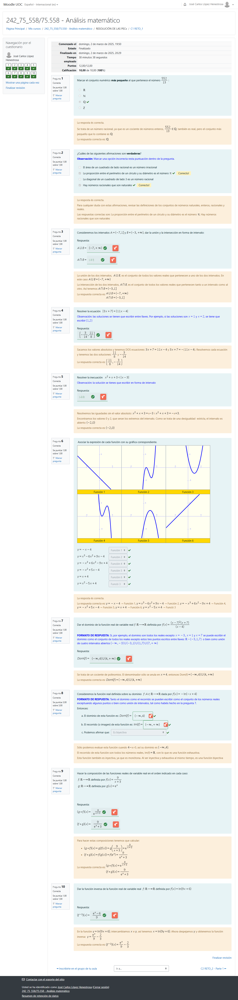
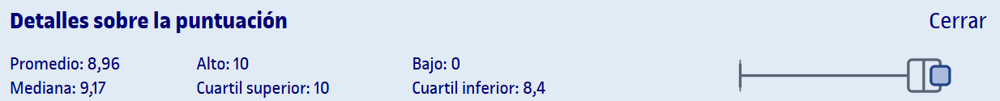

# PEC1 - Funciones reales de variable real

## Capturas de las partes

	
Captura de la parte 1 realizada en Moodle

## Recursos de aprendizaje

>[!NOTE]
>- No se incluyen los archivos `pdf` en el repositorio para evitar posibles problemas de copyright.

- [**Funciones reales de variable real**](http://cvapp.uoc.edu/autors/MostraPDFMaterialAction.do?id=284292&hash=698e6f70d8d51d3cbe7b9e288ca162f49eadc2bb61c832a9990783a27cdb9717) ([resumen](pec1/recursos/README.md)) ([Sin Espinas](pec1/recursos/sin_espinas-funciones.pdf))

---

## Resultado

### Calificación

- **Calificación original**: 12,00 / 12,00
- **Calificación sobre 10**: 10,00 / 10,00
- **Letra (escala internacional)**: A

### Detalles sobre la puntuación

