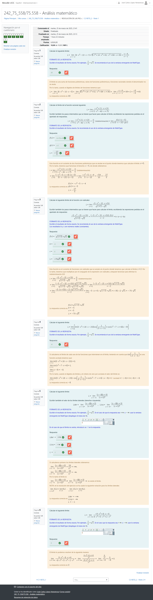
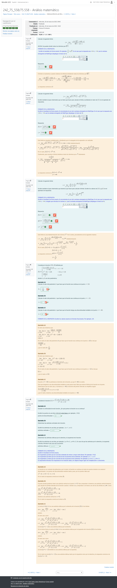
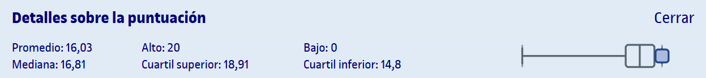

# PEC2 - Límites de funciones y continuidad

## Capturas de las partes

	
Captura de la parte 1 realizada en Moodle

	
Captura de la parte 2 realizada en Moodle

## Recursos de aprendizaje

>[!NOTE]
>- No se incluyen los archivos `pdf` en el repositorio para evitar posibles problemas de copyright.

- [**Límites de funciones y continuidad**](http://cvapp.uoc.edu/autors/MostraPDFMaterialAction.do?id=284288&hash=6aaa82909fee7ad8205ab3b6e8fb45fa47ca1845a10ccdbf0ec38ad9e8415768) ([resumen](pec2/recursos/README.md)) ([Sin Espinas](pec2/recursos/sin_espinas-limites.pdf))

---

## Resultado

### Calificación

**Parte 1**:
- **Calificación original**: 6,00 / 6,00
- **Calificación sobre 10**: 10,00 / 10,00
- **Letra (escala internacional)**: A

**Parte 2**:
- **Calificación original**: 5,00 / 5,00
- **Calificación sobre 10**: 10,00 / 10,00
- **Letra (escala internacional)**: A

**Calificación total**:
- **Calificación original** (suma de la calificación sobre 10 de las partes 1 y 2): 20,00 / 20,00
- **Calificación sobre 10**: 10,00 / 10,00
- **Letra (escala internacional)**: A

### Detalles sobre la puntuación

