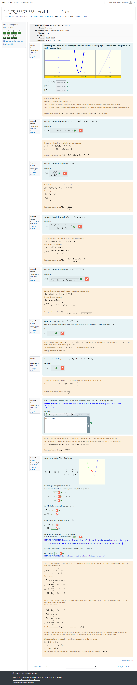
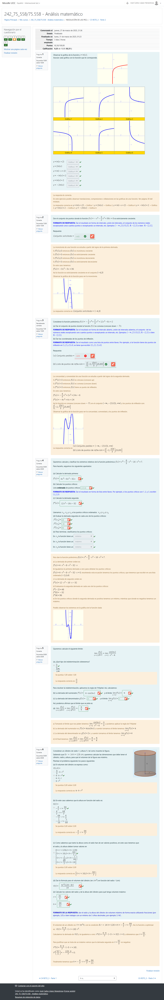
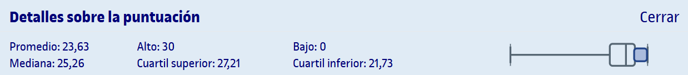

# PEC3 - Derivación: el problema de la tangente

## Capturas de las partes

	
Captura de la parte 1 realizada en Moodle

	
Captura de la parte 2 realizada en Moodle

	
Captura de la parte 3 realizada en Moodle

## Recursos de aprendizaje

>[!NOTE]
>- No se incluyen los archivos `pdf` en el repositorio para evitar posibles problemas de copyright.

- [**Derivación: el problema de la tangente**](http://cvapp.uoc.edu/autors/MostraPDFMaterialAction.do?id=284285&hash=d2b9fd2f3d54657bf691c6a73166ab55ecfb532d60ae21aa3b6d3b4a40df505f) ([resumen](pec3/recursos/README.md))

---

## Resultado

### Calificación

**Parte 1**:
- **Calificación**: 10,00 / 10,00
- **Letra (escala internacional)**: A

**Parte 2**:
- **Calificación**: 9,25 / 10,00
- **Letra (escala internacional)**: A

**Parte 3**:
- **Calificación**: 9,20 / 10,00
- **Letra (escala internacional)**: A

**Calificación total**:
- **Calificación original** (suma de la calificación sobre 10 de las partes 1, 2 y 3): 28,45 / 30,00
- **Calificación sobre 10**: 9,49 / 10,00
- **Letra (escala internacional)**: A

### Detalles sobre la puntuación

