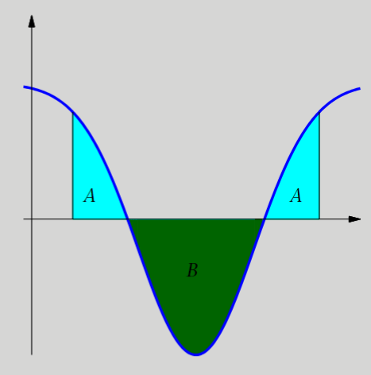

# RESUMEN Integración: el problema del área

## Índice

>[!NOTE]
>Los siguientes subapartados han sido omitidos por tener contenido redundante o superfluo:
>- [2.1.1. Idea intuitiva](#211-idea-intuitiva)
>- [2.1.2. Idea para aproximar el área](#212-idea-para-aproximar-el-área)
>- [2.1.3. Definición formal](#213-definición-formal)

- [1. Cálculos de primitivas](#1-cálculos-de-primitivas)
	- [1.1. Introducción](#11-introducción)
	- [1.2. Primitiva de una función](#12-primitiva-de-una-función)
	- [1.3. Integral indefinida de una función](#13-integral-indefinida-de-una-función)
	- [1.4. Cálculo de primitivas](#14-cálculo-de-primitivas)
		- [1.4.1. Primitivas inmediatas](#141-primitivas-inmediatas)
		- [1.4.2. Primitivas casi inmediatas](#142-primitivas-casi-inmediatas)
		- [1.4.3. Método de integración por partes](#143-método-de-integración-por-partes)
		- [1.4.4. Método de cambio de variable](#144-método-de-cambio-de-variable)
		- [1.4.5. Primitivas de funciones racionales](#145-primitivas-de-funciones-racionales)
- [2. Integral de Riemann y teorema fundamental del cálculo](#2-integral-de-riemann-y-teorema-fundamental-del-cálculo)
	- [2.1. Integral de Riemann](#21-integral-de-riemann)
	- [2.2. Teorema fundamental del cálculo](#22-teorema-fundamental-del-cálculo)
	- [2.3. Propiedades de la integral de Riemann](#23-propiedades-de-la-integral-de-riemann)
	- [2.4. Aplicaciones de la integral de Riemann: cálculo de áreas](#24-aplicaciones-de-la-integral-de-riemann-cálculo-de-áreas)
		- [2.4.1. Área delimitada por una función y el eje de abscisas](#241-área-delimitada-por-una-función-y-el-eje-de-abscisas)
		- [2.4.2. Área delimitada por dos funciones cualesquiera](#242-área-delimitada-por-dos-funciones-cualesquiera)
- [3. Integración impropia](#3-integración-impropia)
	- [3.1. Una primera aproximación a la integración impropia](#31-una-primera-aproximación-a-la-integración-impropia)
	- [3.2. Integrales impropias de primera especie](#32-integrales-impropias-de-primera-especie)
	- [3.3. Integrales impropias de segunda especie](#33-integrales-impropias-de-segunda-especie)
	- [3.4. Integrales impropias de tercera especie](#34-integrales-impropias-de-tercera-especie)

 

## 1. Cálculos de primitivas

### 1.1. Introducción

El **cálculo de primitivas** es la operación inversa a la derivación.

### 1.2. Primitiva de una función

La **primitiva** (también llamada **antiderivada** o **integral indefinida**) de una función $f(x)$ es otra función $F(x)$ tal que:

$$F'(x) = f(x), \quad \text{para todo } x \in [a,b]$$

**Notación general**:

$$F(x) = \int f(x) \mathrm{d}x$$

Toda función tiene infinitas primitivas que difieren entre sí por una constante. Si $F_1$ y $F_2$ son dos primitivas de la función $f : [a,b] \to \mathbb[R]$, entonces existe una constante $C$ tal que

$$F_1 (x) - F_2 (x) = C \quad \text{para todo } x \in [a,b]$$

### 1.3. Integral indefinida de una función

**Notación general**:

$$\int f(x) \mathrm{d}x = F(x) + C$$

A pesar de que tiene la misma notación de una primitiva, se distinguen en función de si el resultado es una única función o un conjunto de funciones.

**Primitiva de $\cos (x)$**:

$$\int \cos(x) \mathrm{d}x = \sin(x) + 2$$

**Integral indefinida de la función $\cos (x)$**:

$$\int \cos(x) \mathrm{d}x = \sin(x) + C, C \in \mathrm{R}$$

Donde $C$ es una **constante de integración**.

 

La integral indefinida tiene la propiedad de **linealidad**, que se hereda de la propiedad de linealidad de la derivación:

- $\int (f(x) + g(x)) \mathrm{d}x = \int f(x) \mathrm{d}x + \int g(x) \mathrm{d}x$
- $\int k f(x) \mathrm{d}x = k \int f(x) \mathrm{d}x, k \in \mathbb{R}$

### 1.4. Cálculo de primitivas

#### 1.4.1. Primitivas inmediatas

<table>
	<thead>
		<tr align="center">
			<td colspan="3">
				<strong>INTEGRALES INMEDIATAS</strong>
			</td>
		</tr>
		<tr align="center">
			<td><strong>$f(x)$</strong></td>
			<td><strong>$\int \! f(x) \mathrm{d}x$</strong></td>
			<td><strong>EJEMPLOS</strong></td>
		</tr>
	</thead>
	<tbody>
		<tr>
			<td>$k$ constante</td>
			<td>$k \cdot x + C$</td>
			<td>$\int \! 7 \mathrm{d}x = 7x + C$</td>
		</tr>
		<tr>
			<td>$x^n$ si $n \neq -1$</td>
			<td>$\frac{x^{n + 1}}{n + 1} + C$</td>
			<td>
				
$\int \! x^5 \mathrm{d}x = \frac{x^6}{6} + C$

				
$\int \! 3x^{-\frac{2}{3}} \mathrm{d}x = 3 \cdot \frac{x^{\frac{1}{3}}}{\frac{1}{3}} + C = 9x^{\frac{1}{3}} + C$

				
$\int \! \left( 5x \cdot \sqrt{x} \right) \mathrm{d}x = \int \! \left( 5x \cdot x^{\frac{1}{2}} \right) \mathrm{d}x = \frac{10}{3}x^\frac{3}{2} + C$

			</td>
		</tr>
		<tr>
			<td>$\frac{1}{x}$</td>
			<td>$\ln (x) + C$</td>
			<td>$\int \! \frac{5}{x} \mathrm{d}x = 5\ln (x) + C$</td>
		</tr>
		<tr>
			<td>$a^{kx}$</td>
			<td>$\frac{a^{kx}}{k \ln (a)} + C$</td>
			<td>
				
$\int \! 2^{2x} \mathrm{d}x = \frac{2^{2x}}{2 \ln(2)} + C$

				
$\int \! e^{3x} \mathrm{d}x = \frac{e^{3x}}{3} + C$

			</td>
		</tr>
		<tr>
			<td>$\cos(kx)$</td>
			<td>$\frac{1}{k} \sin(kx) + C$</td>
			<td>$\int \! 5\cos(2x) \mathrm{d}x = \frac{5}{2}\sin(2x) + C$</td>
		</tr>
		<tr>
			<td>$\sin(kx)$</td>
			<td>$\frac{1}{k} \cdot (-\cos(x)) + C$</td>
			<td>$\int \! -3\sin(4x) \mathrm{d}x = \frac{3}{4}\cos(4x) + C$</td>
		</tr>
		<tr>
			<td>$\frac{1}{\sqrt{1 - x^2}}$</td>
			<td>$\arcsin (x) + C$</td>
			<td>$\int \! \frac{1}{\sqrt{1 - (2x)^2}} \mathrm{d}x = \frac{1}{2}\arcsin(2x) + C$</td>
		</tr>
		<tr>
			<td>$\frac{-1}{\sqrt{1 - x^2}}$</td>
			<td>$\arccos (x) + C$</td>
			<td>$\int \! \frac{-3}{\sqrt{1 - (3x)^2}} \mathrm{d}x = -\arccos(3x) + C$</td>
		</tr>
		<tr>
			<td>$\frac{1}{1 + x^2}$</td>
			<td>$\arctan (x) + C$</td>
			<td>$\int \! \frac{2}{1 + \left( \frac{x}{2} \right)^2} \mathrm{d}x = 2\arctan \left( \frac{x}{2} \right) + C$</td>
		</tr>
	</tbody>
</table>

#### 1.4.2. Primitivas casi inmediatas

	$$\text{Si } g(x) = \int \! f(x) \mathrm{d}x \implies g'(x) = f(x)$$

**Suma y resta**

	$$\int \! \left[ f(x) \pm g(x) \right] \mathrm{d}x = \int \! f(x) \mathrm{d}x \pm \int \! g(x) \mathrm{d}x$$

**Producto**

	$$\int \! k \cdot f(x) \mathrm{d}x = k \cdot \int \! f(x) \mathrm{d}x$$

**Regla de la cadena**

	$$\int \! f(g(x)) \cdot g'(x) \mathrm{d}x = f(g(x)) + C$$

A partir de esta regla, podemos elaborar esta tabla:

<table>
	<thead>
		<tr align="center">
			<td colspan="3">
				<strong>INTEGRALES CASI INMEDIATAS</strong>
			</td>
		</tr>
		<tr align="center">
			<td><strong>INTEGRAL</strong></td>
			<td><strong>EJEMPLOS</strong></td>
		</tr>
	</thead>
	<tbody>
		<tr>
			<td>$\int \! \left[ f(x) \right ]^n \cdot f'(x) \mathrm{d}x = \frac{\left[ f(x) \right]^{n + 1}}{n + 1} + C$ si $n \neq 1$</td>
			<td>$\int \! \left[ \sin(x) \right ]^4 \cdot \cos(x) \mathrm{d}x = \frac{\left[ \sin(x) \right]^{5}}{5} + C$</td>
		</tr>
		<tr>
			<td>$\int \! \frac{f'(x)}{f(x)} \mathrm{d}x = \ln |f(x)| + C$</td>
			<td>$\int \! \frac{2x - 3}{x^2 - 3x + 13} \mathrm{d}x = \ln \left\lvert x^2 - 3x + 12 \right\rvert + C$</td>
		</tr>
		<tr>
			<td>$\int \! e^{f(x)} \cdot f'(x) \mathrm{d}x = e^{f(x)} + C$</td>
			<td>$\int \! e^{4x^2 + 3x - 2} \cdot (8x + 3) \mathrm{d}x = e^{4x^2 + 3x - 2} + C$</td>
		</tr>
		<tr>
			<td>$\int \! a^{f(x)} \cdot f'(x) \mathrm{d}x = \frac{a^{f(x)}}{\ln (a)} + C$</td>
			<td>$\int \! 5^{4x^2 + 3x - 2} \cdot (8x + 3) \mathrm{d}x = \frac{5^{4x^2 + 3x - 2}}{\ln (5)} + C$</td>
		</tr>
		<tr>
			<td>$\int \! f'(x)^{f(x)} \cdot \sin (f(x)) \mathrm{d}x = -\cos (f(x)) + C$</td>
			<td>$\int \! \cos (x) \cdot \sin (\sin(x)) \mathrm{d}x = -\cos (\sin (x)) + C$</td>
		</tr>
		<tr>
			<td>$\int \! f'(x)^{f(x)} \cdot \cos (f(x)) \mathrm{d}x = \sin (f(x)) + C$</td>
			<td>$\int \! 6 \cdot \cos (6x - 2) \mathrm{d}x = \sin (6x - 2) + C$</td>
		</tr>
		<tr>
			<td>$\int \! \frac{f'(x)}{1 + (f(x))^2} \mathrm{d}x = \arctan (f(x)) + C$</td>
			<td>$\int \! \frac{\frac{1}{x}}{1 + (\ln (x))^2} \mathrm{d}x = \arctan (\ln (x)) + C$</td>
		</tr>
		<tr>
			<td>$\int \! \frac{f'(x)}{\sqrt{1 - (f(x))^2}} \mathrm{d}x = \arcsin (f(x)) + C$</td>
			<td>$\int \! \frac{e^x}{\sqrt{1 - (e^x)^2}} \mathrm{d}x = \arcsin (e^x) + C$</td>
		</tr>
	</tbody>
</table>

#### 1.4.3. Método de integración por partes

Método para transformar una integral en una integral inmediata o casi inmediata mediante un cambio de variable. Los pasos a seguir son:

1. **Sustituimos $x$ por $u(t)$ y $\mathrm{d}x$ por $u'(t) \mathrm{d}t$**:

	$$\int \! f(x) \mathrm{d}x \overset{\mathrm{d}x = u'(t) \mathrm{d}t}{\underset{x = u(t)}{\longrightarrow}} \int \! f(u(t)) \cdot u'(t) \mathrm{d}t$$

2. **Resolvemos la nueva integral**:

	$$\int \! f(u(t)) \cdot u'(t) \mathrm{d}t = G(t) + C$$

3. **Aislamos la variable $t$ de la igualdad $x = u(t)$ y obtenemos $t = u^{-1}(x)$.**

4. **Deshacemos el cambio y obtenemos**:

	$$\int \! f(x) \mathrm{d}t = G(u^{-1}(x)) + C$$

#### 1.4.4. Método de cambio de variable

	$$\int \! u \mathrm{d}v = u \cdot v - \int \! v \mathrm{d}u$$

Ejemplo:

	$$\int \! xe^x \mathrm{d}x$$

1. **Escoger $u$ y $dv$**:

	- $u = x$ porque su derivada $\mathrm{d}u$ es más sencilla ($\mathrm{d}u = \mathrm{d}x$)
	- 
$\mathrm{d}v = e^x \mathrm{d}x$ porque su integral es simple ($v = e^x$).

2. **Calcular $\mathrm{d}u$ y $v$**:

	- $u = x$, entonces $\mathrm{d}u = \mathrm{d}x$.
	- 
$\mathrm{d}v = e^x \mathrm{d}x$, entonces $v = e^x$.

3. **Sustituir en la fórmula**:

	

		$\int xe^x \mathrm{d}x = x \cdot e^x - \int e^x \mathrm{d}x$
	

4. **Resolver la nueva integral**:

	

		$\int xe^x \mathrm{d}x = x \cdot e^x - e^x + C$
	

	Factorizamos $e^x$:

	

		$\int xe^x \mathrm{d}x = e^x (x - 1) + C$
	

#### 1.4.5. Primitivas de funciones racionales

Una **función racional** es el cociente de dos polinomios:

$$f(x) = \frac{P(x)}{Q(x)}$$

Para calcular su **integral indefinida**:

$$\int \frac{P(x)}{Q(x)} \mathrm{d}x$$

se siguen estos pasos:

1. **División de polinomios**

	Si el grado del numerador $\deg(P(x)) \geq \deg(Q(x))$, primero dividimos.

	**Ejemplo**:

	$$\int \frac{x^2 + 1}{x + 1} \mathrm{d}x$$

	Hacemos la división de polinomios y luego integramos el resultado.

2. **Descomposición en fracciones simples**

	Si $\deg(P(x)) < \deg(Q(x))$, descomponemos la función racional.

	- **Caso 1**: Raíces lineales

		**Ejemplo**:

		$$\int \frac{3x + 5}{(x + 1)(x - 2)} \mathrm{d}x$$

		Descomponemos:

		$$\frac{3x + 5}{(x + 1)(x - 2)} = \frac{A}{x + 1} + \frac{B}{x - 2}$$

		Integramos:

		$$\int \left( \frac{A}{x + 1} + \frac{B}{x - 2} \right) \mathrm{d}x = A \ln|x + 1| + B \ln|x - 2| + C$$

	- **Caso 2**: Factores cuadráticos

		**Ejemplo**:

		$$\int \frac{x^2 + 1}{(x^2 + 4)(x - 1)} \mathrm{d}x$$

		Descomposición:

		$$\frac{x^2 + 1}{(x^2 + 4)(x - 1)} = \frac{A}{x - 1} + \frac{Bx + C}{x^2 + 4}$$

3. **Cambiamos de variable** (si es necesario)

	**Ejemplo**:

	$$\int \frac{x}{x^2 + 1} \mathrm{d}x \quad \text{usamos } u = x^2 + 1$$

 

**Ejemplo**:

$$\int \frac{2x + 3}{x^2 + 3x + 2} \mathrm{d}x$$

Factorizamos:

$$x^2 + 3x + 2 = (x + 1)(x + 2)$$

Descomponemos:

$$\frac{2x + 3}{(x + 1)(x + 2)} = \frac{A}{x + 1} + \frac{B}{x + 2}$$

Resolvemos $A$ y $B$, luego:

$$\int \frac{2x + 3}{x^2 + 3x + 2} \mathrm{d}x = A \ln|x + 1| + B \ln|x + 2| + C$$

## 2. Integral de Riemann y teorema fundamental del cálculo

### 2.1. Integral de Riemann

Define rigurosamente el **área bajo una curva** en un intervalo cerrado $[a,b]$.

- Si $f : [a,b] \to \mathrm{R}$ es una función **positiva**, acotada e integrable en el sentido de Riemann, entonces 

	$$\int_a^b f(x) \mathrm{d}x = A$$

	donde $A$ es el área limitada por la gráfica de $f$, el eje de abscisas y las rectas verticales de ecuaciones $x = a$ y $x = b$.

- Si $f : [a,b] \to \mathrm{R}$ es una función **negativa**, acotada e integrable en el sentido de Riemann, entonces 

	$$\int_a^b f(x) \mathrm{d}x = -A$$

	donde $A$ es el área limitada por la gráfica de $f$, el eje de abscisas y las rectas verticales de ecuaciones $x = a$ y $x = b$.

- Si $f : [a,b] \to \mathrm{R}$ es una función acotada e integrable en el sentido de Riemann, entonces 

	$$\int_a^b f(x) \mathrm{d}x = A - B$$

	donde $A$ es la suma de las áreas limitadas por la función $f$ en los trozos donde es **positiva** y $B$ es la suma de las áreas limitadas por la función $f$ en los trozos donde es **negativa**.

	

### 2.2. Teorema fundamental del cálculo

Se divide en dos partes:

#### Primera parte

Si $f$ es una función continua en $[a,b]$ y definimos:

$$F(x) = \int_a^x f(t) \mathrm{d}t$$

entonces $F$ es derivable y:

$$F'(x) = f(x)$$

Lo que significa que la derivada de la acumulación de área bajo la curva $f(t)$ es simplemente $f(x)$.

**Ejemplo**:

Sea $f(t) = \cos(t)$, definimos:

$$F(x) = \int_0^x \cos(t) \mathrm{d}t$$

Queremos encontrar $F'(x)$.

Sabemos que:

$$\int_0^x \cos (t) \mathrm{d}t = \sin(x) - \sin(0) = \sin(x)$$

Así que:

$$F(x) = \sin(x)$$

Derivamos $F(x)$:

$$F'(x) = \frac{\mathrm{d}}{\mathrm{d}x} \sin(x) = \cos(x) = f(x)$$

Hemos comprobado que:

$$F(x) = \int_0^x f(t) \mathrm{d}t \quad \to \quad F'(x) = f(x)$$

En este caso:
- $f(t) = \cos(t)$
- $F(x) = \int_0^x \cos(t) \mathrm{d}t = \sin(x)$
- $F'(x) = \cos(x)$

La derivada de la función "área acumulada" es la función original.

#### Segunda parte

Si $f$ es una función continua en $[a,b]$ y $F(x)$ es una primitiva de $f$, entonces

$$\int_a^b f(x) \mathrm{d}x = F(b) - F(a)$$

La notación usual para la diferencia $F(b) - F(a)$ es:

$$F(x) |_a^b \quad o [F(x)]_a^b$$

**Ejemplo**:

$$\int_1^3 x^2 \mathrm{d}x = \left [ \frac{x^3}{3} \right ]_1^3 = \frac{27}{3} - \frac{1}{3} = \frac{26}{3}$$

### 2.3. Propiedades de la integral de Riemann

Dadas dos funciones $f : [a,b] \to \mathbb{R}$ y $g : [a,b] \to \mathbb[R]$ integrables en el sentido de Riemann en $[a,b]$, se verifican las siguientes propiedades:

a. $\int_a^b f(x) \mathrm{d}x = - \int_b^a f(x) \mathrm{d}x$
b. $\int_a^a f(x) \mathrm{d}x = 0$
c. $\int_a^b (f(x) + g(x)) \mathrm{d}x = \int_b^a f(x) \mathrm{d}x + \int_a^b g(x) \mathrm{d}x$
d. $\int_a^b kf(x) \mathrm{d}x = k \int_b^a f(x) \mathrm{d}x, \forall k \in \mathbb{R}$
e. $\int_a^c f(x) \mathrm{d}x + \int_c^b f(x) \mathrm{d}x = \int_a^b f(x) \mathrm{d}x, \forall c \in [a,b]$

### 2.4. Aplicaciones de la integral de Riemann: cálculo de áreas

#### 2.4.1. Área delimitada por una función y el eje de abscisas

El área delimitada por una función, el eje de abscisas y las rectas $x = a$ y $x = b$ viene dada por:

$$A = \int_a^b |f(x)| \mathrm{d}x$$

Para calcular el valor absoluto, necesitamos saber cuándo $f(x)$ es **positiva** y **negativa**. Por lo tanto, es necesario:

1. Calcular los puntos de intersección de la función $f(x)$ con el eje de abscisas en el intervalo $[a,b]$.
2. Determinar los subintervalos donde $f(x) \ge 0$ y los subintervalos donde $f(x) \le 0$.
3. El área es la suma de las integrales de $f$, donde $f$ es positiva, y las integrales, donde $f$ es negativa, cambiadas de signo.

 

**Ejemplo**:

>Calcular el área entre la curva $f(x) = x^2 - 4$ y el eje $x$ en el intervalo $[-3,3]$:

1. **Analizar la función**
	La función $f(x)$ es una parábola con vértice en $x = 0$ y corta al eje $x$ donde:

	$$x^2 - 4 = 0 \to x = \pm 2$$

	Entonces:
	- En $[-3,-2]$ y $[2,3]$, $f(x) > 0$
	- En $[-2,2]$, $f(x) < 0$

2. **Calcular el área total (con valor absoluto)**
	Como hay regiones donde la función es negativa, dividimos el cálculo por intervalos:

	$A = \int_{-3}^{-2} (x^2 - 4) \mathrm{d}x + \int_{-2}{2} |x^2 - 4| \mathrm{d}x + \int_2^3 (x^2 - 4) \mathrm{d}x$

	Sabemos que $|x^2 - 4| = 4 - x^2$ cuando $x^2 - 4 < 0$, o sea, en $[-2,2]$. Entonces:

	$A = \int_{-3}^{-2} (x^2 -4) \mathrm{d}x + \int_{-2}{2} (4 - x^2) \mathrm{d}x + \int_2^3 (x^2 - 4) \mathrm{d}x$
	
3. **Calcular las integrales**
	1. $\int_{-3}^{-2} (x^2 - 4) \mathrm{d}x = \left[ \frac{x^3}{3} - 4x \right]_{-3}^{-2} = \left( \frac{-8}{3} + 8 \right) - \left( \frac{-27}{3} + 12 \right) = \frac{16}{3} - 3 = \frac{7}{3}$

	2. $\int_{-2}^{2} (4 - x^2) \mathrm{d}x$

		Como la función es par:

		$2 \cdot \int_0^2 (4 - x^2) \mathrm{d}x = 2 \cdot \left[ 4x - \frac{x^3}{3} \right]_0^2 = 2 \cdot \left( 8 - \frac{8}{3} \right) = 2 \cdot \frac{16}{3} = \frac{32}{3}$

	3. $\int_{2}^{3} (x^2 - 4) \mathrm{d}x = \left[ \frac{x^3}{3} - 4x \right]_2^3 = \left( 9 - 12 \right) - \left( \frac{8}{3} - 8 \right) = -3 + \frac{16}{3} = \frac{7}{3}$

4. **Sumar las áreas**
	$$A = \frac{7}{3} + \frac{32}{3} + \frac{7}{3} = \frac{46}{3}$$

**Resultado final**

El área entre la curva $f(x) = x^2 - 4$ y el eje $x$ en $[-3,3]$ es:

$$\frac{46}{3}$$

#### 2.4.2. Área delimitada por dos funciones cualesquiera

Sean dos funciones continuas $f(x)$ y $g(x)$, con $f(x) \ge g(x)$ en un intervalo cerrado $[a,b]$. El área entre las dos curvas es:

$$A = \int_a^b (f(x) - g(x)) \mathrm{d}x$$

 

**Ejemplo**:

Calcular el área comprendida entre las curvas:

- $f(x) = x^2$
- $g(x) = x + 2$

en el intervalo donde se **intersectan**.

1. **Encontrar los puntos de intersección**

	Igualamos las funciones:

	$$x^2 = x + 2 \Rightarrow x^2 - x - 2 = 0 \Rightarrow (x - 2)(x + 1) = 0 \Rightarrow x = -1 \text{ y } x = 2$$

2. **Determinar qué función está por encima**

Evaluamos en un punto del intervalo, por ejemplo en $x = 0$:

- $f(0) = 0$
- $g(0) = 2$

Entonces, $g(x) = x + 2$ está por encima de $f(x) = x^2$ en $[-1, 2]$.

3. **Calcular el área**

La fórmula para el área entre dos curvas es:

$$A = \int_a^b \left( g(x) - f(x) \right) \mathrm{d}x$$

En nuestro caso:

$$A = \int_{-1}^{2} \left( x + 2 - x^2 \right) \mathrm{d}x = \int_{-1}^{2} \left( -x^2 + x + 2 \right) \mathrm{d}x$$

Resolvemos la integral:

$$\int_{-1}^{2} (-x^2 + x + 2) \mathrm{d}x = \left[ -\frac{x^3}{3} + \frac{x^2}{2} + 2x \right]_{-1}^{2}$$

Evaluamos:

1. En $x = 2$:

	$-\frac{8}{3} + 2 + 4 = -\frac{8}{3} + 6 = \frac{10}{3}$

2. En $ x = -1 $:

$\left( -\frac{-1}{3} + \frac{1}{2} - 2 \right) = \frac{1}{3} + \frac{1}{2} - 2 = -\frac{7}{6}$

Área total:

$$A = \frac{10}{3} - (-\frac{7}{6}) = \frac{10}{3} + \frac{7}{6} = \frac{27}{6} = \boxed{\frac{9}{2}}$$

## 3. Integración impropia

### 3.1. Una primera aproximación a la integración impropia

Cálculo de integrales definidas para funciones que, o bien no serán acotadas, o bien no lo será el intervalo de integración, o ambas.

### 3.2. Integrales impropias de primera especie

Las **integrales impropias de primera especie** están definidas en un intervalo infinito; es decir, cuando el límite de integración se extiende hasta el infinito o menos infinito.

Sea $f(x)$ una función continua en $[a, +\infty)$. La integral impropia de primera especie se define como:

$$\int_a^{+\infty} f(x) \mathrm{d}x = \lim_{t \to +\infty} \int_a^t f(x) \mathrm{d}x$$

Si este límite existe y es finito, se dice que la integral **converge**. En caso contrario, se dice que **diverge**.

De forma similar, para el intervalo $(-\infty, b]$:

$$\int_{-\infty}^b f(x) \mathrm{d}x = \lim_{t \to -\infty} \int_t^b f(x) \mathrm{d}x$$

 

**Ejemplo**:

>Calcular $$\int_1^{+\infty} \frac{1}{x^2} \mathrm{d}x$$

Primero, definimos el límite:

$$\int_1^{+\infty} \frac{1}{x^2} \mathrm{d}x = \lim_{t \to +\infty} \int_1^t \frac{1}{x^2} \mathrm{d}x$$

Calculamos la integral indefinida:

$$\int \frac{1}{x^2} \mathrm{d}x = \int x^{-2} \mathrm{d}x = -\frac{1}{x} + C$$

Evaluamos la integral definida:

$$\int_1^t \frac{1}{x^2} \mathrm{d}x = \left[-\frac{1}{x}\right]_1^t = -\frac{1}{t} + 1$$

Finalmente, calculamos el límite:

$$\lim_{t \to +\infty} \left( 1 - \frac{1}{t} \right) = 1$$

Como resultado, tenemos que la integral impropia converge y su valor es:

$$\int_1^{+\infty} \frac{1}{x^2} \mathrm{d}x = 1$$

### 3.3. Integrales impropias de segunda especie

Las **integrales impropias de segunda especie** ocurren cuando la función que queremos integrar presenta una **discontinuidad en el intervalo de integración**; es decir, la función no está definida o tiende a infinito en algún punto dentro del intervalo.

Supongamos que $f(x)$ es continua en $[a, b)$, pero tiene una discontinuidad infinita en el extremo $b$ (por ejemplo, $f(x) \to \infty$ cuando $x \to b^- $).

Entonces la integral impropia se define como:

$$\int_a^b f(x) \mathrm{d}x = \lim_{t \to b^-} \int_a^t f(x) \mathrm{d}x$$

Si el límite existe y es finito, la integral **converge**, de lo contrario, **diverge**.

Si la discontinuidad está en un punto interior $ c \in (a, b) $, se debe dividir la integral en dos partes:

$$\int_a^b f(x) \mathrm{d}x = \int_a^c f(x) \mathrm{d}x + \int_c^b f(x) \mathrm{d}x$$

y evaluar cada una como integral impropia (con límites apropiados).

 

**Ejemplo 1: Discontinuidad en el extremo**

>Calcular $\int_0^1 \frac{1}{\sqrt{x}} \mathrm{d}x$$

La función $ f(x) = \frac{1}{\sqrt{x}} $ tiende a infinito cuando $ x \to 0^+ $. Entonces:

$$\int_0^1 \frac{1}{\sqrt{x}} \mathrm{d}x = \lim_{t \to 0^+} \int_t^1 \frac{1}{\sqrt{x}} \mathrm{d}x$$

Calculamos la integral indefinida:

$$\int \frac{1}{\sqrt{x}} \mathrm{d}x = \int x^{-\frac{1}{2}} \mathrm{d}x = 2 \sqrt{x} + C$$

Evaluamos el integral definido:

$$\int_t^1 \frac{1}{\sqrt{x}} \mathrm{d}x = \left[ 2 \sqrt{x} \right]_t^1 = 2 - 2\sqrt{t}$$

Finalmente, calculamos el límite:

$$\lim_{t \to 0^+} (2 - 2\sqrt{t}) = 2$$

Por lo tanto, la integral impropia converge y su valor es:

$$\int_0^1 \frac{1}{\sqrt{x}} \mathrm{d}x = 2$$

 

**Ejemplo 2: Discontinuidad en un punto interior**

>Calcular $\int_{-1}^1 \frac{1}{x} \mathrm{d}x$$

La función $f(x) = \frac{1}{x}$ tiene una discontinuidad en $ x = 0 $, punto interior del intervalo. Dividimos la integral:

$$\int_{-1}^1 \frac{1}{x} \mathrm{d}x = \int_{-1}^0 \frac{1}{x} \mathrm{d}x + \int_0^1 \frac{1}{x} \mathrm{d}x$$

Evaluamos cada integral impropia:

$$\int_{-1}^0 \frac{1}{x} \mathrm{d}x = \lim_{t \to 0^-} \int_{-1}^t \frac{1}{x} \mathrm{d}x = \lim_{t \to 0^-} [\ln|x|]_{-1}^t = \lim_{t \to 0^-} \ln|t| - \ln 1 = -\infty$$

$$\int_0^1 \frac{1}{x} \mathrm{d}x = \lim_{t \to 0^+} \int_t^1 \frac{1}{x} \mathrm{d}x = \lim_{t \to 0^+} [\ln|x|]_t^1 = \lim_{t \to 0^+} (0 - \ln t) = +\infty$$

Ambas integrales divergen, por lo que:

$$\int_{-1}^1 \frac{1}{x} \mathrm{d}x$$

**no converge**.

### 3.4. Integrales impropias de tercera especie

Las **integrales impropias de tercera especie** son aquellas que combinan características de las integrales impropias de primera y segunda especie, es decir:

- El intervalo de integración es infinito (como en la primera especie), y 
- La función presenta una discontinuidad en algún punto dentro del intervalo (como en la segunda especie).

Es recomendable analizar cada intervalo por separado para determinar la convergencia.

Sea $f(x)$ una función que tiene una discontinuidad en un punto $c$ y el intervalo de integración es infinito. Por ejemplo, para

$$\int_a^{+\infty} f(x) \mathrm{d}x$$

donde $f(x)$ tiene una discontinuidad en $c \in [a, +\infty)$, la integral se evalúa dividiéndola en dos partes y usando límites para manejar tanto la discontinuidad como el infinito:

$$\int_a^{+\infty} f(x) \mathrm{d}x = \int_a^{c} f(x) \mathrm{d}x + \int_c^{+\infty} f(x) \mathrm{d}x$$

donde

$$\int_a^{c} f(x) \mathrm{d}x = \lim_{t \to c^-} \int_a^t f(x) \mathrm{d}x \quad \text{y} \quad \int_c^{+\infty} f(x) \mathrm{d}x = \lim_{s \to +\infty} \int_c^s f(x) \mathrm{d}x$$

Si ambos límites existen y son finitos, la integral impropia de tercera especie **converge**; si no, **diverge**.

 

**Ejemplo**

>Calcular $\int_0^{+\infty} \frac{1}{x \sqrt{x+1}} \mathrm{d}x$

Aquí, la función presenta una discontinuidad en $ x = 0 $ (ya que el denominador se vuelve cero) y el límite superior es infinito.

Dividimos la integral:

$$\int_0^{+\infty} \frac{1}{x \sqrt{x+1}} \mathrm{d}x = \int_0^{1} \frac{1}{x \sqrt{x+1}} \mathrm{d}x + \int_1^{+\infty} \frac{1}{x \sqrt{x+1}} \mathrm{d}x$$

Evaluamos cada parte como integral impropia:

1. Para $\int_0^{1} \frac{1}{x \sqrt{x+1}} \mathrm{d}x$:

	$\lim_{t \to 0^+} \int_t^{1} \frac{1}{x \sqrt{x+1}} \mathrm{d}x$

2. Para $\int_1^{+\infty} \frac{1}{x \sqrt{x+1}} \mathrm{d}x$:

	$\lim_{s \to +\infty} \int_1^{s} \frac{1}{x \sqrt{x+1}} \mathrm{d}x$

El cálculo de estas integrales puede requerir técnicas específicas (como sustituciones), y la convergencia depende del comportamiento de la función cerca de $0$ y en el infinito.
