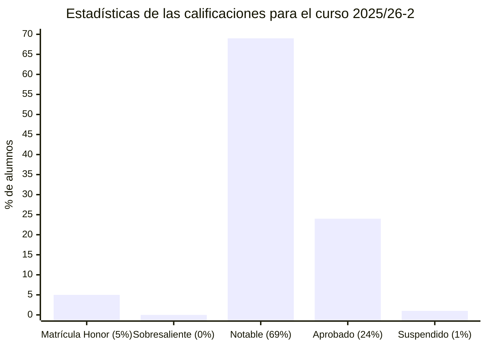
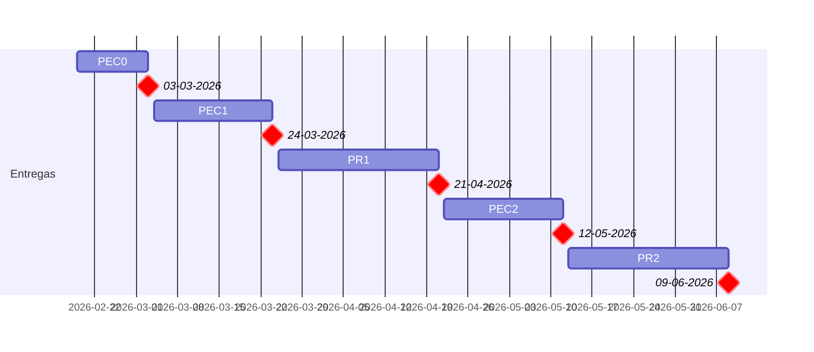

# Análisis y diseño con patrones (25/26-2)

- [Información sobre la asignatura](#información-sobre-la-asignatura)
- [Calendario de entregas](#calendario-de-entregas)
- [Resumen de calificaciones](#resumen-de-calificaciones)
- [Recursos de aprendizaje](#recursos-de-aprendizaje)
	- [PEC0](#pec0)
	- [PEC1](#pec1)
	- [PR1](#pr1)
	- [PEC2](#pec2)
	- [PR2](#pr2)

## Información sobre la asignatura

- **Código**: 75.586
- **Curso**: 2025/26 (2º semestre)
- **Tipo**: Obligatoria (itinerario ingeniería del software) / Optativa (en caso de cursar otro itinerario)
- **Método de evaluación**: Evaluación continua (100%: PEC 50% + PR 50%)
- **Créditos**: 6
- [**Plan docente**](https://apps.uoc.edu/PlaDocent/PlaDocent?Semestre=20252&SignatureCode=75.586&Context=3&Locale=es)

>

>	
Leyenda de calificaciones

>
>	- **Matrícula de Honor (M)**: 9 a 10
>	- **Sobresaliente (EX)**: 9 a 10
>	- **Notable (NO)**: 7 a 8,99
>	- **Aprobado (A)**: 5 a 6,99
>	- **Suspendido (SU)**: 0 a 4,99
>

## Calendario de entregas

## Archivo de exámenes

- [Compilación de 24 exámenes desde 2014 hasta 2021](examenes). A la presente, esta asignatura ya no se evalúa con exámenes.

## Resumen de calificaciones

>[!NOTE]
>- La calificación final es la que aparece en mi expediente. No tiene por qué ser, necesariamente, el resultado de la suma de las calificaciones ponderadas de los bloques.

<table>
	<tr>
		<th>BLOQUE</th>
		<th>DESGLOSE</th>
		<th>ACTIVIDAD</th>
		<th>CALIFICACIÓN</th>
		<th>CALIFICACIÓN PONDERADA</th>
	</tr>
	<tr>
		<td rowspan="5">
			<strong>Evaluación continua (EC)</strong> (100%)
		</td>
		<td rowspan="3">
			<strong>
				Pruebas de evaluación continua (PEC)
			</strong>
			(50%)
		</td>
		<td>
			<a href="pec0">
				PEC0 - Modelado con UML
			</a> (10%)
		</td>
		<td>
			7,50 / 10,00 (B)
		</td>
		<td rowspan="5">
			

				<strong>Calificación total PEC</strong>:
				 
				82,88 / 100,00
			

			 
			

				<strong>Calificación ponderada PEC</strong>:
				 
				4,14 / 5,00
			

			 
			 
			

				<strong>Calificación total PR</strong>:
				 
				85,50 / 100,00
			

			 
			

				<strong>Calificación ponderada PR</strong>:
				 
				4,28 / 5,00
			

			 
			 
			

				<strong>Calificación ponderada EC</strong>:
				 
				8,42 / 10,00
			

		</td>
	</tr>
	<tr>
		<td>
			<a href="pec1">
				PEC1 - Principios de diseño y patrones de análisis
			</a> (45%)
		</td>
		<td>
			37,80 / 45,00 (B)
		</td>
	</tr>
	<tr>
		<td>
			<a href="pec2">
				PEC2 - Patrones de diseño y asignación de responsabilidades
			</a> (45%)
		</td>
		<td>
			37,58 / 45,00 (B)
		</td>
	</tr>
	<tr>
		<td rowspan="2">
			<strong>Práctica (PR)</strong> 
			(50%)
		</td>	
		<td>
			<a href="pr1">
				PR1 - Principios de diseño, patrones de análisis y arquitectónicos
			</a> (50%)
		</td>
		<td>46,50 / 50,00 (A)</td>
	</tr>
	<tr>
		<td>
			<a href="pr2">
				PR2 - Patrones de diseño y de asignación de responsabilidades
			</a> (50%)
		</td>
		<td>
			39,00 / 50,00 (B)
		</td>
	</tr>
	<tr>
		<td colspan="4">
		</td>
		<td></td>
	</tr>
	<tr>
		<td colspan="4">
			<strong>CALIFICACIÓN FINAL</strong>
		</td>
		<td>8,4 / 10,00 (B)</td>
	</tr>
</table>

## Recursos de aprendizaje

>[!NOTE]
>- No se incluyen los archivos `pdf` en el repositorio para evitar posibles problemas de copyright.
>- Las actividades están ordenadas por fecha de realización.

### PEC0

- [VisualParadigm - Class Diagram Tutorial](https://www.visual-paradigm.com/guide/uml-unified-modeling-language/uml-class-diagram-tutorial/)
- [VisualParadigm - Sequence Diagram Tutorial](https://www.visual-paradigm.com/guide/uml-unified-modeling-language/what-is-sequence-diagram/)
- [Diagramas de secuencia en español](pec0/recursos/diagramas_secuencia.pdf)
- [Ejercicios iniciales de repaso](recursos/ejercicios_iniciales_repaso.pdf)

### PEC1, PEC2, PR1, PR2

- [Módulo 1. Introducción a los patrones](https://materials.campus.uoc.edu/daisy/Materials/PID_00276107/pdf/PID_00276107.pdf)
- [Módulo 2. Catálogo de patrones](https://materials.campus.uoc.edu/daisy/Materials/PID_00276109/pdf/PID_00276109.pdf)
- [Módulo 3. Caso práctico de aplicación de patrones](https://materials.campus.uoc.edu/daisy/Materials/PID_00276108/pdf/PID_00276108.pdf)
- [Resumen general de la asignatura](recursos/resumen.pdf)