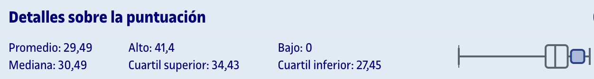

# PEC2 - Patrones de diseño y asignación de responsabilidades

Para realizar esta PEC, hay que resolver los ejercicios que se detallan en el archivo `enunciado.pdf`. El formato de entrega es en `.pdf` ([`entrega_evaluada.pdf`](entrega_evaluada.pdf)) y el directorio `archivos_entrega` contiene los ficheros de Visual Paradigm correspondientes a cada ejercicio junto con su exportación en formato `.png`. 

Se recomienda el uso de [Visual Paradigm](https://www.visual-paradigm.com/) (programa de escritorio) o [diagrams.net](https://app.diagrams.net/) (web) para la elaboración de los diagramas.

## Histórico de PEC

El directorio [`historico`](historico/) contiene una recopilación de 9 PEC corregidas por el equipo docente desde 2015.

## Recursos de aprendizaje

>[!NOTE]
>- No se incluyen los archivos `pdf` en el repositorio para evitar posibles problemas de copyright.

- [Módulo 1. Introducción a los patrones](https://materials.campus.uoc.edu/daisy/Materials/PID_00276107/pdf/PID_00276107.pdf)
- [Módulo 2. Catálogo de patrones](https://materials.campus.uoc.edu/daisy/Materials/PID_00276109/pdf/PID_00276109.pdf)
- [Módulo 3. Caso práctico de aplicación de patrones](https://materials.campus.uoc.edu/daisy/Materials/PID_00276108/pdf/PID_00276108.pdf)
- [Resumen general de la asignatura](recursos/resumen.pdf)

--- 

## Resultado

### Calificación

<table>
	<thead>
		<tr>
			<th>EVALUABLE</th>
			<th>C. ORIGINAL</th>
			<th>C. SOBRE 10</th>
		</tr>
	</thead>
	<tbody>
		<tr>
			<td>Entrega PDF</td>
			<td>37,58 / 45,00</td>
			<td>8,35 / 10,00 (B)</td>
		</tr>
	</tbody>
</table>

### Comentarios de retroalimentación

- **1.1 (4/5)**: Los patrones esperados eran el singleton y el observer
- **1.2 (10/15)** Tu modelo tiene los siguientes problemas
	- `GlobalStateCoordinator` representa el singleton y debe de tener el método `getInstance` y el atributo `instante`, deben de estar subrayados en el modelo.
	- `GlobalStateCoordinator` debe de heredar de la clase `Subject` que debe tener los métodos para gestionar observadores (`get`, `set` y `notify`).
	- te falta interfaz `observer` de la que heredan los nodos.
	- no debe de existir una lista de observadores ya que esto es implícito por la relación.
- **2.1 (5/5)**: Los patrones esperados eran el state y el strategy
- **2.2 (9/15)** Tu modelo tiene los siguientes problemas
	- el patrón state se representa mediante una relación de herencia. No se usan interfaces.
	- el regulador no tiene atributos que representen el modo/estado actual ni el algoritmo actual.
	- para definir los filtros se define una interfaz y unas clases que implementan la interfaz (líneas discontinuas).
- **3.1 (2,5/5)**: El patrón esperado era el adapter
- **3.2 (10/12,5)** Tu modelo se entiende pero tiene los siguientes problemas
	- la clase `DocumentValidator` debe de usar la interfaz `IntegrityChecker` (línea discontinua).
	- la relación entre el adapter y la interzar es de líneas discontinuas.
- **3.3 (15/15)**: El diagrama de secuencia es correcto
- **4.1 (2,5/5)**: El patrón esperado era el template.
- **4.2 (12,5/12,5)**: Tu modelo es correcto.
- **4.3 (13/15)**: El diagrama de secuencia tiene lo siguientes problemas:
	- en los métodos que se aplican sobre si mismo no necesitas un segundo loop para el resultado.

### Detalles sobre la puntuación

