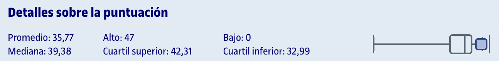

# PR1 - Principios de diseño, patrones de análisis y arquitectónicos

Para realizar esta PEC, hay que resolver los ejercicios que se detallan en el archivo `enunciado.pdf`. El formato de entrega es en `.pdf` ([`entrega_evaluada.pdf`](entrega_evaluada.pdf)) y el directorio `archivos_entrega` contiene los ficheros de Visual Paradigm correspondientes a cada ejercicio junto con su exportación en formato `.png`. 

Se recomienda el uso de [Visual Paradigm](https://www.visual-paradigm.com/) (programa de escritorio) o [diagrams.net](https://app.diagrams.net/) (web) para la elaboración de los diagramas.

## Histórico de PEC

El directorio [`historico`](historico/) contiene una recopilación de 10 PEC corregidas por el equipo docente desde 2015.

## Recursos de aprendizaje

>[!NOTE]
>- No se incluyen los archivos `pdf` en el repositorio para evitar posibles problemas de copyright.

- [Módulo 1. Introducción a los patrones](https://materials.campus.uoc.edu/daisy/Materials/PID_00276107/pdf/PID_00276107.pdf)
- [Módulo 2. Catálogo de patrones](https://materials.campus.uoc.edu/daisy/Materials/PID_00276109/pdf/PID_00276109.pdf)
- [Módulo 3. Caso práctico de aplicación de patrones](https://materials.campus.uoc.edu/daisy/Materials/PID_00276108/pdf/PID_00276108.pdf)
- [Resumen general de la asignatura](recursos/resumen.pdf)

--- 

## Resultado

### Calificación

<table>
	<thead>
		<tr>
			<th>EVALUABLE</th>
			<th>C. ORIGINAL</th>
			<th>C. SOBRE 10</th>
		</tr>
	</thead>
	<tbody>
		<tr>
			<td>Entrega PDF</td>
			<td>46,50 / 50,00</td>
			<td>9,30 / 10,00 (A)</td>
		</tr>
	</tbody>
</table>

### Comentarios de retroalimentación

- **1.1 (10/10)**: Los principios que se incumplen son alta cohesión( SRP-single responsibility principle), Ley de Demeter y Abierto Cerrado (OCP).
- **1.2 (10/10)**: El modelo UML es correcto.
- **2.1. (5/5)**: El patrón esperado era el patrón rango.
- **2.2. (8/10)**: Tu modelo UML tiene los siguientes problemas:
	- las relaciones con `timeperiod` son de tipo asociación y no composición.
- **2.3 (15)**: Tu pseudocódigo es correcto.
- **3.1. (5/5)**: El patrón esperado era el patrón composite.
- **3.2. (8/10)**: Tu modelo UML tiene los siguientes problemas:
	- los métodos `add` y remove solo tienen sentido en `ResourceKit`
- **3.3 (15/15)**: Tu pseudocódigo es correcto.
- **4.1 (5/5)** El patrón esperado es Inyección de dependencias.
- **4.2 (12/15)**: El modelo UML entregado tiene los siguientes problemas:
	- Se debe de crear una interfaz para las notificaciones y 1 o varias clases que las implementen. Se requiere la etiqueta `implements` y línea discontinua
	- Se debe de crear una interfaz para la gestión del repositorio y 1 o varias clases que las implementen. Se requiere la etiqueta `implements` y línea discontinua.

### Detalles sobre la puntuación

