# Resumen general de la asignatura

- [Elementos de un patrón (5)](#elementos-de-un-patrón-5)
- [Pasos a seguir para aplicar un patrón (6)](#pasos-a-seguir-para-aplicar-un-patrón-6)
- [Principios de diseño (7+1)](#principios-de-diseño-71)
	- [Bajo acoplamiento](#bajo-acoplamiento)
	- [Alta cohesión](#alta-cohesión)
	- [Abierto-cerrado (ocp)](#abierto-cerrado-ocp)
	- [Ley de demeter](#ley-de-demeter)
	- [No repetición (DRY)](#no-repetición-dry)
	- [Sustitución de Liskov (LSP)](#sustitución-de-liskov-lsp)
	- [Segregación de interfaces](#segregación-de-interfaces)
	- [Inversión de dependencias](#inversión-de-dependencias)
- [Patrones de análisis (4)](#patrones-de-análisis-4)
	- [Qué es un patrón de análisis](#qué-es-un-patrón-de-análisis)
	- [Asociación histórica](#asociación-histórica)
	- [Objeto compuesto (composite)](#objeto-compuesto-composite)
	- [Cantidad](#cantidad)
	- [Rango](#rango)
- [Patrones de arquitectura (3)](#patrones-de-arquitectura-3)
	- [Qué es un patrón arquitectónico](#qué-es-un-patrón-arquitectónico)
	- [Arquitectura en capas](#arquitectura-en-capas)
	- [Inyección de dependencias](#inyección-de-dependencias)
	- [Modelo-vista-controlador (MVC)](#modelo-vista-controlador-mvc)
- [Patrones de asignación de responsabilidades (4)](#patrones-de-asignación-de-responsabilidades-4)
	- [Qué es un patrón de asignación de responsabilidades](#qué-es-un-patrón-de-asignación-de-responsabilidades)
	- [Controlador](#controlador)
	- [Experto](#experto)
	- [Fabricación pura](#fabricación-pura)
	- [Creador](#creador)
- [Patrones de diseño (13)](#patrones-de-diseño-13)
	- [Qué es un patrón de diseño](#qué-es-un-patrón-de-diseño)
	- [Estado](#estado)
	- [Fachada](#fachada)
	- [Iterador](#iterador)
	- [Método factoría](#método-factoría)
	- [Observador](#observador)
	- [Orden (command)](#orden-command)
	- [Adaptador](#adaptador)
	- [Decorador](#decorador)
	- [Estrategia](#estrategia)
	- [Singleton](#singleton)
	- [Objeto nulo](#objeto-nulo)
	- [Representante (proxy)](#representante-proxy)
	- [SERVIDOR ABSTRACTO](#servidor-abstracto)

## Elementos de un patrón (5)

Nombre, contexto, problema, solución y consecuencias.

## Pasos a seguir para aplicar un patrón (6)

1. Identificar el problema a resolver.
2. Plantear soluciones.
3. Identificar algún patrón del catálogo que sirvan.
4. Descartar los patrones con contexto incompatible.
5. Evaluar las consecuencias.
6. Escoger la solución y aplicarla, tanto si usamos patrón como si no.

## Principios de diseño (7+1)

### Bajo acoplamiento

Tenemos que minimizar el acoplamiento.

El acoplamiento mide la dependencia entre elementos (como clases, paquetes, etc.) como resultado de la colaboración entre los elementos para proporcionar un servicio.

### Alta cohesión

Tenemos que maximizar la cohesión.

La cohesión mide el grado de relación entre las diferentes responsabilidades de una clase. Cuanto más relacionadas estén entre ellas estas responsabilidades, más alta será la cohesión de una clase.

### Abierto-cerrado (ocp)

Una entidad software (clase, módulo, función, etc.) tendría que estar abierta a la extensión, pero cerrada a la modificación.

En términos de diseño, este principio nos indica que, para añadir nuevas responsabilidades a nuestro sistema, lo tenemos que poder hacer añadiendo nuevas clases (extensión), pero sin modificar las que había.
Una manera de cumplir este principio es crear abstracciones en torno a los aspectos que prevemos que tienen que cambiar de manera que se pueda crear una interfaz estable con respecto a los cambios. Mediante esta solución, nuestro sistema estará abierto a la extensión (añadiendo nuevas implementaciones de las interfaces definidas) pero cerrado a la modificación (no tenemos que modificar las interfaces definidas).

### Ley de demeter

La ley de Demeter, a veces resumida como "No hables con desconocidos", es un heurístico que nos ayuda a cumplir el principio Abierto-cerrado.

Una operación de un objeto sólo tendría que utilizar:
* Las operaciones del mismo objeto.
* Los objetos que tenga asociados el mismo objeto (o que sean atributos suyos).
* Los objetos que recibe como parámetro la operación.
* Los objetos que cree la operación.

Esta ley nos ayuda a reducir el acoplamiento con respecto a una estructura de clases concreta. Además, potencia la encapsulación, ya que, para acceder a los objetos asociados a un objeto O, lo tendremos que hacer por medio de las operaciones del objeto O, de manera que nos aseguremos de que éste se enterará del acceso o manipulación.

### No repetición (DRY)

Cada pieza de conocimiento debe tener una única e inambigua representación en el sistema.

Este principio nos indica que tenemos que evitar, siempre que podamos, la duplicación de información y de responsabilidades. Si lo conseguimos, nuestro sistema será más sencillo y más fácil de mantener, ya que, ante un cambio o error, podremos identificar fácilmente cuál es el componente afectado.

### Sustitución de Liskov (LSP)

Las instancias de una subclase C tienen que ser sustituibles por instancias de las superclases de C.

Este principio nos indica que una buena jerarquía de herencia tiene que respetar el comportamiento de las superclases. Una clase o programa que utilizara instancias de una superclase S tendría que poder utilizar cualquier instancia de una subclase de S sin que su comportamiento se vea afectado negativamente.

### Segregación de interfaces

Los clientes no tendrían que depender de operaciones que no utilizan.

Una clase puede ofrecer muchas operaciones. En estos casos, es normal que nos encontremos con que algunas de las clases cliente sólo utilizan un subconjunto de las operaciones. Este principio nos dice que, en estos casos, tenemos que separar la interfaz de la clase en subconjuntos de operaciones con el fin de evitar el acoplamiento de las clases cliente hacia operaciones que no utilizan.

### Inversión de dependencias

Los módulos o clases de alto nivel no tendrían que depender de los de bajo nivel, sino de una abstracción.

Las abstracciones no tendrían que depender de los detalles. Los detalles tendrían que depender de las abstracciones.

Para poder maximizar la reutilización de nuestras clases, tenemos que evitar el acoplamiento con respecto a las clases de más bajo nivel. Eso nos permitirá limitar el impacto de un cambio al nivel de abstracción en el que se produzca.

## Patrones de análisis (4)

### Qué es un patrón de análisis

Los patrones de análisis son aquellos patrones que documentan soluciones aplicables durante la realización del diagrama estático de análisis para resolver los problemas que surgen: nos proporcionan maneras probadas de representar conceptos generales del mundo real en un diagrama estático del análisis.

### Asociación histórica

Queremos poder recuperar los valores que la asociación ha ido tomando a lo largo del tiempo.

Añadimos una dimensión a la asociación (convirtiendo la asociación n-aria en n+1-aria) que represente el tiempo.

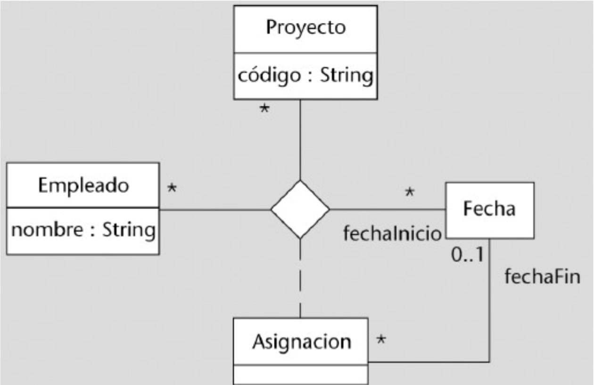

### Objeto compuesto (composite)

Queremos tratar las colecciones de elementos y los elementos de manera uniforme.

Creamos, mediante una generalización, una superclase común a los elementos y a las colecciones y hacemos que el resto del sistema no conozca la subclase concreta con la que está asociado.

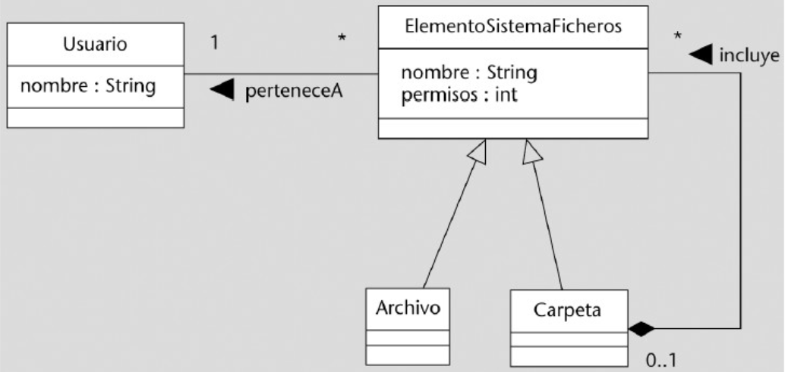

### Cantidad

La representación de una cantidad mediante un valor numérico es poco adecuada, puede llevar a confusión o no es viable cuando pueden intervenir distintas unidades de medida.

Modelar la medida como un tipo de dato más complejo formado por los campos valor y unidad.

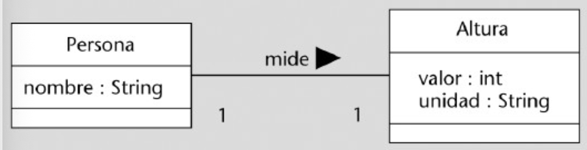

### Rango

Nuestro análisis debería reflejar la semántica propia de un rango, como saber si dos rangos se solapan o si un valor está dentro de un rango.

Creamos una clase que representa un rango de valores y que se encargará de contener la semántica del rango.

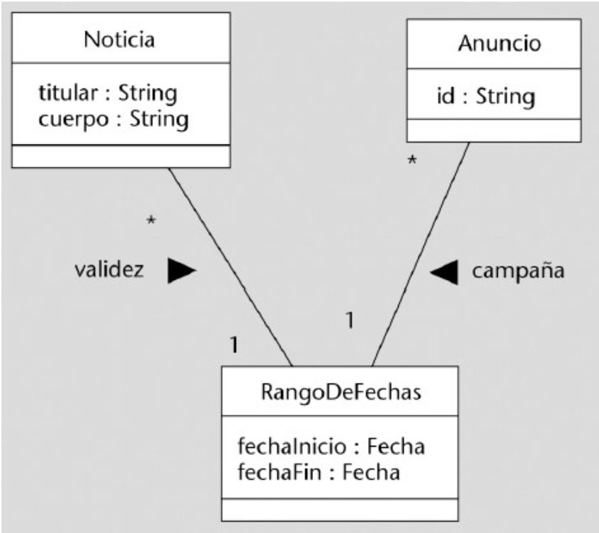

## Patrones de arquitectura (3)

### Qué es un patrón arquitectónico

Los patrones de arquitectura son aquellos que se aplican en la definición de la arquitectura de software y que, por lo tanto, resuelven problemas que afectarán al conjunto del diseño del sistema.

### Arquitectura en capas

Queremos estructurar nuestro sistema de manera que cada componente de éste trabaje a un cierto nivel de abstracción.

Organizamos la estructura lógica a gran escala del sistema en capas separadas con responsabilidades diferentes de tal manera que las capas más bajas son servicios generales de bajo nivel y las más altas son más específicas de la aplicación.

### Inyección de dependencias

Queremos escoger y cambiar la implementación de cada servicio sin tener que modificar el código de nuestras clases, que no dependerán de ninguna implementación concreta, sino de la interfaz del servicio.

Ofrecer operaciones para poder inyectar en las clases usuarias de un servicio la implementación de éste. Esta inyección la llevará a cabo una tercera clase que, típicamente, formará parte de un framework especializado.

Variantes:
* Inyección por constructor.
* Inyección por interfaces.

### Modelo-vista-controlador (MVC)

Queremos desacoplar la interfaz gráfica de nuestro sistema del resto del sistema.

Dividir el sistema en tres tipos de componentes: modelos, vistas y controladores.

## Patrones de asignación de responsabilidades (4)

### Qué es un patrón de asignación de responsabilidades

Los patrones de asignación de responsabilidades son un tipo especial de patrón de diseño que no se aplican para resolver un problema concreto de diseño, sino que se aplican, de manera general, para repartir las responsabilidades entre las diferentes clases del diagrama de clases. Así pues, su aplicación acostumbra a ser previa a la aplicación del resto de patrones de diseño.

### Controlador

Se producen eventos y hay que decidir quién será el responsable de gestionarlos.

Creamos una clase que denominaremos Controlador y asignarle la responsabilidad de gestionar el evento.

Tipos:
* Controlador de fachada: una clase representa a todo el sistema.
* Controlador de caso de uso: cada clase tiene todos los eventos de un caso de uso.
* Controlador de sesión: cada clase tiene todos los eventos de una sesión de cliente.
* Controlador de transacción: una clase por cada tipo de evento.

### Experto

Se tiene que hacer un tratamiento o cálculo sobre una información.

Asignamos la responsabilidad de hacer el tratamiento o cálculo a la clase que contiene la información necesaria. Denominaremos a esta clase Experto (con respecto a este tratamiento o cálculo).

### Fabricación pura

Se tiene que hacer un tratamiento o cálculo independiente de la lógica del dominio.

Asignamos un conjunto de responsabilidades altamente cohesionadas entre ellas a una clase artificial o de conveniencia que no representa un concepto del dominio del problema; una clase inventada para soportar alta cohesión, bajo acoplamiento y reutilización.

### Creador

Tenemos que crear instancias de una clase.

Asignamos a la clase B la responsabilidad de crear una instancia de la clase A si:
* B agrega objetos de A.
* B contiene objetos de A.
* B registra objetos de A.
* B utiliza más estrechamente objetos de A.
* B tiene los datos de inicialización que se pasarán a un objeto de A cuando sea creado (y, por lo tanto, B es un Experto con respecto a la creación de A).

## Patrones de diseño (13)

### Qué es un patrón de diseño

Los patrones de diseño son aquellos que se aplican para resolver problemas concretos de diseño que no afectarán al conjunto de la arquitectura del sistema.

### Estado

Los objetos de una clase varían su comportamiento dependiendo de su estado.

Separamos la parte de la clase que varía dependiendo del estado del resto y tratamos cada estado como una clase que implementará el comportamiento esperado cuando el objeto se encuentra en aquel estado.

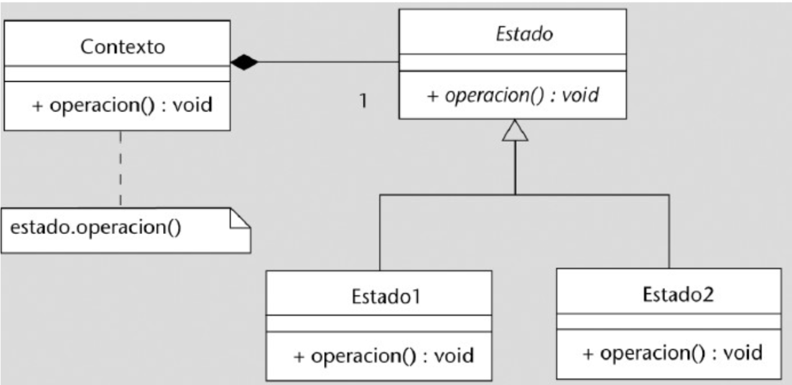

### Fachada

Nuestro sistema está estructurado en subsistemas o capas. Un subsistema (o capa) A utiliza otro subsistema (o capa) B.

* Queremos reducir el acoplamiento entre dos subsistemas.
* Queremos acceder a una versión simplificada de un subsistema.
* Queremos ofrecer un único punto de entrada a un subsistema.

Creamos una nueva clase Fachada que represente todo el subsistema o capa accedido.

Si queremos es reducir el acoplamiento entre A y B o acceder a una versión simplificada de B, añadiremos una Fachada al subsistema cliente (A) que concentre el acoplamiento y/o nos simplifique la visión que tenemos de B.

Si queremos ofrecer un único punto de entrada a B, añadiremos una Fachada a B que será la única clase pública del subsistema (el resto de clases pueden tener visibilidad de paquete) con el fin de asegurarnos de que no hay ninguna otra vía de entrada.

Si queremos reducir el acoplamiento con respecto al subsistema de base de datos y no lo podemos modificar porque es un subsistema desarrollado por otra organización, creamos una fachada dentro del subsistema cliente.

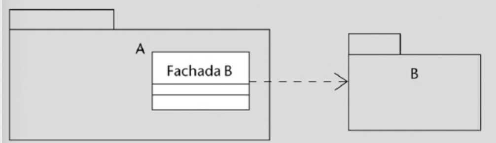
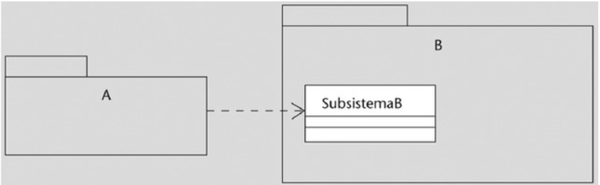
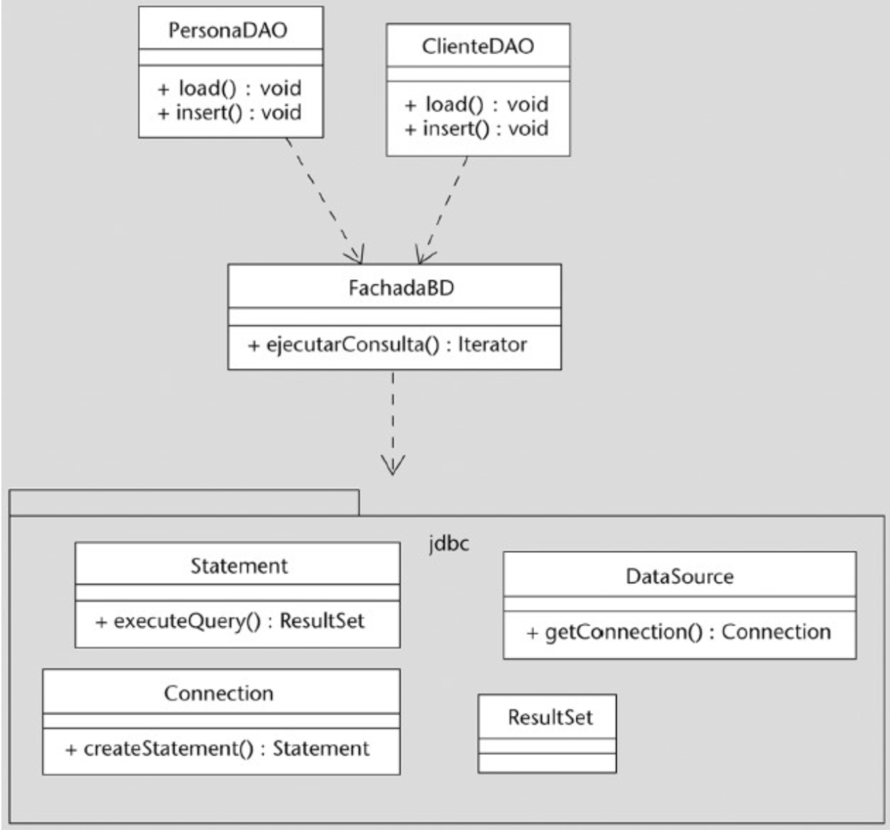

### Iterador

Un objeto agregado quiere dar acceso a sus elementos.

Un objeto quiere dar acceso a los objetos que tiene asociados.

No queremos exponer la estructura de datos que utilizamos internamente para almacenar las referencias a los objetos asociados o agregados (la representación interna de la agregación o la asociación) a quienes accedan a la misma.

Creamos una clase Iterador que conocerá la estructura interna, cómo se tiene que recorrer y cómo se tiene que cambiar (por ejemplo, notificándolo a la clase) y que encapsulará este conocimiento.

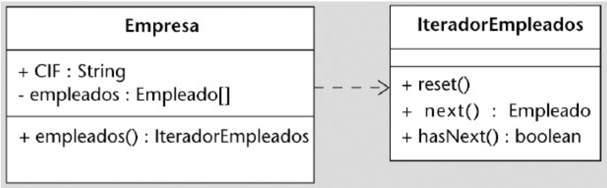

### Método factoría

Un objeto tiene que crear objetos de otra clase. El objeto que tiene que crear otros objetos no puede anticipar la clase de éstos.

Queremos delegar la responsabilidad de especificar la clase de los objetos que se tienen que crear en nuestras subclases.

Definimos, en la clase abstracta Creador (la que crea los objetos), un método "crear" encargado de la creación y que denominaremos método factoría.

Proporcionamos, a cada subclase de Creador, una implementación del método factoría que cree un tipo concreto de objeto.

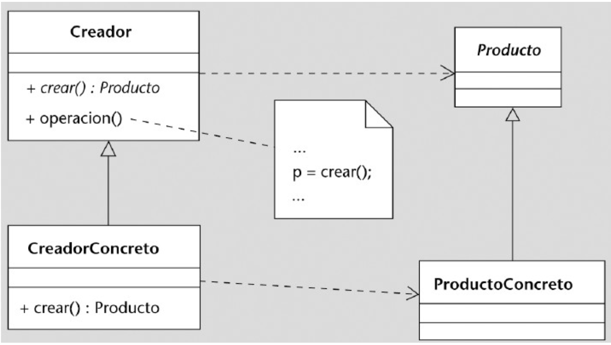
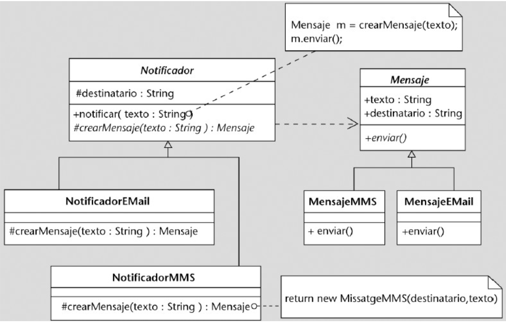

### Observador

Un cambio en un objeto implica cambios en otros objetos.

Queremos evitar el acoplamiento entre la clase del objeto en el cual se produce un cambio y la de los objetos que tienen que recibir la notificación.

Crear una nueva abstracción para el mecanismo de notificación y utilizar la herencia y el polimorfismo para reducir el acoplamiento.

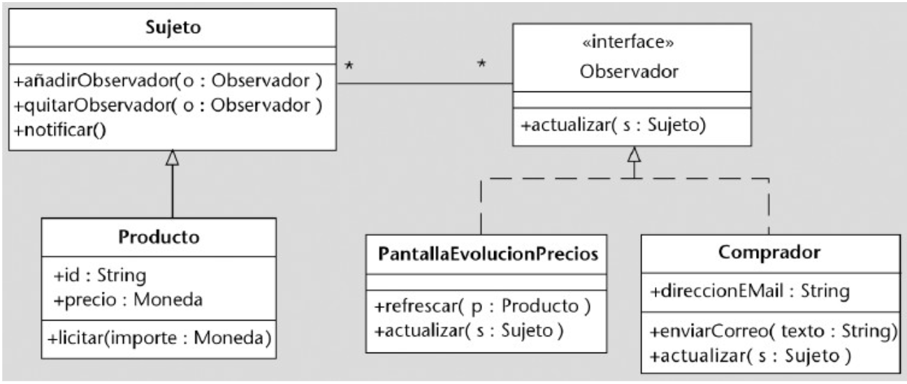

### Orden (command)

Queremos tratar las llamadas a operaciones como objetos, por ejemplo, para lo siguiente:
* Poder deshacer las operaciones.
* Ejecutarlas en otro entorno (en otro proceso o nodo de la red) o en otro momento.
* Parametrizar un objeto (por ejemplo, qué acción tiene que ejecutar un elemento de un menú de usuario).
* Tener un historial de cambios con el fin de poder volver a aplicarlos si cae el sistema.
* Estructurar el sistema en torno a operaciones de alto nivel (por ejemplo, tener una clase para cada operación de sistema).

Necesitamos un mecanismo para poder tratar una operación como un objeto y nuestro lenguaje de programación no tiene esta capacidad.

Creamos una clase cuyas instancias representan invocaciones de una operación.

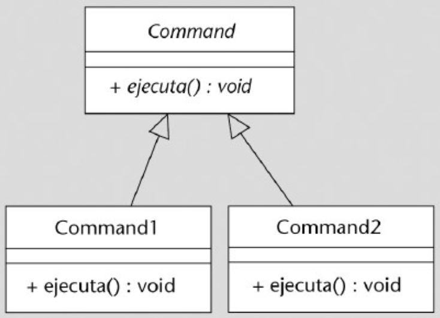
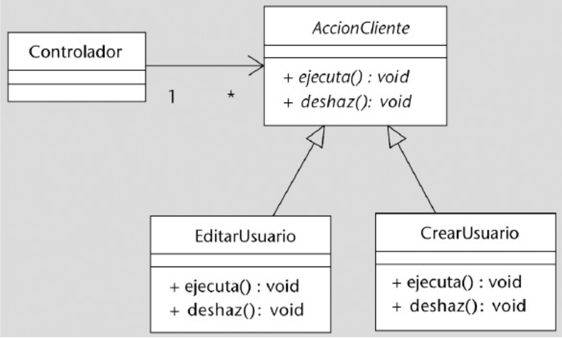

### Adaptador

Permite utilizar una clase utilizando un conjunto de operaciones diferente al que ofrece originalmente.

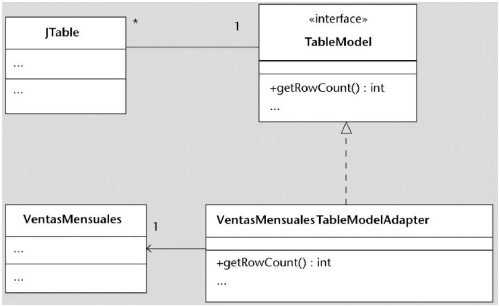

### Decorador

Permite añadir responsabilidades a un objeto dinámicamente.

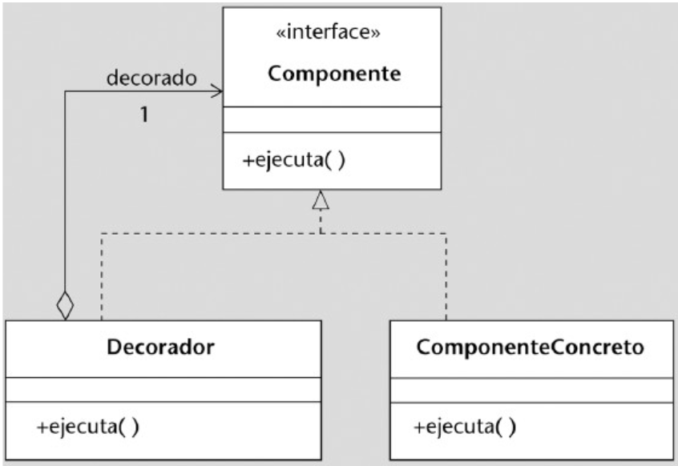

### Estrategia

Permite definir una familia de algoritmos y hacerlos intercambiables los unos con los otros. De esta manera, permite escoger uno dinámicamente.

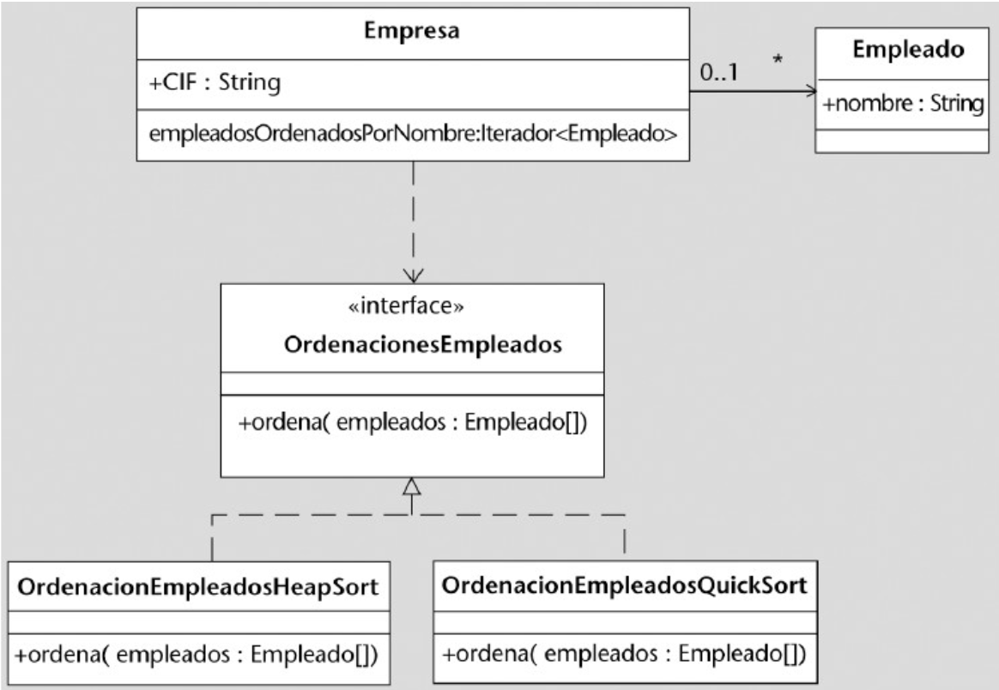

### Singleton

Permite asegurar que, de una determinada clase, sólo hay una instancia en todo el sistema.

```java
class Singleton()
{
    private static Singleton instance = null;
    private Singleton() {}
    public static Singleton getInstance() {
        if (this.instance == null) {
            this.instance = new Singleton();
        }
        return this.instance;
    }
}
```

### Objeto nulo

Permite tratar el caso del valor nulo como si fuera una instancia válida.

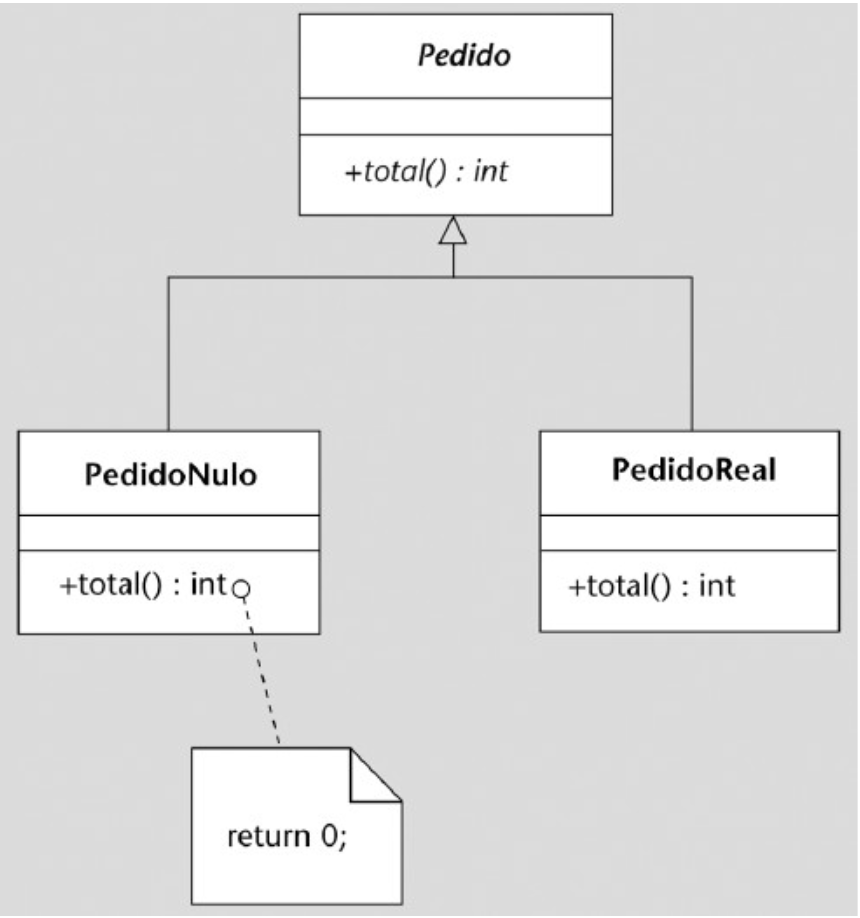

### Representante (proxy)

Permite controlar el acceso a un objeto desde otro de manera transparente.

El patrón Representante propone añadir un objeto (el Representante) que controlará el acceso a la noticia. Cuando este representante detecte que se quiere acceder al cuerpo de la noticia (y sólo en este caso), lo cargará.

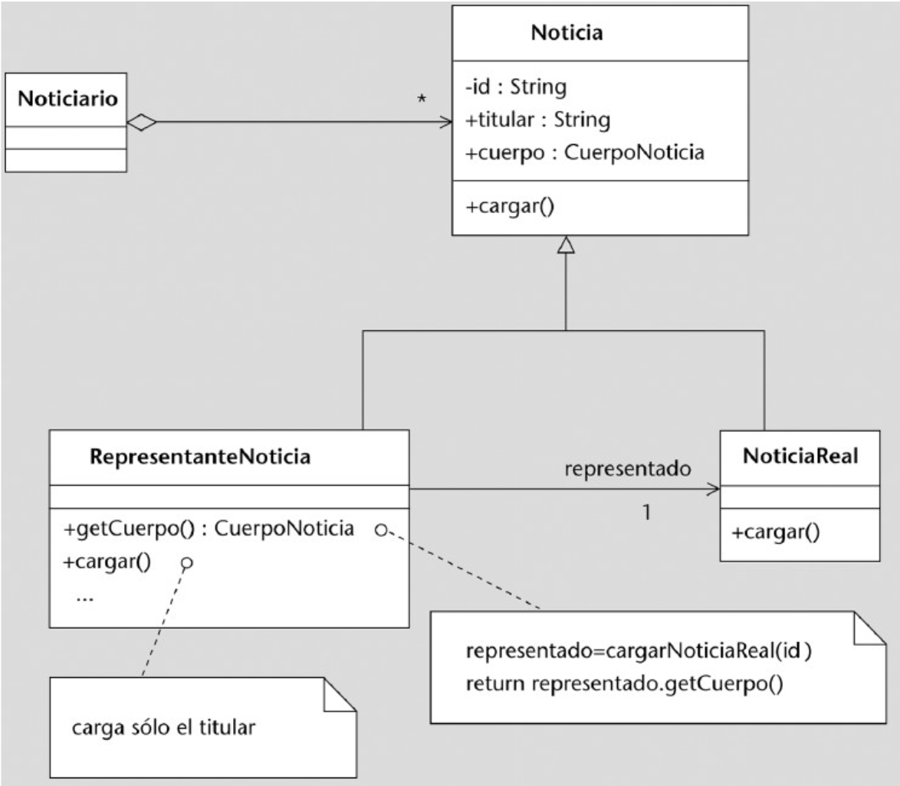

### SERVIDOR ABSTRACTO

Permite desacoplar una clase cliente respecto de una clase que utiliza y que denominaremos servidor.

Para hacerlo, introduce una abstracción que representa el uso que el cliente hace del servidor.

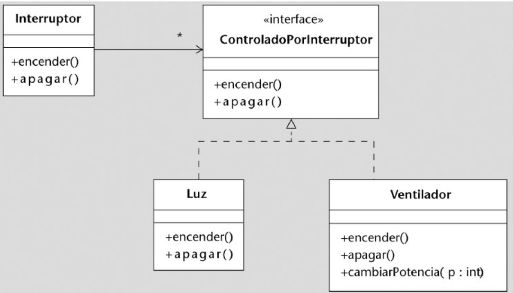