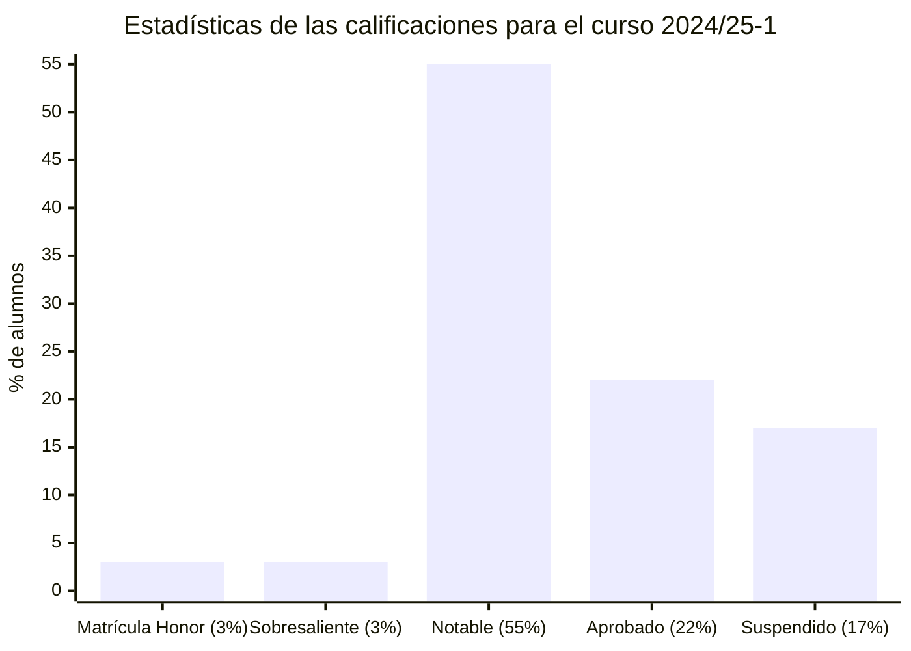

# Competencia comunicativa para profesionales de las TIC (24/25-1)

- [Información sobre la asignatura](#información-sobre-la-asignatura)
- [Resumen de calificaciones](#resumen-de-calificaciones)
- [Recursos de aprendizaje](#recursos-de-aprendizaje)

## Información sobre la asignatura

- **Código**: 75.563
- **Curso**: 2024/25 (1º semestre)
- **Tipo**: Obligatoria
- **Método de evaluación**: Evaluación continua (100%: PEC 40% + PRs 60%)
- **Créditos**: 6
- [**Plan docente**](https://cv.uoc.edu/tren/trenacc/web/GAT_EXP.PLANDOCENTE?any_academico=20241&cod_asignatura=75.563&idioma=CAS&pagina=PD_PREV_PORTAL)

>

>	
Leyenda de calificaciones

>
>	- **Matrícula de Honor (M)**: 9 a 10
>	- **Sobresaliente (EX)**: 9 a 10
>	- **Notable (NO)**: 7 a 8,99
>	- **Aprobado (A)**: 5 a 6,99
>	- **Suspendido (SU)**: 0 a 4,99
>

## Resumen de calificaciones

>[!NOTE]
>- La calificación final es la que aparece en mi expediente. No tiene por qué ser, necesariamente, el resultado de la suma de las calificaciones ponderadas de los bloques.
>- Los errores de las tareas marcadas con un asterisco (*) han sido corregidos, por lo que, según las correcciones del profesorado, deberían tener la máxima puntuación en su estado actual.

<table>
	<tr>
		<th>BLOQUE</th>
		<th>DESGLOSE</th>
		<th>ACTIVIDAD</th>
		<th>CALIFICACIÓN</th>
		<th>CALIFICACIÓN PONDERADA</th>
	</tr>
	<tr>
		<td rowspan="7">
			<strong>Evaluación continua (EC)</strong> (100%)
		</td>
		<td rowspan="3">
			<strong>
				Pruebas de evaluación continua (PEC)
			</strong>
			(40%)
		</td>
		<td>
			<a href="pec1">
				PEC1 - Dime cómo escribes y te diré quién eres
			</a> (33%)
		</td>
		<td>
			31,31 / 33,00 (A)
		</td>
		<td rowspan="7">
			

				<strong>Calificación total PEC</strong>:
				 
				94,35 / 100,00
			

			

				<strong>Calificación ponderada PEC</strong>:
				 
				3,77 / 4,00
			

			

				<strong>Calificación total PRs</strong>:
				 
				94,94 / 100,00
			

			

				<strong>Calificación ponderada PRs</strong>:
				 
				5,70 / 6,00
			

			

				<strong>Calificación ponderada EC</strong>:
				 
				9,47 / 10,00
			

		</td>
	</tr>
	<tr>
		<td>
			<a href="pec2">
				PEC2 - Divide y vencerás. Los párrafos y las técnicas de síntesis
			</a> (33%)
		</td>
		<td>
			33,00 / 33,00 (A)
		</td>
	</tr>
	<tr>
		<td>
			<a href="pec3">
				PEC3 - Texto bien unido, jamás será vencido
			</a> (34%)
		</td>
		<td>
			30,04 / 34,00 (B)
		</td>
	</tr>
	<tr>
		<td rowspan="4">
			<strong>Prácticas (PR)</strong> 
			(60%)
		</td>	
		<td>
			<a href="pr1">
				PR1 - La primera impresión es lo que cuenta
			</a> (15%)*
		</td>
		<td>14,40 / 15,00 (A)</td>
	</tr>
	<tr>
		<td>
			<a href="pr2">
				PR2 - Resumiendo que es gerundio
			</a> (15%)*
		</td>
		<td>
			14,00 / 15,00 (A)
		</td>
	</tr>
	<tr>
		<td>
			<a href="pr3">
				PR3 - ¡Manos a la obra! Trabajamos la propuesta de proyecto
			</a> (40%)
		</td>
		<td>
			36,54 / 40,00 (A)
		</td>
	</tr>
	<tr>
		<td>
			<a href="pr4">
				PR4 - ¡Recapitulemos! ¿Qué he aprendido?
			</a> (30%)
		</td>
		<td>
			30,00 / 30,00 (A)
		</td>
	</tr>
	<tr>
		<td colspan="4"></td>
		<td></td>
	</tr>
	<tr>
		<td colspan="4">
			<strong>CALIFICACIÓN FINAL</strong>
		</td>
		<td>10,00 / 10,00 (M)</td>
	</tr>
</table>

## Recursos de aprendizaje

- [**Competencia comunicativa y producción de textos**](https://materials.campus.uoc.edu/daisy/Materials/PID_00274805/pdf/PID_00274805.pdf) ([resumen](./recursos/competencia_comunicativa_y_produccion_de_textos_resumen.md)).
- [**El proceso de producción de textos**](https://materials.campus.uoc.edu/daisy/Materials/PID_00279144/pdf/PID_00279144.pdf) ([resumen](./recursos/el_proceso_de_produccion_de_textos_resumen.md)).
- [**Técnicas de producción de textos especializados (I). Aspectos de adecuación**](https://materials.campus.uoc.edu/daisy/Materials/PID_00274803/pdf/PID_00274803.pdf) ([resumen](./recursos/tecnicas_i_aspectos_de_adecuacion_resumen.md)).
- [**Técnicas de producción de textos especializados (II). Aspectos de coherencia**](https://materials.campus.uoc.edu/daisy/Materials/PID_00274801/pdf/PID_00274801.pdf) ([resumen](./recursos/tecnicas_ii_aspectos_de_coherencia_resumen.md)).
- [**Técnicas de producción de textos especializados (III). Léxico y aspectos de cohesión**](https://materials.campus.uoc.edu/daisy/Materials/PID_00274804/pdf/PID_00274804.pdf) ([resumen](./recursos/tecnicas_iii_lexico_y_aspectos_de_cohesion_resumen.md)).
- [**Técnicas de producción de textos especializados (IV). Puntuación y aspectos formales**](https://materials.campus.uoc.edu/daisy/Materials/PID_00274802/pdf/PID_00274802.pdf) ([resumen](./recursos/tecnicas_iv_puntuacion_y_aspectos_formales_resumen.md)).