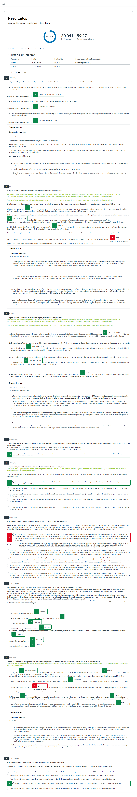
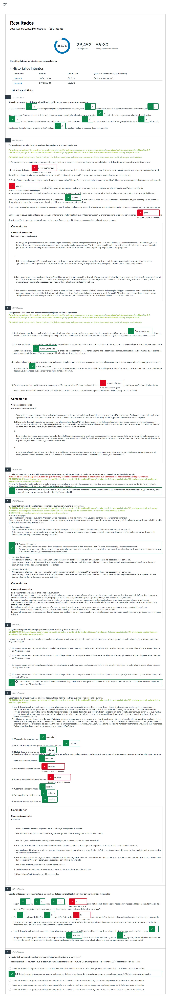

# PEC3 - Texto bien unido, jamás será vencido

Para realizar esta PEC, hay que resolver un cuestionario de Moodle siguiendo las directivas dadas por el [enunciado](enunciado.pdf). Las capturas de los intentos (máximo 2) se muestran adjuntos justo en el apartado de debajo.

## Capturas de los intentos

	
Captura del intento 1 realizado en Moodle (<strong>mayor nota</strong>)

	
Captura del intento 2 realizado en Moodle (<strong>menor nota</strong>)

## Histórico de PEC

El directorio [`historico`](historico/) contiene una recopilación de 8 PEC corregidas por el equipo docente desde 2015.

## Recursos de aprendizaje

- [**Técnicas de producción de textos especializados (III). Léxico y aspectos de cohesión**](https://materials.campus.uoc.edu/daisy/Materials/PID_00274804/pdf/PID_00274804.pdf) ([resumen](https://github.com/HenestrosaDev/uoc-ingenieria-informatica/blob/main/competencia_comunicativa_para_profesionales_de_las_tic/recursos/tecnicas_iii_lexico_y_aspectos_de_cohesion_resumen.md)).
- [**Técnicas de producción de textos especializados (IV). Puntuación y aspectos formales**](https://materials.campus.uoc.edu/daisy/Materials/PID_00274802/pdf/PID_00274802.pdf) ([resumen](https://github.com/HenestrosaDev/uoc-ingenieria-informatica/blob/main/competencia_comunicativa_para_profesionales_de_las_tic/recursos/tecnicas_iv_puntuacion_y_aspectos_formales_resumen.md)).

---

## Resultado

### Calificación

<table>
	<thead>
		<tr>
			<th>EVALUABLE</th>
			<th>C. ORIGINAL</th>
			<th>C. SOBRE 10</th>
		</tr>
	</thead>
	<tbody>
		<tr>
			<td>Cuestionario (<a href="intento_1">intento 1</a>)</td>
			<td>30,04/ 33,00</td>
			<td>9,10 / 10,00 (A)</td>
		</tr>
	</tbody>
</table>
