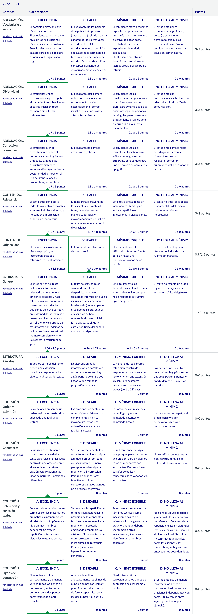

# PR1 - La primera impresión es la que cuenta

- [Descripción](#descripción)
- [Enunciado y recursos docentes](#enunciado-y-recursos-docentes)
	- [Enunciado de la práctica](#enunciado-de-la-práctica)
	- [Recursos de aprendizaje](#recursos-de-aprendizaje)
- [Retroalimentación (_feedback_)](#retroalimentación-feedback)
- [Consideraciones sobre el uso de herramientas de inteligencia artificial generativa](#consideraciones-sobre-el-uso-de-herramientas-de-inteligencia-artificial-generativa)
- [Actividad resuelta](#actividad-resuelta)
- [Resultado](#resultado)
	- [Calificación](#calificación)
	- [Rúbrica](#rúbrica)
	- [Notas personales](#notas-personales)
	- [Mensaje que el profesor publicó en el foro con carácter de corrección general](#mensaje-que-el-profesor-publicó-en-el-foro-con-carácter-de-corrección-general)

## Descripción

En nuestro día a día profesional, la mayoría de comunicaciones se producen de manera escrita. Muchas veces necesitamos dirigirnos a un organismo para obtener información, realizar una petición, concertar una entrevista, etc. Todos estos correos tienen en común el carácter formal y un destinatario desconocido; así pues, el nivel de formalidad tiene que ser adecuado al contexto. 

Los estudios de Informática, Multimedia y Telecomunicación, donde se ofrece este grado, organizan una serie de encuentros con empresas tecnológicas que buscan futuros talentos para prácticas y oportunidades laborales. Recientemente, habéis asistido a una charla impartida por una de estas empresas, **InnovaTech Solutions**, una consultoría tecnológica con proyectos innovadores que resultan especialmente interesantes.

La directora ejecutiva de la empresa, **Paula Rovira**, ha mencionado que buscan estudiantes de la UOC que quieran unirse al equipo como becarios o incluso como posibles futuros trabajadores o trabajadoras. La empresa tiene especial interés en perfiles con conocimientos en desarrollo web, seguridad informática y gestión de bases de datos.

Así pues, en esta práctica, tendréis que escribir un correo electrónico a esta empresa. Y recordad, como dijo Oscar Wilde: «Nunca hay una segunda oportunidad para causar una buena primera impresión».

## Enunciado y recursos docentes

La PR1 consiste en la **redacción de un correo electrónico**. El objetivo de este es poner en práctica los conocimientos de los recursos estudiados en los módulos 1 y 2 de esta asignatura. Por eso es necesario que previamente hayáis realizado la PEC1, que se centra en el aprendizaje de los contenidos de estos módulos. 

### Enunciado de la práctica

En este escenario descrito, el objetivo de la actividad es redactar un correo electrónico formal de presentación personal, donde habléis de vuestra trayectoria académica, las habilidades profesionales y por qué os interesa colaborar con **InnovaTech Solutions**. El mensaje tiene que tener entre **250** y **300 palabras**.

En el correo electrónico hay que incluir la información siguiente:

1. **Presentación personal**: hay que dar información sobre vosotros, vuestras aficiones, inquietudes e intereses personales que tenéis fuera del mundo laboral y educativo.
2. **Trayectoria académica**: es necesario hablar de vuestro progreso académico, el grado que cursáis en la UOC y las asignaturas o proyectos relevantes realizados durante los estudios y de las expectativas que tenéis en relación con el grado que estudiáis.
3. **Experiencia profesional o proyectos personales**: hay que describir la experiencia laboral o proyectos personales relacionados con la informática.
4. **Motivación para trabajar con la empresa**: expresad claramente por qué os interesa esta empresa en concreto y qué podríais aportar.

Recordad que:

- El texto debe cumplir las tres propiedades textuales estudiadas en los recursos didácticos (adecuación, cohesión, coherencia).
- Se valorará más la redacción que el contenido.
- La relación con el interlocutor debe ser cordial y respetuosa a la vez, lo que debéis reflejar en las fórmulas de saludo y despedida, y también en el tratamiento personal que utilicéis.

### Recursos de aprendizaje

Los recursos docentes que debéis consultar para realizar esta PR1 son los siguientes:

1. [**Textos prototípicos del ámbito TIC**](https://multimedia.recursos.uoc.edu/textos-prototipics-tic/es/): recurso de la UOC que tenéis en el apartado siguiente, [Recursos de aprendizaje PR1](https://aula.uoc.edu/courses/46292/pages/recursos-de-aprendizaje-pr1?module_item_id=1625603), donde encontraréis recomendaciones de redacción, modelos y ejemplos de algunos de los documentos más habituales en vuestro ámbito profesional y académico. Para la PR1 debéis consultar el **correo electrónico profesional**.
2. [**El proceso de producción de textos**](https://materials.campus.uoc.edu/daisy/Materials/PID_00279144/pdf/PID_00279144.pdf): recurso de la UOC que incluye las recomendaciones de redacción que debéis seguir para elaborar los textos de las diversas prácticas. También lo tenéis disponible en el apartado [Recursos de aprendizaje PR1](https://aula.uoc.edu/courses/46292/pages/recursos-de-aprendizaje-pr1?module_item_id=1625603).
3. **Los módulos docentes 1** ([_Competencia comunicativa y producción de textos_]((https://materials.campus.uoc.edu/daisy/Materials/PID_00274805/pdf/PID_00274805.pdf))) **y 2** ([_Técnicas de producción de textos especializados (I). Aspectos de adecuación_](https://materials.campus.uoc.edu/daisy/Materials/PID_00279144/pdf/PID_00279144.pdf)) **de la asignatura**, que ya habéis consultado para resolver la PEC 1 y que también encontraréis en el apartado [Recursos de aprendizaje PR1](https://aula.uoc.edu/courses/46292/pages/recursos-de-aprendizaje-pr1?module_item_id=1625603).
4. Rúbrica PR1: tabla que incluye los indicadores que se evalúan en esta práctica PR1 (indicadores extraídos de los recursos docentes de la asignatura). Analizadla con detalles porque será el instrumento con el que se os calificarán los trabajos. La encontraréis en el apartado Entrega PR1.

Y, sobre todo, no perdáis de vista la fecha de entrega que aparece en el [calendario del aula](https://aula.uoc.edu/courses/46292/pages/calendario) y, como siempre, enviad al [foro](https://aula.uoc.edu/courses/46292/discussion_topics/732593) cualquier duda que os surja.

## Retroalimentación (_feedback_)

El retorno individual de las actividades es un elemento clave para el aprendizaje. Por ello,  el docente de vuestra aula os devolverá corregidas de manera individual las actividades de redacción (PR). Además, si lo considera necesario, proporcionará un retorno grupal del resultado de cada actividad en los Anuncios del aula.

## Consideraciones sobre el uso de herramientas de inteligencia artificial generativa

En esta actividad **no está permitido el uso de herramientas de inteligencia artificial** (IA) ni para generar el texto ni para corregirlo o mejorarlo. Queremos evaluar cómo escribís vosotros y no cómo lo hace una herramienta de IA. Además, en el contexto de esta asignatura, usar dichas herramientas implica perder una magnífica oportunidad para aprender.

En el [plan docente](https://aula.uoc.edu/courses/46292/external_tools/1823) y en la [web sobre integridad académica y plagio de la UOC](https://campus.uoc.edu/estudiant/microsites/plagi/es/index.html) encontraréis información sobre qué se considera conducta irregular en la evaluación y sobre las consecuencias que puede conllevar incurrir en alguno de los casos establecidos.

--- 

## Actividad resuelta

Buenos días, Paula:

Me llamo José Carlos y actualmente soy estudiante del grado en Ingeniería Informática en la Universitat Oberta de Catalunya (UOC). Desde pequeño, me ha fascinado el mundo de la tecnología, lo cual me ha llevado a centrarme en el desarrollo web y la seguridad informática. Mi tiempo libre lo paso creando videojuegos y editando vídeos, lo que me permite combinar mis dos grandes pasiones: la creación de contenido y la tecnología.

A lo largo de mi trayectoria académica, he completado dos ciclos formativos de grado superior pertenecientes al ámbito de la informática, en los que tuve la oportunidad de aplicar y desarrollar mis conocimientos en multitud de proyectos prácticos. Entre ellos, destaco el diseño de un sitio web con un modelo de suscripción que permite a los usuarios leer libros en línea y el desarrollo de una aplicación móvil con un sistema de videollamadas en tiempo real.

En cuanto a mi experiencia profesional, llevo más de tres años trabajando por cuenta ajena como desarrollador web full-stack. En este rol, he podido aplicar y ampliar los conocimientos adquiridos durante mi etapa estudiantil, así como comprender la importancia de colaborar en equipo. Además, he aprendido mucho sobre la gestión de proyectos y sobre cómo resolver problemas de manera eficiente, lo cual estimo que es algo que solo se puede adquirir en un contexto laboral exigente.

Confío en que mi formación y mi creatividad, junto con mis aptitudes en desarrollo web y gestión de bases de datos, serán un activo de gran valor para InnovaTech Solutions.

Estaré encantado de resolver cualquier duda o de hablar más en profundidad sobre mi contribución a la empresa en aspectos más concretos.

Atentamente,
José Carlos López Henestrosa

--- 

## Resultado

### Calificación

<table>
	<thead>
		<tr>
			<th>EVALUABLE</th>
			<th>C. ORIGINAL</th>
			<th>C. SOBRE 10</th>
		</tr>
	</thead>
	<tbody>
		<tr>
			<td>Entrega PDF</td>
			<td>14,40 / 15,00</td>
			<td>9,60 / 10,00 (A)</td>
		</tr>
	</tbody>
</table>

### Rúbrica

### Notas personales

He aplicado el feedback proporcionado por el profesor sobre la entrega original, por lo que ahora debería tener la máxima puntuación.

### Mensaje que el profesor publicó en el foro con carácter de corrección general

- **Puntuación en el saludo inicial**. Aunque en inglés los saludos tipo “Estimado X” o “Buenos días, X” que abren las cartas van seguidos de una coma —y seguramente por eso está cada vez más extendido—, recordad que en castellano el saludo termina en dos puntos (:). También va una coma entre el saludo y el nombre, y eso se aplica a cualquier parte de un texto en el que se incluya un vocativo: “Hola, José”; “Buenas tardes, María”, “Te quiero, mamá”.
	- https://www.fundeu.es/consulta/encabezamiento-de-carta-1333/ 
	- https://www.fundeu.es/consulta/signos-de-puntuacion-usados-en-la-correspondencia-2826/ 
	- http://www.fundeu.es/recomendacion/vocativos-entre-comas/ 

- **Tratamiento del destinatario y presentación del emisor**. En lo concerniente a esta cuestión, he considerado válido tanto tratar a vuestro destinatario de "usted" como de "usted/ustedes" (según si os dirigíais a la señora Rovira o a la empresa). Lo que no he considerado válido son los saludos de alcance coloquial, como "Estimada + nombre de pila (+ apellido), pues denota falta de rigor profesional y, además, es una expresión totalmente coloquial. 

- **Justificación del margen del texto**. Aunque en la actividad se simula el envío de un correo electrónico, no debéis olvidar que estáis presentando un texto académico, por lo que debéis justificarlo en su margen derecho (y así se proporciona una imagen correcta de la presentación, no solo en el nivel académico, sino también en el profesional). En este sentido, recordad que existen numerosos programas de gestión de la mensajería electrónica que permiten justificar el texto que enviamos a nuestros destinatarios.

- **Concisión, registro oral y subjetividad**. En no pocas ocasiones, muchos usáis un registro más propio de la oralidad que de los textos formales escritos. Hay expresiones que todos evitáis por ser claramente informales, pero utilizáis otras (que os he señalado) que también pueden resultar inadecuadas.

- **Plagio**: recordad que debéis incluir en el texto (normalmente, al final de este) una aclaración que indique no habéis recurrido a ninguna IA para elaborarlo. En este sentido, he detectado que ha habido alumnos que se han basado en otras fuentes para escribir su texto. En estos casos, os recuerdo que seáis honestos, pues es la única manera de aprender en esta asignatura.

- **Citas de apoyo**: en la rúbrica se especifica que, si se quiere obtener la máxima puntuación en ese apartado, se deben utilizar citas de apoyo para avalar el contenido del texto. Hubiera sido suficiente con que se agregara alguna referencia de algún autor que avale la importancia, por ejemplo, de los fundamentos académicos para ser buenos profesionales. 
