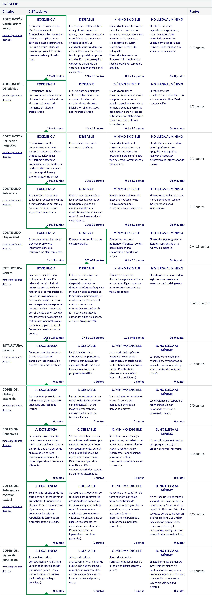

# PR1 - La primera impresión es la que cuenta

Para realizar esta PR, hay que resolver el ejercicio que se detalla en el [enunciado](enunciado.pdf) y entregarlo en formato `.pdf` ([`entrega_evaluada.pdf`](entrega_evaluada.pdf)).

## Histórico PR

El directorio [`historico`](historico/) contiene una recopilación de 4 PR corregidas por el equipo docente desde 2016.

## Recursos de aprendizaje

- [**Textos prototípicos del ámbito TIC**](https://multimedia.recursos.uoc.edu/textos-prototipics-tic/es/)
- [**El proceso de producción de textos**](https://materials.campus.uoc.edu/daisy/Materials/PID_00279144/pdf/PID_00279144.pdf)
- [**Técnicas de producción de textos especializados (I): Aspectos de adecuación**](https://materials.campus.uoc.edu/daisy/Materials/PID_00274803/pdf/PID_00274803.pdf) ([resumen](https://github.com/HenestrosaDev/uoc-ingenieria-informatica/blob/main/competencia_comunicativa_para_profesionales_de_las_tic/recursos/tecnicas_i_aspectos_de_adecuacion.md)).
- [**Normativa de la lengua española**](https://materials.campus.uoc.edu/daisy/Materials/PID_00284330/pdf/PID_00284330.pdf)

--- 

## Resultado

### Calificación

<table>
	<thead>
		<tr>
			<th>EVALUABLE</th>
			<th>C. ORIGINAL</th>
			<th>C. SOBRE 10</th>
		</tr>
	</thead>
	<tbody>
		<tr>
			<td>Entrega PDF</td>
			<td>14,40 / 15,00</td>
			<td>9,60 / 10,00 (A)</td>
		</tr>
	</tbody>
</table>

### Rúbrica

### Notas personales

He aplicado el feedback proporcionado por el profesor sobre la entrega original, por lo que ahora debería tener la máxima puntuación.

### Mensaje que el profesor publicó en el foro con carácter de corrección general

- **Puntuación en el saludo inicial**. Aunque en inglés los saludos tipo “Estimado X” o “Buenos días, X” que abren las cartas van seguidos de una coma —y seguramente por eso está cada vez más extendido—, recordad que en castellano el saludo termina en dos puntos (:). También va una coma entre el saludo y el nombre, y eso se aplica a cualquier parte de un texto en el que se incluya un vocativo: “Hola, José”; “Buenas tardes, María”, “Te quiero, mamá”.
	- https://www.fundeu.es/consulta/encabezamiento-de-carta-1333/ 
	- https://www.fundeu.es/consulta/signos-de-puntuacion-usados-en-la-correspondencia-2826/ 
	- http://www.fundeu.es/recomendacion/vocativos-entre-comas/ 

- **Tratamiento del destinatario y presentación del emisor**. En lo concerniente a esta cuestión, he considerado válido tanto tratar a vuestro destinatario de "usted" como de "usted/ustedes" (según si os dirigíais a la señora Rovira o a la empresa). Lo que no he considerado válido son los saludos de alcance coloquial, como "Estimada + nombre de pila (+ apellido), pues denota falta de rigor profesional y, además, es una expresión totalmente coloquial. 

- **Justificación del margen del texto**. Aunque en la actividad se simula el envío de un correo electrónico, no debéis olvidar que estáis presentando un texto académico, por lo que debéis justificarlo en su margen derecho (y así se proporciona una imagen correcta de la presentación, no solo en el nivel académico, sino también en el profesional). En este sentido, recordad que existen numerosos programas de gestión de la mensajería electrónica que permiten justificar el texto que enviamos a nuestros destinatarios.

- **Concisión, registro oral y subjetividad**. En no pocas ocasiones, muchos usáis un registro más propio de la oralidad que de los textos formales escritos. Hay expresiones que todos evitáis por ser claramente informales, pero utilizáis otras (que os he señalado) que también pueden resultar inadecuadas.

- **Plagio**: recordad que debéis incluir en el texto (normalmente, al final de este) una aclaración que indique no habéis recurrido a ninguna IA para elaborarlo. En este sentido, he detectado que ha habido alumnos que se han basado en otras fuentes para escribir su texto. En estos casos, os recuerdo que seáis honestos, pues es la única manera de aprender en esta asignatura.

- **Citas de apoyo**: en la rúbrica se especifica que, si se quiere obtener la máxima puntuación en ese apartado, se deben utilizar citas de apoyo para avalar el contenido del texto. Hubiera sido suficiente con que se agregara alguna referencia de algún autor que avale la importancia, por ejemplo, de los fundamentos académicos para ser buenos profesionales. 
