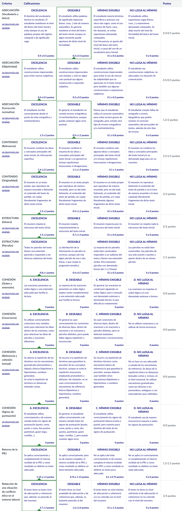

# PR2 - Resumiendo que es gerundio

Para realizar esta PR, hay que resolver los ejercicios que se detallan en el [enunciado](enunciado.pdf) y entregarlo en formato `.pdf` ([`entrega_evaluada.pdf`](entrega_evaluada.pdf)).

## Recursos de aprendizaje

- [**Textos prototípicos del ámbito TIC**](https://multimedia.recursos.uoc.edu/textos-prototipics-tic/es/)
- [**El proceso de producción de textos**](https://materials.campus.uoc.edu/daisy/Materials/PID_00279144/pdf/PID_00279144.pdf)
- [**Técnicas de producción de textos especializados (II): Aspectos de coherencia**](https://materials.campus.uoc.edu/daisy/Materials/PID_00274801/pdf/PID_00274801.pdf) ([resumen](https://github.com/HenestrosaDev/uoc-ingenieria-informatica/blob/main/competencia_comunicativa_para_profesionales_de_las_tic/recursos/tecnicas_ii_aspectos_de_coherencia.md)).
- [**Normativa de la lengua española**](https://materials.campus.uoc.edu/daisy/Materials/PID_00284330/pdf/PID_00284330.pdf)

---

## Resultado

### Calificación

<table>
	<thead>
		<tr>
			<th>EVALUABLE</th>
			<th>C. ORIGINAL</th>
			<th>C. SOBRE 10</th>
		</tr>
	</thead>
	<tbody>
		<tr>
			<td>Entrega PDF</td>
			<td>14,00 / 15,00</td>
			<td>9,33 / 10,00 (A)</td>
		</tr>
	</tbody>
</table>

### Rúbrica

