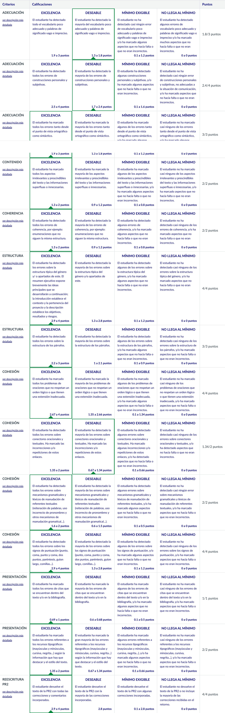

# PR3 - ¡Manos a la obra! Trabajamos la propuesta de proyecto

Para realizar esta PR, hay que resolver las actividades que se detallan en el [enunciado](enunciado.pdf) y entregarlo en  dos archivos separados (uno para cada actividad):
- [Actividad 1](entrega_anotada_actividad_1.pdf)
- [Actividad 2](entrega_anotada_actividad_2.pdf)

## Recursos de aprendizaje

- [**Textos prototípicos del ámbito TIC**](https://multimedia.recursos.uoc.edu/textos-prototipics-tic/es/)
- [**El proceso de producción de textos**](https://materials.campus.uoc.edu/daisy/Materials/PID_00279144/pdf/PID_00279144.pdf)
- [**Técnicas de producción de textos especializados (III). Léxico y aspectos de cohesión**](https://materials.campus.uoc.edu/daisy/Materials/PID_00274804/pdf/PID_00274804.pdf) ([resumen](https://github.com/HenestrosaDev/uoc-ingenieria-informatica/blob/main/competencia_comunicativa_para_profesionales_de_las_tic/recursos/tecnicas_iii_lexico_y_aspectos_de_cohesion_resumen.md)).
- [**Técnicas de producción de textos especializados (IV). Puntuación y aspectos formales**](https://materials.campus.uoc.edu/daisy/Materials/PID_00274802/pdf/PID_00274802.pdf) ([resumen](https://github.com/HenestrosaDev/uoc-ingenieria-informatica/blob/main/competencia_comunicativa_para_profesionales_de_las_tic/recursos/tecnicas_iv_puntuacion_y_aspectos_formales_resumen.md)).
- [**Normativa de la lengua española**](https://materials.campus.uoc.edu/daisy/Materials/PID_00284330/pdf/PID_00284330.pdf)

---

## Resultado

### Calificación

<table>
	<thead>
		<tr>
			<th>EVALUABLE</th>
			<th>C. ORIGINAL</th>
			<th>C. SOBRE 10</th>
		</tr>
	</thead>
	<tbody>
		<tr>
			<td>Entrega PDF</td>
			<td>36,54 / 40,00</td>
			<td>9,14 / 10,00 (A)</td>
		</tr>
	</tbody>
</table>

### Rúbrica

