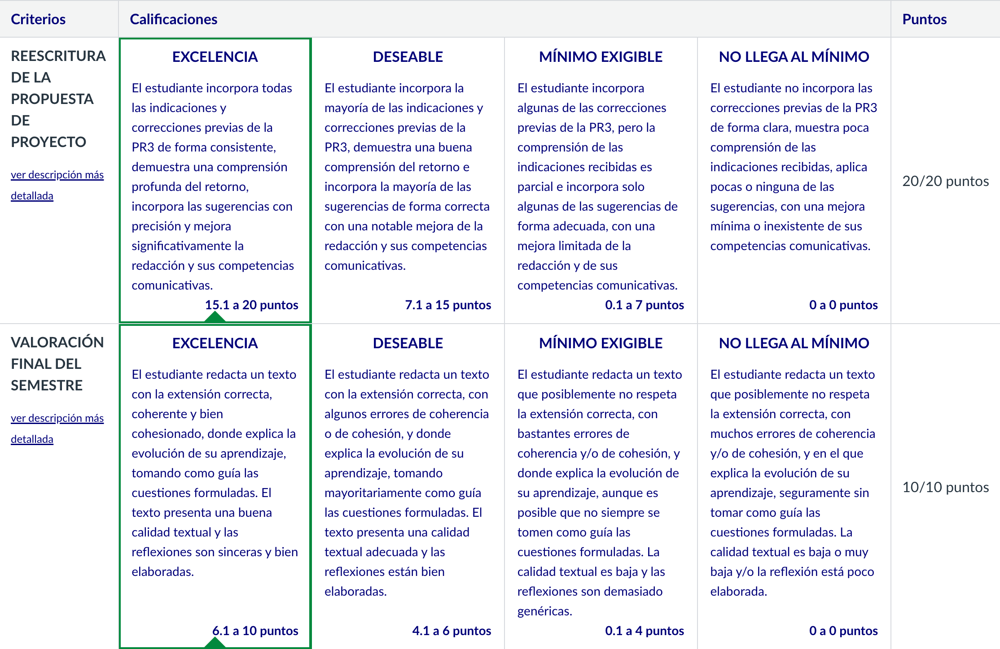

# PR4 - ¡Recapitulemos! ¿Qué he aprendido?

Para realizar esta PR, hay que resolver las tres partes que se detallan en el [enunciado](enunciado.pdf) y entregarlo en tres archivos distintos: 
- [Parte I](entrega_anotada_parte_i.pdf)
- [Parte II](entrega_anotada_parte_ii.pdf)
- [Parte III](entrega_parte_iii.mp4)

## Recursos de aprendizaje

- [**Textos prototípicos del ámbito TIC**](https://multimedia.recursos.uoc.edu/textos-prototipics-tic/es/)
- [**El proceso de producción de textos**](https://materials.campus.uoc.edu/daisy/Materials/PID_00279144/pdf/PID_00279144.pdf)
- [**Técnicas de producción de textos especializados (III). Léxico y aspectos de cohesión**](https://materials.campus.uoc.edu/daisy/Materials/PID_00274804/pdf/PID_00274804.pdf) ([resumen](https://github.com/HenestrosaDev/uoc-ingenieria-informatica/blob/main/competencia_comunicativa_para_profesionales_de_las_tic/recursos/tecnicas_iii_lexico_y_aspectos_de_cohesion_resumen.md)).
- [**Técnicas de producción de textos especializados (IV). Puntuación y aspectos formales**](https://materials.campus.uoc.edu/daisy/Materials/PID_00274802/pdf/PID_00274802.pdf) ([resumen](https://github.com/HenestrosaDev/uoc-ingenieria-informatica/blob/main/competencia_comunicativa_para_profesionales_de_las_tic/recursos/tecnicas_iv_puntuacion_y_aspectos_formales_resumen.md)).
- [**Normativa de la lengua española**](https://materials.campus.uoc.edu/daisy/Materials/PID_00284330/pdf/PID_00284330.pdf)

---

## Resultado

### Calificación

<table>
	<thead>
		<tr>
			<th>EVALUABLE</th>
			<th>C. ORIGINAL</th>
			<th>C. SOBRE 10</th>
		</tr>
	</thead>
	<tbody>
		<tr>
			<td>Entrega PDF</td>
			<td>30,00 / 30,00</td>
			<td>10,00 / 10,00 (A)</td>
		</tr>
	</tbody>
</table>

### Rúbrica

### Comentarios de retroalimentación sobre la entrega original 

**Sobre mi reflexión**

Estimado José Carlos:

Has realizado un buen trabajo, incorporando la teoría aprendida y las consideraciones de corrección de las actividades anteriores. 

Espero que todo lo aprendido puedas llevarlo a la práctica en tu quehacer profesional, pues, como bien indicas "el objetivo no es convertiros en filólogos".

Un saludo,

**Sobre el vídeo**

Estimado José Carlos:

¡Buen trabajo con el vídeo! Has realizado una presentación clara y bien estructurada, ajustándote al tiempo estipulado. Además, has sintetizado de forma acertada los aspectos clave de la materia, añadiendo tu opinión personal de manera reflexiva. Como mejora: no empieces con un "buenas" (eso es correcto en un registro informal), sino con un "Estimados/as".

Un saludo,
