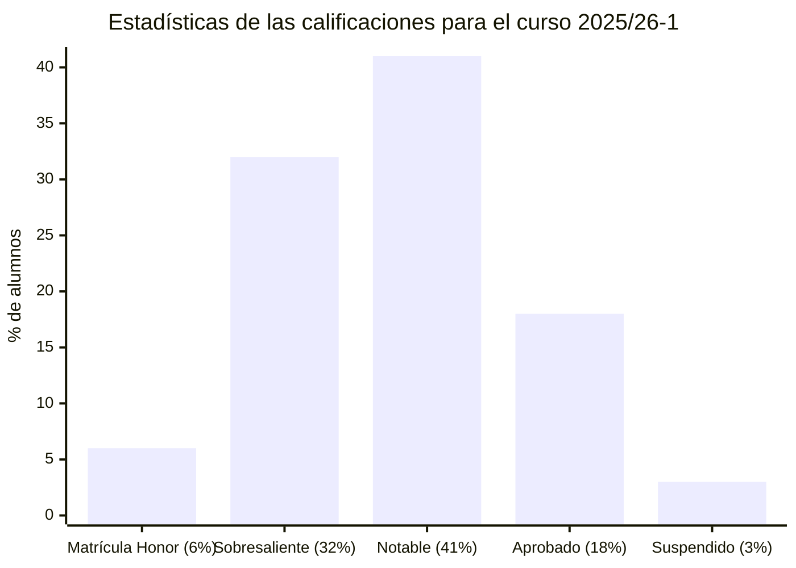

# Estadística (25/26-1)

## Información sobre la asignatura

- **Curso**: 2025/26 (1º semestre)
- **Tipo**: Básica
- **Método de evaluación**: Evaluación continua (100%) [PEC (40%) + PEC de síntesis (60%)]
- **Créditos**: 6
- [**Plan docente**](https://apps.uoc.edu/PlaDocent/PlaDocent?Semestre=20251&SignatureCode=75.568&Context=3&Locale=es)

>

>	
Leyenda de calificaciones

>
>	- **Matrícula de Honor (M)**: 9 a 10
>	- **Sobresaliente (EX)**: 9 a 10
>	- **Notable (NO)**: 7 a 8,99
>	- **Aprobado (A)**: 5 a 6,99
>	- **Suspendido (SU)**: 0 a 4,99
>

## Resumen de calificaciones

>[!NOTE]
>- La calificación final es la que aparece en mi expediente. No tiene por qué ser, necesariamente, el resultado de la suma de las calificaciones ponderadas de los bloques.
>- La última PEC funciona a modo de examen/prueba de síntesis. Las diferencias respecto a este tipo de pruebas son que el alumno puede comenzar la PEC cuando quiera (dentro del período establecido) y sin ningún tipo de supervisión.

<table>
	<tr>
		<th>BLOQUE</th>
		<th>ACTIVIDAD</th>
		<th>CALIFICACIÓN</th>
		<th>CALIFICACIÓN PONDERADA</th>
	</tr>
	<tr>
		<td rowspan="7">
			<strong>Evaluación continua (EC)</strong> (100%)
		</td>
		<td>
			<a href="pec1">
				PEC1 - ¿Qué nos describen los datos que tenemos?
			</a>
			(6,66%)
		</td>
		<td>- / 6,66 ( )</td>
		<td rowspan="7">
			

				<strong>Calificación total PECs</strong>:
				 
				- / 100,00
			

		</td>
	</tr>
	<tr>
		<td>
			<a href="pec2">
				PEC2 - Probabilidad y variables aleatorias I
			</a>
			(6,68%)
		</td>
		<td>- / 6,68 ( )</td>
	</tr>
	<tr>
		<td>
			<a href="pec3">
				PEC3 - Probabilidad y variables aleatorias II
			</a>
			(6,66%)
		</td>
		<td>- / 6,66 ( )</td>
	</tr>
	<tr>
		<td>
			<a href="pec4">
				PEC4 - Inferencia estadística I: Estimación e intervalos de confianza
			</a>
			(6,66%)
		</td>
		<td>- / 6,66 ( )</td>
	</tr>
	<tr>
		<td>
			<a href="pec5">
				PEC5 - Inferencia estadística II: Contrastes de hipótesis
			</a>
			(6,68%)
		</td>
		<td>- / 6,68 ( )</td>
	</tr>
	<tr>
		<td>
			<a href="pec5">
				PEC6 - Regresión
			</a>
			(6,66%)
		</td>
		<td>- / 6,66 ( )</td>
	</tr>
	<tr>
		<td>
			<a href="pec5">
				PEC7 - Cuestionario de síntesis
			</a>
			(60%)
		</td>
		<td>- / 60,00 ( )</td>
	</tr>
	<tr>
		<td colspan="3"></td>	
		<td></td>
	</tr>
	<tr>
		<td colspan="3">
			<strong>CALIFICACIÓN FINAL</strong>
		</td>
		<td>- / 10,00 ( )</td>
	</tr>
</table>

## Recursos de aprendizaje

>[!NOTE]
>- No se incluyen los archivos `pdf` en el repositorio para evitar posibles problemas de copyright.

### PEC1

- [**Estadística descriptiva: Introducción al análisis de datos**](https://aprenentatge.recursos.uoc.edu/continguts/pdf/PID_00269798.pdf) ([resumen](pec1/recursos/estadistica_descriptiva.md))
- [**Muestreo**](https://aprenentatge.recursos.uoc.edu/continguts/pdf/PID_00269801.pdf) ([resumen](pec1/recursos/muestreo.md))
- [**El entorno estadístico R: Estructura, lenguaje y sintaxis**](https://aprenentatge.recursos.uoc.edu/continguts/pdf/PID_00273871.pdf) ([resumen](pec1/recursos/entorno_estadistico_r.md))
- [**Análisis de datos y estadística descriptiva con R**](https://aprenentatge.recursos.uoc.edu/continguts/pdf/PID_00279912.pdf) ([resumen](pec1/recursos/analisis_datos_r.md))

### PEC2 y PEC3

- [**Probabilidad y variables aleatorias**](https://aprenentatge.recursos.uoc.edu/continguts/pdf/PID_00273858.pdf) ([resumen](pec2/recursos/probabilidad_y_variables_aleatorias.md))
- [**Distribuciones de probabilidad e inferencia estadística con R**](https://aprenentatge.recursos.uoc.edu/continguts/pdf/PID_00279914.pdf) ([resumen](pec2/recursos/distribuciones_e_inferencia_con_r.md))

### PEC4

- [**Intervalos de confianza**](https://aprenentatge.recursos.uoc.edu/continguts/pdf/PID_00269797.pdf) ([resumen](pec4/recursos/intervalos_de_confianza.md))
- [**Teorema del límite central**](https://aprenentatge.recursos.uoc.edu/continguts/pdf/PID_00269799.pdf) ([resumen](pec4/recursos/teorema_del_limite_central.md))

### PEC5

- [**Contraste de hipótesis**](https://aprenentatge.recursos.uoc.edu/continguts/pdf/PID_00268873.pdf) ([resumen](pec5/recursos/contraste_de_hipotesis.md))
- [**Contraste de dos muestras**](https://aprenentatge.recursos.uoc.edu/continguts/pdf/PID_00268875.pdf) ([resumen](pec5/recursos/contraste_de_dos_muestras.md))

### PEC6

- [**Regresión lineal simple**](https://aprenentatge.recursos.uoc.edu/continguts/pdf/PID_00269795.pdf) ([resumen](pec6/recursos/regresion_lineal_simple.md))
- [**Modelos de regresión y análisis multivariante con R**](https://aprenentatge.recursos.uoc.edu/continguts/pdf/PID_00280894.pdf) ([resumen](pec6/recursos/modelos_de_regresion_y_analisis_multivariante_con_r.md))
- [Opcional] [**Regresión lineal múltiple**](https://aprenentatge.recursos.uoc.edu/continguts/pdf/PID_00268877.pdf) ([resumen](pec6/recursos/regresion_lineal_multiple.md))
- [Opcional] [**El análisis de la varianza**](https://aprenentatge.recursos.uoc.edu/continguts/pdf/PID_00269800.pdf) ([resumen](pec6/recursos/analisis_de_la_varianza.md))

### PEC7

Esta PEC no cuenta con recursos de aprendizaje.