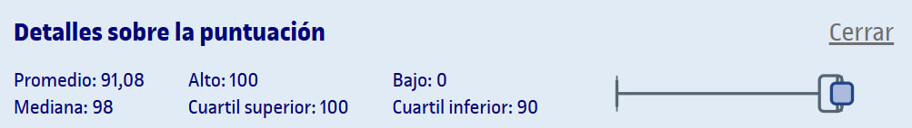

# PEC1 - ¿Qué nos describen los datos que tenemos?

Esta PEC se compone de dos partes:
1. [**Cuestionario WIRIS**](entrega/1_cuestionario/) (80%): Preguntas tipo test sobre el contenido que aparece en los recursos de aprendizaje de la PEC.
2. [**Actividades de R**](entrega/2_actividades_r/) (20%): A partir de un archivo `.rmd` facilitado, debemos realizar los ejercicios y entregar un archivo `.pdf` con el código y los gráficos, así como interpretaciones puntuales de los resultados.

## Recursos de aprendizaje

- [**Estadística descriptiva: Introducción al análisis de datos**](https://aprenentatge.recursos.uoc.edu/continguts/pdf/PID_00269798.pdf)
  - [[RESUMEN] 1. Tipos de datos y su representación gráfica](recursos/introduccion_al_analisis_de_datos/1_tipos_de_datos_y_su_representacion_grafica.md)
  - [[RESUMEN] 2. Medidas de centro y propiedades](recursos/introduccion_al_analisis_de_datos/3_medidas_de_dispersion.md)
  - [[RESUMEN] 3. Medidas de dispersión](recursos/introduccion_al_analisis_de_datos/3_medidas_de_dispersion.md)
- [**Muestreo**](https://aprenentatge.recursos.uoc.edu/continguts/pdf/PID_00269801.pdf) ([resumen](recursos/muestreo.md))
- [**El entorno estadístico R: Estructura, lenguaje y sintaxis**](https://aprenentatge.recursos.uoc.edu/continguts/pdf/PID_00273871.pdf) ([resumen](recursos/fundamentos_de_r.md))
- [**Análisis de datos y estadística descriptiva con R**](https://aprenentatge.recursos.uoc.edu/continguts/pdf/PID_00279912.pdf) ([resumen](recursos/fundamentos_de_r.md))

--- 

## Resultado

### Calificación

- **Calificación cuestionario**: 5,33 / 5,33
- **Calificación sobre**: 10,00 / 10,00

- **Calificación actividades R**: 1,33 / 1,33
- **Calificación sobre 10**: 10,00 / 10,00

- **Calificación original** (cuestionario + actividades R): 6,66 / 6,66
- **Calificación sobre 10**: 10,00 / 10,00
- **Letra (escala internacional)**: A

### Detalles sobre la puntuación

