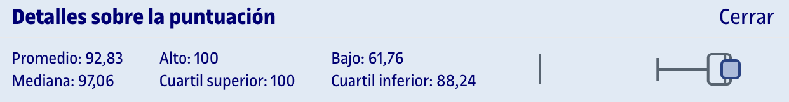
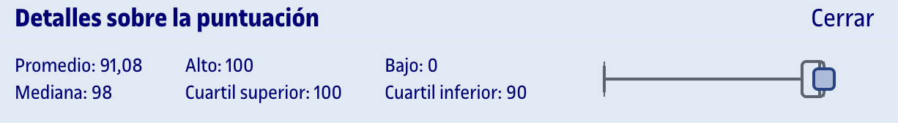

# PEC1 - ¿Qué nos describen los datos que tenemos?

Esta PEC se compone de dos partes:
1. [**Cuestionario WIRIS**](entrega/1_cuestionario/) (80%): Preguntas tipo test sobre el contenido que aparece en los recursos de aprendizaje de la PEC. Se permiten dos intentos, de los cuales cuenta **el último realizado**, independientemente de si la nota es inferior que la del primero.
2. [**Actividades de R**](entrega/2_actividades_r/) (20%): A partir de un archivo `.rmd` facilitado, debemos realizar los ejercicios y entregar un archivo `.pdf` generado con RStudio con el código y los gráficos, así como interpretaciones puntuales de los resultados.

## Recursos de aprendizaje

>[!NOTE]
>- Para evitar posibles infracciones de derechos de autor, los archivos PDF no se incluyen en el repositorio.
>- Con el permiso de [Carlos Cactus](https://t.me/carlos_cactus), he añadido los recursos Sin Espinas que están disponibles públicamente.

- [**Vídeos de apoyo de la UOC sobre este bloque**](recursos/videos)
- [**Estadística descriptiva: Introducción al análisis de datos**](https://aprenentatge.recursos.uoc.edu/continguts/pdf/PID_00269798.pdf) ([Sin Espinas](recursos/sin_espinas-estadistica_descriptiva_y_muestreo.pdf))
- [**Muestreo**](https://aprenentatge.recursos.uoc.edu/continguts/pdf/PID_00269801.pdf) ([Sin Espinas](recursos/sin_espinas-estadistica_descriptiva_y_muestreo.pdf))
- [**R: El entorno estadístico R. Estructura, lenguaje y sintaxis**](https://aprenentatge.recursos.uoc.edu/continguts/pdf/PID_00273871.pdf) ([resumen](recursos/fundamentos_de_r.md))
- [**R: Análisis de datos y estadística descriptiva con R**](https://aprenentatge.recursos.uoc.edu/continguts/pdf/PID_00279912.pdf) ([resumen](recursos/fundamentos_de_r.md)) ([archivos CSV referidos en la actividad](recursos/archivos_r_analisis_de_datos_y_estadística_descriptiva_con_r))

### Recursos complementarios

- [**Guía de R de la UIB (Universitat de les Illes Balears)**](https://aprender-uib.github.io/AprendeR1/)
- [**Actividades resueltas: Estadística descriptiva**](https://aprenentatge.recursos.uoc.edu/continguts/pdf/PID_00279894.pdf) ([archivos CSV de referencia](recursos/archivos_actividades_resueltas_estadistica_descriptiva))
- [**Actividades resueltas: Muestreo**](https://aprenenatge.recursos.uoc.edu/continguts/pdf/PID_00279894.pdf)

--- 

## Resultado

### Calificación

<table>
	<thead>
		<tr>
			<th>EVALUABLE</th>
			<th>C. PONDERADA</th>
			<th>C. SOBRE 100 (ORIGINAL)</th>
		</tr>
	</thead>
	<tbody>
		<tr>
			<td>Cuestionario</td>
			<td>5,33 / 5,33</td>
			<td>100,00 / 100,00</td>
		</tr>
		<tr>
			<td>Actividades R</td>
			<td>1,33 / 1,33</td>
			<td>100,00 / 100,00</td>
		</tr>
		<tr><td colspan="3"></td></tr>
		<tr>
			<td><strong>TOTAL</strong></td>
			<td><strong>6,66 / 6,66</strong></td>
			<td><strong>100,00 / 100,00 (A)</strong></td>
		</tr>
	</tbody>
</table>

### Detalles sobre la puntuación

Cuestionario

Actividades R

