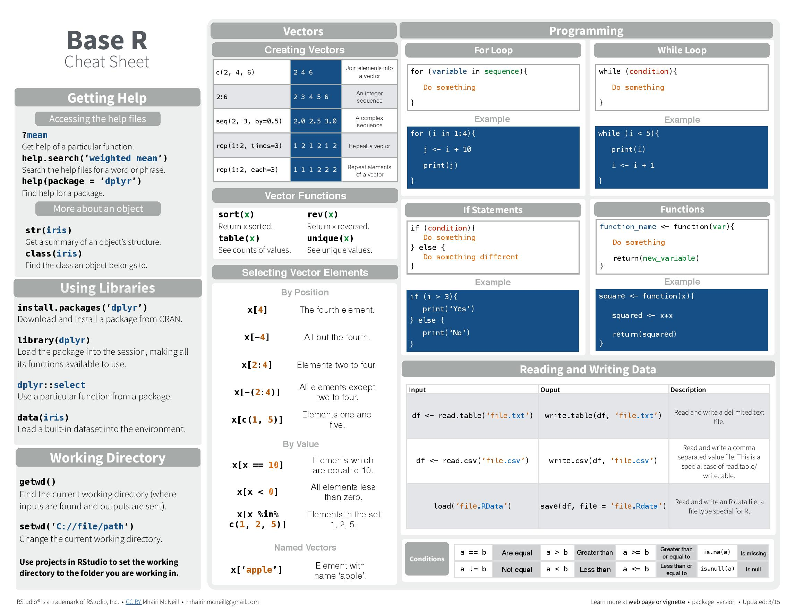
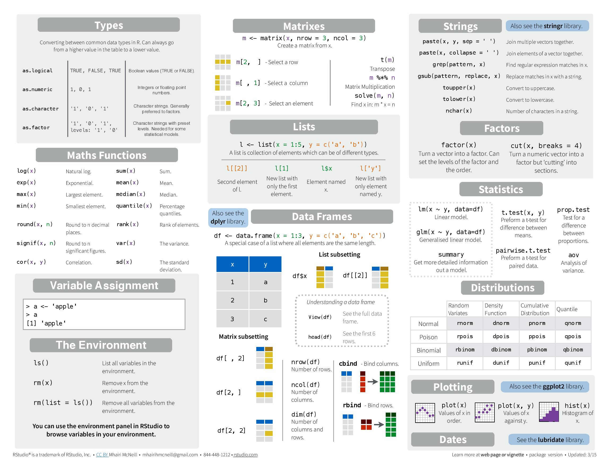
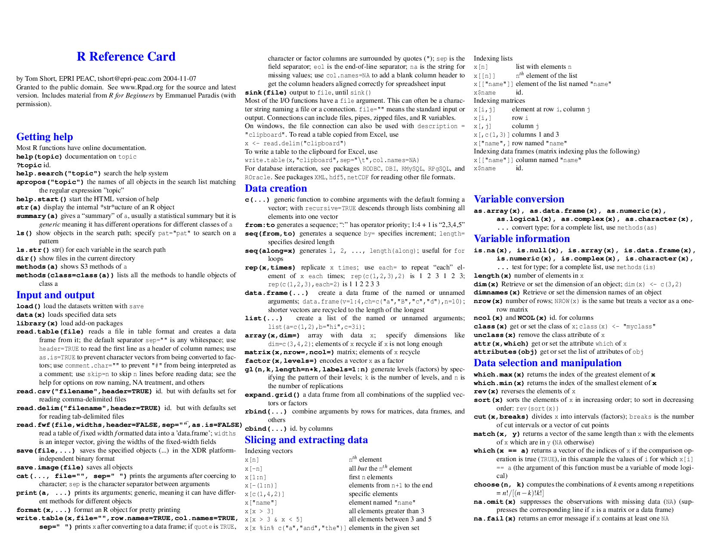
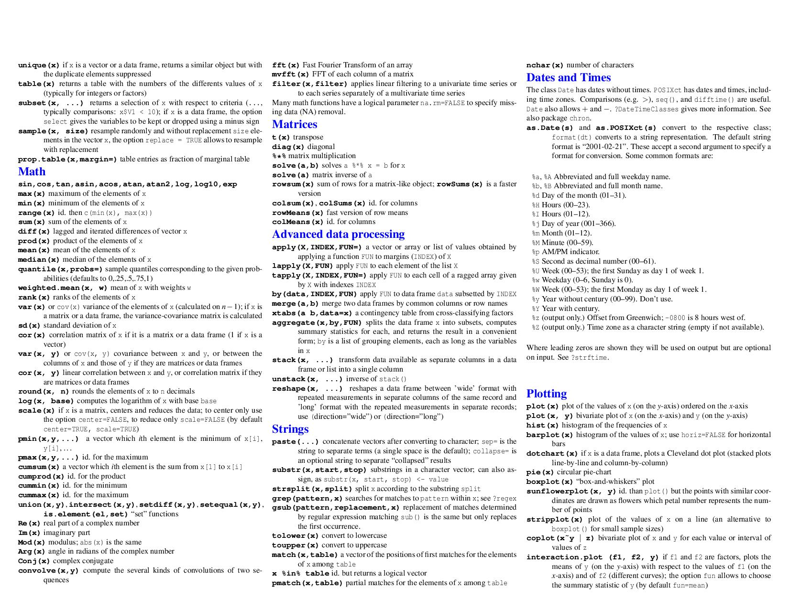
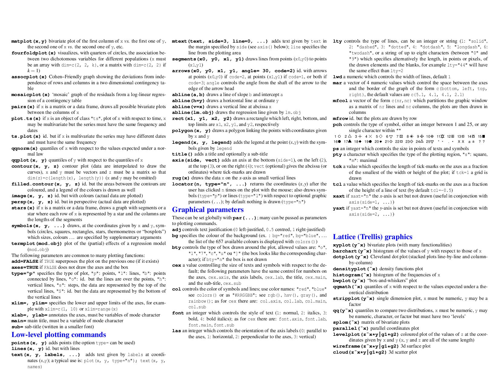
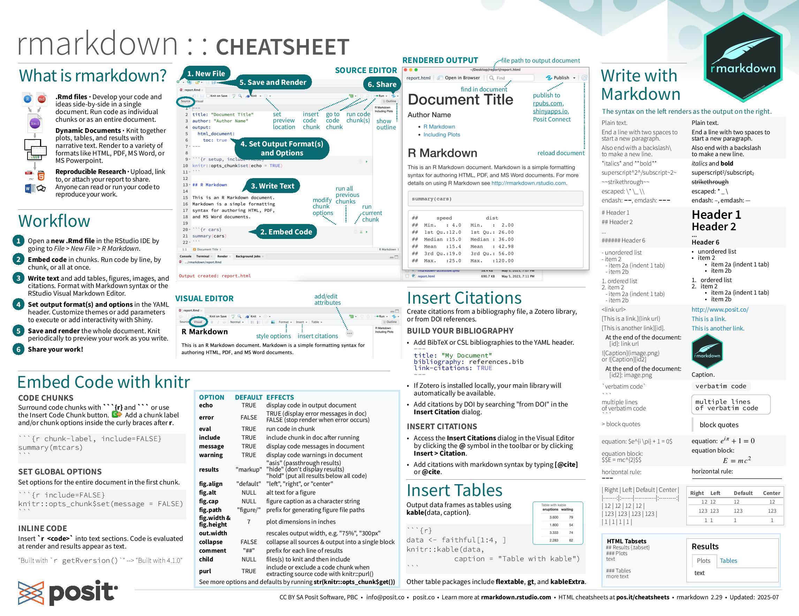
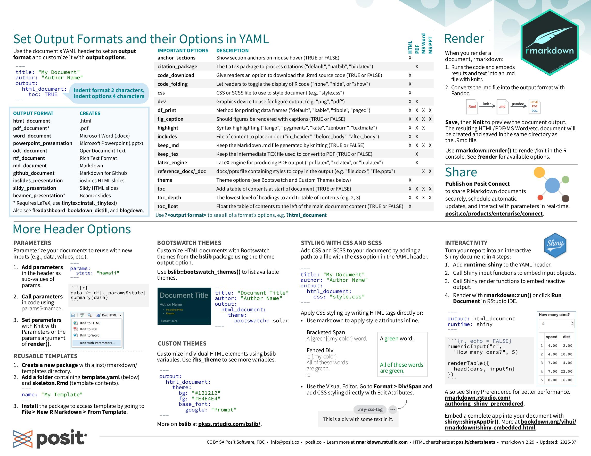

# Fundamentos de R

>[!NOTE]
>Este resumen aglutina los siguientes recursos:
>
>- [**El entorno estadístico R: Estructura, lenguaje y sintaxis**](https://aprenentatge.recursos.uoc.edu/continguts/pdf/PID_00273871.pdf)
>- [**Análisis de datos y estadística descriptiva con R**](https://aprenentatge.recursos.uoc.edu/continguts/pdf/PID_00279912.pdf)

## [Cheat sheet básico](cheat_sheets/base_r.pdf)

>**Fuente**: https://iqss.github.io/dss-workshops/R/Rintro/base-r-cheat-sheet.pdf  
>**Licencia**: [CC BY](https://creativecommons.org/licenses/by/4.0/)  
>**Autor**: Mhairi McNeill

## [Cheat sheet avanzado](cheat_sheets/advanced_r.pdf)

>**Fuente**: https://cran.r-project.org/doc/contrib/Short-refcard.pdf  
>**Licencia**: Granted to the public domain  
>**Autor**: Tom Short

## [RMarkdown](cheat_sheets/rmarkdown.pdf)

>**Fuente**: https://shiny.posit.co/r/articles/build/rm-cheatsheet/  
>**Licencia**: [CC BY SA](https://creativecommons.org/licenses/by/4.0/)  
>**Autor**: Posit Software, PB