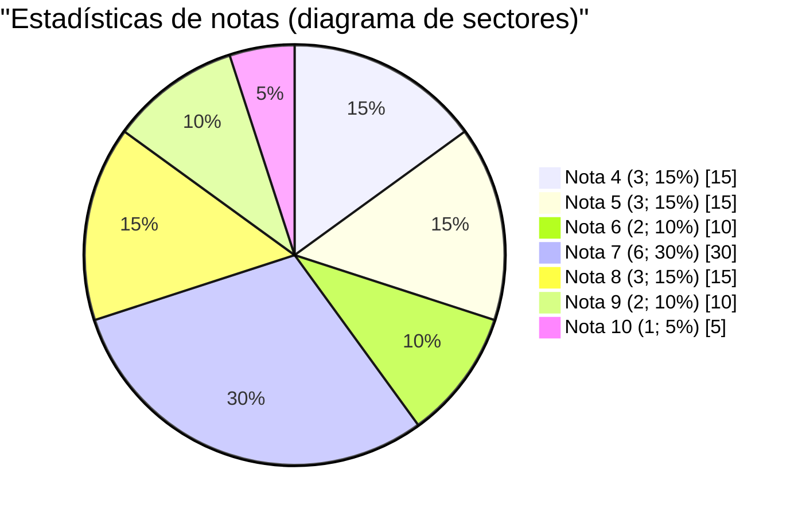
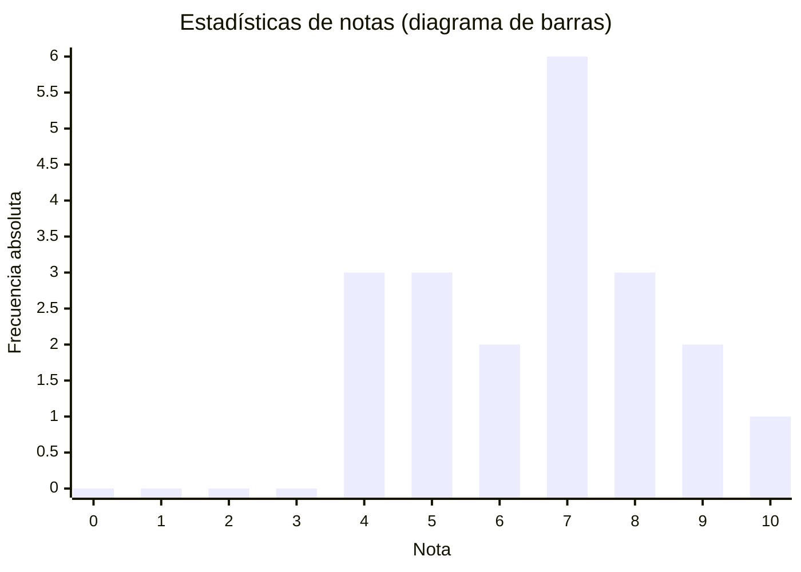

# [RESUMEN] Estadística descriptiva: Introducción al análisis de datos - Tipos de datos y su representación gráfica

## Índice

- [Conceptos básicos](#conceptos-básicos)
- [1. Tipos de variables](#1-tipos-de-variables)
- [2. Variables cualitativas y variables numéricas discretas que toman un número pequeño de valores diferentes](#2-variables-cualitativas-y-variables-numéricas-discretas-que-toman-un-número-pequeño-de-valores-diferentes)
- [3. Variables numéricas](#3-variables-numéricas)
- [4. Variables continuas e histograma](#4-variables-continuas-e-histograma)
	- [4.3. Interpretación de los histogramas](#43-interpretación-de-los-histogramas)

## Conceptos básicos

- **Población**: Conjunto de individuos que se quiere estudiar, en el que los individuos pueden ser tanto objetos como personas.
- **Muestra**: Subconjunto cualquiera de la población.
- **Variable**: Característica de los individuos objeto de nuestro estudio.

## 1. Tipos de variables

1. **Variables cualitativas** (o categóricas): No se expresan numéricamente, sino como categorías o características de los individuos. Ejemplo: asignar un número entero a cada tipo de ordenador posible (1 = PC, 2 = Mac, 3 = Otros).
2. **Variables cuantitativas**: Se expresan de forma numérica. Ejemplo: edad de las personas en años.
	- **Variables cuantitativas discretas**: Sólo toman valores enteros.
	- **Variables cuantitativas continuas**: Pueden tomar cualquier valor en un intervalo.

## 2. Variables cualitativas y variables numéricas discretas que toman un número pequeño de valores diferentes

Tenemos que averiguar estas características para su análisis:
1. El **número total de individuos** de los que se disponen datos ($N$).
2. La **frecuencia absoluta** de cada valor de la variable; es decir, el número de individuos para los cuales la variable toma este valor ($n_i$).
3. La **frecuencia relativa** de cada valor de la variable; es decir, la proporción de individuos en los que la variable toma este valor ($f_i$). 

	Se obtiene con esta fórmula, cuyo resultado es un porcentaje:
	$$f_i = \frac{n_i}{N}$$

>[!NOTE]
>La **frecuencia absoluta** de una categoría es el número de individuos que pertenecen a la categoría.  
>La **frecuencia relativa** de una categoría es la proporción de individuos que pertenecen a ella.

Con este análisis obtenemos la **distribución de las frecuencias de la variable**, la cual se puede representar mediante diagramas **de barras** o diagramas **de sectores**.

**Ejemplo**:

En el semestre anterior las notas de la asignatura de _Estadística_ de un grupo de alumnos fueron las siguientes:

4, 5, 5, 5, 6, 7, 8, 4, 9, 9, 10, 4, 7, 7 ,7 ,7 ,8, 6, 7, 8

A continuación calcularemos la distribución de frecuencias de la variable y añadiremos las
frecuencias acumuladas:

<table>
	<tr>
		<th></th>
		<th>FRECUENCIA ABSOLUTA</th>
		<th>FRECUENCIA RELATIVA</th>
		<th>FRECUENCIA ABSOLUTA ACUMULADA</th>
		<th>FRECUENCIA RELATIVA ACUMULADA</th>
	</tr>
	<tr>
		<td><strong>Nota</strong></td>
		<td>$n_i$</td>
		<td>$f_i$</td>
		<td>$N_i$</td>
		<td>$F_i$</td>
	</tr>
	<tr>
		<td>0</td>
		<td>0</td>
		<td>0</td>
		<td>0</td>
		<td>0</td>
	</tr>
	<tr>
		<td>1</td>
		<td>0</td>
		<td>0</td>
		<td>0</td>
		<td>0</td>
	</tr>
	<tr>
		<td>2</td>
		<td>0</td>
		<td>0</td>
		<td>0</td>
		<td>0</td>
	</tr>
	<tr>
		<td>3</td>
		<td>0</td>
		<td>0</td>
		<td>0</td>
		<td>0</td>
	</tr>
	<tr>
		<td>4</td>
		<td>3</td>
		<td>0,15 = 15%</td>
		<td>3</td>
		<td>0,15 = 15%</td>
	</tr>
	<tr>
		<td>5</td>
		<td>3</td>
		<td>0,15 = 15%</td>
		<td>6</td>
		<td>0,3 = 30%</td>
	</tr>
	<tr>
		<td>6</td>
		<td>2</td>
		<td>0,1 = 10%</td>
		<td>8</td>
		<td>0,4 = 40%</td>
	</tr>
	<tr>
		<td>7</td>
		<td>6</td>
		<td>0,3 = 30%</td>
		<td>14</td>
		<td>0,7 = 70%</td>
	</tr>
	<tr>
		<td>8</td>
		<td>3</td>
		<td>0,15 = 15%</td>
		<td>17</td>
		<td>0,85 = 85%</td>
	</tr>
	<tr>
		<td>9</td>
		<td>2</td>
		<td>0,1 = 10%</td>
		<td>19</td>
		<td>0,95 = 95%</td>
	</tr>
	<tr>
		<td>10</td>
		<td>1</td>
		<td>0,05 = 5%</td>
		<td>20</td>
		<td>1 = 100%</td>
	</tr>
	<tr>
		<td><strong>Totales</strong></td>
		<td>20</td>
		<td></td>
		<td></td>
		<td></td>
	</tr>
</table>

## 3. Variables numéricas

Tenemos que averiguar estas características para su análisis:

- Cuántos individuos aparecen en el estudio ($N$).
- El **máximo** (_máx_) y el **mínimo** (_mín_) de los valores que toma la variable.
- El **rango de la variable**; es decir, la diferencia entre el valor máximo y el mínimo.

Para representar este tipo de variables, se usan diagramas **de puntos** o **de tallo y hojas**.

**Ejemplo**:

Datos de un estudio sobre los días de hospitalización de un grupo:

15, 15, 3, 46, 623, 126, 64 días

Representación de los datos en un diagrama de puntos:

>[!NOTE]
>Un dato alejado de los otros o que está fuera del patrón previsible es un **dato atípico** o **dato extremo** (**outlier**).

Representación de los datos en un diagrama de tallo y hojas:

<table>
	<tr>
		<th>TALLO</th>
		<th>HOJAS</th>
	</tr>
	<tr>
		<td>0</td>
		<td>3</td>
	<tr>
		<td>1</td>
		<td>5 5</td>
	</tr>
	<tr>
		<td>4</td>
		<td>6</td>
	</tr>
	<tr>
		<td>6</td>
		<td>4</td>
	</tr>
	<tr>
		<td>12</td>
		<td>6</td>
	</tr>
		<td>62</td>
		<td>3</td>
	</tr>
</table>

>[!NOTE]
>- Las **hojas** contienen las unidades, mientras que el tallo contiene el resto de cifras. 
>- Los **datos** en este diagrama tienen que presentarse ordenados de manera creciente.

## 4. Variables continuas e histograma

Cuando una variable numérica tiene muchos valores diferentes, se agrupan los datos y se representa la **distribución de frecuencias**.

Pasos para obtener una expresión de la distribución de frecuencias:

1. Agrupar las observaciones en intervalos (**clases**) que van desde el valor mínimo hasta el máximo.
2. Calcular el punto medio de cada intervalo (**marca de clase)**.
3. Calcular la **frecuencia absoluta acumulada** de la clase y la **frecuencia relativa acumulada**.

Para representar la frecuencia, se usan **histogramas**. Son parecidos a los diagramas de barras, con la diferencia de que no hay espacios entre los rectángulos para representar los rangos contiguos.

**Ejemplo**:

El 20% de los participantes de una encuesta ve la TV menos de 2 horas, mientras que el 80% la ve 2 horas o más, pero menos de 4 horas.

<table>
	<tr>
		<th>CLASES</th>
		<th>$f_i$</th>
	</tr>
	<tr>
		<td>[0,2)</td>
		<td>20%</td>
	</tr>
	<tr>
		<td>[2,4)</td>
		<td>80%</td>
	</tr>
</table>

La suma de las áreas de los dos rectángulos es:

$$2 \cdot 20\% + 2 \cdot 80\% = 0,4 + 1,6 = 2$$

### 4.3. Interpretación de los histogramas

