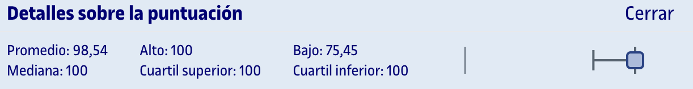
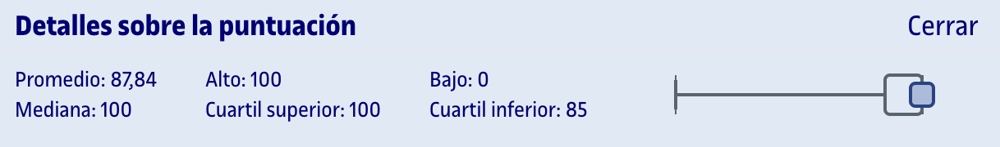

# PEC2 - Probabilidad y variables aleatorias I

Esta PEC se compone de dos partes:
1. [**Cuestionario WIRIS**](entrega/1_cuestionario/) (80%): Preguntas tipo test sobre el contenido que aparece en los recursos de aprendizaje de la PEC. Se permiten dos intentos, de los cuales cuenta **el último realizado**, independientemente de si la nota es inferior que la del primero.
2. [**Actividades de R**](entrega/2_actividades_r/) (20%): A partir de un archivo `.rmd` facilitado, debemos realizar los ejercicios y entregar un archivo `.pdf` generado con RStudio con el código y los gráficos, así como interpretaciones puntuales de los resultados.

## Recursos de aprendizaje

>[!NOTE]
>- No se incluyen los archivos `pdf` en el repositorio para evitar posibles problemas de copyright.
>- Con el permiso de [Carlos Cactus](https://t.me/carlos_cactus), he añadido los recursos Sin Espinas que están disponibles públicamente.

- [**Probabilidad y variables aleatorias**](https://aprenentatge.recursos.uoc.edu/continguts/pdf/PID_00273858.pdf) ([Sin Espinas](pec2/recursos/sin_espinas-probabilidad.pdf))
- [**Distribuciones de probabilidad e inferencia estadística con R**](https://aprenentatge.recursos.uoc.edu/continguts/pdf/PID_00279914.pdf) ([Sin Espinas](pec2/recursos/sin_espinas-probabilidad.pdf))

--- 

## Resultado

### Calificación

<table>
	<thead>
		<tr>
			<th>EVALUABLE</th>
			<th>C. PONDERADA</th>
			<th>C. SOBRE 100 (ORIGINAL)</th>
		</tr>
	</thead>
	<tbody>
		<tr>
			<td>Cuestionario</td>
			<td>5,34 / 5,34</td>
			<td>100,00 / 100,00</td>
		</tr>
		<tr>
			<td>Actividades R</td>
			<td>1,34 / 1,34</td>
			<td>100,00 / 100,00</td>
		</tr>
		<tr><td colspan="3"></td></tr>
		<tr>
			<td><strong>TOTAL</strong></td>
			<td><strong>6,68 / 6,68</strong></td>
			<td><strong>100,00 / 100,00 (A)</strong></td>
		</tr>
	</tbody>
</table>

### Detalles sobre la puntuación

**Cuestionario**

**Actividades R**

