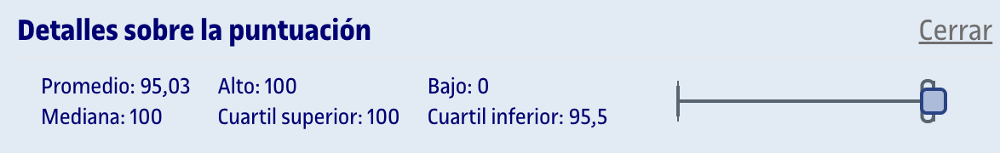
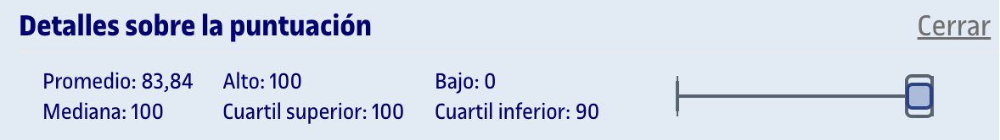

# PEC3 - Probabilidad y variables aleatorias II

Esta PEC se compone de dos partes:
1. [**Cuestionario WIRIS**](entrega/1_cuestionario/) (80%): Preguntas tipo test sobre el contenido que aparece en los recursos de aprendizaje de la PEC.
2. [**Actividades de R**](entrega/2_actividades_r/) (20%): A partir de un archivo `.rmd` facilitado, debemos realizar los ejercicios y entregar un archivo `.pdf` con el código y los gráficos, así como interpretaciones puntuales de los resultados.

## Recursos de aprendizaje

>[!NOTE]
>- No se incluyen los archivos `pdf` en el repositorio para evitar posibles problemas de copyright.
>- Con el permiso de [Carlos Cactus](https://t.me/carlos_cactus), he añadido los recursos Sin Espinas que están disponibles públicamente.

- [**Probabilidad y variables aleatorias**](https://aprenentatge.recursos.uoc.edu/continguts/pdf/PID_00273858.pdf) ([Sin Espinas](pec2/recursos/sin_espinas-probabilidad.pdf))
- [**Distribuciones de probabilidad e inferencia estadística con R**](https://aprenentatge.recursos.uoc.edu/continguts/pdf/PID_00279914.pdf) ([Sin Espinas](pec2/recursos/sin_espinas-probabilidad.pdf))

--- 

## Resultado

### Calificación

**Calificación cuestionario**:

- **Calificación ponderada**: 5,33 / 5,33
- **Calificación original**: 100,00 / 100,00

**Calificación actividades R**:

- **Calificación ponderada**: 1,26 / 1,33
- **Calificación sobre original**: 95,00 / 100,00

**Calificación total**:

- **Calificación ponderada** (cuestionario + actividades R): 6,59 / 6,66
- **Calificación original**: 97,50 / 10,00
- **Letra (escala internacional)**: A

### Detalles sobre la puntuación

**Cuestionario**:

**Actividades R**:

