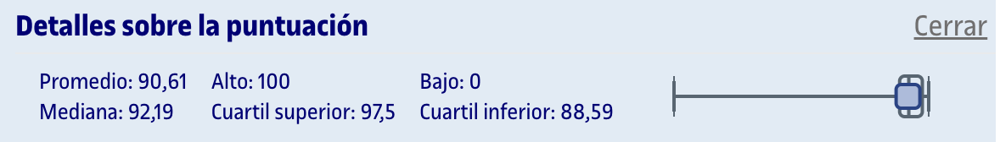
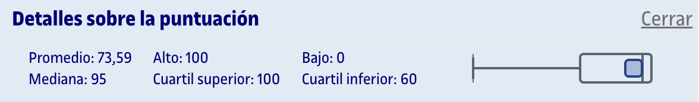

# PEC5 - Inferencia estadística II: Contrastes de hipótesis

Esta PEC se compone de dos partes:
1. [**Cuestionario WIRIS**](entrega/1_cuestionario/) (80%): Preguntas tipo test sobre el contenido que aparece en los recursos de aprendizaje de la PEC. Se permiten dos intentos, de los cuales cuenta **el último realizado**, independientemente de si la nota es inferior que la del primero.
2. [**Actividades de R**](entrega/2_actividades_r/) (20%): A partir de un archivo `.rmd` facilitado, debemos realizar los ejercicios y entregar un archivo `.pdf` generado con RStudio con el código y los gráficos, así como interpretaciones puntuales de los resultados.

## Recursos de aprendizaje

>[!NOTE]
>- Para evitar posibles infracciones de derechos de autor, los archivos PDF no se incluyen en el repositorio.
>- Con el permiso de [Carlos Cactus](https://t.me/carlos_cactus), he añadido los recursos Sin Espinas que están disponibles públicamente.

- [**Vídeos de apoyo de la UOC sobre este bloque**](recursos/videos)
- [**Contraste de hipótesis**](https://aprenentatge.recursos.uoc.edu/continguts/pdf/PID_00268873.pdf) ([Sin Espinas](recursos/sin_espinas-contraste_de_hipotesis.pdf))
- [**Contraste de dos muestras**](https://aprenentatge.recursos.uoc.edu/continguts/pdf/PID_00268875.pdf)

### Recursos complementarios

- [**Guía de R de la UIB (Universitat de les Illes Balears)**](https://aprender-uib.github.io/AprendeR1/)
- [**Actividades resueltas: Contraste de hipótesis**](https://aprenentatge.recursos.uoc.edu/continguts/pdf/PID_00279906.pdf)
- [**Actividades resueltas: Contraste de hipótesis de dos muestras**](https://aprenentatge.recursos.uoc.edu/continguts/pdf/PID_00279908.pdf)

--- 

## Resultado

### Calificación

<table>
	<thead>
		<tr>
			<th>EVALUABLE</th>
			<th>C. PONDERADA</th>
			<th>C. SOBRE 100 (ORIGINAL)</th>
		</tr>
	</thead>
	<tbody>
		<tr>
			<td>Cuestionario</td>
			<td>4,91 / 5,34</td>
			<td>91,81 / 100,00</td>
		</tr>
		<tr>
			<td>Actividades R</td>
			<td>1,21 / 1,34</td>
			<td>90,00 / 100,00</td>
		</tr>
		<tr><td colspan="3"></td></tr>
		<tr>
			<td><strong>TOTAL</strong></td>
			<td><strong>6,12 / 6,68</strong></td>
			<td><strong>91,62 / 100,00 (A)</strong></td>
		</tr>
	</tbody>
</table>

### Detalles sobre la puntuación

Cuestionario

Actividades R

