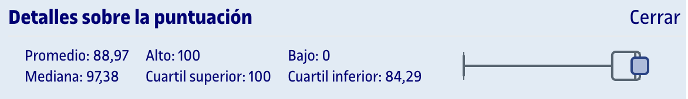
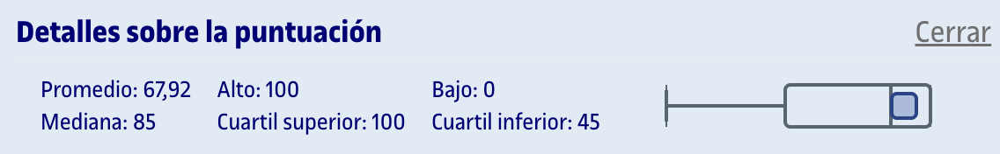

# PEC6 - Regresión

Esta PEC se compone de dos partes:
1. [**Cuestionario WIRIS**](entrega/1_cuestionario/) (80%): Preguntas tipo test sobre el contenido que aparece en los recursos de aprendizaje de la PEC. Se permiten dos intentos, de los cuales cuenta **el último realizado**, independientemente de si la nota es inferior que la del primero.
2. [**Actividades de R**](entrega/2_actividades_r/) (20%): A partir de un archivo `.rmd` facilitado, debemos realizar los ejercicios y entregar un archivo `.pdf` generado con RStudio con el código y los gráficos, así como interpretaciones puntuales de los resultados.

## Recursos de aprendizaje

>[!NOTE]
>- No se incluyen los archivos `pdf` en el repositorio para evitar posibles problemas de copyright.
>- Con el permiso de [Carlos Cactus](https://t.me/carlos_cactus), he añadido los recursos Sin Espinas que están disponibles públicamente.

- [**Regresión lineal simple**](https://aprenentatge.recursos.uoc.edu/continguts/pdf/PID_00269795.pdf) ([Sin Espinas](pec6/recursos/sin_espinas-regresion_lineal.pdf))
- [**Modelos de regresión y análisis multivariante con R**](https://aprenentatge.recursos.uoc.edu/continguts/pdf/PID_00280894.pdf)
- [Opcional] [**Regresión lineal múltiple**](https://aprenentatge.recursos.uoc.edu/continguts/pdf/PID_00268877.pdf)
- [Opcional] [**El análisis de la varianza**](https://aprenentatge.recursos.uoc.edu/continguts/pdf/PID_00269800.pdf)

--- 

## Resultado

### Calificación

<table>
	<thead>
		<tr>
			<th>EVALUABLE</th>
			<th>C. PONDERADA</th>
			<th>C. SOBRE 100 (ORIGINAL)</th>
		</tr>
	</thead>
	<tbody>
		<tr>
			<td>Cuestionario</td>
			<td>5,33 / 5,33</td>
			<td>100,00 / 100,00</td>
		</tr>
		<tr>
			<td>Actividades R</td>
			<td>1,20 / 1,33</td>
			<td>90,00 / 100,00</td>
		</tr>
		<tr><td colspan="3"></td></tr>
		<tr>
			<td><strong>TOTAL</strong></td>
			<td><strong>6,53 / 6,66</strong></td>
			<td><strong>95,00 / 100,00 (A)</strong></td>
		</tr>
	</tbody>
</table>

### Detalles sobre la puntuación

Cuestionario

Actividades R

