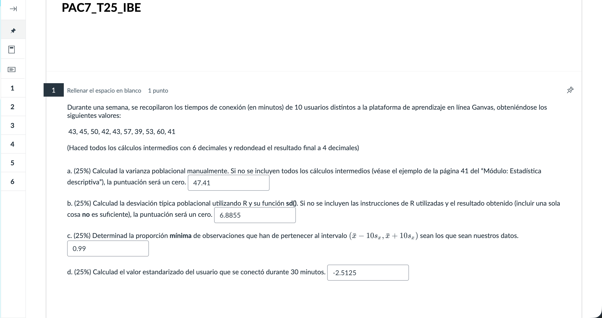
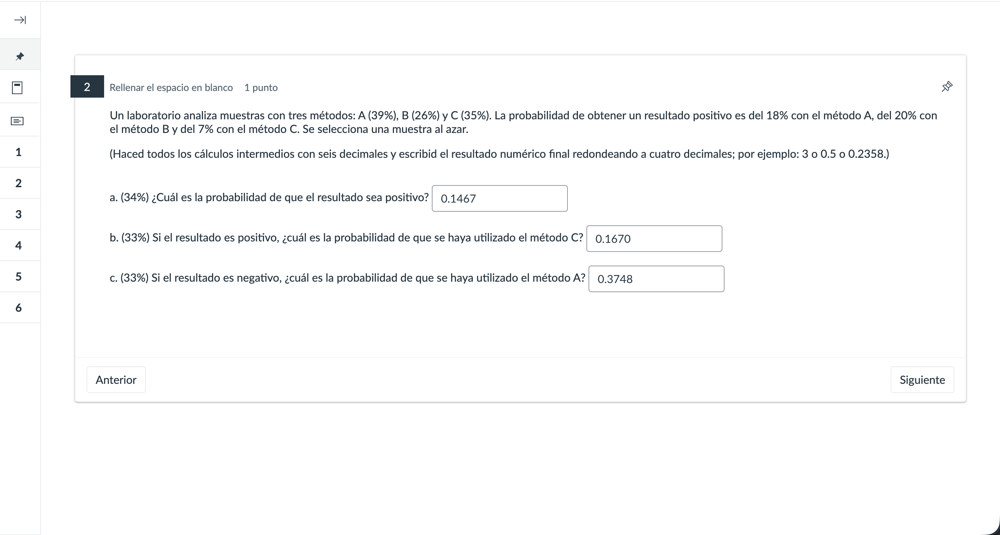
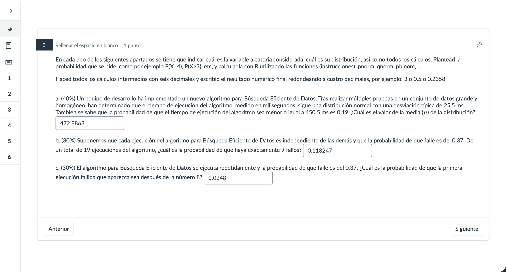
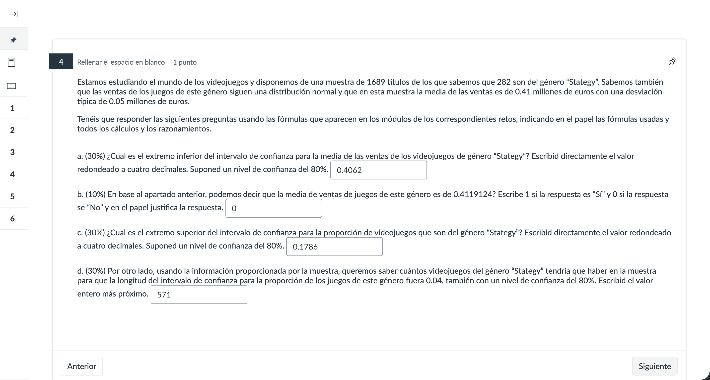
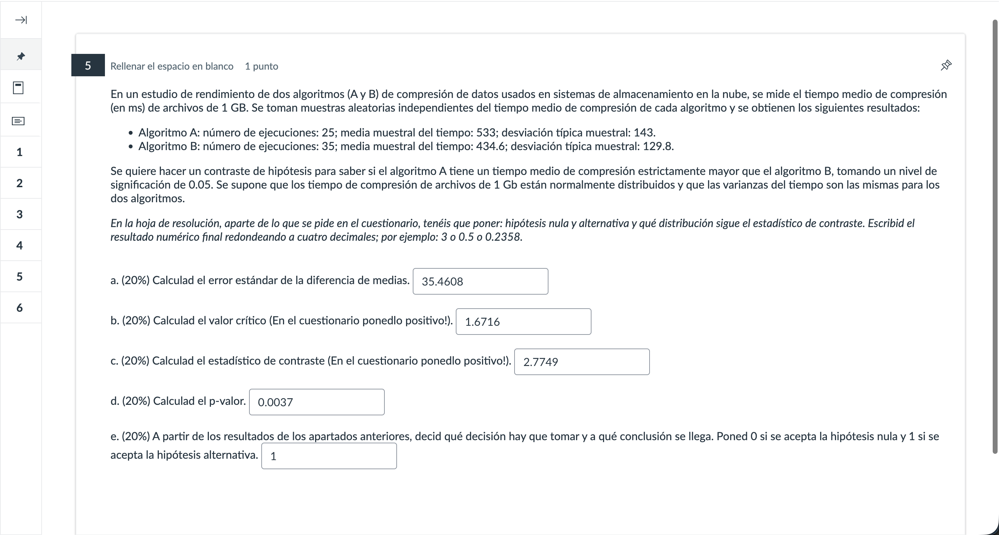
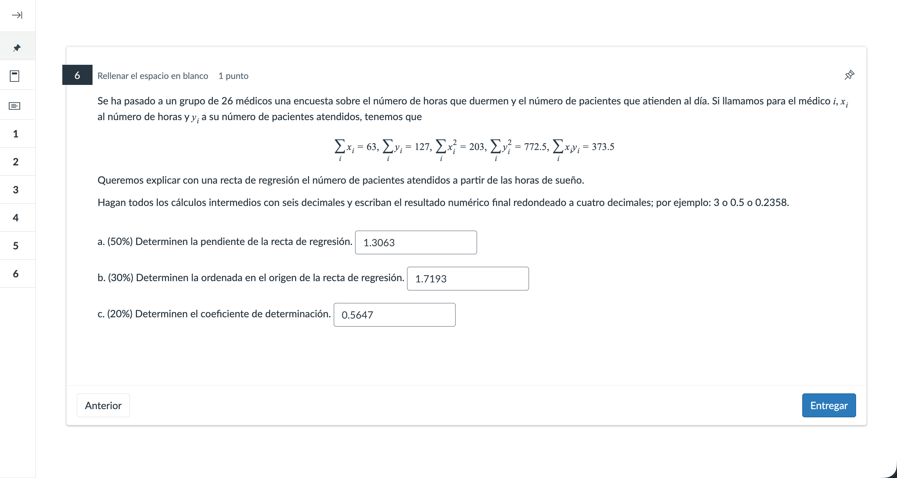
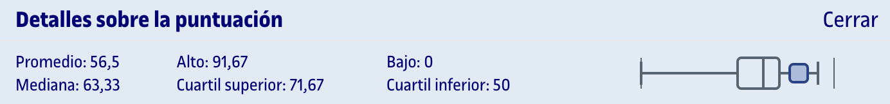

# PEC7 - Cuestionario de síntesis

- [Desglose de ejercicios](#desglose-de-ejercicios)
	- [Ejercicio 1](#ejercicio-1)
	- [Ejercicio 2](#ejercicio-2)
	- [Ejercicio 3](#ejercicio-3)
	- [Ejercicio 4](#ejercicio-4)
	- [Ejercicio 5](#ejercicio-5)
	- [Ejercicio 6](#ejercicio-6)
- [Orientaciones para la PEC](#orientaciones-para-la-pec)
- [Resultado](#resultado)
	- [Calificación](#calificación)
	- [Detalles sobre la puntuación](#detalles-sobre-la-puntuación)

 

## Desglose de ejercicios

[Entrega en papel evaluada](entrega_evaluada.pdf)

>[!IMPORTANT]
>Los resultados de los ejercicios mostrados en las capturas **NO están corregidos**.

### Ejercicio 1

### Ejercicio 2

### Ejercicio 3

### Ejercicio 4

### Ejercicio 5

### Ejercicio 6

## Orientaciones para la PEC

**¿Cuándo se realizará y cuánto tiempo tendré?**

Tendréis 2 horas (+ 15min para escanear) para realizar la PEC7. Podréis comenzar en cualquier momento entre las 10:00h del primer día y las 18:00h del último día. A las 20:00h del último día se cerrará automáticamente el cuestionario y no podréis hacer ningún cambio.

**¿Cómo será la PEC?**

Es un cuestionario con un conjunto de ejercicios con un nivel de dificultad similar a los ejercicios realizados en las PECs anteriores.

**¿Cómo debe ser la resolución?**

Tendréis que:
1) Resolver los ejercicios en papel en blanco (paso a paso, explicando lo que hacéis e interpretando los resultados).
2) Introducir la solución de cada ejercicio en el cuestionario).
3) Escanear las hojas con la resolución, generar un documento en formato pdf, y adjuntarlo (tendréis la opción al final del cuestionario). Es vuestra responsabilidad que el pdf se pueda leer bien e incluya la resolución de todos los ejercicios (os recomiendo enumerar las hojas e indicar claramente el ejercicio que se resuelve en cada hoja). La resolución debe ser clara y completa.

También se puede utilizar una tableta gráfica **para escribir a mano** la resolución de los problemas y generar el correspondiente PDF directamente (**debe ser con escritura manual**). No se aceptarán archivos generados con procesadores de texto.

**¿Qué materiales puedo usar?**

Sólo podéis utilizar una calculadora no programable; no se aceptarán resoluciones donde se utilicen CalcMe, R y/o softwares similares. También podéis consultar apuntes y el formulario, ya sea en papel o en formato digital.

Sólo podéis utilizar R para obtener valores críticos y calcular probabilidades asociadas a distribuciones de probabilidad, a no ser que se diga explícitamente lo contrario.

**¿Y si tengo dudas durante la resolución?**

Os aconsejamos escribir en la resolución la duda y los supuestos hechos para poder resolver los ejercicios. No se resolverán dudas de manera inmediata.

**Otras consideraciones**: Se puede escanear la resolución utilizando el móvil (tenéis programas gratuitos como el camscanner).

**Copia**

Está totalmente prohibido copiar. 

Tal como se indica en la normativa académica de la Universidad: "El proceso de evaluación (...) se fundamenta en el trabajo personal del estudiante y presupone la autenticidad de la autoría y la originalidad de los ejercicios realizados "(pág. 37).

Se define como copia la entrega de actividades de evaluación continua utilizando parcialmente o totalmente textos / resoluciones idénticas extraídas de trabajos de otros estudiantes, autores o softwares. Los responsables serán todos los estudiantes implicados sin que sea relevante el vínculo existente entre estos.

En caso de detectar copia en los trabajos entregados para evaluar, las actuaciones para todos los implicados serán las siguientes:

La nota final será D.
Esta conducta quedará reflejada en un registro a disposición de todo el profesorado por si considera oportuno revisar el resto de actividades de evaluación continua de las asignaturas en curso de los estudiantes implicados.
En caso de detectar copia, desde la asesoría jurídica iniciará un procedimiento disciplinario de acuerdo con la normativa académica de la UOC.

---

## Resultado

### Calificación

<table>
	<thead>
		<tr>
			<th>EVALUABLE</th>
			<th>C. ORIGINAL</th>
			<th>C. SOBRE 10</th>
		</tr>
	</thead>
	<tbody>
		<tr>
			<td>Entrega</td>
			<td>49,00 / 60,00</td>
			<td>81,67 / 100,00 (B)</td>
		</tr>
	</tbody>
</table>

### Detalles sobre la puntuación

