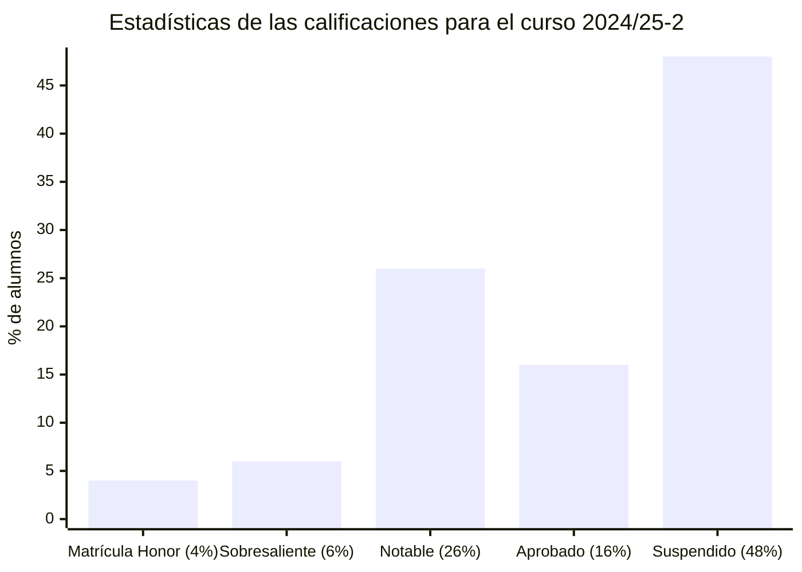

# Fundamentos de computadores (24/25-2)

## Información sobre la asignatura

- **Curso**: 2024/25 (2º semestre)
- **Tipo**: Básica
- **Método de evaluación**: Evaluación continua (70%: PECs 50% + PR 50%) + Examen (30%)
- **Créditos**: 6
- [**Plan docente**](https://apps.uoc.edu/PlaDocent/PlaDocent?Semestre=20242&SignatureCode=75.562&Context=3&Locale=es)

>

>	
Leyenda de calificaciones

>
>	- **Matrícula de Honor (M)**: 9 a 10
>	- **Sobresaliente (EX)**: 9 a 10
>	- **Notable (NO)**: 7 a 8,99
>	- **Aprobado (A)**: 5 a 6,99
>	- **Suspendido (SU)**: 0 a 4,99
>

## Resumen de calificaciones

>[!NOTE]
>La calificación final es la que aparece en mi expediente. No tiene por qué ser, necesariamente, el resultado de la suma de las calificaciones ponderadas de los bloques.

<table>
	<tr>
		<th>BLOQUE</th>
		<th>DESGLOSE</th>
		<th>ACTIVIDAD</th>
		<th>CALIFICACIÓN</th>
		<th>CALIFICACIÓN PONDERADA</th>
	</tr>
	<tr>
		<td rowspan="4">
			<strong>Evaluación continua (EC)</strong> (70%)
		</td>
		<td rowspan="3">
			<strong>
				Pruebas de evaluación continua (PEC)
			</strong>
			(50%)
		</td>
		<td>
			<a href="pec1">
				PEC1 - ¿Estás preparado para adentrarte en el mundo de los computadores digitales?
			</a> (20%)
		</td>
		<td>
			17,00 / 20,00 (B)
		</td>
		<td rowspan="4">
			

				<strong>Calificación total PECs</strong>:
				 
				- / 100,00
			

			 
			

				<strong>Calificación ponderada EC</strong>:
				 
				- / 7,00
			

		</td>
	</tr>
	<tr>
		<td>
			<a href="pec2">
				PEC2 - Diseñando circuitos combinacionales
			</a> (40%)
		</td>
		<td>
			- / 40,00 ( )
		</td>
	</tr>
	<tr>
		<td>
			<a href="pec3">
				PEC3 - De los sistemas combinacionales a los sistemas secuenciales: diseñando circuitos con memoria
			</a> (40%)
		</td>
		<td>
			- / 40,00 ( )
		</td>
	</tr>
	<tr>
		<td>
			<strong>Práctica (PR)</strong> 
			(50%)
		</td>	
		<td>
			<a href="pr1">
				PR1 - Máquinas de estados: entendiendo la arquitectura básica de un computador a partir de las máquinas algorítmicas generalizables
			</a> (100%)
		</td>
		<td>- / 100,00 ( )</td>
	</tr>
	<tr>
		<td>
			<a href="examen">
				<strong>Examen</strong>
			</a> (30%)
		</td>
		<td colspan="2"></td>
		<td>- / 10,00</td>
		<td>- / 3,00</td>
	</tr>
	<tr>
		<td colspan="4">
		</td>
		<td></td>
	</tr>
	<tr>
		<td colspan="4">
			<strong>CALIFICACIÓN FINAL</strong>
		</td>
		<td>- / 10,00 ( )</td>
	</tr>
</table>

## Recursos de aprendizaje

>[!NOTE]
>- En lugar de usar los recursos provistos por la UOC, recomiendo seguir [estas playlists de YouTube](https://www.youtube.com/@carlosguerrerouib6095/playlists) realizadas por el canal [Carlos Guerrero UIB](https://www.youtube.com/@carlosguerrerouib6095).
>- No se incluyen los archivos `pdf` en el repositorio para evitar posibles problemas de copyright.

### PEC1

- [Introducción a los fundamentos de los computadores](http://cvapp.uoc.edu/autors/MostraPDFMaterialAction.do?id=163597&hash=a3d202a21bbd987bcfdbd5d776fa43055248db91bf102dc2236fe32f68d046dc) ([resumen](pec1/recursos/introduccion_a_los_fundamentos_de_los_computadores_resumen.md))
- [Representación de la información](http://cvapp.uoc.edu/autors/MostraPDFMaterialAction.do?id=215618&hash=b0ce9d7416c3a91666d084bf823e8406a4abdcc0e2787d3d1024d81137e6796f) ([resumen](pec1/recursos/representacion_de_la_informacion_resumen.md))

### PEC2

- [Los circuitos lógicos combinacionales](http://cvapp.uoc.edu/autors/MostraPDFMaterialAction.do?id=215620&hash=dcd88579656e2413ea29712f929c6a1bb3fea6655c0dc503f4246beef6e558a2) ([resumen](pec2/recursos/los_circuitos_logicos_combinacionales_resumen.md))

### PEC3

- [Los circuitos lógicos secuenciales](http://cvapp.uoc.edu/autors/MostraPDFMaterialAction.do?id=215619&hash=d25026dd14b3ee362d765576d3893c40b200af038100e77bc444144a21df7985) ([resumen](pec3/recursos/los_circuitos_logicos_secuenciales_resumen.md))

### PR1

- [Estructura básica de un computador: el procesador como generalización de las máquinas de estados algorítmicos](https://materials.campus.uoc.edu/daisy/Materials/PID_00279131/pdf/PID_00279131.pdf) ([resumen](pec4/recursos/estructura_basica_de_un_computador_resumen.md))