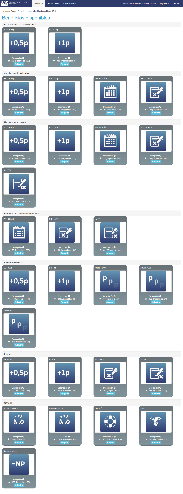
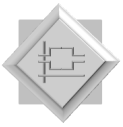
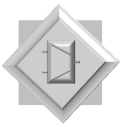

# Ejercicios VerilUOC

- [¿Qué es VerilUOC?](#qué-es-veriluoc)
- [¿Cómo se usa?](#cómo-se-usa)
	- [Windows](#windows)
	- [macOS](#macos)
- [Beneficios PyPAC](#beneficios-pypac)
- [Logros](#logros)
- [Ejercicios](#ejercicios)
	- [Desglose de puntuación](#desglose-de-puntuación)
	- [VerilCirc](#verilcirc)
	- [KeMAP](#kemap)
	- [VerilChart](#verilchart)

 

## ¿Qué es VerilUOC?

>VerilUOC es una herramienta de apoyo al autoaprendizaje para la resolución de las PECs y Práctica de Fundamentos de Computadores. Actualmente, esta herramienta permite verificar automáticamente un subconjunto de los ejercicios relacionados con el diseño y análisis de circuitos digitales. Además todas las herramientas, permiten exportar los resultados en formato imagen, lo que reduce el tiempo de edición necesario realizar las actividades de la asignatura.
>
>Concretamente, las herramientas que podemos encontrar dentro de VerilUOC son:
>
>- **VerilCirc**: Verificación de circuitos digitales
>- **KeMAP**: Verificación de mapas de Karnaugh
>- **VerilChart**: Verificación de cronogramas de tiempo y tablas de verdad.
>
>El cliente de VerilUOC es una aplicación Java multiplataforma que utiliza el programa base LogiSim. No hace falta ningún tipo de instalación. El único requerimiento es tener instalado JAVA (1.8, a día de la escritura de este documento) y acceso a Internet para autenticarse con vuestro login/password del campus de la UOC.
>
>>Información extraída de la [Wiki de VerilUOC](https://eimtveril.uoc.edu/mediawiki/es/Inicio).

## ¿Cómo se usa?

### Windows

1. Instalar Java 1.8.
2. Descargar el archivo [`VerilUOC_3.3.5.jar`](VerilUOC_3.3.5.jar)
3. Abrirlo y pulsar la opción `Simular > Verificación` para iniciar sesión con vuestro usuario de la UOC.

### macOS

>[!NOTE]
>Si al abrir el archivo `.app` en macOS aparece una alerta con el texto _La app "VerilUOC_3.3.6.dmg" no se ha abierto porque contiene software malicioso. Esta acción no ha dañado tu Mac_, sigue [estos pasos](https://support.apple.com/es-es/guide/mac-help/mh40596/mac) para poder ejecutarlo correctamente.
>
>Esta alerta aparece porque la aplicación no está firmada, no porque contenga software malicioso.

1. Descargar el archivo [`VerilUOC_3.3.6.dmg`](VerilUOC_3.3.6.dmg)
2. Abrirlo y pulsar la opción `Simular > Verificación` para iniciar sesión con vuestro usuario de la UOC.

## Beneficios PyPAC

>[!IMPORTANT]
>Los puntos necesarios para obtener cada beneficio y el efecto del mismo está sujeto a cambiar de un semestre a otro.

	
Haz click aquí para desplegar la imagen con todos los beneficios del curso 2024/25-2

	

## Logros

<table>
	<tr>
		<th>LOGRO</th>
		<th>BRONCE</th>
		<th>DESCRIPCIÓN</th>
		<th>PLATA</th>
		<th>DESCRIPCIÓN</th>
		<th>ORO</th>
		<th>DESCRIPCIÓN</th>
	</tr>
	<tr>
		<td><strong>Reto Inicial</strong></td>
		<td>$\emptyset$</td>
		<th>$\emptyset$</th>
		<td>$\emptyset$</td>
		<td>$\emptyset$</td>
		<td>
			
		</td>
		<td>Verificar correctamente el ejercicio AND2.</td>
	</tr>
	<tr>
		<td><strong>Reto VerilCirc</strong></td>
		<td>
			
		</td>
		<td>Verificar correctamente 1 ejercicio de VerilCirc</td>
		<td>
			
		</td>
		<td>Verificar correctamente 10 ejercicios de VerilCirc</td>
		<td>
			
		</td>
		<td>Verificar correctamente 20 ejercicios de VerilCirc</td>
	</tr>
	<tr>
		<td><strong>Reto KeMAP</strong></td>
		<td>
			
		</td>
		<td>Verificar correctamente 1 ejercicio de KeMAP</td>
		<td>
			
		</td>
		<td>Verificar correctamente 5 ejercicios de KeMAP</td>
		<td>
			
		</td>
		<td>Verificar correctamente 10 ejercicios de KeMAP</td>
	</tr>
	<tr>
		<td><strong>Reto VerilChart</strong></td>
		<td>
			
		</td>
		<td>Verificar correctamente 1 ejercicio de VerilChart</td>
		<td>
			
		</td>
		<td>Verificar correctamente 5 ejercicios de VerilChart</td>
		<td>
			
		</td>
		<td>Verificar correctamente 10 ejercicios de VerilChart</td>
	</tr>
	<tr>
		<td><strong>Reto Laboratorio</strong></td>
		<td>
			
		</td>
		<td>Verificar correctamente 1 ejercicio de laboratorio</td>
		<td>
			
		</td>
		<td>Verificar correctamente 5 ejercicios de laboratorio</td>
		<td>
			
		</td>
		<td>Verificar correctamente TODOS los ejercicios de laboratorio</td>
	</tr>
	<tr>
		<td><strong>Reto Circuitos Combinacionales</strong></td>
		<td>
			
		</td>
		<td>Verificar correctamente 1 ejercicio del módulo "los circuitos combinacionales"</td>
		<td>
			
		</td>
		<td>Verificar correctamente 10 ejercicios del módulo "los circuitos combinacionales"</td>
		<td>
			
		</td>
		<td>Verificar correctamente 20 ejercicios del módulo "los circuitos combinacionales"</td>
	</tr>
	<tr>
		<td><strong>Reto Circuitos Secuenciales</strong></td>
		<td>
			
		</td>
		<td>Verificar correctamente 1 ejercicio del módulo "los circuitos secuenciales"</td>
		<td>
			
		</td>
		<td>Verificar correctamente 5 ejercicios módulo "los circuitos secuenciales"</td>
		<td>
			
		</td>
		<td>Verificar correctamente 10 ejercicios módulo "los circuitos secuenciales"</td>
	</tr>
	<tr>
		<td><strong>Reto Ejercicios Materiales</strong></td>
		<td>
			
		</td>
		<td>Verificar correctamente 10 ejercicios del apartado de materiales</td>
		<td>
			
		</td>
		<td>Verificar correctamente 25 ejercicios del apartado de materiales</td>
		<td>
			
		</td>
		<td>Verificar correctamente TODOS los ejercicios del apartado de materiales</td>
	</tr>
	<tr>
		<td><strong>Reto Ejercicios PEC</strong></td>
		<td>
			
		</td>
		<td>Verificar correctamente 3 ejercicios del apartado PEC/PR</td>
		<td>
			
		</td>
		<td>Verificar correctamente 7 ejercicios del apartado PEC/PR</td>
		<td>
			
		</td>
		<td>Verificar correctamente TODOS los ejercicios del apartado PEC/PR</td>
	</tr>
	<tr>
		<td><strong>Reto Ejercicios Histórico</strong></td>
		<td>
			
		</td>
		<td>Verificar correctamente 5 ejercicios del apartado histórico</td>
		<td>
			
		</td>
		<td>Verificar correctamente 10 ejercicios del apartado histórico</td>
		<td>
			
		</td>
		<td>Verificar correctamente TODOS los ejercicios del apartado histórico</td>
	</tr>
	<tr>
		<td><strong>Reto Ejercicios PEC2</strong></td>
		<td>
			
		</td>
		<td>Verificar correctamente 1 ejercicio de la PEC2</td>
		<td>
			
		</td>
		<td>Verificar correctamente 2 ejercicios de la PEC2</td>
		<td>
			
		</td>
		<td>Verificar correctamente TODOS los ejercicios de la PEC2</td>
	</tr>
	<tr>
		<td><strong>Reto Ejercicios PEC3</strong></td>
		<td>
			
		</td>
		<td>Verificar correctamente 1 ejercicio de la PEC3</td>
		<td>
			
		</td>
		<td>Verificar correctamente 2 ejercicios de la PEC3</td>
		<td>
			
		</td>
		<td>Verificar correctamente TODOS los ejercicios de la PEC3</td>
	</tr>
	<tr>
		<td><strong>Reto Ejercicios Práctica</strong></td>
		<td>
			
		</td>
		<td>Verificar correctamente 1 ejercicio de la Práctica</td>
		<td>
			
		</td>
		<td>Verificar correctamente 2 ejercicios de la Práctica</td>
		<td>
			
		</td>
		<td>Verificar correctamente TODOS los ejercicios de la Práctica</td>
	</tr>
	<tr>
		<td><strong>Reto VerilCirc calidad</strong></td>
		<td>
			
		</td>
		<td>Obtener un acumulado de 15 estrellas en ejercicios de VerilCirc</td>
		<td>
			
		</td>
		<td>Obtener un acumulado de 30 estrellas en ejercicios de VerilCirc</td>
		<td>
			
		</td>
		<td>Obtener un acumulado de 60 estrellas en ejercicios de VerilCirc</td>
	</tr>
	<tr>
		<td><strong>Reto KeMAP calidad</strong></td>
		<td>
			
		</td>
		<td>Obtener un acumulado de 15 estrellas en ejercicios de KeMAP</td>
		<td>
			
		</td>
		<td>Obtener un acumulado de 30 estrellas en ejercicios de KeMAP</td>
		<td>
			
		</td>
		<td>Obtener un acumulado de 60 estrellas en ejercicios de KeMAP</td>
	</tr>
	<tr>
		<td><strong>Reto VerilChart calidad</strong></td>
		<td>
			
		</td>
		<td>Obtener un acumulado de 15 estrellas en ejercicios de VerilChart</td>
		<td>
			
		</td>
		<td>Obtener un acumulado de 30 estrellas en ejercicios de VerilChart</td>
		<td>
			
		</td>
		<td>Obtener un acumulado de 60 estrellas en ejercicios de VerilChart</td>
	</tr>
	<tr>
		<td><strong>Reto Sumar 0,5 puntos PR (básico)</strong></td>
		<td>$\emptyset$</td>
		<td>$\emptyset$</td>
		<td>$\emptyset$</td>
		<td>$\emptyset$</td>
		<td>
			
		</td>
		<td>Lograr la medalla de plata en el reto Laboratorio y la medalla de bronce en los retos Ejercicios Material e Histórico</td>
	</tr>
	<tr>
		<td><strong>Reto Sumar 0,5 puntos PR (EC)</strong></td>
		<td>$\emptyset$</td>
		<td>$\emptyset$</td>
		<td>$\emptyset$</td>
		<td>$\emptyset$</td>
		<td>
			
		</td>
		<td>Lograr la medalla de plata en los retos Ejercicios PEC2 y PEC3 y la medalla de bronce en el reto Ejercicios Práctica</td>
	</tr>
</table>

## Ejercicios

>[!NOTE]
>- Todos los ejercicios tienen una puntuación de 3 estrellas (⭐).
>
>- Categorías de ejercicios:
>	- **Materiales**: Ejercicios de práctica que se encuentran en los materiales didácticos correspondientes a cada bloque.
>	- **Histórico**: Ejercicios de exámenes, PECs y PRs realizados durante cursos anteriores.

### Desglose de puntuación

>[!IMPORTANT]
>NO se incluyen los ejercicios de las PECs ni de la PR, los cuales se encuentran en sus respectivas carpetas.

<table>
	<tr>
		<th>HERRAMIENTA</th>
		<th>BLOQUE</th>
		<th>CATEGORÍA</th>
		<th>ESTRELLAS</th>
	</tr>
	<tr>
		<th rowspan="2">KeMAP</th>
		<td rowspan="2">Circuitos combinacionales</td>
		<td>Histórico</td>
		<td>18 ejercicios $\times$ 3⭐ = 54⭐</td>
	</tr>
	<tr>
		<td>Materiales</td>
		<td>4 ejercicios $\times$ 3⭐ = 12⭐</td>
	</tr>
	<tr>
		<th rowspan="5">VerilChart</th>
		<td rowspan="2">Circuitos combinacionales</td>
		<td>Histórico</td>
		<td>18 ejercicios $\times$ 3⭐ = 54⭐</td>
	</tr>
	<tr>
		<td>Materiales</td>
		<td>1 ejercicio $\times$ 3⭐ = 3⭐</td>
	</tr>
	<tr>
		<td rowspan="2">Circuitos secuenciales</td>
		<td>Histórico</td>
		<td>24 ejercicios $\times$ 3⭐ = 72⭐</td>
	</tr>
	<tr>
		<td>Materiales</td>
		<td>10 ejercicios $\times$ 3⭐ = 30⭐</td>
	</tr>
	<tr>
		<td colspan="2">Laboratorio</td>
		<td>11 ejercicios $\times$ 3⭐ = 33⭐</td>
	</tr>
	<tr>
		<th rowspan="4">VerilCirc</th>
		<td rowspan="2">Circuitos combinacionales</td>
		<td>Histórico</td>
		<td>18 ejercicios $\times$ 3⭐ = 54⭐</td>
	</tr>
	<tr>
		<td>Materiales</td>
		<td>34 ejercicios $\times$ 3⭐ = 102⭐</td>
	</tr>
	<tr>
		<td>Circuitos secuenciales</td>
		<td>Histórico</td>
		<td>2 ejercicios $\times$ 3⭐ = 6⭐</td>
	</tr>
	<tr>
		<td colspan="2">Laboratorio</td>
		<td>9 ejercicios $\times$ 3⭐ = 27⭐</td>
	</tr>
	<tr>
		<td colspan="3"></td>
		<td></td>
	</tr>
	<tr>
		<td colspan="3"><strong>PUNTUACIÓN TOTAL</strong></td>
		<td>447⭐</td>
	</tr>
</table>

### [VerilCirc](verilcirc/)

#### [Circuitos combinacionales](verilcirc/circuitos_combinacionales/)

##### [Histórico](verilcirc/circuitos_combinacionales/historico/)

- [20111\_EX1\_2B](verilcirc/circuitos_combinacionales/historico/README.md#20111_ex1_2b)
- [20111\_EX2\_2B](verilcirc/circuitos_combinacionales/historico/README.md#20111_ex2_2b)
- [20122\_PAC2\_1D](verilcirc/circuitos_combinacionales/historico/README.md#20122_pac2_1d)
- [20122\_PAC2\_1E](verilcirc/circuitos_combinacionales/historico/README.md#20122_pac2_1e)
- [20122\_EX3\_2B](verilcirc/circuitos_combinacionales/historico/README.md#20122_ex3_2b)
- [20131\_PAC2\_2B\_C](verilcirc/circuitos_combinacionales/historico/README.md#20131_pac2_2b_c)
- [20131\_PAC2\_3B](verilcirc/circuitos_combinacionales/historico/README.md#20131_pac2_3b)
- [20132\_PAC2\_2D](verilcirc/circuitos_combinacionales/historico/README.md#20132_pac2_2d)
- [20132\_PAC2\_4](verilcirc/circuitos_combinacionales/historico/README.md#20132_pac2_4)
- [20141\_PAC2\_1B](verilcirc/circuitos_combinacionales/historico/README.md#20141_pac2_1b)
- [20141\_PAC2\_4C](verilcirc/circuitos_combinacionales/historico/README.md#20141_pac2_4c)
- [20142\_PAC2\_1C](verilcirc/circuitos_combinacionales/historico/README.md#20142_pac2_1c)
- [20142\_PAC2\_4A](verilcirc/circuitos_combinacionales/historico/README.md#20142_pac2_4a)
- [20152\_PAC2\_2B](verilcirc/circuitos_combinacionales/historico/README.md#20152_pac2_2b)
- [20161\_PAC2\_1B](verilcirc/circuitos_combinacionales/historico/README.md#20161_pac2_1b)
- [20161\_PAC2\_4](verilcirc/circuitos_combinacionales/historico/README.md#20161_pac2_4)
- [20162\_PAC2\_1B](verilcirc/circuitos_combinacionales/historico/README.md#20162_pac2_1b)
- [20162\_PAC2\_1C](verilcirc/circuitos_combinacionales/historico/README.md#20162_pac2_1c)

##### [Materiales](verilcirc/circuitos_combinacionales/materiales/)

- [and2](verilcirc/circuitos_combinacionales/materiales/README.md#and2)
- [m3ex21](verilcirc/circuitos_combinacionales/materiales/README.md#m3ex21)
- [m3ex23a](verilcirc/circuitos_combinacionales/materiales/README.md#m3ex23a)
- [m3ex23b](verilcirc/circuitos_combinacionales/materiales/README.md#m3ex23b)
- [m3ex24c](verilcirc/circuitos_combinacionales/materiales/README.md#m3ex24c)
- [m3ex25](verilcirc/circuitos_combinacionales/materiales/README.md#m3ex25)
- [m3ex26](verilcirc/circuitos_combinacionales/materiales/README.md#m3ex26)
- [m3ex27](verilcirc/circuitos_combinacionales/materiales/README.md#m3ex27)
- [m3ex29](verilcirc/circuitos_combinacionales/materiales/README.md#m3ex29)
- [m3ex30](verilcirc/circuitos_combinacionales/materiales/README.md#m3ex30)
- [m3ex31](verilcirc/circuitos_combinacionales/materiales/README.md#m3ex31)
- [m3ex32](verilcirc/circuitos_combinacionales/materiales/README.md#m3ex32)
- [m3ex35](verilcirc/circuitos_combinacionales/materiales/README.md#m3ex35)
- [m3ex36](verilcirc/circuitos_combinacionales/materiales/README.md#m3ex36)
- [m3ex37](verilcirc/circuitos_combinacionales/materiales/README.md#m3ex37)
- [m3ex38](verilcirc/circuitos_combinacionales/materiales/README.md#m3ex38)
- [m3ex40](verilcirc/circuitos_combinacionales/materiales/README.md#m3ex40)
- [m3ex42](verilcirc/circuitos_combinacionales/materiales/README.md#m3ex42)
- [m3ex44](verilcirc/circuitos_combinacionales/materiales/README.md#m3ex44)
- [m3ex45](verilcirc/circuitos_combinacionales/materiales/README.md#m3ex45)
- [m3ex46](verilcirc/circuitos_combinacionales/materiales/README.md#m3ex46)
- [m3ex47](verilcirc/circuitos_combinacionales/materiales/README.md#m3ex47)
- [m3ex48](verilcirc/circuitos_combinacionales/materiales/README.md#m3ex48)
- [m3ex50b](verilcirc/circuitos_combinacionales/materiales/README.md#m3ex50b)
- [m3ex50c](verilcirc/circuitos_combinacionales/materiales/README.md#m3ex50c)
- [m3ex51](verilcirc/circuitos_combinacionales/materiales/README.md#m3ex51)
- [m3ex52](verilcirc/circuitos_combinacionales/materiales/README.md#m3ex52)
- [m3ex53](verilcirc/circuitos_combinacionales/materiales/README.md#m3ex53)
- [m3ex54](verilcirc/circuitos_combinacionales/materiales/README.md#m3ex54)
- [m3ex55](verilcirc/circuitos_combinacionales/materiales/README.md#m3ex55)
- [m3ex57](verilcirc/circuitos_combinacionales/materiales/README.md#m3ex57)
- [m3ex59](verilcirc/circuitos_combinacionales/materiales/README.md#m3ex59)
- [m3ex60a](verilcirc/circuitos_combinacionales/materiales/README.md#m3ex60a)
- [m3ex60b](verilcirc/circuitos_combinacionales/materiales/README.md#m3ex60b)

#### [Circuitos secuenciales](verilcirc/circuitos_secuenciales/)

##### [Histórico](verilcirc/circuitos_secuenciales/historico/)

- [20161\_PAC3\_3B](verilcirc/circuitos_secuenciales/historico/README.md#20161_pac3_3b)
- [20171\_PAC3\_3B](verilcirc/circuitos_secuenciales/historico/README.md#20171_pac3_3b)

#### [Laboratorio](verilcirc/laboratorio/)

- [MUX2](verilcirc/laboratorio/README.md#mux2)
- [DEMUX2](verilcirc/laboratorio/README.md#demux2)
- [COD4IN](verilcirc/laboratorio/README.md#cod4in)
- [DECOD2](verilcirc/laboratorio/README.md#decod2)
- [SUM1](verilcirc/laboratorio/README.md#sum1)
- [SHIFT2L](verilcirc/laboratorio/README.md#shift2l)
- [SUBST2](verilcirc/laboratorio/README.md#subst2)
- [CMPBIT](verilcirc/laboratorio/README.md#cmpbit)
- [REG2B](verilcirc/laboratorio/README.md#reg2b)

---

### [KeMAP](kemap/)

##### [Circuitos combinacionales](kemap/circuitos_combinacionales/)

###### [Histórico](kemap/circuitos_combinacionales/historico/)

- [20102\_EX3\_2B](kemap/circuitos_combinacionales/historico/README.md#20102_ex3_2b)
- [20111\_EX1\_2A](kemap/circuitos_combinacionales/historico/README.md#20111_ex1_2a)
- [20111\_EX2\_2A](kemap/circuitos_combinacionales/historico/README.md#20111_ex2_2a)
- [20111\_EX3\_2A](kemap/circuitos_combinacionales/historico/README.md#20111_ex3_2a)
- [20112\_EX1\_2B](kemap/circuitos_combinacionales/historico/README.md#20112_ex1_2b)
- [20112\_EX2\_2](kemap/circuitos_combinacionales/historico/README.md#20112_ex2_2)
- [20121\_EX2\_2A](kemap/circuitos_combinacionales/historico/README.md#20121_ex2_2a)
- [20122\_PAC2\_2A\_KM](kemap/circuitos_combinacionales/historico/README.md#20122_pac2_2a_km)
- [20122\_EX3\_2A](kemap/circuitos_combinacionales/historico/README.md#20122_ex3_2a)
- [20131\_PAC2\_2A\_KM](kemap/circuitos_combinacionales/historico/README.md#20131_pac2_2a_km)
- [20132\_PAC2\_2C\_KM](kemap/circuitos_combinacionales/historico/README.md#20132_pac2_2c_km)
- [20141\_PAC2\_1B\_KM](kemap/circuitos_combinacionales/historico/README.md#20141_pac2_1b_km)
- [20142\_PAC2\_1C\_KM](kemap/circuitos_combinacionales/historico/README.md#20142_pac2_1c_km)
- [20151\_PAC2\_2\_KM](kemap/circuitos_combinacionales/historico/README.md#20151_pac2_2_km)
- [20152\_PAC2\_2A\_KM](kemap/circuitos_combinacionales/historico/README.md#20152_pac2_2a_km)
- [20161\_PAC2\_1B\_KM](kemap/circuitos_combinacionales/historico/README.md#20161_pac2_1b_km)
- [20162\_PAC2\_1B\_KM](kemap/circuitos_combinacionales/historico/README.md#20162_pac2_1b_km)
- [20171\_PAC2\_2A\_KM](kemap/circuitos_combinacionales/historico/README.md#20171_pac2_2a_km)

###### [Materiales](kemap/circuitos_combinacionales/materiales/)

- [m3ex26KM](kemap/circuitos_combinacionales/historico/README.md#m3ex26km)
- [m3ex27KM](kemap/circuitos_combinacionales/historico/README.md#m3ex27km)
- [m3ex28E](kemap/circuitos_combinacionales/historico/README.md#m3ex28e)
- [m3ex28R](kemap/circuitos_combinacionales/historico/README.md#m3ex28r)

---

### [VerilChart](verilchart/)

#### [Circuitos combinacionales](verilchart/circuitos_combinacionales/)

##### [Histórico](verilchart/circuitos_combinacionales/historico/)

- [20122\_PAC2\_3B](verilchart/circuitos_combinacionales/historico/README.md#20122_pac2_3b)
- [20131\_PAC2\_3C](verilchart/circuitos_combinacionales/historico/README.md#20131_pac2_3c)
- [20132\_PAC2\_2E](verilchart/circuitos_combinacionales/historico/README.md#20132_pac2_2e)
- [20141\_PAC2\_3A](verilchart/circuitos_combinacionales/historico/README.md#20141_pac2_3a)
- [20142\_PAC2\_3](verilchart/circuitos_combinacionales/historico/README.md#20142_pac2_3)
- [20152\_PAC2\_4](verilchart/circuitos_combinacionales/historico/README.md#20152_pac2_4)
- [20102\_PAC2\_2](verilchart/circuitos_combinacionales/historico/README.md#20102_pac2_2)
- [20121\_PAC2\_3](verilchart/circuitos_combinacionales/historico/README.md#20121_pac2_3)
- [20122\_PAC2\_3](verilchart/circuitos_combinacionales/historico/README.md#20122_pac2_3)
- [20131\_EX1\_2B](verilchart/circuitos_combinacionales/historico/README.md#20131_ex1_2b)
- [20131\_EX2\_2B](verilchart/circuitos_combinacionales/historico/README.md#20131_ex2_2b)
- [20131\_EX3\_2B](verilchart/circuitos_combinacionales/historico/README.md#20131_ex3_2b)
- [20132\_PAC2\_3](verilchart/circuitos_combinacionales/historico/README.md#20132_pac2_3)
- [20141\_PAC2\_2](verilchart/circuitos_combinacionales/historico/README.md#20141_pac2_2)
- [20152\_PAC2\_3A](verilchart/circuitos_combinacionales/historico/README.md#20152_pac2_3a)
- [20162\_PAC2\_2](verilchart/circuitos_combinacionales/historico/README.md#20162_pac2_2)
- [20171\_PAC2\_1B](verilchart/circuitos_combinacionales/historico/README.md#20171_pac2_1b)
- [20171\_PAC2\_3](verilchart/circuitos_combinacionales/historico/README.md#20171_pac2_3)

##### [Materiales](verilchart/circuitos_combinacionales/materiales/)

- [m3ex22](verilchart/circuitos_combinacionales/historico/README.md#m3ex22)

#### [Circuitos secuenciales](verilchart/circuitos_secuenciales/)

##### [Histórico](verilchart/circuitos_secuenciales/historico/)

- [20111\_EX2\_3B](verilchart/circuitos_secuenciales/historico/README.md#20111_ex2_3b)
- [20111\_EX3\_3B](verilchart/circuitos_secuenciales/historico/README.md#20111_ex3_3b)
- [20112\_EX3\_3B](verilchart/circuitos_secuenciales/historico/README.md#20112_ex3_3b)
- [20121\_EX2\_3B](verilchart/circuitos_secuenciales/historico/README.md#20121_ex2_3b)
- [20121\_EX3\_3B](verilchart/circuitos_secuenciales/historico/README.md#20121_ex3_3b)
- [20122\_PAC3\_1B](verilchart/circuitos_secuenciales/historico/README.md#20122_pac3_1b)
- [20122\_EX1\_3A](verilchart/circuitos_secuenciales/historico/README.md#20122_ex1_3a)
- [20122\_EX2\_3B](verilchart/circuitos_secuenciales/historico/README.md#20122_ex2_3b)
- [20122\_EX3\_3B](verilchart/circuitos_secuenciales/historico/README.md#20122_ex3_3b)
- [20132\_PAC3\_2B](verilchart/circuitos_secuenciales/historico/README.md#20132_pac3_2b)
- [20132\_PAC3\_4](verilchart/circuitos_secuenciales/historico/README.md#20132_pac3_4)
- [20141\_PAC3\_1](verilchart/circuitos_secuenciales/historico/README.md#20141_pac3_1)
- [20141\_PAC3\_3](verilchart/circuitos_secuenciales/historico/README.md#20141_pac3_3)
- [20141\_PAC3\_5](verilchart/circuitos_secuenciales/historico/README.md#20141_pac3_5)
- [20142\_PAC3\_1](verilchart/circuitos_secuenciales/historico/README.md#20142_pac3_1)
- [20142\_PAC3\_2](verilchart/circuitos_secuenciales/historico/README.md#20142_pac3_2)
- [20142\_PAC3\_4](verilchart/circuitos_secuenciales/historico/README.md#20142_pac3_4)
- [20151\_PAC3\_1B](verilchart/circuitos_secuenciales/historico/README.md#20151_pac3_1b)
- [20151\_PAC3\_4A](verilchart/circuitos_secuenciales/historico/README.md#20151_pac3_4a)
- [20161\_PAC3\_2](verilchart/circuitos_secuenciales/historico/README.md#20161_pac3_2)
- [20162\_PAC3\_1](verilchart/circuitos_secuenciales/historico/README.md#20162_pac3_1)
- [20162\_PAC3\_2](verilchart/circuitos_secuenciales/historico/README.md#20162_pac3_2)
- [20161\_PAC3\_3A](verilchart/circuitos_secuenciales/historico/README.md#20161_pac3_3a)
- [20171\_PAC3\_3A](verilchart/circuitos_secuenciales/historico/README.md#20171_pac3_3a)

##### [Materiales](verilchart/circuitos_secuenciales/materiales/)

- [m4ex4](verilchart/circuitos_secuenciales/materiales/README.md#m4ex4)
- [m4ex5](verilchart/circuitos_secuenciales/materiales/README.md#m4ex5)
- [m4ex6](verilchart/circuitos_secuenciales/materiales/README.md#m4ex6)
- [m4ex9](verilchart/circuitos_secuenciales/materiales/README.md#m4ex9)
- [m4exa1](verilchart/circuitos_secuenciales/materiales/README.md#m4exa1)
- [m4exa2](verilchart/circuitos_secuenciales/materiales/README.md#m4exa2)
- [m4exa5](verilchart/circuitos_secuenciales/materiales/README.md#m4exa5)
- [m4exa6](verilchart/circuitos_secuenciales/materiales/README.md#m4exa6)
- [m4exa7](verilchart/circuitos_secuenciales/materiales/README.md#m4exa7)
- [m4ex32](verilchart/circuitos_secuenciales/materiales/README.md#m4ex32)

#### [Laboratorio](verilchart/laboratorio/)

- [VMUX2](verilchart/laboratorio/README.md#vmux2)
- [VDEMUX2](verilchart/laboratorio/README.md#vdemux2)
- [VCOD4](verilchart/laboratorio/README.md#vcod4)
- [VDECOD4](verilchart/laboratorio/README.md#vdecod4)
- [VSUM1](verilchart/laboratorio/README.md#vsum1)
- [VSHIFT5](verilchart/laboratorio/README.md#vshift5)
- [VSUBST2](verilchart/laboratorio/README.md#vsubst2)
- [VCMP1](verilchart/laboratorio/README.md#vcmp1)
- [VBIEST](verilchart/laboratorio/README.md#vbiest)
- [VREG8B](verilchart/laboratorio/README.md#vreg8b)
- [VCOUNTER8B](verilchart/laboratorio/README.md#vcounter8b)
