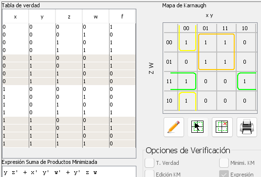

# KeMAP - Circuitos combinacionales (histórico)

## Índice

- [20102\_EX3\_2B](#20102_ex3_2b)
- [20111\_EX1\_2A](#20111_ex1_2a)
- [20111\_EX2\_2A](#20111_ex2_2a)
- [20111\_EX3\_2A](#20111_ex3_2a)
- [20112\_EX1\_2B](#20112_ex1_2b)
- [20112\_EX2\_2](#20112_ex2_2)
- [20121\_EX2\_2A](#20121_ex2_2a)
- [20122\_PAC2\_2A\_KM](#20122_pac2_2a_km)
- [20122\_EX3\_2A](#20122_ex3_2a)
- [20131\_PAC2\_2A\_KM](#20131_pac2_2a_km)
- [20132\_PAC2\_2C\_KM](#20132_pac2_2c_km)
- [20141\_PAC2\_1B\_KM](#20141_pac2_1b_km)
- [20142\_PAC2\_1C\_KM](#20142_pac2_1c_km)
- [20151\_PAC2\_2\_KM](#20151_pac2_2_km)
- [20152\_PAC2\_2A\_KM](#20152_pac2_2a_km)
- [20161\_PAC2\_1B\_KM](#20161_pac2_1b_km)
- [20162\_PAC2\_1B\_KM](#20162_pac2_1b_km)
- [20171\_PAC2\_2A\_KM](#20171_pac2_2a_km)

 

## 20102_EX3_2B

<blockquote>

Dada la tabla de verdad, minimizad la expresión en suma de productos de la función $f$ mediante mapas de Karnaugh.

<table>
	<tr>
		<th colspan="4">ENTRADA</th>
		<th>SALIDA</th>
	</tr>
	<tr>
		<th>$a$</th>
		<th>$b$</th>
		<th>$c$</th>
		<th>$d$</th>
		<th>$f$</th>
	</tr>
	<tr>
		<td>0</td>
		<td>0</td>
		<td>0</td>
		<td>0</td>
		<td>0</td>
	</tr>
	<tr>
		<td>0</td>
		<td>0</td>
		<td>0</td>
		<td>1</td>
		<td>1</td>
	</tr>
	<tr>
		<td>0</td>
		<td>0</td>
		<td>1</td>
		<td>0</td>
		<td>0</td>
	</tr>
	<tr>
		<td>0</td>
		<td>0</td>
		<td>1</td>
		<td>1</td>
		<td>0</td>
	</tr>
	<tr>
		<td>0</td>
		<td>1</td>
		<td>0</td>
		<td>0</td>
		<td>1</td>
	</tr>
	<tr>
		<td>0</td>
		<td>1</td>
		<td>0</td>
		<td>1</td>
		<td>0</td>
	</tr>
	<tr>
		<td>0</td>
		<td>1</td>
		<td>1</td>
		<td>0</td>
		<td>1</td>
	</tr>
	<tr>
		<td>0</td>
		<td>1</td>
		<td>1</td>
		<td>1</td>
		<td>0</td>
	</tr>
	<tr>
		<td>1</td>
		<td>0</td>
		<td>0</td>
		<td>0</td>
		<td>1</td>
	</tr>
	<tr>
		<td>1</td>
		<td>0</td>
		<td>0</td>
		<td>1</td>
		<td>0</td>
	</tr>
	<tr>
		<td>1</td>
		<td>0</td>
		<td>1</td>
		<td>0</td>
		<td>1</td>
	</tr>
	<tr>
		<td>1</td>
		<td>0</td>
		<td>1</td>
		<td>1</td>
		<td>0</td>
	</tr>
	<tr>
		<td>1</td>
		<td>1</td>
		<td>0</td>
		<td>0</td>
		<td>X</td>
	</tr>
	<tr>
		<td>1</td>
		<td>1</td>
		<td>0</td>
		<td>1</td>
		<td>1</td>
	</tr>
	<tr>
		<td>1</td>
		<td>1</td>
		<td>1</td>
		<td>0</td>
		<td>X</td>
	</tr>
	<tr>
		<td>1</td>
		<td>1</td>
		<td>1</td>
		<td>1</td>
		<td>1</td>
	</tr>
</table>
</blockquote>

	
Ejercicio resuelto

	

		
	

## 20111_EX1_2A

<blockquote>

Dada la tabla de verdad, minimizad la expresión en suma de productos de la función $f$ mediante mapas de Karnaugh.

<table>
	<tr>
		<th colspan="4">ENTRADA</th>
		<th>SALIDA</th>
	</tr>
	<tr>
		<th>$a$</th>
		<th>$b$</th>
		<th>$c$</th>
		<th>$d$</th>
		<th>$f$</th>
	</tr>
	<tr>
		<td>0</td>
		<td>0</td>
		<td>0</td>
		<td>0</td>
		<td>X</td>
	</tr>
	<tr>
		<td>0</td>
		<td>0</td>
		<td>0</td>
		<td>1</td>
		<td>1</td>
	</tr>
	<tr>
		<td>0</td>
		<td>0</td>
		<td>1</td>
		<td>0</td>
		<td>X</td>
	</tr>
	<tr>
		<td>0</td>
		<td>0</td>
		<td>1</td>
		<td>1</td>
		<td>0</td>
	</tr>
	<tr>
		<td>0</td>
		<td>1</td>
		<td>0</td>
		<td>0</td>
		<td>X</td>
	</tr>
	<tr>
		<td>0</td>
		<td>1</td>
		<td>0</td>
		<td>1</td>
		<td>1</td>
	</tr>
	<tr>
		<td>0</td>
		<td>1</td>
		<td>1</td>
		<td>0</td>
		<td>1</td>
	</tr>
	<tr>
		<td>0</td>
		<td>1</td>
		<td>1</td>
		<td>1</td>
		<td>0</td>
	</tr>
	<tr>
		<td>1</td>
		<td>0</td>
		<td>0</td>
		<td>0</td>
		<td>0</td>
	</tr>
	<tr>
		<td>1</td>
		<td>0</td>
		<td>0</td>
		<td>1</td>
		<td>1</td>
	</tr>
	<tr>
		<td>1</td>
		<td>0</td>
		<td>1</td>
		<td>0</td>
		<td>0</td>
	</tr>
	<tr>
		<td>1</td>
		<td>0</td>
		<td>1</td>
		<td>1</td>
		<td>0</td>
	</tr>
	<tr>
		<td>1</td>
		<td>1</td>
		<td>0</td>
		<td>0</td>
		<td>1</td>
	</tr>
	<tr>
		<td>1</td>
		<td>1</td>
		<td>0</td>
		<td>1</td>
		<td>1</td>
	</tr>
	<tr>
		<td>1</td>
		<td>1</td>
		<td>1</td>
		<td>0</td>
		<td>0</td>
	</tr>
	<tr>
		<td>1</td>
		<td>1</td>
		<td>1</td>
		<td>1</td>
		<td>0</td>
	</tr>
</table>
</blockquote>

	
Ejercicio resuelto

	

		
	

## 20111_EX2_2A

<blockquote>

Dada la tabla de verdad, minimizad la expresión en suma de productos de la función $f$ mediante mapas de Karnaugh.

<table>
	<tr>
		<th colspan="4">ENTRADA</th>
		<th>SALIDA</th>
	</tr>
	<tr>
		<th>$a$</th>
		<th>$b$</th>
		<th>$c$</th>
		<th>$d$</th>
		<th>$f$</th>
	</tr>
	<tr>
		<td>0</td>
		<td>0</td>
		<td>0</td>
		<td>0</td>
		<td>X</td>
	</tr>
	<tr>
		<td>0</td>
		<td>0</td>
		<td>0</td>
		<td>1</td>
		<td>1</td>
	</tr>
	<tr>
		<td>0</td>
		<td>0</td>
		<td>1</td>
		<td>0</td>
		<td>X</td>
	</tr>
	<tr>
		<td>0</td>
		<td>0</td>
		<td>1</td>
		<td>1</td>
		<td>0</td>
	</tr>
	<tr>
		<td>0</td>
		<td>1</td>
		<td>0</td>
		<td>0</td>
		<td>X</td>
	</tr>
	<tr>
		<td>0</td>
		<td>1</td>
		<td>0</td>
		<td>1</td>
		<td>1</td>
	</tr>
	<tr>
		<td>0</td>
		<td>1</td>
		<td>1</td>
		<td>0</td>
		<td>0</td>
	</tr>
	<tr>
		<td>0</td>
		<td>1</td>
		<td>1</td>
		<td>1</td>
		<td>X</td>
	</tr>
	<tr>
		<td>1</td>
		<td>0</td>
		<td>0</td>
		<td>0</td>
		<td>1</td>
	</tr>
	<tr>
		<td>1</td>
		<td>0</td>
		<td>0</td>
		<td>1</td>
		<td>1</td>
	</tr>
	<tr>
		<td>1</td>
		<td>0</td>
		<td>1</td>
		<td>0</td>
		<td>0</td>
	</tr>
	<tr>
		<td>1</td>
		<td>0</td>
		<td>1</td>
		<td>1</td>
		<td>X</td>
	</tr>
	<tr>
		<td>1</td>
		<td>1</td>
		<td>0</td>
		<td>0</td>
		<td>1</td>
	</tr>
	<tr>
		<td>1</td>
		<td>1</td>
		<td>0</td>
		<td>1</td>
		<td>1</td>
	</tr>
	<tr>
		<td>1</td>
		<td>1</td>
		<td>1</td>
		<td>0</td>
		<td>1</td>
	</tr>
	<tr>
		<td>1</td>
		<td>1</td>
		<td>1</td>
		<td>1</td>
		<td>0</td>
	</tr>
</table>
</blockquote>

	
Ejercicio resuelto

	

		
	

## 20111_EX3_2A

<blockquote>

Dada la tabla de verdad, minimizad la expresión en suma de productos de la función $f$ mediante mapas de Karnaugh.

<table>
	<tr>
		<th colspan="4">ENTRADA</th>
		<th>SALIDA</th>
	</tr>
	<tr>
		<th>$a$</th>
		<th>$b$</th>
		<th>$c$</th>
		<th>$d$</th>
		<th>$f$</th>
	</tr>
	<tr>
		<td>0</td>
		<td>0</td>
		<td>0</td>
		<td>0</td>
		<td>0</td>
	</tr>
	<tr>
		<td>0</td>
		<td>0</td>
		<td>0</td>
		<td>1</td>
		<td>0</td>
	</tr>
	<tr>
		<td>0</td>
		<td>0</td>
		<td>1</td>
		<td>0</td>
		<td>1</td>
	</tr>
	<tr>
		<td>0</td>
		<td>0</td>
		<td>1</td>
		<td>1</td>
		<td>0</td>
	</tr>
	<tr>
		<td>0</td>
		<td>1</td>
		<td>0</td>
		<td>0</td>
		<td>0</td>
	</tr>
	<tr>
		<td>0</td>
		<td>1</td>
		<td>0</td>
		<td>1</td>
		<td>1</td>
	</tr>
	<tr>
		<td>0</td>
		<td>1</td>
		<td>1</td>
		<td>0</td>
		<td>0</td>
	</tr>
	<tr>
		<td>0</td>
		<td>1</td>
		<td>1</td>
		<td>1</td>
		<td>1</td>
	</tr>
	<tr>
		<td>1</td>
		<td>0</td>
		<td>0</td>
		<td>0</td>
		<td>1</td>
	</tr>
	<tr>
		<td>1</td>
		<td>0</td>
		<td>0</td>
		<td>1</td>
		<td>1</td>
	</tr>
	<tr>
		<td>1</td>
		<td>0</td>
		<td>1</td>
		<td>0</td>
		<td>1</td>
	</tr>
	<tr>
		<td>1</td>
		<td>0</td>
		<td>1</td>
		<td>1</td>
		<td>0</td>
	</tr>
	<tr>
		<td>1</td>
		<td>1</td>
		<td>0</td>
		<td>0</td>
		<td>1</td>
	</tr>
	<tr>
		<td>1</td>
		<td>1</td>
		<td>0</td>
		<td>1</td>
		<td>1</td>
	</tr>
	<tr>
		<td>1</td>
		<td>1</td>
		<td>1</td>
		<td>0</td>
		<td>X</td>
	</tr>
	<tr>
		<td>1</td>
		<td>1</td>
		<td>1</td>
		<td>1</td>
		<td>X</td>
	</tr>
</table>
</blockquote>

	
Ejercicio resuelto

	

		
	

## 20112_EX1_2B

<blockquote>

Diseñad un circuito combinacional que haga una codificación de los números 0 a 8. El nuevo código de un número se obtiene sumando el valor 5 al número que se desea codificar. El sistema tiene una entrada $X = x_3, x_2, x_1, x_0$ de 4 bits que representa el número a codificar en binario y una salida $Y = y_3, y_2, y_1, y_0$ de 4 bits que es el nuevo código del número en binario.

Obtened la tabla de verdad de $y_2$ y minimizad $y_2$ utilizando el método de Karnaugh.
</blockquote>

	
Ejercicio resuelto

	

		
	

## 20112_EX2_2

<blockquote>

Dado el siguiente circuito combinacional:

En el cual la ROM tiene el siguiente contenido:

<table>
	<tr>
		<th>M@</th>
	</tr>
	<tr>
		<td>1</td>
	</tr>
	<tr>
		<td>0</td>
	</tr>
	<tr>
		<td>1</td>
	</tr>
	<tr>
		<td>0</td>
	</tr>
	<tr>
		<td>1</td>
	</tr>
	<tr>
		<td>0</td>
	</tr>
	<tr>
		<td>1</td>
	</tr>
	<tr>
		<td>0</td>
	</tr>
</table>

Minimizad la salida $s$ utilizando el método de Karnaugh.
</blockquote>

	
Ejercicio resuelto

	

		
	

## 20121_EX2_2A

<blockquote>

Dada la tabla de verdad, sintetizad de forma mínima a dos niveles la función $f$ mediante el método de Karnaugh:

<table>
	<tr>
		<th colspan="4">ENTRADA</th>
		<th>SALIDA</th>
	</tr>
	<tr>
		<th>$a$</th>
		<th>$b$</th>
		<th>$c$</th>
		<th>$d$</th>
		<th>$f$</th>
	</tr>
	<tr>
		<td>0</td>
		<td>0</td>
		<td>0</td>
		<td>0</td>
		<td>0</td>
	</tr>
	<tr>
		<td>0</td>
		<td>0</td>
		<td>0</td>
		<td>1</td>
		<td>0</td>
	</tr>
	<tr>
		<td>0</td>
		<td>0</td>
		<td>1</td>
		<td>0</td>
		<td>1</td>
	</tr>
	<tr>
		<td>0</td>
		<td>0</td>
		<td>1</td>
		<td>1</td>
		<td>1</td>
	</tr>
	<tr>
		<td>0</td>
		<td>1</td>
		<td>0</td>
		<td>0</td>
		<td>1</td>
	</tr>
	<tr>
		<td>0</td>
		<td>1</td>
		<td>0</td>
		<td>1</td>
		<td>1</td>
	</tr>
	<tr>
		<td>0</td>
		<td>1</td>
		<td>1</td>
		<td>0</td>
		<td>1</td>
	</tr>
	<tr>
		<td>0</td>
		<td>1</td>
		<td>1</td>
		<td>1</td>
		<td>0</td>
	</tr>
	<tr>
		<td>1</td>
		<td>0</td>
		<td>0</td>
		<td>0</td>
		<td>1</td>
	</tr>
	<tr>
		<td>1</td>
		<td>0</td>
		<td>0</td>
		<td>1</td>
		<td>0</td>
	</tr>
	<tr>
		<td>1</td>
		<td>0</td>
		<td>1</td>
		<td>0</td>
		<td>1</td>
	</tr>
	<tr>
		<td>1</td>
		<td>0</td>
		<td>1</td>
		<td>1</td>
		<td>0</td>
	</tr>
	<tr>
		<td>1</td>
		<td>1</td>
		<td>0</td>
		<td>0</td>
		<td>0</td>
	</tr>
	<tr>
		<td>1</td>
		<td>1</td>
		<td>0</td>
		<td>1</td>
		<td>1</td>
	</tr>
	<tr>
		<td>1</td>
		<td>1</td>
		<td>1</td>
		<td>0</td>
		<td>0</td>
	</tr>
	<tr>
		<td>1</td>
		<td>1</td>
		<td>1</td>
		<td>1</td>
		<td>0</td>
	</tr>
</table>
</blockquote>

	
Ejercicio resuelto

	

		
	

## 20122_PAC2_2A_KM

<blockquote>

Dada la tabla de verdad, sintetizad de forma mínima a dos niveles la función $f$ mediante el método de Karnaugh:

<table>
	<tr>
		<th colspan="4">ENTRADA</th>
		<th>SALIDA</th>
	</tr>
	<tr>
		<th>$a$</th>
		<th>$b$</th>
		<th>$c$</th>
		<th>$d$</th>
		<th>$f$</th>
	</tr>
	<tr>
		<td>0</td>
		<td>0</td>
		<td>0</td>
		<td>0</td>
		<td>1</td>
	</tr>
	<tr>
		<td>0</td>
		<td>0</td>
		<td>0</td>
		<td>1</td>
		<td>1</td>
	</tr>
	<tr>
		<td>0</td>
		<td>0</td>
		<td>1</td>
		<td>0</td>
		<td>1</td>
	</tr>
	<tr>
		<td>0</td>
		<td>0</td>
		<td>1</td>
		<td>1</td>
		<td>1</td>
	</tr>
	<tr>
		<td>0</td>
		<td>1</td>
		<td>0</td>
		<td>0</td>
		<td>0</td>
	</tr>
	<tr>
		<td>0</td>
		<td>1</td>
		<td>0</td>
		<td>1</td>
		<td>1</td>
	</tr>
	<tr>
		<td>0</td>
		<td>1</td>
		<td>1</td>
		<td>0</td>
		<td>0</td>
	</tr>
	<tr>
		<td>0</td>
		<td>1</td>
		<td>1</td>
		<td>1</td>
		<td>1</td>
	</tr>
	<tr>
		<td>1</td>
		<td>0</td>
		<td>0</td>
		<td>0</td>
		<td>1</td>
	</tr>
	<tr>
		<td>1</td>
		<td>0</td>
		<td>0</td>
		<td>1</td>
		<td>0</td>
	</tr>
	<tr>
		<td>1</td>
		<td>0</td>
		<td>1</td>
		<td>0</td>
		<td>1</td>
	</tr>
	<tr>
		<td>1</td>
		<td>0</td>
		<td>1</td>
		<td>1</td>
		<td>0</td>
	</tr>
	<tr>
		<td>1</td>
		<td>1</td>
		<td>0</td>
		<td>0</td>
		<td>1</td>
	</tr>
	<tr>
		<td>1</td>
		<td>1</td>
		<td>0</td>
		<td>1</td>
		<td>0</td>
	</tr>
	<tr>
		<td>1</td>
		<td>1</td>
		<td>1</td>
		<td>0</td>
		<td>0</td>
	</tr>
	<tr>
		<td>1</td>
		<td>1</td>
		<td>1</td>
		<td>1</td>
		<td>1</td>
	</tr>
</table>
</blockquote>

	
Ejercicio resuelto

	

		
	

## 20122_EX3_2A

<blockquote>

Dada la tabla de verdad, sintetizad de forma mínima a dos niveles la función $g$ mediante el método de Karnaugh:

<table>
	<tr>
		<th colspan="4">ENTRADA</th>
		<th colspan="2">SALIDA</th>
	</tr>
	<tr>
		<th>$x$</th>
		<th>$y$</th>
		<th>$z$</th>
		<th>$w$</th>
		<th>$f$</th>
		<th>$g$</th>
	</tr>
	<tr>
		<td>0</td>
		<td>0</td>
		<td>0</td>
		<td>0</td>
		<td>0</td>
		<td>1</td>
	</tr>
	<tr>
		<td>0</td>
		<td>0</td>
		<td>0</td>
		<td>1</td>
		<td>1</td>
		<td>X</td>
	</tr>
	<tr>
		<td>0</td>
		<td>0</td>
		<td>1</td>
		<td>0</td>
		<td>0</td>
		<td>1</td>
	</tr>
	<tr>
		<td>0</td>
		<td>0</td>
		<td>1</td>
		<td>1</td>
		<td>0</td>
		<td>0</td>
	</tr>
	<tr>
		<td>0</td>
		<td>1</td>
		<td>0</td>
		<td>0</td>
		<td>1</td>
		<td>1</td>
	</tr>
	<tr>
		<td>0</td>
		<td>1</td>
		<td>0</td>
		<td>1</td>
		<td>0</td>
		<td>X</td>
	</tr>
	<tr>
		<td>0</td>
		<td>1</td>
		<td>1</td>
		<td>0</td>
		<td>0</td>
		<td>X</td>
	</tr>
	<tr>
		<td>0</td>
		<td>1</td>
		<td>1</td>
		<td>1</td>
		<td>1</td>
		<td>0</td>
	</tr>
	<tr>
		<td>1</td>
		<td>0</td>
		<td>0</td>
		<td>0</td>
		<td>1</td>
		<td>0</td>
	</tr>
	<tr>
		<td>1</td>
		<td>0</td>
		<td>0</td>
		<td>1</td>
		<td>0</td>
		<td>0</td>
	</tr>
	<tr>
		<td>1</td>
		<td>0</td>
		<td>1</td>
		<td>0</td>
		<td>0</td>
		<td>0</td>
	</tr>
	<tr>
		<td>1</td>
		<td>0</td>
		<td>1</td>
		<td>1</td>
		<td>0</td>
		<td>1</td>
	</tr>
	<tr>
		<td>1</td>
		<td>1</td>
		<td>0</td>
		<td>0</td>
		<td>0</td>
		<td>1</td>
	</tr>
	<tr>
		<td>1</td>
		<td>1</td>
		<td>0</td>
		<td>1</td>
		<td>0</td>
		<td>X</td>
	</tr>
	<tr>
		<td>1</td>
		<td>1</td>
		<td>1</td>
		<td>0</td>
		<td>0</td>
		<td>1</td>
	</tr>
	<tr>
		<td>1</td>
		<td>1</td>
		<td>1</td>
		<td>1</td>
		<td>0</td>
		<td>X</td>
	</tr>
</table>
</blockquote>

	
Ejercicio resuelto

	

		
	

## 20131_PAC2_2A_KM

<blockquote>

Dada la tabla de verdad, sintetizad de forma mínima a dos niveles la función $f$ mediante el método de Karnaugh:

<table>
	<tr>
		<th colspan="4">ENTRADA</th>
		<th>SALIDA</th>
	</tr>
	<tr>
		<th>$x$</th>
		<th>$y$</th>
		<th>$z$</th>
		<th>$w$</th>
		<th>$f$</th>
	</tr>
	<tr>
		<td>0</td>
		<td>0</td>
		<td>0</td>
		<td>0</td>
		<td>1</td>
	</tr>
	<tr>
		<td>0</td>
		<td>0</td>
		<td>0</td>
		<td>1</td>
		<td>0</td>
	</tr>
	<tr>
		<td>0</td>
		<td>0</td>
		<td>1</td>
		<td>0</td>
		<td>1</td>
	</tr>
	<tr>
		<td>0</td>
		<td>0</td>
		<td>1</td>
		<td>1</td>
		<td>1</td>
	</tr>
	<tr>
		<td>0</td>
		<td>1</td>
		<td>0</td>
		<td>0</td>
		<td>1</td>
	</tr>
	<tr>
		<td>0</td>
		<td>1</td>
		<td>0</td>
		<td>1</td>
		<td>1</td>
	</tr>
	<tr>
		<td>0</td>
		<td>1</td>
		<td>1</td>
		<td>0</td>
		<td>0</td>
	</tr>
	<tr>
		<td>0</td>
		<td>1</td>
		<td>1</td>
		<td>1</td>
		<td>0</td>
	</tr>
	<tr>
		<td>1</td>
		<td>0</td>
		<td>0</td>
		<td>0</td>
		<td>0</td>
	</tr>
	<tr>
		<td>1</td>
		<td>0</td>
		<td>0</td>
		<td>1</td>
		<td>0</td>
	</tr>
	<tr>
		<td>1</td>
		<td>0</td>
		<td>1</td>
		<td>0</td>
		<td>0</td>
	</tr>
	<tr>
		<td>1</td>
		<td>0</td>
		<td>1</td>
		<td>1</td>
		<td>1</td>
	</tr>
	<tr>
		<td>1</td>
		<td>1</td>
		<td>0</td>
		<td>0</td>
		<td>1</td>
	</tr>
	<tr>
		<td>1</td>
		<td>1</td>
		<td>0</td>
		<td>1</td>
		<td>1</td>
	</tr>
	<tr>
		<td>1</td>
		<td>1</td>
		<td>1</td>
		<td>0</td>
		<td>0</td>
	</tr>
	<tr>
		<td>1</td>
		<td>1</td>
		<td>1</td>
		<td>1</td>
		<td>0</td>
	</tr>
</table>
</blockquote>

	
Ejercicio resuelto

	

		
	

## 20132_PAC2_2C_KM

<blockquote>

Dada la siguiente tabla de verdad, sintetizad de manera mínima a dos niveles la función $g$ mediante el método de Karnaugh:

<table>
	<tr>
		<th colspan="4">ENTRADA</th>
		<th colspan="2">SALIDA</th>
	</tr>
	<tr>
		<th>$x$</th>
		<th>$y$</th>
		<th>$z$</th>
		<th>$w$</th>
		<th>$f$</th>
		<th>$g$</th>
	</tr>
	<tr>
		<td>0</td>
		<td>0</td>
		<td>0</td>
		<td>0</td>
		<td>1</td>
		<td>X</td>
	</tr>
	<tr>
		<td>0</td>
		<td>0</td>
		<td>0</td>
		<td>1</td>
		<td>0</td>
		<td>1</td>
	</tr>
	<tr>
		<td>0</td>
		<td>0</td>
		<td>1</td>
		<td>0</td>
		<td>1</td>
		<td>X</td>
	</tr>
	<tr>
		<td>0</td>
		<td>0</td>
		<td>1</td>
		<td>1</td>
		<td>0</td>
		<td>0</td>
	</tr>
	<tr>
		<td>0</td>
		<td>1</td>
		<td>0</td>
		<td>0</td>
		<td>1</td>
		<td>1</td>
	</tr>
	<tr>
		<td>0</td>
		<td>1</td>
		<td>0</td>
		<td>1</td>
		<td>1</td>
		<td>1</td>
	</tr>
	<tr>
		<td>0</td>
		<td>1</td>
		<td>1</td>
		<td>0</td>
		<td>0</td>
		<td>X</td>
	</tr>
	<tr>
		<td>0</td>
		<td>1</td>
		<td>1</td>
		<td>1</td>
		<td>0</td>
		<td>1</td>
	</tr>
	<tr>
		<td>1</td>
		<td>0</td>
		<td>0</td>
		<td>0</td>
		<td>1</td>
		<td>0</td>
	</tr>
	<tr>
		<td>1</td>
		<td>0</td>
		<td>0</td>
		<td>1</td>
		<td>0</td>
		<td>X</td>
	</tr>
	<tr>
		<td>1</td>
		<td>0</td>
		<td>1</td>
		<td>0</td>
		<td>1</td>
		<td>1</td>
	</tr>
	<tr>
		<td>1</td>
		<td>0</td>
		<td>1</td>
		<td>1</td>
		<td>0</td>
		<td>1</td>
	</tr>
	<tr>
		<td>1</td>
		<td>1</td>
		<td>0</td>
		<td>0</td>
		<td>1</td>
		<td>X</td>
	</tr>
	<tr>
		<td>1</td>
		<td>1</td>
		<td>0</td>
		<td>1</td>
		<td>0</td>
		<td>0</td>
	</tr>
	<tr>
		<td>1</td>
		<td>1</td>
		<td>1</td>
		<td>0</td>
		<td>1</td>
		<td>X</td>
	</tr>
	<tr>
		<td>1</td>
		<td>1</td>
		<td>1</td>
		<td>1</td>
		<td>0</td>
		<td>0</td>
	</tr>
</table>
</blockquote>

	
Ejercicio resuelto

	

		
	

## 20141_PAC2_1B_KM

<blockquote>

Dada la siguiente tabla de verdad:

<table>
	<tr>
		<th colspan="4">ENTRADA</th>
		<th colspan="3">SALIDA</th>
	</tr>
	<tr>
		<th>$x$</th>
		<th>$y$</th>
		<th>$z$</th>
		<th>$w$</th>
		<th>$f_1$</th>
		<th>$f_2$</th>
		<th>$f_3$</th>
	</tr>
	<tr>
		<td>0</td>
		<td>0</td>
		<td>0</td>
		<td>0</td>
		<td>0</td>
		<td>1</td>
		<td>1</td>
	</tr>
	<tr>
		<td>0</td>
		<td>0</td>
		<td>0</td>
		<td>1</td>
		<td>0</td>
		<td>1</td>
		<td>X</td>
	</tr>
	<tr>
		<td>0</td>
		<td>0</td>
		<td>1</td>
		<td>0</td>
		<td>0</td>
		<td>0</td>
		<td>X</td>
	</tr>
	<tr>
		<td>0</td>
		<td>0</td>
		<td>1</td>
		<td>1</td>
		<td>0</td>
		<td>1</td>
		<td>0</td>
	</tr>
	<tr>
		<td>0</td>
		<td>1</td>
		<td>0</td>
		<td>0</td>
		<td>0</td>
		<td>0</td>
		<td>0</td>
	</tr>
	<tr>
		<td>0</td>
		<td>1</td>
		<td>0</td>
		<td>1</td>
		<td>0</td>
		<td>0</td>
		<td>0</td>
	</tr>
	<tr>
		<td>0</td>
		<td>1</td>
		<td>1</td>
		<td>0</td>
		<td>0</td>
		<td>0</td>
		<td>1</td>
	</tr>
	<tr>
		<td>0</td>
		<td>1</td>
		<td>1</td>
		<td>1</td>
		<td>1</td>
		<td>0</td>
		<td>X</td>
	</tr>
	<tr>
		<td>1</td>
		<td>0</td>
		<td>0</td>
		<td>0</td>
		<td>0</td>
		<td>1</td>
		<td>X</td>
	</tr>
	<tr>
		<td>1</td>
		<td>0</td>
		<td>0</td>
		<td>1</td>
		<td>0</td>
		<td>1</td>
		<td>X</td>
	</tr>
	<tr>
		<td>1</td>
		<td>0</td>
		<td>1</td>
		<td>0</td>
		<td>0</td>
		<td>1</td>
		<td>0</td>
	</tr>
	<tr>
		<td>1</td>
		<td>0</td>
		<td>1</td>
		<td>1</td>
		<td>1</td>
		<td>0</td>
		<td>0</td>
	</tr>
	<tr>
		<td>1</td>
		<td>1</td>
		<td>0</td>
		<td>0</td>
		<td>0</td>
		<td>0</td>
		<td>0</td>
	</tr>
	<tr>
		<td>1</td>
		<td>1</td>
		<td>0</td>
		<td>1</td>
		<td>1</td>
		<td>0</td>
		<td>X</td>
	</tr>
	<tr>
		<td>1</td>
		<td>1</td>
		<td>1</td>
		<td>0</td>
		<td>1</td>
		<td>0</td>
		<td>X</td>
	</tr>
	<tr>
		<td>1</td>
		<td>1</td>
		<td>1</td>
		<td>1</td>
		<td>1</td>
		<td>0</td>
		<td>X</td>
	</tr>
</table>

Sintetizad de forma mínima a dos niveles la función $f2$ mediante el método de Karnaugh.
</blockquote>

	
Ejercicio resuelto

	

		
	

## 20142_PAC2_1C_KM

<blockquote>

Dada la siguiente tabla de verdad:

<table>
	<tr>
		<th colspan="4">ENTRADA</th>
		<th>SALIDA</th>
	</tr>
	<tr>
		<th>$x$</th>
		<th>$y$</th>
		<th>$z$</th>
		<th>$w$</th>
		<th>$f_0$</th>
	</tr>
	<tr>
		<td>0</td>
		<td>0</td>
		<td>0</td>
		<td>0</td>
		<td>1</td>
	</tr>
	<tr>
		<td>0</td>
		<td>0</td>
		<td>0</td>
		<td>1</td>
		<td>0</td>
	</tr>
	<tr>
		<td>0</td>
		<td>0</td>
		<td>1</td>
		<td>0</td>
		<td>1</td>
	</tr>
	<tr>
		<td>0</td>
		<td>0</td>
		<td>1</td>
		<td>1</td>
		<td>1</td>
	</tr>
	<tr>
		<td>0</td>
		<td>1</td>
		<td>0</td>
		<td>0</td>
		<td>1</td>
	</tr>
	<tr>
		<td>0</td>
		<td>1</td>
		<td>0</td>
		<td>1</td>
		<td>1</td>
	</tr>
	<tr>
		<td>0</td>
		<td>1</td>
		<td>1</td>
		<td>0</td>
		<td>1</td>
	</tr>
	<tr>
		<td>0</td>
		<td>1</td>
		<td>1</td>
		<td>1</td>
		<td>1</td>
	</tr>
	<tr>
		<td>1</td>
		<td>0</td>
		<td>0</td>
		<td>0</td>
		<td>1</td>
	</tr>
	<tr>
		<td>1</td>
		<td>0</td>
		<td>0</td>
		<td>1</td>
		<td>0</td>
	</tr>
	<tr>
		<td>1</td>
		<td>0</td>
		<td>1</td>
		<td>0</td>
		<td>0</td>
	</tr>
	<tr>
		<td>1</td>
		<td>0</td>
		<td>1</td>
		<td>1</td>
		<td>1</td>
	</tr>
	<tr>
		<td>1</td>
		<td>1</td>
		<td>0</td>
		<td>0</td>
		<td>1</td>
	</tr>
	<tr>
		<td>1</td>
		<td>1</td>
		<td>0</td>
		<td>1</td>
		<td>0</td>
	</tr>
	<tr>
		<td>1</td>
		<td>1</td>
		<td>1</td>
		<td>0</td>
		<td>1</td>
	</tr>
	<tr>
		<td>1</td>
		<td>1</td>
		<td>1</td>
		<td>1</td>
		<td>1</td>
	</tr>
</table>

Sintetizad la forma mínima a dos niveles la función $f_0$ mediante el método de Karnaugh.
</blockquote>

	
Ejercicio resuelto

	

		
	

## 20151_PAC2_2_KM

<blockquote>

Dada la siguiente tabla de verdad:

<table>
	<tr>
		<th colspan="4">ENTRADA</th>
		<th colspan="3">SALIDA</th>
	</tr>
	<tr>
		<th>$x$</th>
		<th>$y$</th>
		<th>$z$</th>
		<th>$w$</th>
		<th>$f_2$</th>
	</tr>
	<tr>
		<td>0</td>
		<td>0</td>
		<td>0</td>
		<td>0</td>
		<td>1</td>
	</tr>
	<tr>
		<td>0</td>
		<td>0</td>
		<td>0</td>
		<td>1</td>
		<td>0</td>
	</tr>
	<tr>
		<td>0</td>
		<td>0</td>
		<td>1</td>
		<td>0</td>
		<td>1</td>
	</tr>
	<tr>
		<td>0</td>
		<td>0</td>
		<td>1</td>
		<td>1</td>
		<td>1</td>
	</tr>
	<tr>
		<td>0</td>
		<td>1</td>
		<td>0</td>
		<td>0</td>
		<td>0</td>
	</tr>
	<tr>
		<td>0</td>
		<td>1</td>
		<td>0</td>
		<td>1</td>
		<td>0</td>
	</tr>
	<tr>
		<td>0</td>
		<td>1</td>
		<td>1</td>
		<td>0</td>
		<td>1</td>
	</tr>
	<tr>
		<td>0</td>
		<td>1</td>
		<td>1</td>
		<td>1</td>
		<td>0</td>
	</tr>
	<tr>
		<td>1</td>
		<td>0</td>
		<td>0</td>
		<td>0</td>
		<td>1</td>
	</tr>
	<tr>
		<td>1</td>
		<td>0</td>
		<td>0</td>
		<td>1</td>
		<td>0</td>
	</tr>
	<tr>
		<td>1</td>
		<td>0</td>
		<td>1</td>
		<td>0</td>
		<td>1</td>
	</tr>
	<tr>
		<td>1</td>
		<td>0</td>
		<td>1</td>
		<td>1</td>
		<td>1</td>
	</tr>
	<tr>
		<td>1</td>
		<td>1</td>
		<td>0</td>
		<td>0</td>
		<td>0</td>
	</tr>
	<tr>
		<td>1</td>
		<td>1</td>
		<td>0</td>
		<td>1</td>
		<td>0</td>
	</tr>
	<tr>
		<td>1</td>
		<td>1</td>
		<td>1</td>
		<td>0</td>
		<td>1</td>
	</tr>
	<tr>
		<td>1</td>
		<td>1</td>
		<td>1</td>
		<td>1</td>
		<td>0</td>
	</tr>
</table>

Sintetizad la forma mínima a dos niveles la función $f_2$ mediante el método de Karnaugh.
</blockquote>

	
Ejercicio resuelto

	

		
	

## 20152_PAC2_2A_KM

<blockquote>

Dada la siguiente tabla de verdad:

<table>
	<tr>
		<th colspan="4">ENTRADA</th>
		<th>SALIDA</th>
	</tr>
	<tr>
		<th>$x$</th>
		<th>$y$</th>
		<th>$z$</th>
		<th>$w$</th>
		<th>$f$</th>
	</tr>
	<tr>
		<td>0</td>
		<td>0</td>
		<td>0</td>
		<td>0</td>
		<td>1</td>
	</tr>
	<tr>
		<td>0</td>
		<td>0</td>
		<td>0</td>
		<td>1</td>
		<td>0</td>
	</tr>
	<tr>
		<td>0</td>
		<td>0</td>
		<td>1</td>
		<td>0</td>
		<td>1</td>
	</tr>
	<tr>
		<td>0</td>
		<td>0</td>
		<td>1</td>
		<td>1</td>
		<td>0</td>
	</tr>
	<tr>
		<td>0</td>
		<td>1</td>
		<td>0</td>
		<td>0</td>
		<td>0</td>
	</tr>
	<tr>
		<td>0</td>
		<td>1</td>
		<td>0</td>
		<td>1</td>
		<td>0</td>
	</tr>
	<tr>
		<td>0</td>
		<td>1</td>
		<td>1</td>
		<td>0</td>
		<td>0</td>
	</tr>
	<tr>
		<td>0</td>
		<td>1</td>
		<td>1</td>
		<td>1</td>
		<td>1</td>
	</tr>
	<tr>
		<td>1</td>
		<td>0</td>
		<td>0</td>
		<td>0</td>
		<td>1</td>
	</tr>
	<tr>
		<td>1</td>
		<td>0</td>
		<td>0</td>
		<td>1</td>
		<td>0</td>
	</tr>
	<tr>
		<td>1</td>
		<td>0</td>
		<td>1</td>
		<td>0</td>
		<td>X</td>
	</tr>
	<tr>
		<td>1</td>
		<td>0</td>
		<td>1</td>
		<td>1</td>
		<td>X</td>
	</tr>
	<tr>
		<td>1</td>
		<td>1</td>
		<td>0</td>
		<td>0</td>
		<td>1</td>
	</tr>
	<tr>
		<td>1</td>
		<td>1</td>
		<td>0</td>
		<td>1</td>
		<td>0</td>
	</tr>
	<tr>
		<td>1</td>
		<td>1</td>
		<td>1</td>
		<td>0</td>
		<td>0</td>
	</tr>
	<tr>
		<td>1</td>
		<td>1</td>
		<td>1</td>
		<td>1</td>
		<td>0</td>
	</tr>
</table>

Sintetizad la forma mínima a dos niveles la función $f$ mediante el método de Karnaugh.
</blockquote>

	
Ejercicio resuelto

	

		
	

## 20161_PAC2_1B_KM

<blockquote>

Dada la siguiente tabla de verdad:

<table>
	<tr>
		<th colspan="4">ENTRADA</th>
		<th colspan="2">SALIDA</th>
	</tr>
	<tr>
		<th>$x$</th>
		<th>$y$</th>
		<th>$z$</th>
		<th>$w$</th>
		<th>$f_1$</th>
		<th>$f_2$</th>
	</tr>
	<tr>
		<td>0</td>
		<td>0</td>
		<td>0</td>
		<td>0</td>
		<td>0</td>
		<td>0</td>
	</tr>
	<tr>
		<td>0</td>
		<td>0</td>
		<td>0</td>
		<td>1</td>
		<td>1</td>
		<td>0</td>
	</tr>
	<tr>
		<td>0</td>
		<td>0</td>
		<td>1</td>
		<td>0</td>
		<td>1</td>
		<td>0</td>
	</tr>
	<tr>
		<td>0</td>
		<td>0</td>
		<td>1</td>
		<td>1</td>
		<td>1</td>
		<td>0</td>
	</tr>
	<tr>
		<td>0</td>
		<td>1</td>
		<td>0</td>
		<td>0</td>
		<td>0</td>
		<td>1</td>
	</tr>
	<tr>
		<td>0</td>
		<td>1</td>
		<td>0</td>
		<td>1</td>
		<td>0</td>
		<td>1</td>
	</tr>
	<tr>
		<td>0</td>
		<td>1</td>
		<td>1</td>
		<td>0</td>
		<td>0</td>
		<td>0</td>
	</tr>
	<tr>
		<td>0</td>
		<td>1</td>
		<td>1</td>
		<td>1</td>
		<td>0</td>
		<td>1</td>
	</tr>
	<tr>
		<td>1</td>
		<td>0</td>
		<td>0</td>
		<td>0</td>
		<td>0</td>
		<td>0</td>
	</tr>
	<tr>
		<td>1</td>
		<td>0</td>
		<td>0</td>
		<td>1</td>
		<td>0</td>
		<td>0</td>
	</tr>
	<tr>
		<td>1</td>
		<td>0</td>
		<td>1</td>
		<td>0</td>
		<td>0</td>
		<td>0</td>
	</tr>
	<tr>
		<td>1</td>
		<td>0</td>
		<td>1</td>
		<td>1</td>
		<td>1</td>
		<td>0</td>
	</tr>
	<tr>
		<td>1</td>
		<td>1</td>
		<td>0</td>
		<td>0</td>
		<td>0</td>
		<td>1</td>
	</tr>
	<tr>
		<td>1</td>
		<td>1</td>
		<td>0</td>
		<td>1</td>
		<td>0</td>
		<td>1</td>
	</tr>
	<tr>
		<td>1</td>
		<td>1</td>
		<td>1</td>
		<td>0</td>
		<td>0</td>
		<td>1</td>
	</tr>
	<tr>
		<td>1</td>
		<td>1</td>
		<td>1</td>
		<td>1</td>
		<td>1</td>
		<td>X</td>
	</tr>
</table>

Sintetizad de forma mínima a dos niveles la función $f2$ mediante el método de Karnaugh.
</blockquote>

	
Ejercicio resuelto

	

		
	

## 20162_PAC2_1B_KM

<blockquote>

Dada la siguiente tabla de verdad:

<table>
	<tr>
		<th colspan="4">ENTRADA</th>
		<th colspan="2">SALIDA</th>
	</tr>
	<tr>
		<th>$x$</th>
		<th>$y$</th>
		<th>$z$</th>
		<th>$w$</th>
		<th>$f_1$</th>
		<th>$f_2$</th>
	</tr>
	<tr>
		<td>0</td>
		<td>0</td>
		<td>0</td>
		<td>0</td>
		<td>0</td>
		<td>1</td>
	</tr>
	<tr>
		<td>0</td>
		<td>0</td>
		<td>0</td>
		<td>1</td>
		<td>0</td>
		<td>X</td>
	</tr>
	<tr>
		<td>0</td>
		<td>0</td>
		<td>1</td>
		<td>0</td>
		<td>0</td>
		<td>X</td>
	</tr>
	<tr>
		<td>0</td>
		<td>0</td>
		<td>1</td>
		<td>1</td>
		<td>0</td>
		<td>1</td>
	</tr>
	<tr>
		<td>0</td>
		<td>1</td>
		<td>0</td>
		<td>0</td>
		<td>0</td>
		<td>0</td>
	</tr>
	<tr>
		<td>0</td>
		<td>1</td>
		<td>0</td>
		<td>1</td>
		<td>1</td>
		<td>X</td>
	</tr>
	<tr>
		<td>0</td>
		<td>1</td>
		<td>1</td>
		<td>0</td>
		<td>1</td>
		<td>0</td>
	</tr>
	<tr>
		<td>0</td>
		<td>1</td>
		<td>1</td>
		<td>1</td>
		<td>1</td>
		<td>1</td>
	</tr>
	<tr>
		<td>1</td>
		<td>0</td>
		<td>0</td>
		<td>0</td>
		<td>0</td>
		<td>0</td>
	</tr>
	<tr>
		<td>1</td>
		<td>0</td>
		<td>0</td>
		<td>1</td>
		<td>0</td>
		<td>1</td>
	</tr>
	<tr>
		<td>1</td>
		<td>0</td>
		<td>1</td>
		<td>0</td>
		<td>0</td>
		<td>0</td>
	</tr>
	<tr>
		<td>1</td>
		<td>0</td>
		<td>1</td>
		<td>1</td>
		<td>0</td>
		<td>1</td>
	</tr>
	<tr>
		<td>1</td>
		<td>1</td>
		<td>0</td>
		<td>0</td>
		<td>1</td>
		<td>0</td>
	</tr>
	<tr>
		<td>1</td>
		<td>1</td>
		<td>0</td>
		<td>1</td>
		<td>1</td>
		<td>0</td>
	</tr>
	<tr>
		<td>1</td>
		<td>1</td>
		<td>1</td>
		<td>0</td>
		<td>0</td>
		<td>0</td>
	</tr>
	<tr>
		<td>1</td>
		<td>1</td>
		<td>1</td>
		<td>1</td>
		<td>1</td>
		<td>0</td>
	</tr>
</table>

Sintetizad de forma mínima a dos niveles la función $f2$ mediante el método de Karnaugh.
</blockquote>

	
Ejercicio resuelto

	

		
	

## 20171_PAC2_2A_KM

<blockquote>

Dada la siguiente tabla de verdad:

<table>
	<tr>
		<th colspan="4">ENTRADA</th>
		<th colspan="2">SALIDA</th>
	</tr>
	<tr>
		<th>$x$</th>
		<th>$y$</th>
		<th>$z$</th>
		<th>$w$</th>
		<th>$f$</th>
		<th>$g$</th>
	</tr>
	<tr>
		<td>0</td>
		<td>0</td>
		<td>0</td>
		<td>0</td>
		<td>1</td>
		<td>1</td>
	</tr>
	<tr>
		<td>0</td>
		<td>0</td>
		<td>0</td>
		<td>1</td>
		<td>1</td>
		<td>0</td>
	</tr>
	<tr>
		<td>0</td>
		<td>0</td>
		<td>1</td>
		<td>0</td>
		<td>1</td>
		<td>X</td>
	</tr>
	<tr>
		<td>0</td>
		<td>0</td>
		<td>1</td>
		<td>1</td>
		<td>1</td>
		<td>0</td>
	</tr>
	<tr>
		<td>0</td>
		<td>1</td>
		<td>0</td>
		<td>0</td>
		<td>0</td>
		<td>X</td>
	</tr>
	<tr>
		<td>0</td>
		<td>1</td>
		<td>0</td>
		<td>1</td>
		<td>1</td>
		<td>1</td>
	</tr>
	<tr>
		<td>0</td>
		<td>1</td>
		<td>1</td>
		<td>0</td>
		<td>0</td>
		<td>0</td>
	</tr>
	<tr>
		<td>0</td>
		<td>1</td>
		<td>1</td>
		<td>1</td>
		<td>1</td>
		<td>1</td>
	</tr>
	<tr>
		<td>1</td>
		<td>0</td>
		<td>0</td>
		<td>0</td>
		<td>0</td>
		<td>1</td>
	</tr>
	<tr>
		<td>1</td>
		<td>0</td>
		<td>0</td>
		<td>1</td>
		<td>0</td>
		<td>1</td>
	</tr>
	<tr>
		<td>1</td>
		<td>0</td>
		<td>1</td>
		<td>0</td>
		<td>1</td>
		<td>1</td>
	</tr>
	<tr>
		<td>1</td>
		<td>0</td>
		<td>1</td>
		<td>1</td>
		<td>1</td>
		<td>1</td>
	</tr>
	<tr>
		<td>1</td>
		<td>1</td>
		<td>0</td>
		<td>0</td>
		<td>0</td>
		<td>1</td>
	</tr>
	<tr>
		<td>1</td>
		<td>1</td>
		<td>0</td>
		<td>1</td>
		<td>0</td>
		<td>0</td>
	</tr>
	<tr>
		<td>1</td>
		<td>1</td>
		<td>1</td>
		<td>0</td>
		<td>0</td>
		<td>1</td>
	</tr>
	<tr>
		<td>1</td>
		<td>1</td>
		<td>1</td>
		<td>1</td>
		<td>1</td>
		<td>0</td>
	</tr>
</table>

Sintetizad de forma mínima a dos niveles la función $g$ mediante el método de Karnaugh.
</blockquote>

	
Ejercicio resuelto

	

		
	

