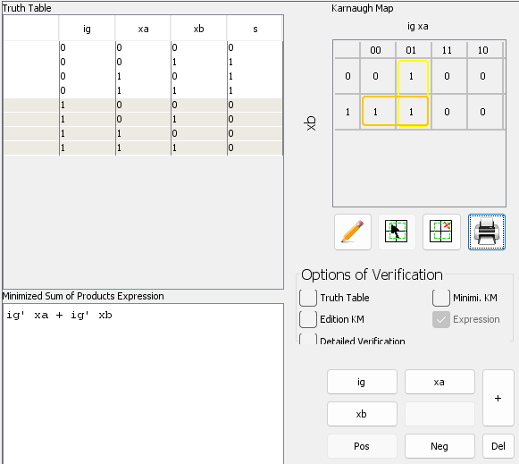
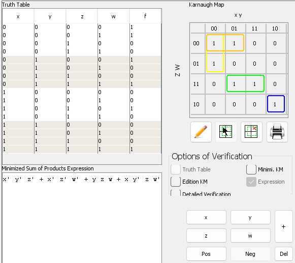
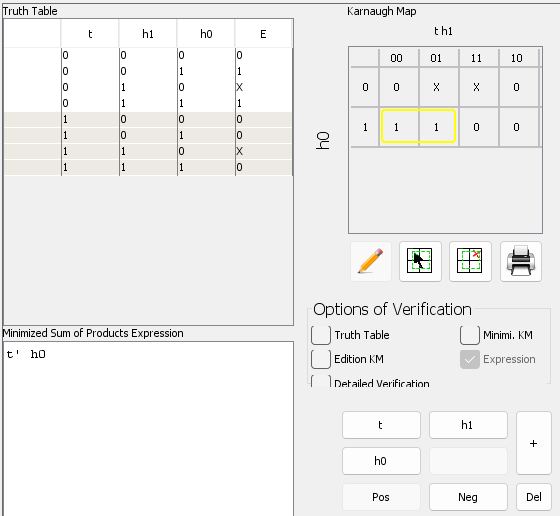
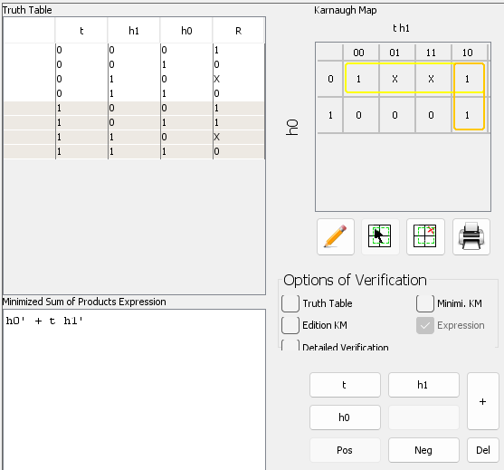

# KeMAP - Circuitos combinacionales (materiales)

## Índice

- [m3ex26KM](#m3ex26km)
- [m3ex27KM](#m3ex27km)
- [m3ex28E](#m3ex28e)
- [m3ex28R](#m3ex28r)

 

## m3ex26KM

<blockquote>

Se dispone de dos cajas fuertes electrónicas, `A` y `B`. Cada una de estas tiene una señal asociada, `xA` y `xB` respectivamente, que vale 1 cuando la caja está abierta y 0 cuando está cerrada. Se tiene también un interruptor general que tiene una señal asociada `ig`, que vale 1 si el interruptor está cerrado y 0 si no lo está.

Se quiere construir un sistema de alarma antirrobos, que generará una señal de salida `s`. Esta señal tiene que valer 1 cuando alguna caja fuerte esté abierta y el interruptor esté cerrado.

Minimizad la función mediante Karnaugh.
</blockquote>

	
Capturas del ejercicio resuelto

	

		
	

## m3ex27KM

<blockquote>

Sea la función:

$$f(x,y,z,w) = x'y'z'w' + x'yz'w' + xy'zw' + xyzw + x'y'z'w + x'yzw$$

Minimizad la función `F` mediante Karnaugh.
</blockquote>

	
Capturas del ejercicio resuelto

	

		
	

## m3ex28E

<blockquote>

Se quiere diseñar un sistema de riego de una planta con control de la temperatura y de la humedad de la tierra. El sistema tiene tres señales de entrada (variables) y dos de salida (funciones).

Entradas:

- Un sensor de temperatura (`t`): se pone a 1 si la temperatura de la tierra supera un límite prefijado `T0`.
- Dos sensores de humedad de la tierra (`h0` y `h1`): se ponen en 1 cuando la humedad de la tierra supera los límites `H0` y `H1`, respectivamente. El límite `H0` es inferior al límite `H1` (`H0 < H1`).

Salidas:

- Regar (`R`): cuando se pone en 1 se activa el riego de la planta.
- Calentar (`E`): cuando se pone en 1 se activa el calentamiento de la tierra.

Las especificaciones del sistema son las siguientes:

- La planta se riega siempre que la tierra está seca, es decir, siempre que n supera el límite `H0`.
- También se riega cuando la temperatura supera el límite `T0` y la humedad de la tierra es inferior a `H1`.
- La tierra de la planta se calienta cuando la temperatura es inferior a `T0` y la humedad es superior a `H0`.

Minimizad la función `E` mediante Karnaugh.
</blockquote>

	
Capturas del ejercicio resuelto

	

		
	

## m3ex28R

<blockquote>

Se quiere diseñar un sistema de riego de una planta con control de la temperatura y de la humedad de la tierra. El sistema tiene tres señales de entrada (variables) y dos de salida (funciones).

Entradas:

- Un sensor de temperatura (`t`): se pone a 1 si la temperatura de la tierra supera un límite prefijado `T0`.
- Dos sensores de humedad de la tierra (`h0` y `h1`): se ponen en 1 cuando la humedad de la tierra supera los límites `H0` y `H1`, respectivamente. El límite `H0` es inferior al límite `H1` (`H0 < H1`).

Salidas:

- Regar (`R`): cuando se pone en 1 se activa el riego de la planta.
- Calentar (`E`): cuando se pone en 1 se activa el calentamiento de la tierra.

Las especificaciones del sistema son las siguientes:

- La planta se riega siempre que la tierra está seca, es decir, siempre que n supera el límite `H0`.
- También se riega cuando la temperatura supera el límite `T0` y la humedad de la tierra es inferior a `H1`.
- La tierra de la planta se calienta cuando la temperatura es inferior a `T0` y la humedad es superior a `H0`.

Minimizad la función `R` mediante Karnaugh.
</blockquote>

	
Capturas del ejercicio resuelto

	

		
	

