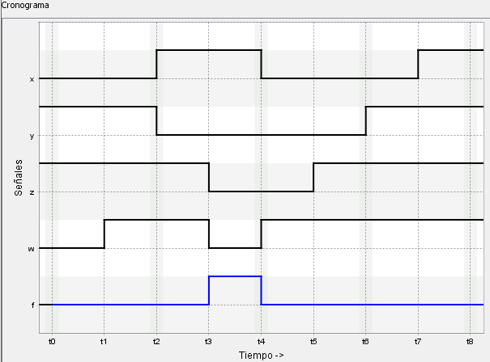
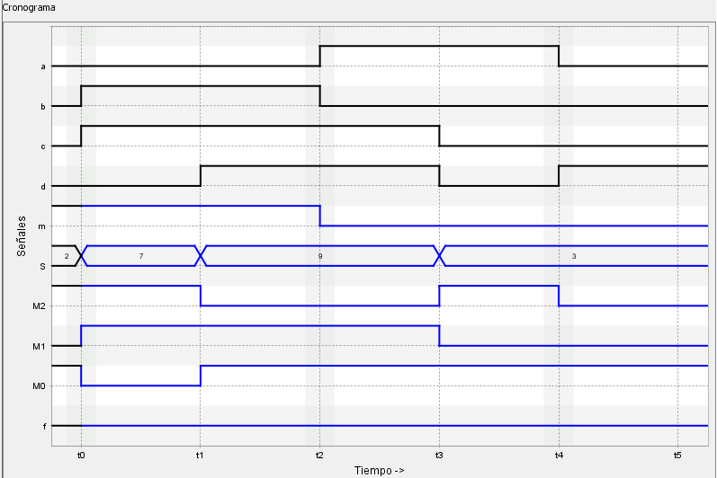

# VerilChart - Circuitos combinacionales (histórico)

## Índice

- [20122\_PAC2\_3B](#20122_pac2_3b)
- [20131\_PAC2\_3C](#20131_pac2_3c)
- [20132\_PAC2\_2E](#20132_pac2_2e)
- [20141\_PAC2\_3A](#20141_pac2_3a)
- [20142\_PAC2\_3](#20142_pac2_3)
- [20152\_PAC2\_4](#20152_pac2_4)
- [20102\_PAC2\_2](#20102_pac2_2)
- [20121\_PAC2\_3](#20121_pac2_3)
- [20122\_PAC2\_3](#20122_pac2_3)
- [20131\_EX1\_2B](#20131_ex1_2b)
- [20131\_EX2\_2B](#20131_ex2_2b)
- [20131\_EX3\_2B](#20131_ex3_2b)
- [20132\_PAC2\_3](#20132_pac2_3)
- [20141\_PAC2\_2](#20141_pac2_2)
- [20152\_PAC2\_3A](#20152_pac2_3a)
- [20162\_PAC2\_2](#20162_pac2_2)
- [20171\_PAC2\_1B](#20171_pac2_1b)
- [20171\_PAC2\_3](#20171_pac2_3)

 

## 20122_PAC2_3B

<blockquote>

Dado el siguiente circuito:

donde el contenido de la memoria ROM es:

<table align="center">
	<tr>
		<th>@</th>
		<th>ROM1[@]</th>
		<th>ROM2[@]</th>
	</tr>
	<tr>
		<td>0</td>
		<td>10</td>
		<td>10</td>
	</tr>
	<tr>
		<td>1</td>
		<td>11</td>
		<td>10</td>
	</tr>
	<tr>
		<td>2</td>
		<td>01</td>
		<td>11</td>
	</tr>
	<tr>
		<td>3</td>
		<td>00</td>
		<td>00</td>
	</tr>
</table>

Completad el siguiente cronograma:

</blockquote>

	
Ejercicio resuelto

	

		
	

## 20131_PAC2_3C

<blockquote>

A continuación se muestra la tabla de verdad de un circuito combinacional:

<table align="center">
	<tr>
		<th colspan="4">ENTRADA</th>
		<th colspan="2">SALIDA</th>
	</tr>
	<tr>
		<th>$x$</th>
		<th>$y$</th>
		<th>$z$</th>
		<th>$w$</th>
		<th>$f$</th>
		<th>$g$</th>
	</tr>
	<tr>
		<td>0</td>
		<td>0</td>
		<td>0</td>
		<td>0</td>
		<td>1</td>
		<td>1</td>
	</tr>
	<tr>
		<td>0</td>
		<td>0</td>
		<td>0</td>
		<td>1</td>
		<td>1</td>
		<td>0</td>
	</tr>
	<tr>
		<td>0</td>
		<td>0</td>
		<td>1</td>
		<td>0</td>
		<td>1</td>
		<td>0</td>
	</tr>
	<tr>
		<td>0</td>
		<td>0</td>
		<td>1</td>
		<td>1</td>
		<td>1</td>
		<td>0</td>
	</tr>
	<tr>
		<td>0</td>
		<td>1</td>
		<td>0</td>
		<td>0</td>
		<td>0</td>
		<td>1</td>
	</tr>
	<tr>
		<td>0</td>
		<td>1</td>
		<td>0</td>
		<td>1</td>
		<td>1</td>
		<td>1</td>
	</tr>
	<tr>
		<td>0</td>
		<td>1</td>
		<td>1</td>
		<td>0</td>
		<td>0</td>
		<td>0</td>
	</tr>
	<tr>
		<td>0</td>
		<td>1</td>
		<td>1</td>
		<td>1</td>
		<td>1</td>
		<td>1</td>
	</tr>
	<tr>
		<td>1</td>
		<td>0</td>
		<td>0</td>
		<td>0</td>
		<td>0</td>
		<td>1</td>
	</tr>
	<tr>
		<td>1</td>
		<td>0</td>
		<td>0</td>
		<td>1</td>
		<td>0</td>
		<td>1</td>
	</tr>
	<tr>
		<td>1</td>
		<td>0</td>
		<td>1</td>
		<td>0</td>
		<td>1</td>
		<td>1</td>
	</tr>
	<tr>
		<td>1</td>
		<td>0</td>
		<td>1</td>
		<td>1</td>
		<td>1</td>
		<td>1</td>
	</tr>
	<tr>
		<td>1</td>
		<td>1</td>
		<td>0</td>
		<td>0</td>
		<td>0</td>
		<td>1</td>
	</tr>
	<tr>
		<td>1</td>
		<td>1</td>
		<td>0</td>
		<td>1</td>
		<td>0</td>
		<td>0</td>
	</tr>
	<tr>
		<td>1</td>
		<td>1</td>
		<td>1</td>
		<td>0</td>
		<td>0</td>
		<td>1</td>
	</tr>
	<tr>
		<td>1</td>
		<td>1</td>
		<td>1</td>
		<td>1</td>
		<td>1</td>
		<td>0</td>
	</tr>
</table>

Completad el siguiente cronograma:

</blockquote>

	
Ejercicio resuelto

	

		
	

## 20132_PAC2_2E

<blockquote>

A continuación se muestra la tabla de verdad de un circuito combinacional:

<table align="center">
	<tr>
		<th colspan="4">ENTRADA</th>
		<th colspan="2">SALIDA</th>
	</tr>
	<tr>
		<th>$x$</th>
		<th>$y$</th>
		<th>$z$</th>
		<th>$w$</th>
		<th>$f$</th>
		<th>$g$</th>
	</tr>
	<tr>
		<td>0</td>
		<td>0</td>
		<td>0</td>
		<td>0</td>
		<td>1</td>
		<td>X</td>
	</tr>
	<tr>
		<td>0</td>
		<td>0</td>
		<td>0</td>
		<td>1</td>
		<td>0</td>
		<td>1</td>
	</tr>
	<tr>
		<td>0</td>
		<td>0</td>
		<td>1</td>
		<td>0</td>
		<td>1</td>
		<td>X</td>
	</tr>
	<tr>
		<td>0</td>
		<td>0</td>
		<td>1</td>
		<td>1</td>
		<td>0</td>
		<td>0</td>
	</tr>
	<tr>
		<td>0</td>
		<td>1</td>
		<td>0</td>
		<td>0</td>
		<td>1</td>
		<td>1</td>
	</tr>
	<tr>
		<td>0</td>
		<td>1</td>
		<td>0</td>
		<td>1</td>
		<td>1</td>
		<td>1</td>
	</tr>
	<tr>
		<td>0</td>
		<td>1</td>
		<td>1</td>
		<td>0</td>
		<td>0</td>
		<td>X</td>
	</tr>
	<tr>
		<td>0</td>
		<td>1</td>
		<td>1</td>
		<td>1</td>
		<td>0</td>
		<td>1</td>
	</tr>
	<tr>
		<td>1</td>
		<td>0</td>
		<td>0</td>
		<td>0</td>
		<td>1</td>
		<td>0</td>
	</tr>
	<tr>
		<td>1</td>
		<td>0</td>
		<td>0</td>
		<td>1</td>
		<td>0</td>
		<td>X</td>
	</tr>
	<tr>
		<td>1</td>
		<td>0</td>
		<td>1</td>
		<td>0</td>
		<td>1</td>
		<td>1</td>
	</tr>
	<tr>
		<td>1</td>
		<td>0</td>
		<td>1</td>
		<td>1</td>
		<td>0</td>
		<td>1</td>
	</tr>
	<tr>
		<td>1</td>
		<td>1</td>
		<td>0</td>
		<td>0</td>
		<td>1</td>
		<td>X</td>
	</tr>
	<tr>
		<td>1</td>
		<td>1</td>
		<td>0</td>
		<td>1</td>
		<td>0</td>
		<td>0</td>
	</tr>
	<tr>
		<td>1</td>
		<td>1</td>
		<td>1</td>
		<td>0</td>
		<td>1</td>
		<td>X</td>
	</tr>
	<tr>
		<td>1</td>
		<td>1</td>
		<td>1</td>
		<td>1</td>
		<td>0</td>
		<td>0</td>
	</tr>
</table>

Completad el siguiente cronograma:

</blockquote>

	
Ejercicio resuelto

	

		
	

## 20141_PAC2_3A

<blockquote>

A continuación se muestra la tabla de verdad de un circuito combinacional:

<table align="center">
	<tr>
		<th colspan="3">ENTRADA</th>
		<th colspan="2">SALIDA</th>
	</tr>
	<tr>
		<th>$a$</th>
		<th>$b$</th>
		<th>$c$</th>
		<th>$f_1$</th>
		<th>$f_2$</th>
	</tr>
	<tr>
		<td>0</td>
		<td>0</td>
		<td>0</td>
		<td>0</td>
		<td>0</td>
	</tr>
	<tr>
		<td>0</td>
		<td>0</td>
		<td>1</td>
		<td>1</td>
		<td>0</td>
	</tr>
	<tr>
		<td>0</td>
		<td>1</td>
		<td>0</td>
		<td>0</td>
		<td>1</td>
	</tr>
	<tr>
		<td>0</td>
		<td>1</td>
		<td>1</td>
		<td>1</td>
		<td>0</td>
	</tr>
	<tr>
		<td>1</td>
		<td>0</td>
		<td>0</td>
		<td>1</td>
		<td>1</td>
	</tr>
	<tr>
		<td>1</td>
		<td>0</td>
		<td>1</td>
		<td>0</td>
		<td>1</td>
	</tr>
	<tr>
		<td>1</td>
		<td>1</td>
		<td>0</td>
		<td>1</td>
		<td>1</td>
	</tr>
	<tr>
		<td>1</td>
		<td>1</td>
		<td>1</td>
		<td>0</td>
		<td>0</td>
	</tr>
</table>

Completad el siguiente cronograma:

</blockquote>

	
Ejercicio resuelto

	

		
	

## 20142_PAC2_3

<blockquote>

A continuación se muestra la tabla de verdad de un circuito combinacional:

<table align="center">
	<tr>
		<th colspan="4">ENTRADA</th>
		<th>SALIDA</th>
	</tr>
	<tr>
		<th>$a$</th>
		<th>$b$</th>
		<th>$c$</th>
		<th>$d$</th>
		<th>$f_2$</th>
	</tr>
	<tr>
		<td>0</td>
		<td>0</td>
		<td>0</td>
		<td>0</td>
		<td>0</td>
	</tr>
	<tr>
		<td>0</td>
		<td>0</td>
		<td>0</td>
		<td>1</td>
		<td>0</td>
	</tr>
	<tr>
		<td>0</td>
		<td>0</td>
		<td>1</td>
		<td>0</td>
		<td>0</td>
	</tr>
	<tr>
		<td>0</td>
		<td>0</td>
		<td>1</td>
		<td>1</td>
		<td>0</td>
	</tr>
	<tr>
		<td>0</td>
		<td>1</td>
		<td>0</td>
		<td>0</td>
		<td>0</td>
	</tr>
	<tr>
		<td>0</td>
		<td>1</td>
		<td>0</td>
		<td>1</td>
		<td>0</td>
	</tr>
	<tr>
		<td>0</td>
		<td>1</td>
		<td>1</td>
		<td>0</td>
		<td>1</td>
	</tr>
	<tr>
		<td>0</td>
		<td>1</td>
		<td>1</td>
		<td>1</td>
		<td>1</td>
	</tr>
	<tr>
		<td>1</td>
		<td>0</td>
		<td>0</td>
		<td>0</td>
		<td>0</td>
	</tr>
	<tr>
		<td>1</td>
		<td>0</td>
		<td>0</td>
		<td>1</td>
		<td>1</td>
	</tr>
	<tr>
		<td>1</td>
		<td>0</td>
		<td>1</td>
		<td>0</td>
		<td>0</td>
	</tr>
	<tr>
		<td>1</td>
		<td>0</td>
		<td>1</td>
		<td>1</td>
		<td>1</td>
	</tr>
	<tr>
		<td>1</td>
		<td>1</td>
		<td>0</td>
		<td>0</td>
		<td>0</td>
	</tr>
	<tr>
		<td>1</td>
		<td>1</td>
		<td>0</td>
		<td>1</td>
		<td>1</td>
	</tr>
	<tr>
		<td>1</td>
		<td>1</td>
		<td>1</td>
		<td>0</td>
		<td>1</td>
	</tr>
	<tr>
		<td>1</td>
		<td>1</td>
		<td>1</td>
		<td>1</td>
		<td>1</td>
	</tr>
</table>

Completad el siguiente cronograma:

</blockquote>

	
Ejercicio resuelto

	

		
	

## 20152_PAC2_4

<blockquote>

Dado el siguiente circuito combinacional:

>`0cd1` y `00ab` **NO SON** números hexadecimales. `a` y `b` hacen referencia a las entradas.

donde el contenido de la memoria ROM es:

<table align="center">
	<tr>
		<th>@</th>
		<th>M[@]</th>
	</tr>
	<tr>
		<td>0</td>
		<td>10</td>
	</tr>
	<tr>
		<td>1</td>
		<td>00</td>
	</tr>
	<tr>
		<td>2</td>
		<td>01</td>
	</tr>
	<tr>
		<td>3</td>
		<td>11</td>
	</tr>
	<tr>
		<td>4</td>
		<td>11</td>
	</tr>
	<tr>
		<td>5</td>
		<td>00</td>
	</tr>
	<tr>
		<td>6</td>
		<td>11</td>
	</tr>
	<tr>
		<td>7</td>
		<td>10</td>
	</tr>
</table>

Completad el siguiente cronograma:

</blockquote>

	
Ejercicio resuelto

	

		
	

## 20102_PAC2_2

<blockquote>

Dado el siguiente circuito:

donde el contenido de la memoria ROM es:

<table align="center">
	<tr>
		<th>@</th>
		<th>ROM[@]</th>
	</tr>
	<tr>
		<td>0</td>
		<td>101</td>
	</tr>
	<tr>
		<td>1</td>
		<td>001</td>
	</tr>
	<tr>
		<td>2</td>
		<td>011</td>
	</tr>
	<tr>
		<td>3</td>
		<td>100</td>
	</tr>
	<tr>
		<td>4</td>
		<td>101</td>
	</tr>
	<tr>
		<td>5</td>
		<td>110</td>
	</tr>
	<tr>
		<td>6</td>
		<td>011</td>
	</tr>
	<tr>
		<td>7</td>
		<td>010</td>
	</tr>
</table>

Completad la siguiente tabla de verdad:

<table align="center">
	<tr>
		<th colspan="4">ENTRADAS</th>
		<th colspan="4">SALIDAS</th>
	</tr>
	<tr>
		<th>$a$</th>
		<th>$b$</th>
		<th>$c$</th>
		<th>$d$</th>
		<th>$s1$</th>
		<th>$s0$</th>
		<th>$s$</th>
		<th>$x$</th>
	</tr>
	<tr>
		<th>0</th>
		<th>0</th>
		<th>0</th>
		<th>0</th>
		<th>0</th>
		<th>0</th>
		<th>0</th>
		<th>0</th>
	</tr>
	<tr>
		<th>0</th>
		<th>0</th>
		<th>0</th>
		<th>1</th>
		<th>0</th>
		<th>0</th>
		<th>0</th>
		<th>0</th>
	</tr>
	<tr>
		<th>0</th>
		<th>0</th>
		<th>1</th>
		<th>0</th>
		<th>0</th>
		<th>0</th>
		<th>0</th>
		<th>0</th>
	</tr>
	<tr>
		<th>0</th>
		<th>0</th>
		<th>1</th>
		<th>1</th>
		<th>0</th>
		<th>0</th>
		<th>0</th>
		<th>0</th>
	</tr>
	<tr>
		<th>0</th>
		<th>1</th>
		<th>0</th>
		<th>0</th>
		<th>0</th>
		<th>0</th>
		<th>0</th>
		<th>0</th>
	</tr>
	<tr>
		<th>0</th>
		<th>1</th>
		<th>0</th>
		<th>1</th>
		<th>0</th>
		<th>0</th>
		<th>0</th>
		<th>0</th>
	</tr>
	<tr>
		<th>0</th>
		<th>1</th>
		<th>1</th>
		<th>0</th>
		<th>0</th>
		<th>0</th>
		<th>0</th>
		<th>0</th>
	</tr>
	<tr>
		<th>0</th>
		<th>1</th>
		<th>1</th>
		<th>1</th>
		<th>0</th>
		<th>0</th>
		<th>0</th>
		<th>0</th>
	</tr>
	<tr>
		<th>1</th>
		<th>0</th>
		<th>0</th>
		<th>0</th>
		<th>0</th>
		<th>0</th>
		<th>0</th>
		<th>0</th>
	</tr>
	<tr>
		<th>1</th>
		<th>0</th>
		<th>0</th>
		<th>1</th>
		<th>0</th>
		<th>0</th>
		<th>0</th>
		<th>0</th>
	</tr>
	<tr>
		<th>1</th>
		<th>0</th>
		<th>1</th>
		<th>0</th>
		<th>0</th>
		<th>0</th>
		<th>0</th>
		<th>0</th>
	</tr>
	<tr>
		<th>1</th>
		<th>0</th>
		<th>1</th>
		<th>1</th>
		<th>0</th>
		<th>0</th>
		<th>0</th>
		<th>0</th>
	</tr>
	<tr>
		<th>1</th>
		<th>1</th>
		<th>0</th>
		<th>0</th>
		<th>0</th>
		<th>0</th>
		<th>0</th>
		<th>0</th>
	</tr>
	<tr>
		<th>1</th>
		<th>1</th>
		<th>0</th>
		<th>1</th>
		<th>0</th>
		<th>0</th>
		<th>0</th>
		<th>0</th>
	</tr>
	<tr>
		<th>1</th>
		<th>1</th>
		<th>1</th>
		<th>0</th>
		<th>0</th>
		<th>0</th>
		<th>0</th>
		<th>0</th>
	</tr>
	<tr>
		<th>1</th>
		<th>1</th>
		<th>1</th>
		<th>1</th>
		<th>0</th>
		<th>0</th>
		<th>0</th>
		<th>0</th>
	</tr>
</table>
</blockquote>

	
Ejercicio resuelto

	<table align="center">
		<tr>
			<th colspan="4">ENTRADAS</th>
		<th colspan="4">SALIDAS</th>
		</tr>
		<tr>
			<th>$a$</th>
			<th>$b$</th>
			<th>$c$</th>
			<th>$d$</th>
			<th>$s1$</th>
			<th>$s0$</th>
			<th>$s$</th>
			<th>$x$</th>
		</tr>
		<tr>
			<th>0</th>
			<th>0</th>
			<th>0</th>
			<th>0</th>
			<th>0</th>
			<th>0</th>
			<th>0</th>
			<th>1</th>
		</tr>
		<tr>
			<th>0</th>
			<th>0</th>
			<th>0</th>
			<th>1</th>
			<th>0</th>
			<th>0</th>
			<th>0</th>
			<th>1</th>
		</tr>
		<tr>
			<th>0</th>
			<th>0</th>
			<th>1</th>
			<th>0</th>
			<th>0</th>
			<th>1</th>
			<th>1</th>
			<th>1</th>
		</tr>
		<tr>
			<th>0</th>
			<th>0</th>
			<th>1</th>
			<th>1</th>
			<th>0</th>
			<th>1</th>
			<th>1</th>
			<th>1</th>
		</tr>
		<tr>
			<th>0</th>
			<th>1</th>
			<th>0</th>
			<th>0</th>
			<th>1</th>
			<th>0</th>
			<th>1</th>
			<th>1</th>
		</tr>
		<tr>
			<th>0</th>
			<th>1</th>
			<th>0</th>
			<th>1</th>
			<th>1</th>
			<th>0</th>
			<th>0</th>
			<th>1</th>
		</tr>
		<tr>
			<th>0</th>
			<th>1</th>
			<th>1</th>
			<th>0</th>
			<th>1</th>
			<th>0</th>
			<th>0</th>
			<th>1</th>
		</tr>
		<tr>
			<th>0</th>
			<th>1</th>
			<th>1</th>
			<th>1</th>
			<th>1</th>
			<th>0</th>
			<th>1</th>
			<th>1</th>
		</tr>
		<tr>
			<th>1</th>
			<th>0</th>
			<th>0</th>
			<th>0</th>
			<th>1</th>
			<th>1</th>
			<th>0</th>
			<th>0</th>
		</tr>
		<tr>
			<th>1</th>
			<th>0</th>
			<th>0</th>
			<th>1</th>
			<th>1</th>
			<th>1</th>
			<th>1</th>
			<th>0</th>
		</tr>
		<tr>
			<th>1</th>
			<th>0</th>
			<th>1</th>
			<th>0</th>
			<th>1</th>
			<th>1</th>
			<th>0</th>
			<th>0</th>
		</tr>
		<tr>
			<th>1</th>
			<th>0</th>
			<th>1</th>
			<th>1</th>
			<th>1</th>
			<th>1</th>
			<th>1</th>
			<th>0</th>
		</tr>
		<tr>
			<th>1</th>
			<th>1</th>
			<th>0</th>
			<th>0</th>
			<th>1</th>
			<th>1</th>
			<th>0</th>
			<th>0</th>
		</tr>
		<tr>
			<th>1</th>
			<th>1</th>
			<th>0</th>
			<th>1</th>
			<th>1</th>
			<th>1</th>
			<th>1</th>
			<th>0</th>
		</tr>
		<tr>
			<th>1</th>
			<th>1</th>
			<th>1</th>
			<th>0</th>
			<th>1</th>
			<th>1</th>
			<th>1</th>
			<th>0</th>
		</tr>
		<tr>
			<th>1</th>
			<th>1</th>
			<th>1</th>
			<th>1</th>
			<th>1</th>
			<th>1</th>
			<th>1</th>
			<th>0</th>
		</tr>
	</table>

## 20121_PAC2_3

<blockquote>

Dado el siguiente circuito:

donde el contenido de la memoria ROM es:

<table align="center">
	<tr>
		<th>@</th>
		<th>ROM[@]</th>
	</tr>
	<tr>
		<td>0</td>
		<td>0111</td>
	</tr>
	<tr>
		<td>1</td>
		<td>1110</td>
	</tr>
	<tr>
		<td>2</td>
		<td>1001</td>
	</tr>
	<tr>
		<td>3</td>
		<td>1000</td>
	</tr>
</table>

Completad la siguiente tabla de verdad:

<table align="center">
	<tr>
		<th colspan="4">ENTRADAS</th>
		<th colspan="7">SALIDAS</th>
	</tr>
	<tr>
		<th>$a$</th>
		<th>$b$</th>
		<th>$c$</th>
		<th>$d$</th>
		<th>$x$</th>
		<th>$y$</th>
		<th>$m3$</th>
		<th>$m2$</th>
		<th>$m1$</th>
		<th>$m0$</th>
		<th>$f$</th>
	</tr>
	<tr>
		<td>0</td>
		<td>0</td>
		<td>0</td>
		<td>0</td>
		<td>0</td>
		<td>0</td>
		<td>0</td>
		<td>0</td>
		<td>0</td>
		<td>0</td>
		<td>0</td>
	</tr>
	<tr>
		<td>0</td>
		<td>0</td>
		<td>0</td>
		<td>1</td>
		<td>0</td>
		<td>0</td>
		<td>0</td>
		<td>0</td>
		<td>0</td>
		<td>0</td>
		<td>0</td>
	</tr>
	<tr>
		<td>0</td>
		<td>0</td>
		<td>1</td>
		<td>0</td>
		<td>0</td>
		<td>0</td>
		<td>0</td>
		<td>0</td>
		<td>0</td>
		<td>0</td>
		<td>0</td>
	</tr>
	<tr>
		<td>0</td>
		<td>0</td>
		<td>1</td>
		<td>1</td>
		<td>0</td>
		<td>0</td>
		<td>0</td>
		<td>0</td>
		<td>0</td>
		<td>0</td>
		<td>0</td>
	</tr>
	<tr>
		<td>0</td>
		<td>1</td>
		<td>0</td>
		<td>0</td>
		<td>0</td>
		<td>0</td>
		<td>0</td>
		<td>0</td>
		<td>0</td>
		<td>0</td>
		<td>0</td>
	</tr>
	<tr>
		<td>0</td>
		<td>1</td>
		<td>0</td>
		<td>1</td>
		<td>0</td>
		<td>0</td>
		<td>0</td>
		<td>0</td>
		<td>0</td>
		<td>0</td>
		<td>0</td>
	</tr>
	<tr>
		<td>0</td>
		<td>1</td>
		<td>1</td>
		<td>0</td>
		<td>0</td>
		<td>0</td>
		<td>0</td>
		<td>0</td>
		<td>0</td>
		<td>0</td>
		<td>0</td>
	</tr>
	<tr>
		<td>0</td>
		<td>1</td>
		<td>1</td>
		<td>1</td>
		<td>0</td>
		<td>0</td>
		<td>0</td>
		<td>0</td>
		<td>0</td>
		<td>0</td>
		<td>0</td>
	</tr>
	<tr>
		<td>1</td>
		<td>0</td>
		<td>0</td>
		<td>0</td>
		<td>0</td>
		<td>0</td>
		<td>0</td>
		<td>0</td>
		<td>0</td>
		<td>0</td>
		<td>0</td>
	</tr>
	<tr>
		<td>1</td>
		<td>0</td>
		<td>0</td>
		<td>1</td>
		<td>0</td>
		<td>0</td>
		<td>0</td>
		<td>0</td>
		<td>0</td>
		<td>0</td>
		<td>0</td>
	</tr>
	<tr>
		<td>1</td>
		<td>0</td>
		<td>1</td>
		<td>0</td>
		<td>0</td>
		<td>0</td>
		<td>0</td>
		<td>0</td>
		<td>0</td>
		<td>0</td>
		<td>0</td>
	</tr>
	<tr>
		<td>1</td>
		<td>0</td>
		<td>1</td>
		<td>1</td>
		<td>0</td>
		<td>0</td>
		<td>0</td>
		<td>0</td>
		<td>0</td>
		<td>0</td>
		<td>0</td>
	</tr>
	<tr>
		<td>1</td>
		<td>1</td>
		<td>0</td>
		<td>0</td>
		<td>0</td>
		<td>0</td>
		<td>0</td>
		<td>0</td>
		<td>0</td>
		<td>0</td>
		<td>0</td>
	</tr>
	<tr>
		<td>1</td>
		<td>1</td>
		<td>0</td>
		<td>1</td>
		<td>0</td>
		<td>0</td>
		<td>0</td>
		<td>0</td>
		<td>0</td>
		<td>0</td>
		<td>0</td>
	</tr>
	<tr>
		<td>1</td>
		<td>1</td>
		<td>1</td>
		<td>0</td>
		<td>0</td>
		<td>0</td>
		<td>0</td>
		<td>0</td>
		<td>0</td>
		<td>0</td>
		<td>0</td>
	</tr>
	<tr>
		<td>1</td>
		<td>1</td>
		<td>1</td>
		<td>1</td>
		<td>0</td>
		<td>0</td>
		<td>0</td>
		<td>0</td>
		<td>0</td>
		<td>0</td>
		<td>0</td>
	</tr>
</table>
</blockquote>

	
Ejercicio resuelto

	<table align="center">
		<tr>
			<th colspan="4">ENTRADAS</th>
			<th colspan="7">SALIDAS</th>
		</tr>
		<tr>
			<th>$a$</th>
			<th>$b$</th>
			<th>$c$</th>
			<th>$d$</th>
			<th>$x$</th>
			<th>$y$</th>
			<th>$m3$</th>
			<th>$m2$</th>
			<th>$m1$</th>
			<th>$m0$</th>
			<th>$f$</th>
		</tr>
		<tr>
			<td>0</td>
			<td>0</td>
			<td>0</td>
			<td>0</td>
			<td>1</td>
			<td>1</td>
			<td>1</td>
			<td>0</td>
			<td>0</td>
			<td>0</td>
			<td>0</td>
		</tr>
		<tr>
			<td>0</td>
			<td>0</td>
			<td>0</td>
			<td>1</td>
			<td>1</td>
			<td>0</td>
			<td>1</td>
			<td>0</td>
			<td>0</td>
			<td>1</td>
			<td>1</td>
		</tr>
		<tr>
			<td>0</td>
			<td>0</td>
			<td>1</td>
			<td>0</td>
			<td>1</td>
			<td>1</td>
			<td>1</td>
			<td>0</td>
			<td>0</td>
			<td>0</td>
			<td>0</td>
		</tr>
		<tr>
			<td>0</td>
			<td>0</td>
			<td>1</td>
			<td>1</td>
			<td>0</td>
			<td>0</td>
			<td>0</td>
			<td>1</td>
			<td>1</td>
			<td>1</td>
			<td>0</td>
		</tr>
		<tr>
			<td>0</td>
			<td>1</td>
			<td>0</td>
			<td>0</td>
			<td>1</td>
			<td>1</td>
			<td>1</td>
			<td>0</td>
			<td>0</td>
			<td>0</td>
			<td>0</td>
		</tr>
		<tr>
			<td>0</td>
			<td>1</td>
			<td>0</td>
			<td>1</td>
			<td>1</td>
			<td>0</td>
			<td>1</td>
			<td>0</td>
			<td>0</td>
			<td>1</td>
			<td>1</td>
		</tr>
		<tr>
			<td>0</td>
			<td>1</td>
			<td>1</td>
			<td>0</td>
			<td>1</td>
			<td>1</td>
			<td>1</td>
			<td>0</td>
			<td>0</td>
			<td>0</td>
			<td>0</td>
		</tr>
		<tr>
			<td>0</td>
			<td>1</td>
			<td>1</td>
			<td>1</td>
			<td>0</td>
			<td>0</td>
			<td>0</td>
			<td>1</td>
			<td>1</td>
			<td>1</td>
			<td>0</td>
		</tr>
		<tr>
			<td>1</td>
			<td>0</td>
			<td>0</td>
			<td>0</td>
			<td>1</td>
			<td>0</td>
			<td>1</td>
			<td>0</td>
			<td>0</td>
			<td>1</td>
			<td>1</td>
		</tr>
		<tr>
			<td>1</td>
			<td>0</td>
			<td>0</td>
			<td>1</td>
			<td>1</td>
			<td>0</td>
			<td>1</td>
			<td>0</td>
			<td>0</td>
			<td>1</td>
			<td>1</td>
		</tr>
		<tr>
			<td>1</td>
			<td>0</td>
			<td>1</td>
			<td>0</td>
			<td>1</td>
			<td>0</td>
			<td>1</td>
			<td>0</td>
			<td>0</td>
			<td>1</td>
			<td>1</td>
		</tr>
		<tr>
			<td>1</td>
			<td>0</td>
			<td>1</td>
			<td>1</td>
			<td>0</td>
			<td>0</td>
			<td>0</td>
			<td>1</td>
			<td>1</td>
			<td>1</td>
			<td>0</td>
		</tr>
		<tr>
			<td>1</td>
			<td>1</td>
			<td>0</td>
			<td>0</td>
			<td>0</td>
			<td>1</td>
			<td>1</td>
			<td>1</td>
			<td>1</td>
			<td>0</td>
			<td>1</td>
		</tr>
		<tr>
			<td>1</td>
			<td>1</td>
			<td>0</td>
			<td>1</td>
			<td>0</td>
			<td>1</td>
			<td>1</td>
			<td>1</td>
			<td>1</td>
			<td>0</td>
			<td>1</td>
		</tr>
		<tr>
			<td>1</td>
			<td>1</td>
			<td>1</td>
			<td>0</td>
			<td>0</td>
			<td>1</td>
			<td>1</td>
			<td>1</td>
			<td>1</td>
			<td>0</td>
			<td>1</td>
		</tr>
		<tr>
			<td>1</td>
			<td>1</td>
			<td>1</td>
			<td>1</td>
			<td>1</td>
			<td>1</td>
			<td>1</td>
			<td>0</td>
			<td>0</td>
			<td>0</td>
			<td>0</td>
		</tr>
	</table>

## 20122_PAC2_3

<blockquote>

Dado el siguiente circuito:

donde el contenido de la memoria ROM es:

<table align="center">
	<tr>
		<th>@</th>
		<th>ROM1[@]</th>
		<th>ROM2[@]</th>
	</tr>
	<tr>
		<td>0</td>
		<td>10</td>
		<td>10</td>
	</tr>
	<tr>
		<td>1</td>
		<td>11</td>
		<td>10</td>
	</tr>
	<tr>
		<td>2</td>
		<td>01</td>
		<td>11</td>
	</tr>
	<tr>
		<td>3</td>
		<td>00</td>
		<td>00</td>
	</tr>
</table>

Completad la siguiente tabl, donde $e1$ y $e0$ son las entradas del multiplexor:

<table align="center">
	<tr>
		<th>ENTRADAS</th>
		<th colspan="4">SALIDAS</th>
	</tr>
	<tr>
		<th>$E$</th>
		<th>$e1$</th>
		<th>$e0$</th>
		<th>$c$</th>
		<th>$S$</th>
	</tr>
	<tr>
		<th>000</th>
		<th>00</th>
		<th>00</th>
		<th>0</th>
		<th>00</th>
	</tr>
	<tr>
		<th>001</th>
		<th>00</th>
		<th>00</th>
		<th>0</th>
		<th>00</th>
	</tr>
	<tr>
		<th>010</th>
		<th>00</th>
		<th>00</th>
		<th>0</th>
		<th>00</th>
	</tr>
	<tr>
		<th>011</th>
		<th>00</th>
		<th>00</th>
		<th>0</th>
		<th>00</th>
	</tr>
	<tr>
		<th>100</th>
		<th>00</th>
		<th>00</th>
		<th>0</th>
		<th>00</th>
	</tr>
	<tr>
		<th>101</th>
		<th>00</th>
		<th>00</th>
		<th>0</th>
		<th>00</th>
	</tr>
	<tr>
		<th>110</th>
		<th>00</th>
		<th>00</th>
		<th>0</th>
		<th>00</th>
	</tr>
	<tr>
		<th>111</th>
		<th>00</th>
		<th>00</th>
		<th>0</th>
		<th>00</th>
	</tr>
</table>
</blockquote>

	
Ejercicio resuelto

	<table align="center">
		<tr>
			<th>ENTRADAS</th>
			<th colspan="4">SALIDAS</th>
		</tr>
		<tr>
			<th>$E$</th>
			<th>$e1$</th>
			<th>$e0$</th>
			<th>$c$</th>
			<th>$S$</th>
		</tr>
		<tr>
			<th>000</th>
			<th>00</th>
			<th>10</th>
			<th>0</th>
			<th>10</th>
		</tr>
		<tr>
			<th>001</th>
			<th>00</th>
			<th>10</th>
			<th>0</th>
			<th>10</th>
		</tr>
		<tr>
			<th>010</th>
			<th>11</th>
			<th>10</th>
			<th>1</th>
			<th>11</th>
		</tr>
		<tr>
			<th>011</th>
			<th>11</th>
			<th>10</th>
			<th>1</th>
			<th>11</th>
		</tr>
		<tr>
			<th>100</th>
			<th>11</th>
			<th>10</th>
			<th>0</th>
			<th>10</th>
		</tr>
		<tr>
			<th>101</th>
			<th>11</th>
			<th>10</th>
			<th>0</th>
			<th>10</th>
		</tr>
		<tr>
			<th>110</th>
			<th>11</th>
			<th>00</th>
			<th>0</th>
			<th>00</th>
		</tr>
		<tr>
			<th>111</th>
			<th>11</th>
			<th>00</th>
			<th>0</th>
			<th>00</th>
		</tr>
	</table>

## 20131_EX1_2B

<blockquote>

Dado el siguiente circuito:

donde el contenido de la memoria ROM es:

<table align="center">
	<tr>
		<th>@</th>
		<th>ROM[@]</th>
	</tr>
	<tr>
		<td>0</td>
		<td>01</td>
	</tr>
	<tr>
		<td>1</td>
		<td>11</td>
	</tr>
	<tr>
		<td>2</td>
		<td>00</td>
	</tr>
	<tr>
		<td>3</td>
		<td>10</td>
	</tr>
</table>

Completad la siguiente tabla de verdad:

<table align="center">
	<tr>
		<th colspan="3">ENTRADA</th>
		<th colspan="5">SALIDA</th>
	</tr>
	<tr>
		<th>$x$</th>
		<th>$y$</th>
		<th>$z$</th>
		<th>$entROM$</th>
		<th>$e1$</th>
		<th>$e0$</th>
		<th>$c$</th>
		<th>$S$</th>
	</tr>
	<tr>
		<td>0</td>
		<td>0</td>
		<td>0</td>
		<td>00</td>
		<td>00</td>
		<td>00</td>
		<td>0</td>
		<td>00</td>
	</tr>
	<tr>
		<td>0</td>
		<td>0</td>
		<td>1</td>
		<td>00</td>
		<td>00</td>
		<td>00</td>
		<td>0</td>
		<td>00</td>
	</tr>
	<tr>
		<td>0</td>
		<td>1</td>
		<td>0</td>
		<td>00</td>
		<td>00</td>
		<td>00</td>
		<td>0</td>
		<td>00</td>
	</tr>
	<tr>
		<td>0</td>
		<td>1</td>
		<td>1</td>
		<td>00</td>
		<td>00</td>
		<td>00</td>
		<td>0</td>
		<td>00</td>
	</tr>
	<tr>
		<td>1</td>
		<td>0</td>
		<td>0</td>
		<td>00</td>
		<td>00</td>
		<td>00</td>
		<td>0</td>
		<td>00</td>
	</tr>
	<tr>
		<td>1</td>
		<td>0</td>
		<td>1</td>
		<td>00</td>
		<td>00</td>
		<td>00</td>
		<td>0</td>
		<td>00</td>
	</tr>
	<tr>
		<td>1</td>
		<td>1</td>
		<td>0</td>
		<td>00</td>
		<td>00</td>
		<td>00</td>
		<td>0</td>
		<td>00</td>
	</tr>
	<tr>
		<td>1</td>
		<td>1</td>
		<td>1</td>
		<td>00</td>
		<td>00</td>
		<td>00</td>
		<td>0</td>
		<td>00</td>
	</tr>
</table>
</blockquote>

	
Ejercicio resuelto

	<table align="center">
		<tr>
			<th colspan="3">ENTRADA</th>
			<th colspan="5">SALIDA</th>
		</tr>
		<tr>
			<th>$x$</th>
			<th>$y$</th>
			<th>$z$</th>
			<th>$entROM$</th>
			<th>$e1$</th>
			<th>$e0$</th>
			<th>$c$</th>
			<th>$S$</th>
		</tr>
		<tr>
			<td>0</td>
			<td>0</td>
			<td>0</td>
			<td>01</td>
			<td>00</td>
			<td>11</td>
			<td>0</td>
			<td>11</td>
		</tr>
		<tr>
			<td>0</td>
			<td>0</td>
			<td>1</td>
			<td>00</td>
			<td>11</td>
			<td>01</td>
			<td>0</td>
			<td>01</td>
		</tr>
		<tr>
			<td>0</td>
			<td>1</td>
			<td>0</td>
			<td>10</td>
			<td>00</td>
			<td>00</td>
			<td>0</td>
			<td>00</td>
		</tr>
		<tr>
			<td>0</td>
			<td>1</td>
			<td>1</td>
			<td>10</td>
			<td>11</td>
			<td>00</td>
			<td>0</td>
			<td>00</td>
		</tr>
		<tr>
			<td>1</td>
			<td>0</td>
			<td>0</td>
			<td>11</td>
			<td>10</td>
			<td>10</td>
			<td>1</td>
			<td>10</td>
		</tr>
		<tr>
			<td>1</td>
			<td>0</td>
			<td>1</td>
			<td>10</td>
			<td>10</td>
			<td>00</td>
			<td>1</td>
			<td>10</td>
		</tr>
		<tr>
			<td>1</td>
			<td>1</td>
			<td>0</td>
			<td>00</td>
			<td>10</td>
			<td>01</td>
			<td>1</td>
			<td>10</td>
		</tr>
		<tr>
			<td>1</td>
			<td>1</td>
			<td>1</td>
			<td>00</td>
			<td>10</td>
			<td>01</td>
			<td>1</td>
			<td>10</td>
		</tr>
	</table>

## 20131_EX2_2B

<blockquote>

Dado el siguiente circuito:

Completad la siguiente tabla de verdad:

<table align="center">
	<tr>
		<th colspan="3">ENTRADA</th>
		<th colspan="5">SALIDA</th>
	</tr>
	<tr>
		<th>$x$</th>
		<th>$y$</th>
		<th>$z$</th>
		<th>$S$</th>
		<th>$nor$</th>
		<th>$xor$</th>
		<th>$f1$</th>
		<th>$f0$</th>
	</tr>
	<tr>
		<td>0</td>
		<td>0</td>
		<td>0</td>
		<td>0000</td>
		<td>0</td>
		<td>0</td>
		<td>0</td>
		<td>0</td>
	</tr>
	<tr>
		<td>0</td>
		<td>0</td>
		<td>1</td>
		<td>0000</td>
		<td>0</td>
		<td>0</td>
		<td>0</td>
		<td>0</td>
	</tr>
	<tr>
		<td>0</td>
		<td>1</td>
		<td>0</td>
		<td>0000</td>
		<td>0</td>
		<td>0</td>
		<td>0</td>
		<td>0</td>
	</tr>
	<tr>
		<td>0</td>
		<td>1</td>
		<td>1</td>
		<td>0000</td>
		<td>0</td>
		<td>0</td>
		<td>0</td>
		<td>0</td>
	</tr>
	<tr>
		<td>1</td>
		<td>0</td>
		<td>0</td>
		<td>0000</td>
		<td>0</td>
		<td>0</td>
		<td>0</td>
		<td>0</td>
	</tr>
	<tr>
		<td>1</td>
		<td>0</td>
		<td>1</td>
		<td>0000</td>
		<td>0</td>
		<td>0</td>
		<td>0</td>
		<td>0</td>
	</tr>
	<tr>
		<td>1</td>
		<td>1</td>
		<td>0</td>
		<td>0000</td>
		<td>0</td>
		<td>0</td>
		<td>0</td>
		<td>0</td>
	</tr>
	<tr>
		<td>1</td>
		<td>1</td>
		<td>1</td>
		<td>0000</td>
		<td>0</td>
		<td>0</td>
		<td>0</td>
		<td>0</td>
	</tr>
</table>
</blockquote>

	
Ejercicio resuelto

	<table align="center">
		<tr>
			<th colspan="3">ENTRADA</th>
			<th colspan="5">SALIDA</th>
		</tr>
		<tr>
			<th>$x$</th>
			<th>$y$</th>
			<th>$z$</th>
			<th>$S$</th>
			<th>$nor$</th>
			<th>$xor$</th>
			<th>$f1$</th>
			<th>$f0$</th>
		</tr>
		<tr>
			<td>0</td>
			<td>0</td>
			<td>0</td>
			<td>0000</td>
			<td>1</td>
			<td>0</td>
			<td>0</td>
			<td>0</td>
		</tr>
		<tr>
			<td>0</td>
			<td>0</td>
			<td>1</td>
			<td>0001</td>
			<td>0</td>
			<td>0</td>
			<td>0</td>
			<td>0</td>
		</tr>
		<tr>
			<td>0</td>
			<td>1</td>
			<td>0</td>
			<td>0000</td>
			<td>1</td>
			<td>0</td>
			<td>0</td>
			<td>0</td>
		</tr>
		<tr>
			<td>0</td>
			<td>1</td>
			<td>1</td>
			<td>0010</td>
			<td>0</td>
			<td>0</td>
			<td>0</td>
			<td>1</td>
		</tr>
		<tr>
			<td>1</td>
			<td>0</td>
			<td>0</td>
			<td>0000</td>
			<td>1</td>
			<td>0</td>
			<td>0</td>
			<td>0</td>
		</tr>
		<tr>
			<td>1</td>
			<td>0</td>
			<td>1</td>
			<td>0100</td>
			<td>1</td>
			<td>1</td>
			<td>1</td>
			<td>0</td>
		</tr>
		<tr>
			<td>1</td>
			<td>1</td>
			<td>0</td>
			<td>0000</td>
			<td>1</td>
			<td>0</td>
			<td>0</td>
			<td>0</td>
		</tr>
		<tr>
			<td>1</td>
			<td>1</td>
			<td>1</td>
			<td>1000</td>
			<td>1</td>
			<td>1</td>
			<td>1</td>
			<td>1</td>
		</tr>
	</table>

## 20131_EX3_2B

<blockquote>

Dado el siguiente circuito:

donde el contenido de la memoria ROM es:

<table align="center">
	<tr>
		<th>@</th>
		<th>ROM[@]</th>
	</tr>
	<tr>
		<td>0</td>
		<td>11</td>
	</tr>
	<tr>
		<td>1</td>
		<td>10</td>
	</tr>
	<tr>
		<td>2</td>
		<td>00</td>
	</tr>
	<tr>
		<td>3</td>
		<td>01</td>
	</tr>
</table>

Completad la siguiente tabla de verdad:

<table align="center">
	<tr>
		<th colspan="3">ENTRADA</th>
		<th colspan="5">SALIDA</th>
	</tr>
	<tr>
		<th>$x$</th>
		<th>$y$</th>
		<th>$z$</th>
		<th>$Mout$</th>
		<th>$xor$</th>
		<th>$E$</th>
		<th>$s1$</th>
		<th>$s0$</th>
	</tr>
	<tr>
		<td>0</td>
		<td>0</td>
		<td>0</td>
		<td>00</td>
		<td>0</td>
		<td>0000</td>
		<td>0</td>
		<td>0</td>
	</tr>
	<tr>
		<td>0</td>
		<td>0</td>
		<td>1</td>
		<td>00</td>
		<td>0</td>
		<td>0000</td>
		<td>0</td>
		<td>0</td>
	</tr>
	<tr>
		<td>0</td>
		<td>1</td>
		<td>0</td>
		<td>00</td>
		<td>0</td>
		<td>0000</td>
		<td>0</td>
		<td>0</td>
	</tr>
	<tr>
		<td>0</td>
		<td>1</td>
		<td>1</td>
		<td>00</td>
		<td>0</td>
		<td>0000</td>
		<td>0</td>
		<td>0</td>
	</tr>
	<tr>
		<td>1</td>
		<td>0</td>
		<td>0</td>
		<td>00</td>
		<td>0</td>
		<td>0000</td>
		<td>0</td>
		<td>0</td>
	</tr>
	<tr>
		<td>1</td>
		<td>0</td>
		<td>1</td>
		<td>00</td>
		<td>0</td>
		<td>0000</td>
		<td>0</td>
		<td>0</td>
	</tr>
	<tr>
		<td>1</td>
		<td>1</td>
		<td>0</td>
		<td>00</td>
		<td>0</td>
		<td>0000</td>
		<td>0</td>
		<td>0</td>
	</tr>
	<tr>
		<td>1</td>
		<td>1</td>
		<td>1</td>
		<td>00</td>
		<td>0</td>
		<td>0000</td>
		<td>0</td>
		<td>0</td>
	</tr>
</table>
</blockquote>

	
Ejercicio resuelto

	<table align="center">
		<tr>
			<th colspan="3">ENTRADA</th>
			<th colspan="5">SALIDA</th>
		</tr>
		<tr>
			<th>$x$</th>
			<th>$y$</th>
			<th>$z$</th>
			<th>$Mout$</th>
			<th>$xor$</th>
			<th>$E$</th>
			<th>$s1$</th>
			<th>$s0$</th>
		</tr>
		<tr>
			<td>0</td>
			<td>0</td>
			<td>0</td>
			<td>00</td>
			<td>0</td>
			<td>1001</td>
			<td>1</td>
			<td>1</td>
		</tr>
		<tr>
			<td>0</td>
			<td>0</td>
			<td>1</td>
			<td>10</td>
			<td>0</td>
			<td>1001</td>
			<td>1</td>
			<td>1</td>
		</tr>
		<tr>
			<td>0</td>
			<td>1</td>
			<td>0</td>
			<td>11</td>
			<td>1</td>
			<td>0010</td>
			<td>0</td>
			<td>1</td>
		</tr>
		<tr>
			<td>0</td>
			<td>1</td>
			<td>1</td>
			<td>11</td>
			<td>1</td>
			<td>0010</td>
			<td>0</td>
			<td>1</td>
		</tr>
		<tr>
			<td>1</td>
			<td>0</td>
			<td>0</td>
			<td>00</td>
			<td>0</td>
			<td>0001</td>
			<td>0</td>
			<td>0</td>
		</tr>
		<tr>
			<td>1</td>
			<td>0</td>
			<td>1</td>
			<td>10</td>
			<td>0</td>
			<td>0001</td>
			<td>0</td>
			<td>0</td>
		</tr>
		<tr>
			<td>1</td>
			<td>1</td>
			<td>0</td>
			<td>11</td>
			<td>1</td>
			<td>0100</td>
			<td>1</td>
			<td>0</td>
		</tr>
		<tr>
			<td>1</td>
			<td>1</td>
			<td>1</td>
			<td>11</td>
			<td>1</td>
			<td>0100</td>
			<td>1</td>
			<td>0</td>
		</tr>
	</table>

## 20132_PAC2_3

<blockquote>

Dado el siguiente circuito:

donde el contenido de la memoria ROM es:

<table align="center">
	<tr>
		<th>@</th>
		<th>ROM[@]</th>
	</tr>
	<tr>
		<td>0</td>
		<td>11</td>
	</tr>
	<tr>
		<td>1</td>
		<td>00</td>
	</tr>
	<tr>
		<td>2</td>
		<td>01</td>
	</tr>
	<tr>
		<td>3</td>
		<td>10</td>
	</tr>
	<tr>
		<td>4</td>
		<td>01</td>
	</tr>
	<tr>
		<td>5</td>
		<td>10</td>
	</tr>
	<tr>
		<td>6</td>
		<td>11</td>
	</tr>
	<tr>
		<td>7</td>
		<td>00</td>
	</tr>
</table>

Completad la siguiente tabla de verdad:

<table align="center">
	<tr>
		<th colspan="4">ENTRADAS</th>
		<th colspan="4">SALIDAS</th>
	</tr>
	<tr>
		<th>$a$</th>
		<th>$b$</th>
		<th>$c$</th>
		<th>$d$</th>
		<th>$M2$</th>
		<th>$M1$</th>
		<th>$M0$</th>
		<th>$x$</th>
	</tr>
	<tr>
		<th>0</th>
		<th>0</th>
		<th>0</th>
		<th>0</th>
		<th>0</th>
		<th>0</th>
		<th>0</th>
		<th>0</th>
	</tr>
	<tr>
		<th>0</th>
		<th>0</th>
		<th>0</th>
		<th>1</th>
		<th>0</th>
		<th>0</th>
		<th>0</th>
		<th>0</th>
	</tr>
	<tr>
		<th>0</th>
		<th>0</th>
		<th>1</th>
		<th>0</th>
		<th>0</th>
		<th>0</th>
		<th>0</th>
		<th>0</th>
	</tr>
	<tr>
		<th>0</th>
		<th>0</th>
		<th>1</th>
		<th>1</th>
		<th>0</th>
		<th>0</th>
		<th>0</th>
		<th>0</th>
	</tr>
	<tr>
		<th>0</th>
		<th>1</th>
		<th>0</th>
		<th>0</th>
		<th>0</th>
		<th>0</th>
		<th>0</th>
		<th>0</th>
	</tr>
	<tr>
		<th>0</th>
		<th>1</th>
		<th>0</th>
		<th>1</th>
		<th>0</th>
		<th>0</th>
		<th>0</th>
		<th>0</th>
	</tr>
	<tr>
		<th>0</th>
		<th>1</th>
		<th>1</th>
		<th>0</th>
		<th>0</th>
		<th>0</th>
		<th>0</th>
		<th>0</th>
	</tr>
	<tr>
		<th>0</th>
		<th>1</th>
		<th>1</th>
		<th>1</th>
		<th>0</th>
		<th>0</th>
		<th>0</th>
		<th>0</th>
	</tr>
	<tr>
		<th>1</th>
		<th>0</th>
		<th>0</th>
		<th>0</th>
		<th>0</th>
		<th>0</th>
		<th>0</th>
		<th>0</th>
	</tr>
	<tr>
		<th>1</th>
		<th>0</th>
		<th>0</th>
		<th>1</th>
		<th>0</th>
		<th>0</th>
		<th>0</th>
		<th>0</th>
	</tr>
	<tr>
		<th>1</th>
		<th>0</th>
		<th>1</th>
		<th>0</th>
		<th>0</th>
		<th>0</th>
		<th>0</th>
		<th>0</th>
	</tr>
	<tr>
		<th>1</th>
		<th>0</th>
		<th>1</th>
		<th>1</th>
		<th>0</th>
		<th>0</th>
		<th>0</th>
		<th>0</th>
	</tr>
	<tr>
		<th>1</th>
		<th>1</th>
		<th>0</th>
		<th>0</th>
		<th>0</th>
		<th>0</th>
		<th>0</th>
		<th>0</th>
	</tr>
	<tr>
		<th>1</th>
		<th>1</th>
		<th>0</th>
		<th>1</th>
		<th>0</th>
		<th>0</th>
		<th>0</th>
		<th>0</th>
	</tr>
	<tr>
		<th>1</th>
		<th>1</th>
		<th>1</th>
		<th>0</th>
		<th>0</th>
		<th>0</th>
		<th>0</th>
		<th>0</th>
	</tr>
	<tr>
		<th>1</th>
		<th>1</th>
		<th>1</th>
		<th>1</th>
		<th>0</th>
		<th>0</th>
		<th>0</th>
		<th>0</th>
	</tr>
</table>
</blockquote>

	
Ejercicio resuelto

	<table align="center">
		<tr>
			<th colspan="4">ENTRADAS</th>
			<th colspan="4">SALIDAS</th>
		</tr>
		<tr>
			<th>$a$</th>
			<th>$b$</th>
			<th>$c$</th>
			<th>$d$</th>
			<th>$M2$</th>
			<th>$M1$</th>
			<th>$M0$</th>
			<th>$x$</th>
		</tr>
		<tr>
			<th>0</th>
			<th>0</th>
			<th>0</th>
			<th>0</th>
			<th>0</th>
			<th>1</th>
			<th>0</th>
			<th>1</th>
		</tr>
		<tr>
			<th>0</th>
			<th>0</th>
			<th>0</th>
			<th>1</th>
			<th>0</th>
			<th>1</th>
			<th>0</th>
			<th>1</th>
		</tr>
		<tr>
			<th>0</th>
			<th>0</th>
			<th>1</th>
			<th>0</th>
			<th>0</th>
			<th>1</th>
			<th>0</th>
			<th>1</th>
		</tr>
		<tr>
			<th>0</th>
			<th>0</th>
			<th>1</th>
			<th>1</th>
			<th>1</th>
			<th>1</th>
			<th>0</th>
			<th>0</th>
		</tr>
		<tr>
			<th>0</th>
			<th>1</th>
			<th>0</th>
			<th>0</th>
			<th>0</th>
			<th>1</th>
			<th>1</th>
			<th>1</th>
		</tr>
		<tr>
			<th>0</th>
			<th>1</th>
			<th>0</th>
			<th>1</th>
			<th>1</th>
			<th>1</th>
			<th>1</th>
			<th>0</th>
		</tr>
		<tr>
			<th>0</th>
			<th>1</th>
			<th>1</th>
			<th>0</th>
			<th>0</th>
			<th>1</th>
			<th>1</th>
			<th>1</th>
		</tr>
		<tr>
			<th>0</th>
			<th>1</th>
			<th>1</th>
			<th>1</th>
			<th>1</th>
			<th>1</th>
			<th>1</th>
			<th>0</th>
		</tr>
		<tr>
			<th>1</th>
			<th>0</th>
			<th>0</th>
			<th>0</th>
			<th>0</th>
			<th>1</th>
			<th>1</th>
			<th>1</th>
		</tr>
		<tr>
			<th>1</th>
			<th>0</th>
			<th>0</th>
			<th>1</th>
			<th>0</th>
			<th>1</th>
			<th>1</th>
			<th>1</th>
		</tr>
		<tr>
			<th>1</th>
			<th>0</th>
			<th>1</th>
			<th>0</th>
			<th>0</th>
			<th>1</th>
			<th>1</th>
			<th>1</th>
		</tr>
		<tr>
			<th>1</th>
			<th>0</th>
			<th>1</th>
			<th>1</th>
			<th>1</th>
			<th>1</th>
			<th>1</th>
			<th>0</th>
		</tr>
		<tr>
			<th>1</th>
			<th>1</th>
			<th>0</th>
			<th>0</th>
			<th>0</th>
			<th>1</th>
			<th>1</th>
			<th>1</th>
		</tr	
		<tr>
			<th>1</th>
			<th>1</th>
			<th>0</th>
			<th>1</th>
			<th>1</th>
			<th>1</th>
			<th>1</th>
			<th>0</th>
		</tr>
		<tr>
			<th>1</th>
			<th>1</th>
			<th>1</th>
			<th>0</th>
			<th>0</th>
			<th>1</th>
			<th>1</th>
			<th>1</th>
		</tr>
		<tr>
			<th>1</th>
			<th>1</th>
			<th>1</th>
			<th>1</th>
			<th>1</th>
			<th>1</th>
			<th>1</th>
			<th>0</th>
		</tr>
	</table>

## 20141_PAC2_2

<blockquote>

Dado el siguiente circuito:

donde el contenido de la memoria ROM es:

<table align="center">
	<tr>
		<th>@</th>
		<th>ROM[@]</th>
	</tr>
	<tr>
		<td>0</td>
		<td>11</td>
	</tr>
	<tr>
		<td>1</td>
		<td>00</td>
	</tr>
	<tr>
		<td>2</td>
		<td>11</td>
	</tr>
	<tr>
		<td>3</td>
		<td>01</td>
	</tr>
	<tr>
		<td>4</td>
		<td>11</td>
	</tr>
	<tr>
		<td>5</td>
		<td>10</td>
	</tr>
	<tr>
		<td>6</td>
		<td>11</td>
	</tr>
	<tr>
		<td>7</td>
		<td>00</td>
	</tr>
</table>

Completad la siguiente tabla de verdad:

<table align="center">
	<tr>
		<th colspan="4">ENTRADAS</th>
		<th colspan="5">SALIDAS</th>
	</tr>
	<tr>
		<th>$a$</th>
		<th>$b$</th>
		<th>$c$</th>
		<th>$d$</th>
		<th>$x$</th>
		<th>$y$</th>
		<th>$z3$</th>
		<th>$z2$</th>
		<th>$z1$</th>
	</tr>
	<tr>
		<th>0</th>
		<th>0</th>
		<th>0</th>
		<th>0</th>
		<th>0</th>
		<th>0</th>
		<th>0</th>
		<th>0</th>
		<th>0</th>
	</tr>
	<tr>
		<th>0</th>
		<th>0</th>
		<th>0</th>
		<th>1</th>
		<th>0</th>
		<th>0</th>
		<th>0</th>
		<th>0</th>
		<th>0</th>
	</tr>
	<tr>
		<th>0</th>
		<th>0</th>
		<th>1</th>
		<th>0</th>
		<th>0</th>
		<th>0</th>
		<th>0</th>
		<th>0</th>
		<th>0</th>
	</tr>
	<tr>
		<th>0</th>
		<th>0</th>
		<th>1</th>
		<th>1</th>
		<th>0</th>
		<th>0</th>
		<th>0</th>
		<th>0</th>
		<th>0</th>
	</tr>
	<tr>
		<th>0</th>
		<th>1</th>
		<th>0</th>
		<th>0</th>
		<th>0</th>
		<th>0</th>
		<th>0</th>
		<th>0</th>
		<th>0</th>
	</tr>
	<tr>
		<th>0</th>
		<th>1</th>
		<th>0</th>
		<th>1</th>
		<th>0</th>
		<th>0</th>
		<th>0</th>
		<th>0</th>
		<th>0</th>
	</tr>
	<tr>
		<th>0</th>
		<th>1</th>
		<th>1</th>
		<th>0</th>
		<th>0</th>
		<th>0</th>
		<th>0</th>
		<th>0</th>
		<th>0</th>
	</tr>
	<tr>
		<th>0</th>
		<th>1</th>
		<th>1</th>
		<th>1</th>
		<th>0</th>
		<th>0</th>
		<th>0</th>
		<th>0</th>
		<th>0</th>
	</tr>
	<tr>
		<th>1</th>
		<th>0</th>
		<th>0</th>
		<th>0</th>
		<th>0</th>
		<th>0</th>
		<th>0</th>
		<th>0</th>
		<th>0</th>
	</tr>
	<tr>
		<th>1</th>
		<th>0</th>
		<th>0</th>
		<th>1</th>
		<th>0</th>
		<th>0</th>
		<th>0</th>
		<th>0</th>
		<th>0</th>
	</tr>
	<tr>
		<th>1</th>
		<th>0</th>
		<th>1</th>
		<th>0</th>
		<th>0</th>
		<th>0</th>
		<th>0</th>
		<th>0</th>
		<th>0</th>
	</tr>
	<tr>
		<th>1</th>
		<th>0</th>
		<th>1</th>
		<th>1</th>
		<th>0</th>
		<th>0</th>
		<th>0</th>
		<th>0</th>
		<th>0</th>
	</tr>
	<tr>
		<th>1</th>
		<th>1</th>
		<th>0</th>
		<th>0</th>
		<th>0</th>
		<th>0</th>
		<th>0</th>
		<th>0</th>
		<th>0</th>
	</tr>
	<tr>
		<th>1</th>
		<th>1</th>
		<th>0</th>
		<th>1</th>
		<th>0</th>
		<th>0</th>
		<th>0</th>
		<th>0</th>
		<th>0</th>
	</tr>
	<tr>
		<th>1</th>
		<th>1</th>
		<th>1</th>
		<th>0</th>
		<th>0</th>
		<th>0</th>
		<th>0</th>
		<th>0</th>
		<th>0</th>
	</tr>
	<tr>
		<th>1</th>
		<th>1</th>
		<th>1</th>
		<th>1</th>
		<th>0</th>
		<th>0</th>
		<th>0</th>
		<th>0</th>
		<th>0</th>
	</tr>
</table>
</blockquote>

	
Ejercicio resuelto

	<table align="center">
		<tr>
			<th colspan="4">ENTRADAS</th>
			<th colspan="5">SALIDAS</th>
		</tr>
		<tr>
			<th>$a$</th>
			<th>$b$</th>
			<th>$c$</th>
			<th>$d$</th>
			<th>$x$</th>
			<th>$y$</th>
			<th>$z3$</th>
			<th>$z2$</th>
			<th>$z1$</th>
		</tr>
		<tr>
			<th>0</th>
			<th>0</th>
			<th>0</th>
			<th>0</th>
			<th>0</th>
			<th>0</th>
			<th>0</th>
			<th>0</th>
			<th>1</th>
		</tr>
		<tr>
			<th>0</th>
			<th>0</th>
			<th>0</th>
			<th>1</th>
			<th>0</th>
			<th>1</th>
			<th>0</th>
			<th>0</th>
			<th>1</th>
		</tr>
		<tr>
			<th>0</th>
			<th>0</th>
			<th>1</th>
			<th>0</th>
			<th>0</th>
			<th>1</th>
			<th>0</th>
			<th>0</th>
			<th>0</th>
		</tr>
		<tr>
			<th>0</th>
			<th>0</th>
			<th>1</th>
			<th>1</th>
			<th>0</th>
			<th>0</th>
			<th>0</th>
			<th>0</th>
			<th>0</th>
		</tr>
		<tr>
			<th>0</th>
			<th>1</th>
			<th>0</th>
			<th>0</th>
			<th>0</th>
			<th>0</th>
			<th>0</th>
			<th>1</th>
			<th>1</th>
		</tr>
		<tr>
			<th>0</th>
			<th>1</th>
			<th>0</th>
			<th>1</th>
			<th>0</th>
			<th>0</th>
			<th>0</th>
			<th>1</th>
			<th>1</th>
		</tr>
		<tr>
			<th>0</th>
			<th>1</th>
			<th>1</th>
			<th>0</th>
			<th>0</th>
			<th>1</th>
			<th>0</th>
			<th>1</th>
			<th>0</th>
		</tr>
		<tr>
			<th>0</th>
			<th>1</th>
			<th>1</th>
			<th>1</th>
			<th>0</th>
			<th>0</th>
			<th>0</th>
			<th>1</th>
			<th>0</th>
		</tr>
		<tr>
			<th>1</th>
			<th>0</th>
			<th>0</th>
			<th>0</th>
			<th>1</th>
			<th>0</th>
			<th>1</th>
			<th>0</th>
			<th>0</th>
		</tr>
		<tr>
			<th>1</th>
			<th>0</th>
			<th>0</th>
			<th>1</th>
			<th>0</th>
			<th>1</th>
			<th>1</th>
			<th>0</th>
			<th>0</th>
		</tr>
		<tr>
			<th>1</th>
			<th>0</th>
			<th>1</th>
			<th>0</th>
			<th>1</th>
			<th>1</th>
			<th>1</th>
			<th>0</th>
			<th>1</th>
		</tr>
		<tr>
			<th>1</th>
			<th>0</th>
			<th>1</th>
			<th>1</th>
			<th>0</th>
			<th>1</th>
			<th>1</th>
			<th>0</th>
			<th>1</th>
		</tr>
		<tr>
			<th>1</th>
			<th>1</th>
			<th>0</th>
			<th>0</th>
			<th>0</th>
			<th>0</th>
			<th>1</th>
			<th>1</th>
			<th>0</th>
		</tr>
		<tr>
			<th>1</th>
			<th>1</th>
			<th>0</th>
			<th>1</th>
			<th>0</th>
			<th>1</th>
			<th>1</th>
			<th>1</th>
			<th>0</th>
		</tr>
		<tr>
			<th>1</th>
			<th>1</th>
			<th>1</th>
			<th>0</th>
			<th>0</th>
			<th>1</th>
			<th>1</th>
			<th>1</th>
			<th>1</th>
		</tr>
		<tr>
			<th>1</th>
			<th>1</th>
			<th>1</th>
			<th>1</th>
			<th>1</th>
			<th>0</th>
			<th>1</th>
			<th>1</th>
			<th>1</th>
		</tr>
	</table>

## 20152_PAC2_3A

<blockquote>

Se pretende diseñar un circuito combinacional que permita hacer la comparación de números enteros representados en complemento a 2.

Considerad que las entradas $A$ y $B$ son números enteros representados en complemento a 2 y de 2 bits cada entrada. El circuito llamado CMPE2 sería el siguiente:

Rellenad la tabla de verdad siguiente con las salidas correspondientes a este comparador donde las salidas están etiquetadas como $\text{gt}$ ($A>B$), $\text{eq}$ $(A=B)$ y $\text{lt}$ ($A<B$):

<table align="center">
	<tr>
		<th colspan="4">ENTRADAS</th>
		<th colspan="3">SALIDAS</th>
	</tr>
	<tr>
		<th>$a1$</th>
		<th>$a0$</th>
		<th>$b1$</th>
		<th>$b0$</th>
		<th>$gt$</th>
		<th>$eq$</th>
		<th>$lt$</th>
	</tr>
	<tr>
		<td>0</td>
		<td>0</td>
		<td>0</td>
		<td>0</td>
		<td>0</td>
		<td>0</td>
		<td>0</td>
	</tr>
	<tr>
		<td>0</td>
		<td>0</td>
		<td>0</td>
		<td>1</td>
		<td>0</td>
		<td>0</td>
		<td>0</td>
	</tr>
	<tr>
		<td>0</td>
		<td>0</td>
		<td>1</td>
		<td>0</td>
		<td>0</td>
		<td>0</td>
		<td>0</td>
	</tr>
	<tr>
		<td>0</td>
		<td>0</td>
		<td>1</td>
		<td>1</td>
		<td>0</td>
		<td>0</td>
		<td>0</td>
	</tr>
	<tr>
		<td>0</td>
		<td>1</td>
		<td>0</td>
		<td>0</td>
		<td>0</td>
		<td>0</td>
		<td>0</td>
	</tr>
	<tr>
		<td>0</td>
		<td>1</td>
		<td>0</td>
		<td>1</td>
		<td>0</td>
		<td>0</td>
		<td>0</td>
	</tr>
	<tr>
		<td>0</td>
		<td>1</td>
		<td>1</td>
		<td>0</td>
		<td>0</td>
		<td>0</td>
		<td>0</td>
	</tr>
	<tr>
		<td>0</td>
		<td>1</td>
		<td>1</td>
		<td>1</td>
		<td>0</td>
		<td>0</td>
		<td>0</td>
	</tr>
	<tr>
		<td>1</td>
		<td>0</td>
		<td>0</td>
		<td>0</td>
		<td>0</td>
		<td>0</td>
		<td>0</td>
	</tr>
	<tr>
		<td>1</td>
		<td>0</td>
		<td>0</td>
		<td>1</td>
		<td>0</td>
		<td>0</td>
		<td>0</td>
	</tr>
	<tr>
		<td>1</td>
		<td>0</td>
		<td>1</td>
		<td>0</td>
		<td>0</td>
		<td>0</td>
		<td>0</td>
	</tr>
	<tr>
		<td>1</td>
		<td>0</td>
		<td>1</td>
		<td>1</td>
		<td>0</td>
		<td>0</td>
		<td>0</td>
	</tr>
	<tr>
		<td>1</td>
		<td>1</td>
		<td>0</td>
		<td>0</td>
		<td>0</td>
		<td>0</td>
		<td>0</td>
	</tr>
	<tr>
		<td>1</td>
		<td>1</td>
		<td>0</td>
		<td>1</td>
		<td>0</td>
		<td>0</td>
		<td>0</td>
	</tr>
	<tr>
		<td>1</td>
		<td>1</td>
		<td>1</td>
		<td>0</td>
		<td>0</td>
		<td>0</td>
		<td>0</td>
	</tr>
	<tr>
		<td>1</td>
		<td>1</td>
		<td>1</td>
		<td>1</td>
		<td>0</td>
		<td>0</td>
		<td>0</td>
	</tr>
</table>
</blockquote>

	
Ejercicio resuelto

	<table align="center">
		<tr>
			<th colspan="4">ENTRADAS</th>
			<th colspan="3">SALIDAS</th>
		</tr>
		<tr>
			<th>$a1$</th>
			<th>$a0$</th>
			<th>$b1$</th>
			<th>$b0$</th>
			<th>$gt$</th>
			<th>$eq$</th>
			<th>$lt$</th>
		</tr>
		<tr>
			<td>0</td>
			<td>0</td>
			<td>0</td>
			<td>0</td>
			<td>0</td>
			<td>1</td>
			<td>0</td>
		</tr>
		<tr>
			<td>0</td>
			<td>0</td>
			<td>0</td>
			<td>1</td>
			<td>0</td>
			<td>0</td>
			<td>1</td>
		</tr>
		<tr>
			<td>0</td>
			<td>0</td>
			<td>1</td>
			<td>0</td>
			<td>1</td>
			<td>0</td>
			<td>0</td>
		</tr>
		<tr>
			<td>0</td>
			<td>0</td>
			<td>1</td>
			<td>1</td>
			<td>1</td>
			<td>0</td>
			<td>0</td>
		</tr>
		<tr>
			<td>0</td>
			<td>1</td>
			<td>0</td>
			<td>0</td>
			<td>1</td>
			<td>0</td>
			<td>0</td>
		</tr>
		<tr>
			<td>0</td>
			<td>1</td>
			<td>0</td>
			<td>1</td>
			<td>0</td>
			<td>1</td>
			<td>0</td>
		</tr>
		<tr>
			<td>0</td>
			<td>1</td>
			<td>1</td>
			<td>0</td>
			<td>1</td>
			<td>0</td>
			<td>0</td>
		</tr>
		<tr>
			<td>0</td>
			<td>1</td>
			<td>1</td>
			<td>1</td>
			<td>1</td>
			<td>0</td>
			<td>0</td>
		</tr>
		<tr>
			<td>1</td>
			<td>0</td>
			<td>0</td>
			<td>0</td>
			<td>0</td>
			<td>0</td>
			<td>1</td>
		</tr>
		<tr>
			<td>1</td>
			<td>0</td>
			<td>0</td>
			<td>1</td>
			<td>0</td>
			<td>0</td>
			<td>1</td>
		</tr>
		<tr>
			<td>1</td>
			<td>0</td>
			<td>1</td>
			<td>0</td>
			<td>0</td>
			<td>1</td>
			<td>0</td>
		</tr>
		<tr>
			<td>1</td>
			<td>0</td>
			<td>1</td>
			<td>1</td>
			<td>0</td>
			<td>0</td>
			<td>1</td>
		</tr>
		<tr>
			<td>1</td>
			<td>1</td>
			<td>0</td>
			<td>0</td>
			<td>0</td>
			<td>0</td>
			<td>1</td>
		</tr>
		<tr>
			<td>1</td>
			<td>1</td>
			<td>0</td>
			<td>1</td>
			<td>0</td>
			<td>0</td>
			<td>1</td>
		</tr>
		<tr>
			<td>1</td>
			<td>1</td>
			<td>1</td>
			<td>0</td>
			<td>1</td>
			<td>0</td>
			<td>0</td>
		</tr>
		<tr>
			<td>1</td>
			<td>1</td>
			<td>1</td>
			<td>1</td>
			<td>0</td>
			<td>1</td>
			<td>0</td>
		</tr>
	</table>
</blockquote>

## 20162_PAC2_2

<blockquote>

Dado el siguiente circuito:

Completad la siguiente tabla de verdad:

<table align="center">
	<tr>
		<th colspan="4">ENTRADAS</th>
		<th colspan="7">SALIDAS</th>
	</tr>
	<tr>
		<th>$a$</th>
		<th>$b$</th>
		<th>$c$</th>
		<th>$d$</th>
		<th>$g$</th>
		<th>$z$</th>
		<th>$x$</th>
		<th>$y$</th>
		<th>$t$</th>
		<th>$s$</th>
		<th>$f$</th>
	</tr>
	<tr>
		<td>0</td>
		<td>0</td>
		<td>0</td>
		<td>0</td>
		<td>0</td>
		<td>0</td>
		<td>0</td>
		<td>0</td>
		<td>0</td>
		<td>0</td>
		<td>0</td>
	</tr>
	<tr>
		<td>0</td>
		<td>0</td>
		<td>0</td>
		<td>1</td>
		<td>0</td>
		<td>0</td>
		<td>0</td>
		<td>0</td>
		<td>0</td>
		<td>0</td>
		<td>0</td>
	</tr>
	<tr>
		<td>0</td>
		<td>0</td>
		<td>1</td>
		<td>0</td>
		<td>0</td>
		<td>0</td>
		<td>0</td>
		<td>0</td>
		<td>0</td>
		<td>0</td>
		<td>0</td>
	</tr>
	<tr>
		<td>0</td>
		<td>0</td>
		<td>1</td>
		<td>1</td>
		<td>0</td>
		<td>0</td>
		<td>0</td>
		<td>0</td>
		<td>0</td>
		<td>0</td>
		<td>0</td>
	</tr>
	<tr>
		<td>0</td>
		<td>1</td>
		<td>0</td>
		<td>0</td>
		<td>0</td>
		<td>0</td>
		<td>0</td>
		<td>0</td>
		<td>0</td>
		<td>0</td>
		<td>0</td>
	</tr>
	<tr>
		<td>0</td>
		<td>1</td>
		<td>0</td>
		<td>1</td>
		<td>0</td>
		<td>0</td>
		<td>0</td>
		<td>0</td>
		<td>0</td>
		<td>0</td>
		<td>0</td>
	</tr>
	<tr>
		<td>0</td>
		<td>1</td>
		<td>1</td>
		<td>0</td>
		<td>0</td>
		<td>0</td>
		<td>0</td>
		<td>0</td>
		<td>0</td>
		<td>0</td>
		<td>0</td>
	</tr>
	<tr>
		<td>0</td>
		<td>1</td>
		<td>1</td>
		<td>1</td>
		<td>0</td>
		<td>0</td>
		<td>0</td>
		<td>0</td>
		<td>0</td>
		<td>0</td>
		<td>0</td>
	</tr>
	<tr>
		<td>1</td>
		<td>0</td>
		<td>0</td>
		<td>0</td>
		<td>0</td>
		<td>0</td>
		<td>0</td>
		<td>0</td>
		<td>0</td>
		<td>0</td>
		<td>0</td>
	</tr>
	<tr>
		<td>1</td>
		<td>0</td>
		<td>0</td>
		<td>1</td>
		<td>0</td>
		<td>0</td>
		<td>0</td>
		<td>0</td>
		<td>0</td>
		<td>0</td>
		<td>0</td>
	</tr>
	<tr>
		<td>1</td>
		<td>0</td>
		<td>1</td>
		<td>0</td>
		<td>0</td>
		<td>0</td>
		<td>0</td>
		<td>0</td>
		<td>0</td>
		<td>0</td>
		<td>0</td>
	</tr>
	<tr>
		<td>1</td>
		<td>0</td>
		<td>1</td>
		<td>1</td>
		<td>0</td>
		<td>0</td>
		<td>0</td>
		<td>0</td>
		<td>0</td>
		<td>0</td>
		<td>0</td>
	</tr>
	<tr>
		<td>1</td>
		<td>1</td>
		<td>0</td>
		<td>0</td>
		<td>0</td>
		<td>0</td>
		<td>0</td>
		<td>0</td>
		<td>0</td>
		<td>0</td>
		<td>0</td>
	</tr>
	<tr>
		<td>1</td>
		<td>1</td>
		<td>0</td>
		<td>1</td>
		<td>0</td>
		<td>0</td>
		<td>0</td>
		<td>0</td>
		<td>0</td>
		<td>0</td>
		<td>0</td>
	</tr>
	<tr>
		<td>1</td>
		<td>1</td>
		<td>1</td>
		<td>0</td>
		<td>0</td>
		<td>0</td>
		<td>0</td>
		<td>0</td>
		<td>0</td>
		<td>0</td>
		<td>0</td>
	</tr>
	<tr>
		<td>1</td>
		<td>1</td>
		<td>1</td>
		<td>1</td>
		<td>0</td>
		<td>0</td>
		<td>0</td>
		<td>0</td>
		<td>0</td>
		<td>0</td>
		<td>0</td>
	</tr>
</table>
</blockquote>

	
Ejercicio resuelto

	<table align="center">
		<tr>
			<th colspan="4">ENTRADAS</th>
			<th colspan="7">SALIDAS</th>
		</tr>
		<tr>
			<th>$a$</th>
			<th>$b$</th>
			<th>$c$</th>
			<th>$d$</th>
			<th>$g$</th>
			<th>$z$</th>
			<th>$x$</th>
			<th>$y$</th>
			<th>$t$</th>
			<th>$s$</th>
			<th>$f$</th>
		</tr>
		<tr>
			<td>0</td>
			<td>0</td>
			<td>0</td>
			<td>0</td>
			<td>1</td>
			<td>1</td>
			<td>0</td>
			<td>0</td>
			<td>1</td>
			<td>0</td>
			<td>1</td>
		</tr>
		<tr>
			<td>0</td>
			<td>0</td>
			<td>0</td>
			<td>1</td>
			<td>1</td>
			<td>0</td>
			<td>1</td>
			<td>1</td>
			<td>1</td>
			<td>0</td>
			<td>1</td>
		</tr>
		<tr>
			<td>0</td>
			<td>0</td>
			<td>1</td>
			<td>0</td>
			<td>0</td>
			<td>0</td>
			<td>1</td>
			<td>0</td>
			<td>1</td>
			<td>0</td>
			<td>1</td>
		</tr>
		<tr>
			<td>0</td>
			<td>0</td>
			<td>1</td>
			<td>1</td>
			<td>0</td>
			<td>0</td>
			<td>0</td>
			<td>1</td>
			<td>1</td>
			<td>0</td>
			<td>1</td>
		</tr>
		<tr>
			<td>0</td>
			<td>1</td>
			<td>0</td>
			<td>0</td>
			<td>0</td>
			<td>1</td>
			<td>0</td>
			<td>1</td>
			<td>1</td>
			<td>1</td>
			<td>0</td>
		</tr>
		<tr>
			<td>0</td>
			<td>1</td>
			<td>0</td>
			<td>1</td>
			<td>0</td>
			<td>1</td>
			<td>0</td>
			<td>0</td>
			<td>1</td>
			<td>1</td>
			<td>1</td>
		</tr>
		<tr>
			<td>0</td>
			<td>1</td>
			<td>1</td>
			<td>0</td>
			<td>0</td>
			<td>0</td>
			<td>1</td>
			<td>1</td>
			<td>1</td>
			<td>1</td>
			<td>0</td>
		</tr>
		<tr>
			<td>0</td>
			<td>1</td>
			<td>1</td>
			<td>1</td>
			<td>0</td>
			<td>0</td>
			<td>1</td>
			<td>0</td>
			<td>1</td>
			<td>1</td>
			<td>1</td>
		</tr>
		<tr>
			<td>1</td>
			<td>0</td>
			<td>0</td>
			<td>0</td>
			<td>1</td>
			<td>1</td>
			<td>1</td>
			<td>0</td>
			<td>0</td>
			<td>0</td>
			<td>1</td>
		</tr>
		<tr>
			<td>1</td>
			<td>0</td>
			<td>0</td>
			<td>1</td>
			<td>1</td>
			<td>1</td>
			<td>0</td>
			<td>1</td>
			<td>0</td>
			<td>0</td>
			<td>1</td>
		</tr>
		<tr>
			<td>1</td>
			<td>0</td>
			<td>1</td>
			<td>0</td>
			<td>0</td>
			<td>1</td>
			<td>0</td>
			<td>0</td>
			<td>0</td>
			<td>0</td>
			<td>1</td>
		</tr>
		<tr>
			<td>1</td>
			<td>0</td>
			<td>1</td>
			<td>1</td>
			<td>0</td>
			<td>0</td>
			<td>1</td>
			<td>1</td>
			<td>0</td>
			<td>0</td>
			<td>0</td>
		</tr>
		<tr>
			<td>1</td>
			<td>1</td>
			<td>0</td>
			<td>0</td>
			<td>0</td>
			<td>1</td>
			<td>1</td>
			<td>1</td>
			<td>0</td>
			<td>1</td>
			<td>1</td>
		</tr>
		<tr>
			<td>1</td>
			<td>1</td>
			<td>0</td>
			<td>1</td>
			<td>0</td>
			<td>1</td>
			<td>1</td>
			<td>0</td>
			<td>0</td>
			<td>1</td>
			<td>1</td>
		</tr>
		<tr>
			<td>1</td>
			<td>1</td>
			<td>1</td>
			<td>0</td>
			<td>0</td>
			<td>1</td>
			<td>0</td>
			<td>1</td>
			<td>0</td>
			<td>1</td>
			<td>1</td>
		</tr>
		<tr>
			<td>1</td>
			<td>1</td>
			<td>1</td>
			<td>1</td>
			<td>0</td>
			<td>1</td>
			<td>0</td>
			<td>0</td>
			<td>0</td>
			<td>1</td>
			<td>1</td>
		</tr>
	</table>

## 20171_PAC2_1B

<blockquote>

Se quiere diseñar un circuito multiplicador MUL como el que se muestra en la figura siguiente:

Donde la entrada $A$ contiene un **número binario natural** de dos bits, y la entrada $B$ contiene un **número entero codificado en Ca2** de dos bits. La salida $S$ tiene que mostrar el resultado de la multiplicación en formato **signo y magnitud** de cuatro bits.

Completad la siguiente tabla de verdad:

<table align="center">
	<tr>
		<th colspan="4">ENTRADAS</th>
		<th colspan="4">SALIDAS</th>
	</tr>
	<tr>
		<th>$a1$</th>
		<th>$a0$</th>
		<th>$b1$</th>
		<th>$b0$</th>
		<th>$s3$</th>
		<th>$s2$</th>
		<th>$s1$</th>
		<th>$s0$</th>
	</tr>
	<tr>
		<th>0</th>
		<th>0</th>
		<th>0</th>
		<th>0</th>
		<th>0</th>
		<th>0</th>
		<th>0</th>
		<th>0</th>
	</tr>
	<tr>
		<th>0</th>
		<th>0</th>
		<th>0</th>
		<th>1</th>
		<th>0</th>
		<th>0</th>
		<th>0</th>
		<th>0</th>
	</tr>
	<tr>
		<th>0</th>
		<th>0</th>
		<th>1</th>
		<th>0</th>
		<th>0</th>
		<th>0</th>
		<th>0</th>
		<th>0</th>
	</tr>
	<tr>
		<th>0</th>
		<th>0</th>
		<th>1</th>
		<th>1</th>
		<th>0</th>
		<th>0</th>
		<th>0</th>
		<th>0</th>
	</tr>
	<tr>
		<th>0</th>
		<th>1</th>
		<th>0</th>
		<th>0</th>
		<th>0</th>
		<th>0</th>
		<th>0</th>
		<th>0</th>
	</tr>
	<tr>
		<th>0</th>
		<th>1</th>
		<th>0</th>
		<th>1</th>
		<th>0</th>
		<th>0</th>
		<th>0</th>
		<th>0</th>
	</tr>
	<tr>
		<th>0</th>
		<th>1</th>
		<th>1</th>
		<th>0</th>
		<th>0</th>
		<th>0</th>
		<th>0</th>
		<th>0</th>
	</tr>
	<tr>
		<th>0</th>
		<th>1</th>
		<th>1</th>
		<th>1</th>
		<th>0</th>
		<th>0</th>
		<th>0</th>
		<th>0</th>
	</tr>
	<tr>
		<th>1</th>
		<th>0</th>
		<th>0</th>
		<th>0</th>
		<th>0</th>
		<th>0</th>
		<th>0</th>
		<th>0</th>
	</tr>
	<tr>
		<th>1</th>
		<th>0</th>
		<th>0</th>
		<th>1</th>
		<th>0</th>
		<th>0</th>
		<th>0</th>
		<th>0</th>
	</tr>
	<tr>
		<th>1</th>
		<th>0</th>
		<th>1</th>
		<th>0</th>
		<th>0</th>
		<th>0</th>
		<th>0</th>
		<th>0</th>
	</tr>
	<tr>
		<th>1</th>
		<th>0</th>
		<th>1</th>
		<th>1</th>
		<th>0</th>
		<th>0</th>
		<th>0</th>
		<th>0</th>
	</tr>
	<tr>
		<th>1</th>
		<th>1</th>
		<th>0</th>
		<th>0</th>
		<th>0</th>
		<th>0</th>
		<th>0</th>
		<th>0</th>
	</tr>
	<tr>
		<th>1</th>
		<th>1</th>
		<th>0</th>
		<th>1</th>
		<th>0</th>
		<th>0</th>
		<th>0</th>
		<th>0</th>
	</tr>
	<tr>
		<th>1</th>
		<th>1</th>
		<th>1</th>
		<th>0</th>
		<th>0</th>
		<th>0</th>
		<th>0</th>
		<th>0</th>
	</tr>
	<tr>
		<th>1</th>
		<th>1</th>
		<th>1</th>
		<th>1</th>
		<th>0</th>
		<th>0</th>
		<th>0</th>
		<th>0</th>
	</tr>
</table>
</blockquote>

	
Ejercicio resuelto

	<table align="center">
		<tr>
			<th colspan="4">ENTRADAS</th>
			<th colspan="4">SALIDAS</th>
		</tr>
		<tr>
			<th>$a1$</th>
			<th>$a0$</th>
			<th>$b1$</th>
			<th>$b0$</th>
			<th>$s3$</th>
			<th>$s2$</th>
			<th>$s1$</th>
			<th>$s0$</th>
		</tr>
		<tr>
			<th>0</th>
			<th>0</th>
			<th>0</th>
			<th>0</th>
			<th>0</th>
			<th>0</th>
			<th>0</th>
			<th>0</th>
		</tr>
		<tr>
			<th>0</th>
			<th>0</th>
			<th>0</th>
			<th>1</th>
			<th>0</th>
			<th>0</th>
			<th>0</th>
			<th>0</th>
		</tr>
		<tr>
			<th>0</th>
			<th>0</th>
			<th>1</th>
			<th>0</th>
			<th>0</th>
			<th>0</th>
			<th>0</th>
			<th>0</th>
		</tr>
		<tr>
			<th>0</th>
			<th>0</th>
			<th>1</th>
			<th>1</th>
			<th>0</th>
			<th>0</th>
			<th>0</th>
			<th>0</th>
		</tr>
		<tr>
			<th>0</th>
			<th>1</th>
			<th>0</th>
			<th>0</th>
			<th>0</th>
			<th>0</th>
			<th>0</th>
			<th>0</th>
		</tr>
		<tr>
			<th>0</th>
			<th>1</th>
			<th>0</th>
			<th>1</th>
			<th>0</th>
			<th>0</th>
			<th>0</th>
			<th>1</th>
		</tr>
		<tr>
			<th>0</th>
			<th>1</th>
			<th>1</th>
			<th>0</th>
			<th>1</th>
			<th>0</th>
			<th>1</th>
			<th>0</th>
		</tr>
		<tr>
			<th>0</th>
			<th>1</th>
			<th>1</th>
			<th>1</th>
			<th>1</th>
			<th>0</th>
			<th>0</th>
			<th>1</th>
		</tr>
		<tr>
			<th>1</th>
			<th>0</th>
			<th>0</th>
			<th>0</th>
			<th>0</th>
			<th>0</th>
			<th>0</th>
			<th>0</th>
		</tr>
		<tr>
			<th>1</th>
			<th>0</th>
			<th>0</th>
			<th>1</th>
			<th>0</th>
			<th>0</th>
			<th>1</th>
			<th>0</th>
		</tr>
		<tr>
			<th>1</th>
			<th>0</th>
			<th>1</th>
			<th>0</th>
			<th>1</th>
			<th>1</th>
			<th>0</th>
			<th>0</th>
		</tr>
		<tr>
			<th>1</th>
			<th>0</th>
			<th>1</th>
			<th>1</th>
			<th>1</th>
			<th>0</th>
			<th>1</th>
			<th>0</th>
		</tr>
		<tr>
			<th>1</th>
			<th>1</th>
			<th>0</th>
			<th>0</th>
			<th>0</th>
			<th>0</th>
			<th>0</th>
			<th>0</th>
		</tr>
		<tr>
			<th>1</th>
			<th>1</th>
			<th>0</th>
			<th>1</th>
			<th>0</th>
			<th>0</th>
			<th>1</th>
			<th>1</th>
		</tr>
		<tr>
			<th>1</th>
			<th>1</th>
			<th>1</th>
			<th>0</th>
			<th>1</th>
			<th>1</th>
			<th>1</th>
			<th>0</th>
		</tr>
		<tr>
			<th>1</th>
			<th>1</th>
			<th>1</th>
			<th>1</th>
			<th>1</th>
			<th>0</th>
			<th>1</th>
			<th>1</th>
		</tr>
	</table>

## 20171_PAC2_3

<blockquote>

Dado el siguiente circuito combinacional:

donde el contenido de la memoria ROM:

<table align="center">
	<tr>
		<th>@</th>
		<th>ROM[@]</th>
	</tr>
	<tr>
		<td>0</td>
		<td>101</td>
	</tr>
	<tr>
		<td>1</td>
		<td>001</td>
	</tr>
	<tr>
		<td>2</td>
		<td>011</td>
	</tr>
	<tr>
		<td>3</td>
		<td>100</td>
	</tr>
	<tr>
		<td>4</td>
		<td>101</td>
	</tr>
	<tr>
		<td>5</td>
		<td>110</td>
	</tr>
	<tr>
		<td>6</td>
		<td>011</td>
	</tr>
	<tr>
		<td>7</td>
		<td>010</td>
	</tr>
</table>

Completad la siguiente tabla de verdad:

<table align="center">
	<tr>
		<th colspan="3">ENTRADA</th>
		<th colspan="7">SALIDA</th>
	</tr>
	<tr>
		<th>$x$</th>
		<th>$y$</th>
		<th>$z$</th>
		<th>$Srom$</th>
		<th>$Scod$</th>
		<th>$e3$</th>
		<th>$e2$</th>
		<th>$e1$</th>
		<th>$e0$</th>
		<th>$S$</th>
	</tr>
	<tr>
		<td>0</td>
		<td>0</td>
		<td>0</td>
		<td>0</td>
		<td>0</td>
		<td>0</td>
		<td>0</td>
		<td>0</td>
		<td>0</td>
		<td>0</td>
	</tr>
	<tr>
		<td>0</td>
		<td>0</td>
		<td>1</td>
		<td>0</td>
		<td>0</td>
		<td>0</td>
		<td>0</td>
		<td>0</td>
		<td>0</td>
		<td>0</td>
	</tr>
	<tr>
		<td>0</td>
		<td>1</td>
		<td>0</td>
		<td>0</td>
		<td>0</td>
		<td>0</td>
		<td>0</td>
		<td>0</td>
		<td>0</td>
		<td>0</td>
	</tr>
	<tr>
		<td>0</td>
		<td>1</td>
		<td>1</td>
		<td>0</td>
		<td>0</td>
		<td>0</td>
		<td>0</td>
		<td>0</td>
		<td>0</td>
		<td>0</td>
	</tr>
	<tr>
		<td>1</td>
		<td>0</td>
		<td>0</td>
		<td>0</td>
		<td>0</td>
		<td>0</td>
		<td>0</td>
		<td>0</td>
		<td>0</td>
		<td>0</td>
	</tr>
	<tr>
		<td>1</td>
		<td>0</td>
		<td>1</td>
		<td>0</td>
		<td>0</td>
		<td>0</td>
		<td>0</td>
		<td>0</td>
		<td>0</td>
		<td>0</td>
	</tr>
	<tr>
		<td>1</td>
		<td>1</td>
		<td>0</td>
		<td>0</td>
		<td>0</td>
		<td>0</td>
		<td>0</td>
		<td>0</td>
		<td>0</td>
		<td>0</td>
	</tr>
	<tr>
		<td>1</td>
		<td>1</td>
		<td>1</td>
		<td>0</td>
		<td>0</td>
		<td>0</td>
		<td>0</td>
		<td>0</td>
		<td>0</td>
		<td>0</td>
	</tr>
</table>
</blockquote>

	
Ejercicio resuelto

	<table align="center">
		<tr>
			<th colspan="3">ENTRADA</th>
			<th colspan="7">SALIDA</th>
		</tr>
		<tr>
			<th>$x$</th>
			<th>$y$</th>
			<th>$z$</th>
			<th>$Srom$</th>
			<th>$Scod$</th>
			<th>$e3$</th>
			<th>$e2$</th>
			<th>$e1$</th>
			<th>$e0$</th>
			<th>$S$</th>
		</tr>
		<tr>
			<td>0</td>
			<td>0</td>
			<td>0</td>
			<td>11</td>
			<td>11</td>
			<td>1</td>
			<td>0</td>
			<td>1</td>
			<td>1</td>
			<td>1</td>
		</tr>
		<tr>
			<td>0</td>
			<td>0</td>
			<td>1</td>
			<td>11</td>
			<td>11</td>
			<td>1</td>
			<td>1</td>
			<td>0</td>
			<td>1</td>
			<td>1</td>
		</tr>
		<tr>
			<td>0</td>
			<td>1</td>
			<td>0</td>
			<td>00</td>
			<td>10</td>
			<td>0</td>
			<td>1</td>
			<td>1</td>
			<td>0</td>
			<td>1</td>
		</tr>
		<tr>
			<td>0</td>
			<td>1</td>
			<td>1</td>
			<td>00</td>
			<td>01</td>
			<td>1</td>
			<td>0</td>
			<td>1</td>
			<td>0</td>
			<td>1</td>
		</tr>
		<tr>
			<td>1</td>
			<td>0</td>
			<td>0</td>
			<td>01</td>
			<td>10</td>
			<td>0</td>
			<td>1</td>
			<td>1</td>
			<td>0</td>
			<td>1</td>
		</tr>
		<tr>
			<td>1</td>
			<td>0</td>
			<td>1</td>
			<td>01</td>
			<td>00</td>
			<td>0</td>
			<td>1</td>
			<td>0</td>
			<td>0</td>
			<td>0</td>
		</tr>
		<tr>
			<td>1</td>
			<td>1</td>
			<td>0</td>
			<td>10</td>
			<td>10</td>
			<td>0</td>
			<td>1</td>
			<td>0</td>
			<td>1</td>
			<td>1</td>
		</tr>
		<tr>
			<td>1</td>
			<td>1</td>
			<td>1</td>
			<td>10</td>
			<td>01</td>
			<td>1</td>
			<td>0</td>
			<td>1</td>
			<td>1</td>
			<td>1</td>
		</tr>
	</table>

